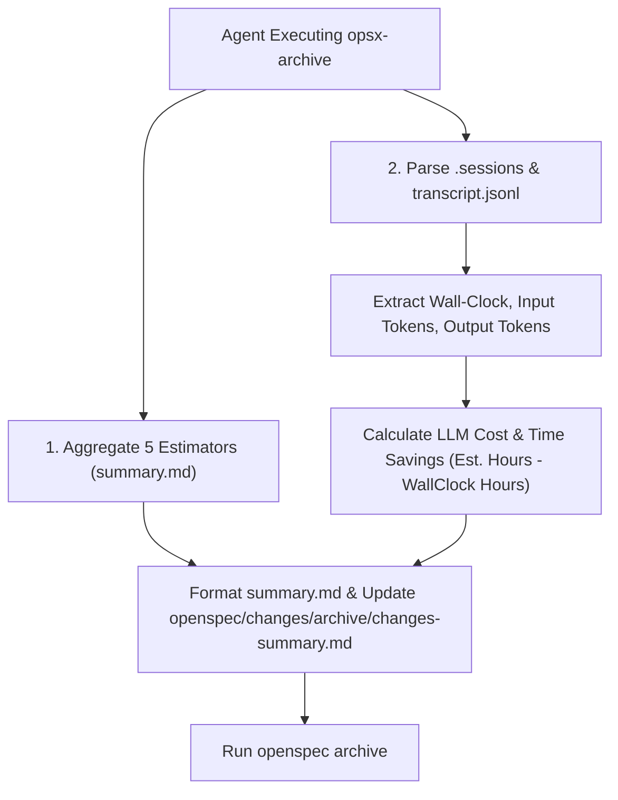

# Architectural Design: Constructive Criticism (12 Rules), README Structure & Estimation Metrics

## Context

Orkiestrator Gen AI (`gen-ai-orchestrator`) odpowiada za automatyzację prac inżynieryjnych i specyfikacji w oparciu o standard OpenSpec.
Aby wyeliminować ryzyko potwierdzania błędnych założeń (sycophancy / confirmation bias), ukrywania niepewności oraz braków w rzetelnym mierzeniu czasu trwania prac i zużycia tokenów, niniejszy projekt wprowadza potrójne usprawnienie:

1. **Bezwzględna Uczciwość (12 Rules)**: Implementacja Zasad *How to Make Claude Brutally Honest (12 Rules)* w procesach oceny architektonicznej, eksploracji i opiniowaniu designu.
2. **Dokumentacja Struktury Repozytorium w `README.md`**: Pełny opis drzewa katalogów wraz ze specyfikacją roli poszczególnych komponentów.
3. **Jednolity Szablon Estymacji (`summary.md`), Wsteczna Migracja & Zbiorczy Rejestr (`archive/changes-summary.md`)**:
   - Przekształcenie estymacji i metryk w `summary.md` w układ tabelaryczny.
   - Tworzenie i utrzymanie centralnego pliku `openspec/changes/archive/changes-summary.md` zbierającego metryki ze wskazaniem wyliczonego kosztu LLM, czasu trwania (Wall-clock), estymacji roboczogodzin (h) oraz roboczodni (MD), zysku czasowego (`Oszczędność Czasowa (h) = Estymowany Czas h - Wall-clock h`) oraz wierszem podsumowującym (Suma / Razem).

---

## Goals / Non-Goals

**Goals:**
- Egzekwowanie 12 Zasad Brutalnej Szczerości w promptach agentów (`opsx-explore`, `opsx-design`), pliku zasad `.ai/guidelines/brutally-honest-rules.md` oraz konfiguracyjnych wymogach `openspec/config.yaml`.
- Czytelne przedstawienie w `README.md` pełnego drzewa architektonicznego z wyjaśnieniem powiązań między `.ai/` a `.agents/` oraz strukturą `openspec/`.
- Zapewnienie tabelarycznego formatu estymacji (roboczogodziny h, roboczodni MD) i metryk sesji w `summary.md` oraz wsteczna przebudowa zarchiwizowanych `summary.md`.
- Stworzenie i automatyczne utrzymywanie zbiorczego rejestru w `openspec/changes/archive/changes-summary.md` prezentującego porównanie czasu trwania, kosztów LLM, estymowanego nakładu pracy oraz **Oszczędności Czasowej (h)** wraz z wierszem sumarycznym.

**Non-Goals:**
- Modyfikacja mechaniki samego CLI `openspec`.

---

## Technical Architecture & Workflow



---

## Structure of Central Archive Summary Table

```markdown
| Nazwa Zmiany | Krótki Opis Zmiany | Tokeny WE | Tokeny WY | Estymowany Koszt LLM ($) | Czas Trwania (Wall-clock) | Estymowany Czas (h) | Estymowane Man-Days (MD) | Oszczędność Czasowa (h) |
```
- **Przelicznik LLM**: Input $3.00 / 1M tokenów, Output $15.00 / 1M tokenów.
- **Oszczędność Czasowa (h)**: `Estymowany Czas Pracy (h) - Czas Trwania Wall-clock (h)`.
- **Wiersz Podsumowania**: Wiersz `SUMA / RAZEM` z podliczeniem zbiorczym metryk.
