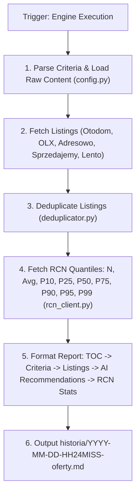

# Architectural Design: Wyszukiwarka Nieruchomości Warszawa & Integracja RCN

## Context

Moduł `wyszukiwarka-nieruchomosci/` jest autonomicznym serwisem zlokalizowanym w podkatalogu repozytorium `gen-ai-orchestrator`.
Serwis służy do automatycznego agregowania, selekcji oraz odświeżania na żądanie ofert nieruchomości w Warszawie według parametrów z pliku `wyszukiwarka-nieruchomosci/kryteria.md`.

Dokumenty wynikowe w `wyszukiwarka-nieruchomosci/historia/YYYY-MM-DD-HH24MISS-oferty.md` zawierają Spis Treści (TOC), wklejoną pełną zawartość `kryteria.md`, oferty rynkowe, rekomendacje AI oraz sekcję 7-kwantylowego rozkładu cen transakcyjnych z Rejestru Cen Nieruchomości (RCN Warszawa: `https://mapa.um.warszawa.pl/rcn-szukaj/`) przeniesioną na koniec raportu.

---

## Goals / Non-Goals

**Goals:**
- Parsowanie parametrów z `wyszukiwarka-nieruchomosci/kryteria.md` z rozszerzoną obsługą odmian słowa "dowolny" (`dowolny`, `dowolna`, `dowolne`, `brak limitu`).
- Wklejanie surowej zawartości pliku `kryteria.md` w sekcji `## ⚙️ Kryteria Wyszukiwania` dla gwarancji pełnej audytowalności.
- Dodanie Spisu Treści (TOC) na początku pliku wyjściowego z czytelnym czasem HH:MM:SS.
- Wyszukiwanie ofert z portali głównych (Otodom, OLX, Morizon) oraz portali bezpośrednich (Adresowo, Sprzedajemy, Lento).
- Integracja z RCN m.st. Warszawy per dzielnica oraz per obszar MSI (Kabaty, Natolin, Służew, Filtry) ze statystykami kwantylowymi ($N$, Średnia, P10, P25, P50-Mediana, P75, P90, P95, P99) umieszczonymi na końcu dokumentu.
- Zapewnienie pełnej historii przebiegów z unikalnym datownikiem `YYYY-MM-DD-HH24MISS-oferty.md`.

**Non-Goals:**
- Tworzenie osobnego repozytorium Git.
- Wyszukiwanie ofert w miejscowościach spoza Warszawy.

---

## Technical Architecture & Component Flow

