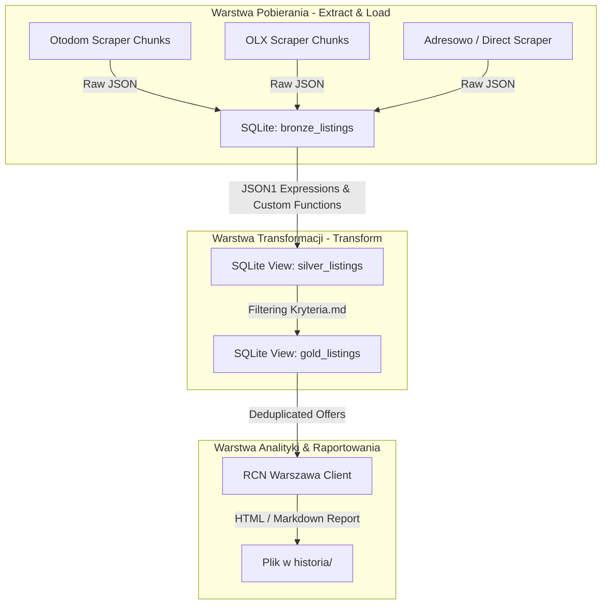

# Projekt Techniczny Architektury Danych: Wyszukiwarka Nieruchomości ELT (MVP: Opcja 1 - Czyste Widoki SQL Views)

**Kod Zmiany**: `wyszukiwarka-nieruchomosci-data-arch`  
**Data**: 27 Lipca 2026  
**Status**: Projekt Architektoniczny (Design)  
**Dokumenty Referencyjne**:
- `file:///Users/pawel/git/gen-ai-orchestrator/openspec/changes/wyszukiwarka-nieruchomosci-data-arch/proposal.md`
- `file:///Users/pawel/git/gen-ai-orchestrator/openspec/changes/wyszukiwarka-nieruchomosci-data-arch/explore/001-wyszukiwarka-nieruchomosci-data-arch-01.md`
- `file:///Users/pawel/git/gen-ai-orchestrator/wyszukiwarka-nieruchomosci/kryteria.md`
- `file:///Users/pawel/git/gen-ai-orchestrator/.ai/guidelines/brutally-honest-rules.md`

---

## 1. Cel i Kontekst Architektury (Context & Goals)

Zgodnie z uaktualnionymi założeniami biznesowymi oraz propozycją zmiany [`proposal.md`](file:///Users/pawel/git/gen-ai-orchestrator/openspec/changes/wyszukiwarka-nieruchomosci-data-arch/proposal.md), celem niniejszego projektu jest wdrożenie MVP architektury **ELT (Extract, Load, Transform)** opartej o bazę danych **SQLite**.

Jako MVP wybrano **Opcję 1 (Czyste Widoki SQL Views z rozszerzeniem JSON1)**, która:
1. Eliminację konieczności nakładania wąskich filtrów bizneowych w zapytaniach HTTP do portali (zostaje tylko filtracja miasto: Warszawa).
2. Natychmiastowo zapisuje surowe odpowiedzi JSON z portali do tabeli `bronze_listings` bez wstępnego parsowania.
3. Przenosi całą logikę wyciągania cech i filtracji wg [`kryteria.md`](file:///Users/pawel/git/gen-ai-orchestrator/wyszukiwarka-nieruchomosci/kryteria.md) do dekodowalnego i elastycznego widoku SQL `silver_listings`.
4. Tworzy widok `gold_listings` odpowiedzialny za deduplikację międzyserwisową i integrację z danymi referencyjnymi.

---

## 2. Przegląd Komponentów i Przepływ Danych (System Architecture & Flow)



### Przepływ Zdarzeń (Sequence):
1. **Scraper (Python)** -> Wykonuje zapytania do portali stosując strategię *Extraction Chunks* (szeroka Warszawa + podziały per rynek/zakres cenowy) i umieszcza nieprzetworzone struktury w `bronze_listings`.
2. **SQLite Driver (Python)** -> Podczas otwierania bazy danych rejestruje funkcje pomocnicze `haversine_m` (dystans przestrzenny) oraz `regexp` (dla zaawansowanych dopasowań w opisach).
3. **SQLite Engine** -> Wylicza dynamicznie widok `silver_listings` wykorzystując `json_extract()` i aplikując kryteria biznesowe z `kryteria.md`.
4. **SQLite Engine** -> Widok `gold_listings` grupuje oferty po unikalnym hashu nieruchomości i deduplikuje ogłoszenia występujące na wielu portalach.
5. **Report Generator (Python)** -> Zgłasza zapytanie `SELECT * FROM gold_listings`, wzbogaca dane o ceny transakcyjne z RCN Warszawa i zapisuje raport w `historia/`.

---

## 3. Zaadresowanie Ryzyk i Ograniczeń z Proposal.md (Brutally Honest Engineering)

Zgodnie z wytycznymi z pliku `.ai/guidelines/brutally-honest-rules.md`, poniżej przedstawiono konkretne rozwiązania inżynieryjne dla 3 kluczowych ryzyk zidentyfikowanych w propozycji:

### ⚠️ Ryzyko 1: Paginacja Portali i Twarde Limity Zapytań (Portal Limits)
- **Problem**: Portale takie jak Otodom czy OLX ograniczają wyniki wyszukiwania do maksymalnie 50 stron (~1200–2000 ofert). Ogólne zapytanie o całą Warszawę bez podziału uciązłoby pozostałe kilkutysięcy ogłoszeń.
- **Rozwiązanie Architektoniczne (Extraction Chunks)**:
  Skrypty ekstrakcyjne w warstwie Bronze nie filtrują cech nieruchomości, ale dzielą strumień zapytań HTTP na tzw. *Extraction Chunks* według 2 stabilnych wymiarów:
  1. Rynek: `primary` (pierwotny) vs `secondary` (wtórny).
  2. Zakresy cenowe HTTP: np. `< 600k`, `600k-900k`, `900k-1.3M`, `> 1.3M`.
  Dzięki temu żaden pojedynczy strumień nie przekracza limitu 1200 ofert, a wszystkie surowe rekordy trafiają do jednej tabeli `bronze_listings` w SQLite, gdzie są scalane i czyszczone w widoku `silver_listings`.

### ⚠️ Ryzyko 2: Ukryte i Brakujące Pola w JSON (Schema Variability)
- **Problem**: Pola takie jak `total_floors` (całkowita liczba pięter w budynku, potrzebna do sprawdzenia *"wyklucz ostatnie piętro"*), `has_elevator` (winda) czy `legal_status` (*spółdzielcze własnościowe z KW*) często nie występują w ustrukturyzowanej formie w JSON-ie.
- **Rozwiązanie Architektoniczne (Fallback Regex & Tolerant Null Filtering)**:
  W widoku SQL `silver_listings` stosujemy dwupoziomową weryfikację:
  1. **Poziom 1**: Pobranie wartości z ustrukturyzowanego klucza JSON via `json_extract()`.
  2. **Poziom 2 (Fallback)**: Jeśli pole JSON przyjmuje wartość `NULL`, przeszukujemy surowy tekst opisu ogłoszenia (`description_text`) za pomocą operatora `LIKE` / customowej funkcji `REGEXP`.
  - **[Hipoteza/Domysł]**: Dla warunku *"wyklucz ostatnie piętro"*, jeśli w JSON-ie brak pola `total_floors`, a w tekście opisu nie ma frazy określającej liczbę pięter w budynku, stosujemy **Permissive Null Strategy** (oferta nie jest odrzucana, lecz flaga `is_top_floor_unknown` ustawiana jest na `1`, umożliwiając użytkownikowi jej ręczną weryfikację w raporcie).

### ⚠️ Ryzyko 3: Geolokalizacja i Obliczanie Odległości od Metra w SQLite
- **Problem**: Standardowa kompilacja SQLite nie posiada wbudowanych funkcji trygonometrycznych (`sin`, `cos`, `acos`), co uniemożliwia bezpośrednie użycie wzoru Haversine'a w czystym SQL.
- **Rozwiązanie Architektoniczne (Python Registered SQLite Function)**:
  Podczas nawiązywania połączenia z SQLite w kodzie Pythona rejestrujemy dwupunktową funkcję matematyczną `haversine_m`:
  ```python
  import sqlite3
  import math

  def haversine_m(lat1, lon1, lat2, lon2):
      if None in (lat1, lon1, lat2, lon2):
          return None
      R = 6371000.0 # Promień Ziemi w metrach
      dlat = math.radians(lat2 - lat1)
      dlon = math.radians(lon2 - lon1)
      a = math.sin(dlat / 2)**2 + math.cos(math.radians(lat1)) * math.cos(math.radians(lat2)) * math.sin(dlon / 2)**2
      c = 2 * math.atan2(math.sqrt(a), math.sqrt(1 - a))
      return round(R * c, 1)

  conn = sqlite3.connect("data/listings.db")
  conn.create_function("haversine_m", 4, haversine_m)
  ```
  Dzięki temu w widoku `silver_listings` możemy wywoływać bezpośrednio: `haversine_m(lat, lon, station_lat, station_lon) AS dist_to_metro_m`.

---

## 4. Schematy Bazy Danych i Kontrakty (DDL & SQL Views)

### 4.1 Tabela Bronze (`bronze_listings`)
```sql
CREATE TABLE IF NOT EXISTS bronze_listings (
    id INTEGER PRIMARY KEY AUTOINCREMENT,
    source_portal TEXT NOT NULL,          -- 'otodom', 'olx', 'adresowo', 'sprzedajemy'
    external_id TEXT NOT NULL,            -- ID ogłoszenia w danym portalu
    city TEXT NOT NULL DEFAULT 'Warszawa',
    chunk_name TEXT,                      -- Nazwa chunka pobierania (np. 'warszawa_wtorny_800_1200k')
    raw_payload JSON NOT NULL,            -- Pełny surowy JSON ogłoszenia
    scraped_at DATETIME DEFAULT CURRENT_TIMESTAMP,
    UNIQUE(source_portal, external_id) ON CONFLICT REPLACE
);

CREATE INDEX IF NOT EXISTS idx_bronze_source_ext ON bronze_listings(source_portal, external_id);
```

### 4.2 Widok Silver (`silver_listings`) - MVP Opcja 1
```sql
CREATE VIEW IF NOT EXISTS silver_listings AS
WITH extracted_data AS (
    SELECT 
        b.id AS bronze_id,
        b.source_portal,
        b.external_id,
        b.scraped_at,
        json_extract(b.raw_payload, '$.title') AS title,
        json_extract(b.raw_payload, '$.url') AS url,
        COALESCE(json_extract(b.raw_payload, '$.location.city'), b.city) AS city,
        json_extract(b.raw_payload, '$.location.district') AS district,
        CAST(json_extract(b.raw_payload, '$.price.value') AS REAL) AS price_pln,
        CAST(json_extract(b.raw_payload, '$.area.value') AS REAL) AS area_m2,
        CAST(json_extract(b.raw_payload, '$.rooms') AS INTEGER) AS rooms,
        CAST(json_extract(b.raw_payload, '$.floor') AS INTEGER) AS floor,
        CAST(json_extract(b.raw_payload, '$.total_floors') AS INTEGER) AS total_floors,
        
        -- Winda: Sprawdzenie pola JSON, a w razie NULL - szukanie fraz w opisie
        COALESCE(
            CAST(json_extract(b.raw_payload, '$.features.elevator') AS INTEGER),
            CASE 
                WHEN json_extract(b.raw_payload, '$.description') LIKE '%winda%' 
                  OR json_extract(b.raw_payload, '$.description') LIKE '%windą%' THEN 1 
                ELSE 0 
            END
        ) AS has_elevator,
        
        CAST(json_extract(b.raw_payload, '$.location.coordinates.latitude') AS REAL) AS lat,
        CAST(json_extract(b.raw_payload, '$.location.coordinates.longitude') AS REAL) AS lon,
        json_extract(b.raw_payload, '$.description') AS description_text,
        b.raw_payload
    FROM bronze_listings b
)
SELECT 
    e.*,
    ROUND(e.price_pln / e.area_m2, 2) AS price_per_m2,
    CASE 
        WHEN e.total_floors IS NOT NULL AND e.floor = e.total_floors AND e.floor > 0 THEN 1 
        ELSE 0 
    END AS is_last_floor
FROM extracted_data e
WHERE e.city = 'Warszawa'
  -- Filtry biznesowe z kryteria.md (wartości parametryzowane dynamicznie w zliczaniu/raporcie):
  AND (e.price_pln BETWEEN 800000 AND 1200000)
  AND (e.rooms = 3)
  AND (e.floor BETWEEN 1 AND 8)
  AND (e.floor > 0)             -- Wyklucz parter
  AND (e.has_elevator = 1)      -- Winda wymagana
  AND (e.district IN ('Ursynów', 'Warszawa-Ursynów'));
```

### 4.3 Widok Gold (`gold_listings`) - Deduplikacja Międzyserwisowa
```sql
CREATE VIEW IF NOT EXISTS gold_listings AS
WITH deduplicated AS (
    SELECT 
        -- Hash geolokalizacyjny (~111m) + metraż + pokoje
        ROUND(lat, 3) || '_' || ROUND(lon, 3) || '_' || ROUND(area_m2, 1) || '_' || rooms AS dedup_fingerprint,
        MIN(bronze_id) AS primary_bronze_id,
        GROUP_CONCAT(source_portal || ':' || external_id, ', ') AS source_portals_list,
        MIN(price_pln) AS min_price_pln,
        MAX(price_pln) AS max_price_pln,
        COUNT(*) AS portal_occurrences_count,
        title,
        url,
        district,
        price_pln,
        area_m2,
        price_per_m2,
        rooms,
        floor,
        total_floors,
        has_elevator,
        lat,
        lon,
        scraped_at
    FROM silver_listings
    GROUP BY dedup_fingerprint
)
SELECT * FROM deduplicated;
```

---

## 5. Porównanie Wydajności i Ścieżka Migracji (Architectural Trade-offs & Migration Path)

### Dlaczego Opcja 1 jako MVP?
1. **Zastosowanie Zero-Redundancy Storage**: Wszelkie zapytania bazują bezpośrednio na tabeli Bronze. Brak konieczności czyszczenia i ponownego budowania fizycznych tabel po zmianie schematu portalu.
2. **Natychmiastowe testowanie kryteriów**: Wystarczy zmienić warunek `WHERE` w SQL lub przedefiniować widok `silver_listings`, aby natychmiast przefiltrować 10 000 surowych rekordów w Bronze bez ponownego pobierania z sieci.

### Wąskie Gardła Opcji 1 (Kiedy zmigrować do Opcji 2):
- **Brak indeksowania we wnętrzu JSON**: Przy przekroczeniu **50 000+ ogłoszeń** w tabeli `bronze_listings`, wykonywanie funkcji `json_extract()` on-the-fly przy każdym zapytaniu `SELECT` odczuwalnie spowolni czas generowania raportu (z <100ms do kilku sekund).
- **Ścieżka Migracji do Opcji 2 (Materializowane Tabele Silver)**:
  Gdy czas wykonywania zapytań przekroczy 2 sekundy, przekształcimy widok `silver_listings` w tabelę fizyczną `CREATE TABLE silver_listings AS SELECT ...` z nakładanymi indeksami B-drzewa:
  ```sql
  CREATE INDEX idx_silver_filter ON silver_listings(city, district, price_pln, rooms, floor);
  ```

---

## 6. Obsługa Sytuacji Awaryjnych i Krawędziowych (Edge Cases & Error Handling)

1. **Uszkodzony Payload JSON w Bronze**:
   - W przypadku wygenerowania niepoprawnego JSON-a przez portal, funkcja `json_extract()` zwróci `NULL`. Wyrażenie `CAST(... AS REAL)` bezpiecznie obsłuży `NULL` bez wywoływania wyjątku bazy danych. Rekord zostanie pominięty w widoku `silver_listings`.
2. **Brak Współrzędnych GPS (`lat`/`lon`)**:
   - W przypadku braku geolokalizacji w ogłoszeniu, klucz deduplikacji `dedup_fingerprint` przełączy się na fallback: `district || '_' || ROUND(area_m2, 1) || '_' || rooms || '_' || floor`.
3. **Konflikty Nazw Dzielnic**:
   - Portale stosują różne konwencje: `Ursynów`, `Warszawa-Ursynów`, `Warszawa / Ursynów`.
   - Widok `silver_listings` wykorzystuje operacje normalizujące (`REPLACE(district, 'Warszawa-', '')`), aby zapewnić spójność z `kryteria.md`.

---

## 7. Plan Realizacji Zadań (Przejście do tasks.md)

1. **Zadanie 1**: Utworzenie tabeli `bronze_listings` i modułu podłączenia SQLite z customową funkcją `haversine_m`.
2. **Zadanie 2**: Refaktoryzacja skryptów pobierających (`CommercialProvider`, `DirectProvider`) na zapis surowego `raw_payload` z obsługą *Extraction Chunks*.
3. **Zadanie 3**: Zbudowanie i przetestowanie DDL widoku `silver_listings` wg kryteriów z `kryteria.md`.
4. **Zadanie 4**: Utworzenie widoku `gold_listings` dla deduplikacji i podpięcie pod `ReportGenerator`.
