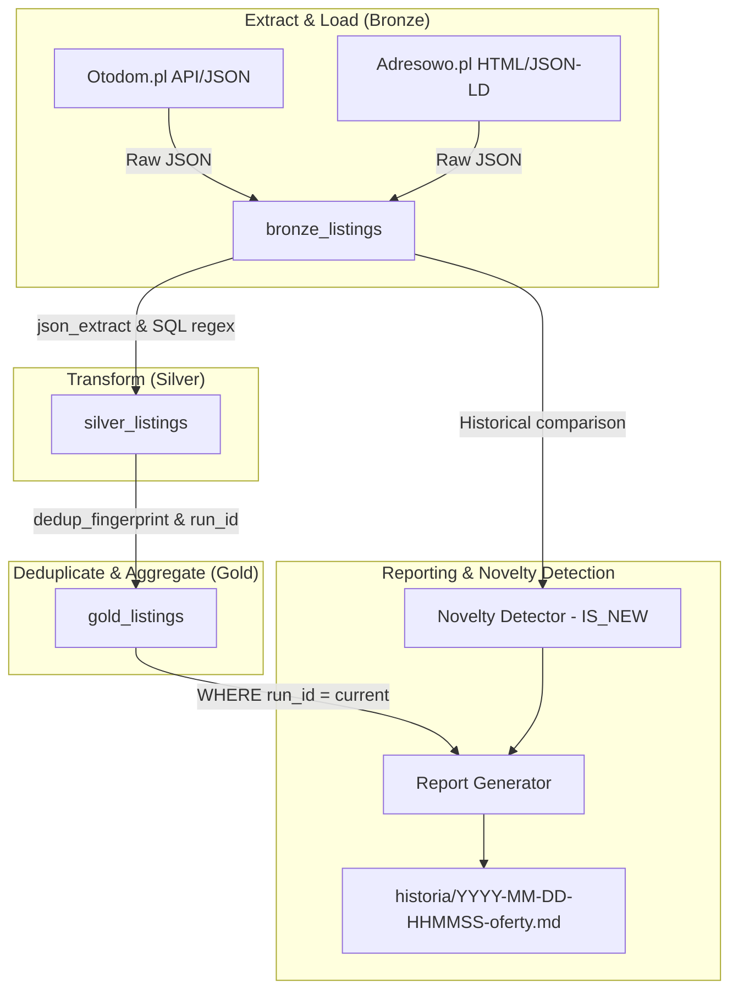

# Dokument Architektury i Designu Technicznego (Design.md)

**Kod Zmiany**: `wyszukiwarka-nieruchomosci-adresowo`  
**Data**: 2 Sierpnia 2026  
**Status**: Projekt Architektoniczny (Design)  
**Dokumenty Referencyjne**:
- `file:///Users/pawel/git/gen-ai-orchestrator/openspec/changes/wyszukiwarka-nieruchomosci-adresowo/explore/001-wyszukiwarka-nieruchomosci-adresowo-01.md`
- `file:///Users/pawel/git/gen-ai-orchestrator/openspec/changes/wyszukiwarka-nieruchomosci-adresowo/proposal.md`
- `file:///Users/pawel/git/gen-ai-orchestrator/wyszukiwarka-nieruchomosci/kryteria.md`

---

## 1. Architektura Przepływu Danych (ELT Pipeline)



---

## 2. Projekt Schematu Bazy Danych SQLite

### 🥉 Tabela `bronze_listings`:
Przechowuje surowe zrzuty ogłoszeń z kluczem unikalnym na poziomie `(run_id, source_portal, external_id)`:
```sql
CREATE TABLE IF NOT EXISTS bronze_listings (
    id INTEGER PRIMARY KEY AUTOINCREMENT,
    run_id TEXT NOT NULL,
    source_portal TEXT NOT NULL,
    external_id TEXT NOT NULL,
    city TEXT NOT NULL DEFAULT 'Warszawa',
    chunk_name TEXT,
    raw_payload JSON NOT NULL,
    scraped_at DATETIME DEFAULT CURRENT_TIMESTAMP,
    UNIQUE(run_id, source_portal, external_id) ON CONFLICT REPLACE
);
```

### 🥈 Widok `silver_listings`:
Zapewnia jednolity schemat dla rekordów z Otodom i Adresowo.pl:
```sql
CREATE VIEW IF NOT EXISTS silver_listings AS
WITH extracted_data AS (
    SELECT 
        b.id AS bronze_id,
        b.run_id,
        b.source_portal,
        b.external_id,
        b.scraped_at,
        json_extract(b.raw_payload, '$.title') AS title,
        json_extract(b.raw_payload, '$.url') AS url,
        COALESCE(json_extract(b.raw_payload, '$.location.city'), b.city) AS city,
        COALESCE(
            json_extract(b.raw_payload, '$.location.district'),
            json_extract(b.raw_payload, '$.district'),
            b.chunk_name
        ) AS district,
        CAST(json_extract(b.raw_payload, '$.price_pln') AS REAL) AS price_pln,
        CAST(json_extract(b.raw_payload, '$.area_m2') AS REAL) AS area_m2,
        CAST(json_extract(b.raw_payload, '$.rooms') AS INTEGER) AS rooms,
        CAST(json_extract(b.raw_payload, '$.floor') AS INTEGER) AS floor,
        CAST(json_extract(b.raw_payload, '$.total_floors') AS INTEGER) AS total_floors,
        CAST(json_extract(b.raw_payload, '$.has_elevator') AS INTEGER) AS has_elevator,
        CAST(json_extract(b.raw_payload, '$.build_year') AS INTEGER) AS build_year,
        json_extract(b.raw_payload, '$.seller_type') AS seller_type,
        json_extract(b.raw_payload, '$.description_text') AS description_text,
        b.raw_payload
    FROM bronze_listings b
)
SELECT 
    e.*,
    CASE WHEN e.area_m2 > 0 THEN ROUND(e.price_pln / e.area_m2, 2) ELSE NULL END AS price_per_m2,
    CASE 
        WHEN e.total_floors IS NOT NULL AND e.floor = e.total_floors AND e.floor > 0 THEN 1 
        ELSE 0 
    END AS is_last_floor
FROM extracted_data e;
```

---

## 3. Implementacja `AdresowoProvider` (`src/providers/adresowo.py`)

Klasa `AdresowoProvider` odczytuje listę ofert z Adresowo.pl i tworzy zrzut `raw_payload` zawierający:
- `id`: Identyfikator ogłoszenia z URL (np. `r6l7m7`).
- `title`: Tytuł ogłoszenia.
- `url`: Pełny adres URL (`https://adresowo.pl/o/...`).
- `price_pln`: Cena całkowita w PLN (z `JSON-LD Offer.price`).
- `area_m2`: Powierzchnia w m².
- `rooms`: Liczba pokoi.
- `floor`: Piętro.
- `total_floors`: Całkowita liczba pięter w budynku.
- `has_elevator`: 1 jeśli obecny znacznik `winda`, 0 w przeciwnym wypadku.
- `build_year`: Rok budowy (ze znacznika `rok budowy`).
- `seller_type`: `Bezpośrednio` jeśli obecny znacznik `bez pośredników`, inaczej `Agencja`.
