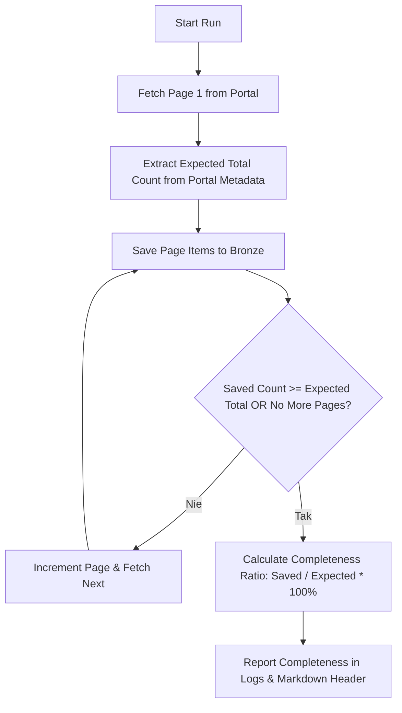

# Dokument Architektury i Designu Technicznego (Design.md)

**Kod Zmiany**: `wyszukiwarka-nieruchomosci-brozne-completeness`  
**Data**: 2 Sierpnia 2026  
**Status**: Projekt Architektoniczny (Design)  

---

## 1. Architektura Pętli Pobierającej z Kontrolą Kompletności



---

## 2. Metody Ekstrakcji Liczników

### 🟧 OtodomProvider (`src/providers/commercial.py`):
```python
total_count = data['props']['pageProps']['data']['searchAds']['pagination']['totalCount']
```

### 🌐 AdresowoProvider (`src/providers/adresowo.py`):
```python
match = re.search(r'(\d+)\s*oferty', html, re.IGNORECASE) or re.search(r'Zobacz\s*(\d+)\s*aktualnych', html, re.IGNORECASE)
total_count = int(match.group(1)) if match else None
```

---

## 3. Schemat Tabeli Audytowej `run_audit` w SQLite

```sql
CREATE TABLE IF NOT EXISTS run_audit (
    run_id TEXT PRIMARY KEY,
    source_portal TEXT NOT NULL,
    expected_total INTEGER,
    saved_bronze INTEGER,
    completeness_pct REAL,
    run_timestamp DATETIME DEFAULT CURRENT_TIMESTAMP
);
```
