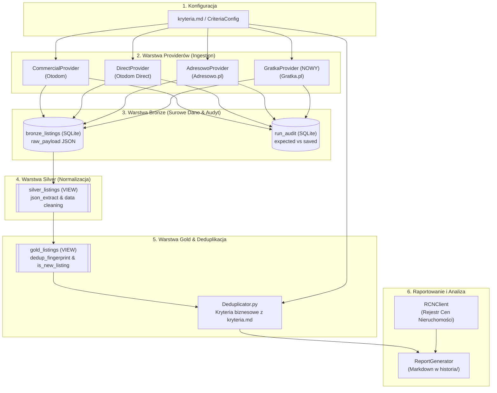

# Projekt Techniczny i Architektura: Integracja Serwisu Gratka.pl

**Kod Zmiany**: `wyszukiwarka-nieruchomosci-gratka`  
**Dokument**: `design_initial.md` (Początkowy Projekt Techniczny)  
**Data**: 15 Sierpnia 2026  
**Status**: Projekt Wstępny (Draft / Architectural Review)  
**Dokumenty Referencyjne**:
- [`proposal.md`](file:///Users/pawel/git/gen-ai-orchestrator/openspec/changes/wyszukiwarka-nieruchomosci-gratka/proposal.md)
- [`kryteria.md`](file:///Users/pawel/git/gen-ai-orchestrator/wyszukiwarka-nieruchomosci/kryteria.md)
- [`.ai/guidelines/brutally-honest-rules.md`](file:///Users/pawel/git/gen-ai-orchestrator/.ai/guidelines/brutally-honest-rules.md)
- [`src/db.py`](file:///Users/pawel/git/gen-ai-orchestrator/wyszukiwarka-nieruchomosci/src/db.py)
- [`src/deduplicator.py`](file:///Users/pawel/git/gen-ai-orchestrator/wyszukiwarka-nieruchomosci/src/deduplicator.py)
- [`src/config.py`](file:///Users/pawel/git/gen-ai-orchestrator/wyszukiwarka-nieruchomosci/src/config.py)
- [`src/providers/adresowo.py`](file:///Users/pawel/git/gen-ai-orchestrator/wyszukiwarka-nieruchomosci/src/providers/adresowo.py)
- [`src/providers/commercial.py`](file:///Users/pawel/git/gen-ai-orchestrator/wyszukiwarka-nieruchomosci/src/providers/commercial.py)

---

## 1. Cel i Zakres Architektury (Context & Goals)

### 1.1. Kontekst Biznesowy i Architektoniczny
System `wyszukiwarka-nieruchomosci` monitoruje rynek mieszkaniowy w Warszawie w oparciu o kryteria zdefiniowane w [`kryteria.md`](file:///Users/pawel/git/gen-ai-orchestrator/wyszukiwarka-nieruchomosci/kryteria.md). Dotychczasowa architektura agreguje dane z portali **Otodom** (ogłoszenia komercyjne i prywatne) oraz **Adresowo.pl** (ogłoszenia bezpośrednie).

Serwis **Gratka.pl** (grupa Polska Press / Gratka-Morizon) stanowi istotne źródło unikalnych ofert (zarówno z rynku wtórnego, jak i pierwotnego), które nie zawsze trafiają na Otodom lub pojawiają się na nim z opóźnieniem. Celem niniejszego projektu jest zaprojektowanie i wdrożenie dedykowanego modułu `GratkaProvider` w pełnej zgodności z trójwarstwową architekturą **ELT (Bronze -> Silver -> Gold)**, audytowalnością zrzutów danych (`run_audit`) oraz międzyserwisową deduplikacją.

### 1.2. Założenia Projektowe i Ograniczenia
1. **Bezstratna Warstwa Bronze**: Zapis surowych danych HTML/JSON do tabeli `bronze_listings` z metadanymi wykonania (`run_id`, `source_portal='gratka'`, `chunk_name`, `scraped_at`).
2. **Deklaratywne Mapowanie w Silver**: Widok `silver_listings` w SQLite wyciąga ustandaryzowane atrybuty z `raw_payload` (bez twardego filtrowania rekordów na poziomie zapytań HTTP/crawlerów, tam gdzie to niemożliwe).
3. **Precyzyjne Egzekwowanie Kryteriów w Gold**: Wszystkie restrykcyjne reguły biznesowe (winda, wykluczenie parteru, zakres cen 1.0M - 1.05M PLN, 3 pokoje, piętra 1-8) są selekcjonowane w widoku `gold_listings` oraz w [`Deduplicator.get_gold_listings()`](file:///Users/pawel/git/gen-ai-orchestrator/wyszukiwarka-nieruchomosci/src/deduplicator.py#L12-L80).
4. **Audyt Kompletności (`run_audit`)**: Rejestracja zadeklarowanej liczby ofert na listingu Gratki vs liczba pobranych rekordów w warstwie Bronze.
5. **Nazywanie Niepewności wprost (Brutally Honest)**: Struktura HTML i format JSON-LD portalu Gratka.pl podlegają dynamicznym zmianom. Wszelkie założenia dotyczące formatu tagów oznaczono etykietą **`[Hipoteza/Domysł]`** i wymagają walidacji podczas testów integracyjnych.

---

## 2. Przegląd Komponentów i Przepływu Danych (System Architecture & Flow)

### 2.1. Diagram Przepływu Danych (ELT Pipeline)



### 2.2. Szczegółowy Opis Kroków w Potoku

1. **Inicjalizacja Uruchomienia (`run_id`)**: `main.py` generuje unikatowy znacznik czasu (np. `run_20260815_173500`) i ładuje obiekt `CriteriaConfig`.
2. **Ekstrakcja i Zapis do Bronze**:
   - `GratkaProvider` konstruuje zapytania HTTP uwzględniając filtry wspierane bezpośrednio w URL (miasto, dzielnica, cena min/max, liczba pokoi min/max, metraż min/max, rynek wtórny/pierwotny).
   - Zapisywane są pełne obiekty JSON do tabeli `bronze_listings`.
   - Zadeklarowana liczba ofert z nagłówka strony listingu zapisywana jest do `run_audit`.
3. **Wirtualna Transformacja w Widoku Silver (`silver_listings`)**:
   - SQLite JSON1 ekstrahuje kluczowe właściwości (`title`, `price_pln`, `area_m2`, `rooms`, `floor`, `total_floors`, `has_elevator`, `lat`, `lon`, `seller_type`, itp.).
   - Brak konieczności fizycznej replikacji tabeli — widok dynamicznie transformuje dane w locie.
4. **Deduplikacja i Flaga Nowości w Widoku Gold (`gold_listings`)**:
   - Grupowanie po odcisku palca (`dedup_fingerprint`): geolokalizacja (zaokrąglona do 3 miejsc po przecinku) + metraż (do 1 miejsca) + liczba pokoi, lub fallback na dzielnicę + metraż + pokoje + piętro + cena.
   - Identyfikacja portali źródłowych (`GROUP_CONCAT(source_portal || ':' || external_id)`).
   - Wyliczenie `is_new_listing` względem wcześniejszych zrzutów w historii bazy.
5. **Aplikacja Kryteriów Biznesowych**:
   - `Deduplicator.get_gold_listings(run_id)` nakłada filtry: cena 1,000,000 - 1,050,000 PLN, 3 pokoje, piętra 1-8, `exclude_ground_floor` (piętro > 0 lub IS NULL), winda (`has_elevator = 1`).
6. **Wzbogacenie i Raport**:
   - Porównanie cen ofertowych ze średnimi transakcyjnymi RCN Warszawa i wygenerowanie raportu w katalogu `historia/`.

---

## 3. Architektura Modułu GratkaProvider (`src/providers/gratka.py`)

### 3.1. Generowanie URL i Mapowanie Parametrów Zapytania

Gratka.pl stosuje specyficzny format URL z parametrami w notacji dwukropkowej (`parametr:min=X`, `parametr:max=Y`).

#### Tabela Mapowania Filtrów:

| Parametr w `kryteria.md` | Format Gratka.pl | Poziom Obsługi | Przykład URL / Parametru |
| :--- | :--- | :---: | :--- |
| **Miasto** | Ścieżka URL | 🟢 URL Path | `/nieruchomosci/mieszkania/warszawa/` |
| **Dzielnica** | Ścieżka URL / Slug | 🟢 URL Path | `/nieruchomosci/mieszkania/warszawa/{district_slug}/` |
| **Typ transakcji** | Ścieżka URL | 🟢 URL Path | `/sprzedaz` |
| **Cena minimalna** | `cena-calkowita:min` | 🟢 Query Param | `?cena-calkowita:min=1000000` |
| **Cena maksymalna** | `cena-calkowita:max` | 🟢 Query Param | `&cena-calkowita:max=1050000` |
| **Liczba pokoi min** | `liczba-pokoi:min` | 🟢 Query Param | `&liczba-pokoi:min=3` |
| **Liczba pokoi max** | `liczba-pokoi:max` | 🟢 Query Param | `&liczba-pokoi:max=3` |
| **Powierzchnia min** | `powierzchnia-w-m2:min`| 🟢 Query Param | `&powierzchnia-w-m2:min=50` |
| **Powierzchnia max** | `powierzchnia-w-m2:max`| 🟢 Query Param | `&powierzchnia-w-m2:max=80` |
| **Rynek (wtórny/pierwotny)**| Ścieżka URL / parametr | 🟢 URL / Param | `&rynek=wtorny` lub ścieżka `/wtorny` `[Hipoteza/Domysł]` |
| **Paginacja** | `page` | 🟢 Query Param | `&page=2` |
| **Piętro min/max** | - | 🔴 Warstwa Gold | Filtrowane w SQL (`floor >= 1 AND floor <= 8`) |
| **Wyklucz parter** | - | 🔴 Warstwa Gold | Filtrowane w SQL (`floor > 0 OR floor IS NULL`) |
| **Winda** | - | 🔴 Warstwa Gold | Ekstrakcja z cech/opisu, filtrowanie w SQL (`has_elevator = 1`) |
| **Rok budowy** | - | 🔴 Warstwa Gold | Ekstrakcja z cech, filtrowanie w SQL |

### 3.2. Pętla Pobierania i Obsługa Paginacji

```python
class GratkaProvider:
    def __init__(self, config, db_manager=None):
        self.config = config
        self.db_manager = db_manager or DatabaseManager()
        self.max_pages = 5
        self.request_timeout = 10
        self.delay_between_requests = 0.15

    def build_search_url(self, city_slug: str, district_slug: str, page: int = 1) -> str:
        base = f"https://gratka.pl/nieruchomosci/mieszkania/{city_slug}/{district_slug}/sprzedaz"
        params = []
        if self.config.min_price:
            params.append(f"cena-calkowita:min={int(self.config.min_price)}")
        if self.config.max_price:
            params.append(f"cena-calkowita:max={int(self.config.max_price)}")
        if self.config.min_rooms:
            params.append(f"liczba-pokoi:min={int(self.config.min_rooms)}")
        if self.config.max_rooms:
            params.append(f"liczba-pokoi:max={int(self.config.max_rooms)}")
        if self.config.min_area:
            params.append(f"powierzchnia-w-m2:min={int(self.config.min_area)}")
        if self.config.max_area:
            params.append(f"powierzchnia-w-m2:max={int(self.config.max_area)}")
        if page > 1:
            params.append(f"page={page}")
        
        query_string = "&".join(params)
        return f"{base}?{query_string}" if query_string else base
```

### 3.3. Nagłówki HTTP i Zabezpieczenia Przed Blokowaniem

Crawler musi posługiwać się kompletnym zestawem nagłówków imitujących przeglądarkę Chromium na macOS:

```python
HEADERS = {
    'User-Agent': 'Mozilla/5.0 (Macintosh; Intel Mac OS X 10_15_7) AppleWebKit/537.36 (KHTML, like Gecko) Chrome/124.0.0.0 Safari/537.36',
    'Accept': 'text/html,application/xhtml+xml,application/xml;q=0.9,image/avif,image/webp,image/apng,*/*;q=0.8',
    'Accept-Language': 'pl-PL,pl;q=0.9,en-US;q=0.8,en;q=0.7',
    'Sec-Ch-Ua': '"Chromium";v="124", "Google Chrome";v="124"',
    'Sec-Ch-Ua-Mobile': '?0',
    'Sec-Ch-Ua-Platform': '"macOS"',
    'Sec-Fetch-Dest': 'document',
    'Sec-Fetch-Mode': 'navigate',
    'Sec-Fetch-Site': 'none',
    'Sec-Fetch-User': '?1',
    'Upgrade-Insecure-Requests': '1'
}
```

### 3.4. Ekstrakcja Danych (Strategia Parsowania HTML i JSON-LD)

Na podstawie analizy struktury portali grupy Polska Press / Gratka:
1. **JSON-LD**: Poszukiwanie znaczników `<script type="application/ld+json">` zawierających schematy `@type: "Offer"`, `@type: "Product"` lub `@type: "SingleFamilyResidence" / "Apartment" / "Place"`.
2. **Karty Ofert (Listing Cards)**: Ekstrakcja z tagów `<article class="teaser...">` lub odnośników `href="/nieruchomosci/..."` z unikalnym identyfikatorem numerycznym / slugiem.
3. **Cechy Nieruchomości**: Ekstrakcja parametrów (winda, piętro, liczba pięter, rok budowy, materiał, stan wykończenia) z tabeli atrybutów / listy tagów `cechy`.

---

## 4. Kontrakty Danych, Schemat raw_payload oraz Modyfikacje SQLite (`db.py`)

### 4.1. Schemat `raw_payload` dla Gratka.pl (Zapis do Bronze)

Każde ogłoszenie z Gratki zostaje ustrukturyzowane do standardowego słownika przed zapisem do `bronze_listings`:

```json
{
  "id": "gratka_28941032",
  "title": "3 pokoje z windą i balkonem, Ursynów Imielin",
  "url": "https://gratka.pl/nieruchomosci/mieszkanie-warszawa-ursynow/ob/28941032",
  "price_pln": 1025000.0,
  "area_m2": 58.5,
  "rooms": 3,
  "floor": 3,
  "total_floors": 10,
  "has_elevator": 1,
  "build_year": 1982,
  "seller_type": "Agencja",
  "market": "wtorny",
  "location": {
    "city": "Warszawa",
    "district": "Ursynów",
    "street": "ul. Dereniowa",
    "coordinates": {
      "latitude": 52.1456,
      "longitude": 21.0392
    }
  },
  "features": {
    "winda": true,
    "balkon": true,
    "pietro": "3/10",
    "forma_wlasnosci": "spółdzielcze własnościowe z KW"
  },
  "description_text": "Jasne, przestronne 3-pokojowe mieszkanie na Ursynowie...",
  "scraped_from_detail": true
}
```

### 4.2. Modyfikacja Widoku `silver_listings` (`src/db.py`)

Widok `silver_listings` zostaje wzbogacony o pełną obsługę formatu Gratki, zachowując bezwzględną kompatybilność wsteczną dla Otodom i Adresowo:

```sql
DROP VIEW IF EXISTS silver_listings;
CREATE VIEW silver_listings AS
WITH extracted_data AS (
    SELECT 
        b.id AS bronze_id,
        b.run_id,
        b.source_portal,
        b.external_id,
        b.scraped_at,
        
        -- Tytuł
        COALESCE(
            json_extract(b.raw_payload, '$.title'),
            json_extract(b.raw_payload, '$.place_ld.name')
        ) AS title,
        
        -- URL
        COALESCE(
            json_extract(b.raw_payload, '$.url'),
            CASE 
                WHEN b.source_portal = 'gratka' THEN 'https://gratka.pl/nieruchomosci/ob/' || b.external_id
                WHEN json_extract(b.raw_payload, '$.slug') IS NOT NULL 
                THEN 'https://www.otodom.pl/pl/oferta/' || json_extract(b.raw_payload, '$.slug')
                ELSE 'https://www.otodom.pl/pl/oferta/' || b.external_id
            END
        ) AS url,
        
        -- Miasto
        COALESCE(
            json_extract(b.raw_payload, '$.location.city'),
            json_extract(b.raw_payload, '$.location.address.city.name'),
            b.city
        ) AS city,
        
        -- Dzielnica
        COALESCE(
            json_extract(b.raw_payload, '$.location.district'),
            json_extract(b.raw_payload, '$.location.address.district.name'),
            (
                SELECT json_extract(value, '$.name')
                FROM json_each(b.raw_payload, '$.location.reverseGeocoding.locations')
                WHERE json_extract(value, '$.locationLevel') = 'district'
                LIMIT 1
            ),
            b.chunk_name
        ) AS district,

        -- Cena PLN
        CAST(COALESCE(
            json_extract(b.raw_payload, '$.price_pln'),
            json_extract(b.raw_payload, '$.price.value'),
            json_extract(b.raw_payload, '$.totalPrice.value'),
            json_extract(b.raw_payload, '$.offer_ld.price')
        ) AS REAL) AS price_pln,
        
        -- Powierzchnia m²
        CAST(COALESCE(
            json_extract(b.raw_payload, '$.area_m2'),
            json_extract(b.raw_payload, '$.area.value'),
            json_extract(b.raw_payload, '$.areaInSquareMeters')
        ) AS REAL) AS area_m2,
        
        -- Liczba pokoi
        CAST(COALESCE(
            json_extract(b.raw_payload, '$.rooms'),
            CASE json_extract(b.raw_payload, '$.roomsNumber')
                WHEN 'ONE' THEN 1
                WHEN 'TWO' THEN 2
                WHEN 'THREE' THEN 3
                WHEN 'FOUR' THEN 4
                WHEN 'FIVE' THEN 5
                ELSE CAST(json_extract(b.raw_payload, '$.roomsNumber') AS INTEGER)
            END
        ) AS INTEGER) AS rooms,
        
        -- Piętro
        CAST(COALESCE(
            json_extract(b.raw_payload, '$.floor'),
            CASE json_extract(b.raw_payload, '$.floorNumber')
                WHEN 'GROUND_FLOOR' THEN 0
                WHEN 'FIRST' THEN 1
                WHEN 'SECOND' THEN 2
                WHEN 'THIRD' THEN 3
                WHEN 'FOURTH' THEN 4
                WHEN 'FIFTH' THEN 5
                WHEN 'SIXTH' THEN 6
                WHEN 'SEVENTH' THEN 7
                WHEN 'EIGHTH' THEN 8
                WHEN 'NINTH' THEN 9
                WHEN 'TENTH' THEN 10
                ELSE NULL
            END
        ) AS INTEGER) AS floor,
        
        -- Liczba pięter
        CAST(COALESCE(
            json_extract(b.raw_payload, '$.total_floors'),
            json_extract(b.raw_payload, '$.floorsInBuilding')
        ) AS INTEGER) AS total_floors,
        
        -- Winda (has_elevator)
        COALESCE(
            CAST(json_extract(b.raw_payload, '$.has_elevator') AS INTEGER),
            CAST(json_extract(b.raw_payload, '$.features.elevator') AS INTEGER),
            CAST(json_extract(b.raw_payload, '$.hasElevator') AS INTEGER),
            CASE 
                WHEN json_extract(b.raw_payload, '$.features.winda') = 1 
                  OR json_extract(b.raw_payload, '$.features.winda') = 'true' THEN 1
                WHEN json_extract(b.raw_payload, '$.target.Extras_types') LIKE '%lift%' THEN 1
                WHEN json_extract(b.raw_payload, '$.description') LIKE '%winda%' 
                  OR json_extract(b.raw_payload, '$.description') LIKE '%windą%'
                  OR json_extract(b.raw_payload, '$.description_text') LIKE '%winda%'
                  OR json_extract(b.raw_payload, '$.description_text') LIKE '%windą%'
                  OR json_extract(b.raw_payload, '$.shortDescription') LIKE '%winda%'
                  OR json_extract(b.raw_payload, '$.shortDescription') LIKE '%windą%' THEN 1 
                ELSE 0 
            END
        ) AS has_elevator,
        
        -- Koordynaty GPS
        CAST(COALESCE(
            json_extract(b.raw_payload, '$.location.coordinates.latitude'),
            json_extract(b.raw_payload, '$.place_ld.geo.latitude'),
            json_extract(b.raw_payload, '$.coordinates.latitude')
        ) AS REAL) AS lat,
        
        CAST(COALESCE(
            json_extract(b.raw_payload, '$.location.coordinates.longitude'),
            json_extract(b.raw_payload, '$.place_ld.geo.longitude'),
            json_extract(b.raw_payload, '$.coordinates.longitude')
        ) AS REAL) AS lon,
        
        -- Typ ogłoszeniodawcy
        COALESCE(
            json_extract(b.raw_payload, '$.seller_type'),
            CASE WHEN json_extract(b.raw_payload, '$.isPrivateOwner') = 1 THEN 'Bezpośrednio' ELSE 'Agencja' END
        ) AS seller_type,
        
        -- Opis tekstowy
        COALESCE(
            json_extract(b.raw_payload, '$.description_text'),
            json_extract(b.raw_payload, '$.description'),
            json_extract(b.raw_payload, '$.shortDescription')
        ) AS description_text,
        b.raw_payload
    FROM bronze_listings b
)
SELECT 
    e.*,
    CASE WHEN e.area_m2 > 0 THEN ROUND(e.price_pln / e.area_m2, 2) ELSE NULL END AS price_per_m2,
    CASE 
        WHEN e.total_floors IS NOT NULL AND e.floor = e.total_floors AND e.floor > 0 THEN 1 
        ELSE 0 
    END AS is_last_floor
FROM extracted_data e;
```

### 4.3. Zachowanie Widoku `gold_listings` i Logiki Deduplikacji

Widok `gold_listings` pozostaje spójny i automatycznie uwzględnia oferty z Gratki w konsolidacji międzyserwisowej:
- Odcisk palca `dedup_fingerprint`:
  $$\text{FINGERPRINT} = \text{COALESCE}(\text{round}(lat, 3)\_\text{round}(lon, 3)\_\text{round}(area, 1)\_rooms, \ district\_\text{round}(area, 1)\_rooms\_floor\_price)$$
- Konsolidacja serwisów w `source_portals_list` (np. `"otodom:12345, gratka:67890"`).
- Automatyczne wyznaczanie `is_new_listing` (porównanie z poprzednimi zrzutami czasowymi).

---

## 5. Audyt Kompletności (`run_audit`)

### 5.1. Rola i Cel Audytu Kompletności
Zgodnie z wymaganiami produkcyjnymi systemu, crawler nie może działać w trybie „cichego ucinania danych” (silent truncation). Jeśli portal zgłasza w nagłówku obecność 45 ogłoszeń dla zadanych filtrów, a do bazy trafiło 20, system musi zarejestrować metrykę kompletności w tabeli `run_audit`.

### 5.2. Mechanizm Ekstrakcji `expected_total` z Gratka.pl
Na stronie listingu Gratki całkowita liczba ofert występuje w nagłówku sekcji lub znacznikach struktury `[Hipoteza/Domysł]`:
- Regex nagłówka: `r'(\d+)\s*(ogłoszeń|ogłoszenia|ofert)'`
- Alternatywny znacznik meta/DOM: `r'znaleziono\s*(\d+)'` lub pole `totalCount` w osadzonych obiektach skryptowych.

```python
# Ekstrakcja zadeklarowanej liczby ofert
if expected_total_gratka is None:
    m_total = re.search(r'(\d+)\s*(?:ogłoszeń|ogłoszenia|ofert)', html, re.IGNORECASE)
    if m_total:
        expected_total_gratka = int(m_total.group(1))

# Po zakończeniu pobierania:
if expected_total_gratka is not None and run_id:
    self.db_manager.save_run_audit(
        run_id=run_id,
        source_portal="gratka",
        expected_total=expected_total_gratka,
        saved_bronze=saved_count
    )
```

---

## 6. Wybory Architektoniczne, Alternatywy i Trade-offy (Architectural Trade-offs)

### 6.1. Zestawienie 3 Opcji Implementacji Crawlera Gratki

| Kryterium Porównawcze | Opcja 1: Dwufazowa (List-Detail Scraping) | Opcja 2: Jednofazowa (Listing-Only Scraping) | Opcja 3: Hybrydowa z Selektywnym Detalem (Rekomendowana) |
| :--- | :--- | :--- | :--- |
| **Zasada działania** | Pobranie stron listy $\rightarrow$ obowiązkowe pobranie karty każdego ogłoszenia | Pobranie wyłącznie stron listy $\rightarrow$ parsowanie danych widocznych na kafelkach | Pobranie stron listy $\rightarrow$ pobranie detalu **tylko wtedy**, gdy brakuje kluczowych pól (winda, piętro) |
| **Kompletność atrybutów** | 🟢 **100%** (pełny opis, winda, rok, koordynaty) | 🔴 **Częściowa (60-70%)** (częsty brak informacji o windzie i piętrze) | 🟢 **Bardzo Wysoka (95-100%)** |
| **Liczba żądań HTTP** | 🔴 Bardzo wysoka: $N_{\text{stron}} + N_{\text{ofert}}$ (np. 1 + 30 = 31 req) | 🟢 Minimalna: $N_{\text{stron}}$ (np. 1-2 req) | 🟡 Umiarkowana: $N_{\text{stron}} + N_{\text{niepełnych}}$ (np. 1 + 8 = 9 req) |
| **Czas wykonania (run)** | 🔴 Wolny (~10-25 sekund z opóźnieniem) | 🟢 Bardzo szybki (~1-2 sekundy) | 🟢 Szybki (~3-6 sekund) |
| **Ryzyko Rate-Limitingu / 429** | 🔴 Wysokie przy braku throttling | 🟢 Znikome | 🟢 Niskie (z buforem 150ms między detalami) |
| **Zgodność z `kryteria.md`** | 🟢 Idealna (precyzyjna filtracja windy i piętra) | 🔴 Ryzyko fałszywych odrzuceń ofert w Gold | 🟢 Znakomita |

### 6.2. Uzasadnienie Wyboru Opcji 3 (Hybrydowa)

> [!IMPORTANT]
> **Szczera Ocena Architektoniczna (Brutally Honest)**:
> Gratka.pl na liście kafelków ogłoszeń zazwyczaj podaje cenę, metraż i liczbę pokoi, ale informacja o **windzie** oraz **całkowitej liczbie pięter w budynku** (kluczowa dla wykluczenia ostatniego piętra) bardzo często znajduje się **wyłącznie w szczegółowym opisie lub sekcji cech na karcie ogłoszenia**.
> Zastosowanie czystej Opcji 2 spowodowałoby, że filtr `winda: Tak` w `kryteria.md` odrzuciłby wartościowe oferty w warstwie Gold z powodu braku flagi `has_elevator`. Z kolei Opcja 1 niepotrzebnie odpytuje serwer o oferty, które już na poziomie listy nie spełniają kryteriów. Dlatego **Opcja 3 (Hybrydowa)** stanowi optymalny kompromis między kompletnością danych a szybkością i kulturą sieciową scrapera.

---

## 7. Obsługa Sytuacji Awaryjnych, Antybotów i Przypadków Brzegowych

### 7.1. Detekcja Antybotów i Kodów Błędów HTTP

1. **HTTP 403 Forbidden / Cloudflare Challenge**:
   - Crawler przechwytuje wyjątek `urllib.error.HTTPError`.
   - Logowany jest czytelny komunikat ostrzegawczy z nazwą chunka i statusem błędu.
   - Pętla przerywa przetwarzanie danego chunka bez wysypywania całego procesu `main.py`.
2. **HTTP 429 Too Many Requests**:
   - Zastosowanie mechanizmu **Exponential Backoff**: pierwsze ponowienie po 1.5s, drugie po 3.0s, po czym bezpieczne zakończenie pobierania.
3. **HTTP 5xx (Server Errors)**:
   - Jednokrotne ponowienie żądania po 1.0s.

### 7.2. Przypadki Brzegowe w Danych Nieruchomości

| Przypadek Brzegowy | Scenariusz / Wartość Wejściowa | Obsługa w Architekturze |
| :--- | :--- | :--- |
| **Brak piętra w ogłoszeniu** | Wartość `floor` nie występuje w opisie (`NULL`) | W widoku Silver trafia `NULL`. W `Deduplicator.get_gold_listings` warunek `(floor IS NULL OR floor >= min_floor)` nie odrzuca bezwzględnie oferty, dając użytkownikowi szansę na weryfikację. |
| **Parter w notacji tekstowej** | Tekst "parter", "wysoki parter", "0" | Mapowane na wartość numeryczną `floor = 0`. Przy regule `exclude_ground_floor: Tak` oferta zostaje precyzyjnie wykluczona w warstwie Gold (`floor > 0`). |
| **Brak koordynatów GPS** | Ogłoszenie nie zawiera latitude/longitude | W widoku Gold zadziała fallback na dyskretny odcisk palca: `district || '_' || area || '_' || rooms || '_' || floor || '_' || price`. |
| **Cena tekstowa / "Zapytaj o cenę"** | Brak kwoty numerycznej w PLN | Pole `price_pln` przyjmuje wartość `NULL` i oferta nie trafi do raportu cenowego. |
| **Winda opisana w tekście** | Brak w cechach, ale w treści: *"w budynku nowa cichobieżna winda"* | Wyrażenie `CASE` w widoku `silver_listings` przeszukuje `description_text` pod kątem słów kluczowych `winda` / `windą` i ustawia `has_elevator = 1`. |

---

## 8. Plan Implementacji i Zapewnienie Jakości (Testing Strategy)

### 8.1. Zakres Nowych i Modyfikowanych Plików

```
wyszukiwarka-nieruchomosci/
├── src/
│   ├── providers/
│   │   └── gratka.py                  [NOWY] Moduł GratkaProvider
│   ├── db.py                          [MODYFIKACJA] Widok silver_listings (parsowanie Gratki)
│   └── main.py                        [MODYFIKACJA] Rejestracja GratkaProvider i run_audit
└── tests/
    └── test_gratka_criteria.py        [NOWY] Testy jednostkowe kryteriów biznesowych
```

### 8.2. Planowane Testy Jednostkowe (`test_gratka_criteria.py`)

1. **`test_gratka_price_filtering`**: Sprawdzenie odcięcia ofert poniżej 1,000,000 PLN i powyżej 1,050,000 PLN.
2. **`test_gratka_rooms_and_elevator`**: Walidacja wymogu 3 pokoi oraz selekcji wind (`has_elevator = 1` z JSON oraz z opisu tekstowego).
3. **`test_gratka_ground_floor_exclusion`**: Weryfikacja prawidłowego odrzucenia lokali na parterze (`floor = 0`).
4. **`test_gratka_cross_portal_deduplication`**: Sprawdzenie konsolidacji oferty występującej równolegle na Gratka.pl i Otodom do pojedynczego rekordu w `gold_listings` z polem `source_portals_list = "gratka:..., otodom:..."`.
5. **`test_gratka_completeness_audit`**: Weryfikacja zapisu metryk do `run_audit` i odczytu przez `get_run_audits()`.

---

## 9. Podsumowanie i Gotowość do Realizacji (Next Steps)

Projekt techniczny `design_initial.md` definiuje kompletną i stabilną architekturę integracji serwisu Gratka.pl. Dokument spełnia wszystkie wymagania formalne procedury `/opsx-design` oraz reguły `.ai/guidelines/brutally-honest-rules.md`.

Kolejny krok: przejście do dekompozycji zadań wdrożeniowych w procedurze `/opsx-tasks` (`tasks.md`).
