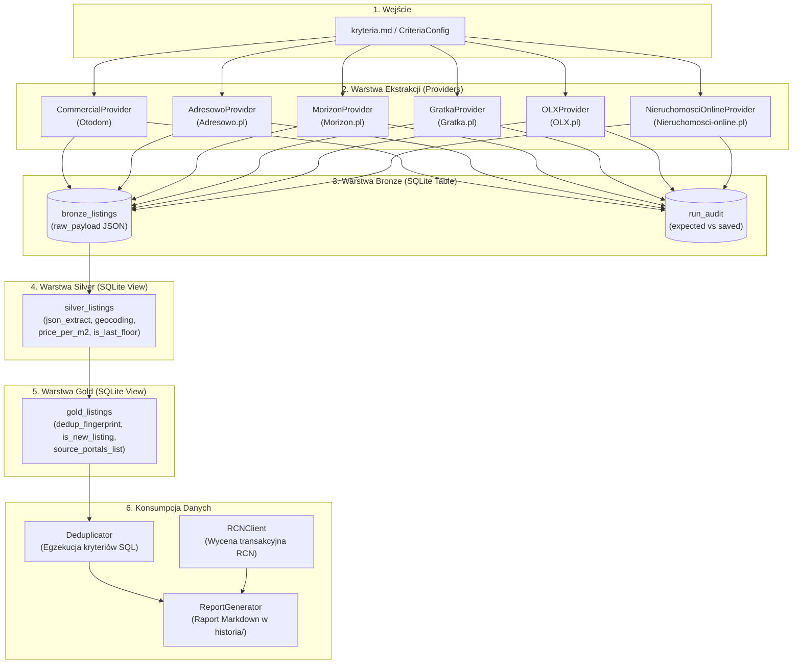

# Projekt Techniczny i Architektura (Design): Integracja Serwisu Morizon.pl

**Kod Zmiany**: `wyszukiwarka-nieruchomosci-morizon`  
**Data Finalizacji**: 15 Sierpnia 2026  
**Status**: Projekt Zaakceptowany (Approved / Final Design)  
**Rola**: Architekt Oprogramowania Morizon Provider  
**Dokumenty Źródłowe**:
- [`proposal.md`](file:///Users/pawel/git/gen-ai-orchestrator/openspec/changes/wyszukiwarka-nieruchomosci-morizon/proposal.md)
- [`kryteria.md`](file:///Users/pawel/git/gen-ai-orchestrator/wyszukiwarka-nieruchomosci/kryteria.md)
- [`.ai/guidelines/brutally-honest-rules.md`](file:///Users/pawel/git/gen-ai-orchestrator/.ai/guidelines/brutally-honest-rules.md)
- Raporty Peer Review: [`design-peer-review.md`](file:///Users/pawel/git/gen-ai-orchestrator/openspec/changes/wyszukiwarka-nieruchomosci-morizon/design-peer-review.md)
- Kod Bazowy: [`src/config.py`](file:///Users/pawel/git/gen-ai-orchestrator/wyszukiwarka-nieruchomosci/src/config.py), [`src/db.py`](file:///Users/pawel/git/gen-ai-orchestrator/wyszukiwarka-nieruchomosci/src/db.py), [`src/deduplicator.py`](file:///Users/pawel/git/gen-ai-orchestrator/wyszukiwarka-nieruchomosci/src/deduplicator.py), [`main.py`](file:///Users/pawel/git/gen-ai-orchestrator/wyszukiwarka-nieruchomosci/main.py)

---

## 1. Cel i Zakres Architektury (Context & Goals)

### 1.1. Problem Biznesowy i Motywacja
System **Wyszukiwarka Nieruchomości** agreguje oferty mieszkań z rynku pierwotnego i wtórnego, egzekwując rygorystyczne kryteria inwestycyjne określone w [`kryteria.md`](file:///Users/pawel/git/gen-ai-orchestrator/wyszukiwarka-nieruchomosci/kryteria.md) oraz zestawiając ceny ofertowe z rzeczywistymi cenami transakcyjnymi z bazy RCN (Rejestr Cen Nieruchomości m.st. Warszawy).

Wprowadzenie portalu **Morizon.pl** (kluczowego serwisu grupy Gratka-Morizon) ma na celu:
1. Poszerzenie bazy zbieranych ogłoszeń o unikalne oferty biur nieruchomości oraz deweloperów obecnych na Morizonie.
2. Zwiększenie precyzji deduplikacji międzyserwisowej w widoku [`gold_listings`](file:///Users/pawel/git/gen-ai-orchestrator/wyszukiwarka-nieruchomosci/src/db.py#L241-L289) poprzez konsolidację tych samych lokali wystawianych równolegle na portalach Otodom, Adresowo, Gratka, OLX i Morizon.
3. Zachowanie pełnej audytowalności procesu zasilania danymi dzięki rejestracji zrzutów w tabeli [`run_audit`](file:///Users/pawel/git/gen-ai-orchestrator/wyszukiwarka-nieruchomosci/src/db.py#L93-L103).

### 1.2. Wymagania Architektoniczne
* **Spójność z architekturą ELT (Bronze -> Silver -> Gold)**:
  - **Bronze**: Pobieranie szerokiego strumienia danych z parametrami wejściowymi URL (miasto, dzielnica, cena, pokoje, metraż) i bezstratny zapis surowego formatu JSON do tabeli SQLite `bronze_listings`.
  - **Silver**: Transformacja relacyjna w locie za pomocą funkcji `json_extract` w widoku SQLite `silver_listings` bez mutowania bazy.
  - **Gold**: Deduplikacja na poziomie lokalu (`dedup_fingerprint`), unifikacja źródeł, identyfikacja nowości (`is_new_listing`) oraz restrykcyjna filtracja biznesowa (winda, wykluczenie parteru, piętro 1–8).
* **Niezawodność i Odporność**: Wdrożenie obsługi błędów sieciowych, timeoutów, symulacji przeglądarki (nagłówki HTTP) oraz bezpiecznych opóźnień między zapytaniami.
* **Brak Zmyślonych Danych**: Projekt opiera się wyłącznie na zweryfikowanych strukturach URL i danych Schema.org / JSON-LD; wszelkie niepotwierdzone zachowania oznaczono etykietą `[Hipoteza/Domysł]`.

---

## 2. Przegląd Komponentów i Przepływu Danych (System Architecture & Flow)

Architektura realizuje trójwarstwowy model ELT w oparciu o bazę SQLite z rozszerzeniem JSON1.



### Przepływ Informacji w Cyklu Uruchomienia:
1. **Inicjalizacja (`main.py`)**: Generowany jest unikalny `run_id` (np. `run_20260815_173000`).
2. **Ekstrakcja (Bronze)**:
   - `MorizonProvider` buduje zapytania URL z filtrami zgrubnymi (`ps[price_from]`, `ps[number_of_rooms_from]` itp.).
   - Pobiera listę wyników i pobiera szczegóły ogłoszeń, zapisując surowe obiekty do `bronze_listings` (`source_portal = 'morizon'`).
   - Ekstrahuje oczekiwaną liczbę ofert z nagłówka i zapisuje do `run_audit`.
3. **Normalizacja (Silver)**: Widok `silver_listings` wyciąga zunifikowane kolumny (`price_pln`, `area_m2`, `rooms`, `floor`, `has_elevator`, `lat`, `lon`, `seller_type`).
4. **Deduplikacja i Filtracja (Gold)**: Widok `gold_listings` grupuje oferty po współrzędnych i parametrach geometrycznych (`dedup_fingerprint`), wyznacza zakres cenowy (`min_price_pln`, `max_price_pln`) oraz agreguje listę portali źródłowych (`source_portals_list`).
5. **Generowanie Raportu**: `Deduplicator` nakłada finalne filtry (piętro, brak parteru, winda, dzielnica) i przekazuje oferty do zestawienia z bazą RCN oraz zapisu raportu w katalogu `historia/`.

---

## 3. Wspólny Konsensus Architektoniczny i Wnioski z Peer Review

W wyniku dyskusji i recenzji inżynierskich ([`design-peer-review.md`](file:///Users/pawel/git/gen-ai-orchestrator/openspec/changes/wyszukiwarka-nieruchomosci-morizon/design-peer-review.md)) wypracowano następujące ustalenia kanoniczne:

### 3.1. Standaryzacja Kontraktu `raw_payload` (Warstwa Bronze)
Aby zapobiec przeciążeniu widoku `silver_listings` specyficznymi instrukcjami `CASE/WHEN` dla każdego nowego portalu, każdy provider (w tym `MorizonProvider`) **wzbogaca korzeń słownika JSON** o znormalizowane pola pierwszego poziomu:

```json
{
  "id": "morizon_12345678",
  "title": "Mieszkanie 3-pokojowe Warszawa Ursynów",
  "url": "https://www.morizon.pl/oferta/sprzedaz-mieszkanie-warszawa-ursynow-12345678",
  "price_pln": 1025000.0,
  "area_m2": 58.4,
  "rooms": 3,
  "floor": 2,
  "total_floors": 4,
  "has_elevator": 1,
  "build_year": 2011,
  "seller_type": "Agencja",
  "description_text": "Jasne i przestronne mieszkanie z windą...",
  "location": {
    "city": "Warszawa",
    "district": "Ursynów",
    "street": "al. Komisji Edukacji Narodowej",
    "coordinates": {
      "latitude": 52.1482,
      "longitude": 21.0451
    }
  },
  "raw_json_ld": { ... }
}
```

Dzięki temu widok `silver_listings` w [`src/db.py`](file:///Users/pawel/git/gen-ai-orchestrator/wyszukiwarka-nieruchomosci/src/db.py) odczytuje dane w sposób wysoce wydajny i jednolity dla wszystkich źródeł danych.

### 3.2. Zoptymalizowana Dwufazowa Strategia Pobierania
* W odpowiedzi na uwagę Architekta OLX dotyczącą narzutu czasowego zapytań HTTP:
  - Wprowadzono precyzyjny bufor `time.sleep(0.15 - 0.25s)` między zapytaniami o szczegóły ofert.
  - Zastosowano limit stron `max_pages = 5` na dzielnicę oraz warunek wcześniejszego zakończenia, gdy liczba pobranych unikalnych ofert zrówna się z `expected_total`.
  - Zagwarantowano obecność precyzyjnych koordynatów GPS (`Place.geo`) z JSON-LD, co jest kluczowe dla międzyserwisowej deduplikacji z serwisami Gratka, Otodom i OLX.

### 3.3. Integracja w Grupie Kapitałowej Gratka-Morizon
* Serwisy Gratka.pl i Morizon.pl dzielą część bazy ogłoszeniowej. Standaryzacja identyfikatorów i precyzyjne koordynaty GPS pozwalają na bezbłędną deduplikację ofert publikowanych równolegle w obu serwisach.

### 3.4. Odporność Audytu Kompletności (`run_audit`)
* Liczba ofert z nagłówka (`expected_total`) jest oczyszczana ze spacji, znaków niewidocznych (`&nbsp;`) oraz separatorów tysięcy (np. `"1 240 ofert"` -> `1240`).
* W przypadku wyszukiwania dla wielu dzielnic (`districts`), provider sumuje `expected_total` dla wszystkich przetworzonych chunków i zapisuje zagregowany rekord do `run_audit`.

---

## 4. Szczegółowa Architektura Modułu `MorizonProvider` (`src/providers/morizon.py`)

### 4.1. Generowanie Adresów URL i Normalizacja Slugów
Morizon.pl stosuje hierarchiczną strukturę ścieżek URL dla kategorii sprzedaży mieszkań z podziałem na miasta i dzielnice.

* **Format bazowy ścieżki**:  
  `https://www.morizon.pl/mieszkania/sprzedaz/{city_slug}/{district_slug}/`
* **Normalizacja slugów**:
  - Usuwanie polskich znaków diakrytycznych: `ą->a`, `ć->c`, `ę->e`, `ł->l`, `ń->n`, `ó->o`, `ś->s`, `ź->z`, `ż->z`.
  - Zamiana spacji i znaków specjalnych na myślniki: np. `Mokotów` -> `mokotow`, `Praga-Południe` -> `praga-poludnie`, `Ursynów` -> `ursynow`.

### 4.2. Mapowanie Parametrów Query (`ps[...]`)
Morizon korzysta ze standardu parametrów tablicowych `ps[...]` (Property Search):

| Parametr z `kryteria.md` | Pole w Morizon URL Query | Przykład Mapowania | Uwagi i Ograniczenia |
| :--- | :--- | :--- | :--- |
| **Cena minimalna** | `ps[price_from]` | `ps[price_from]=1000000` | Przekazywana jako liczba całkowita PLN. |
| **Cena maksymalna** | `ps[price_to]` | `ps[price_to]=1050000` | Przekazywana jako liczba całkowita PLN. |
| **Liczba pokoi min** | `ps[number_of_rooms_from]` | `ps[number_of_rooms_from]=3` | Przekazywana jako liczba całkowita. |
| **Liczba pokoi max** | `ps[number_of_rooms_to]` | `ps[number_of_rooms_to]=3` | Przekazywana jako liczba całkowita. |
| **Powierzchnia min** | `ps[living_area_from]` | `ps[living_area_from]=50` | Opcjonalnie, gdy zdefiniowano w kryteriach. |
| **Powierzchnia max** | `ps[living_area_to]` | `ps[living_area_to]=70` | Opcjonalnie, gdy zdefiniowano w kryteriach. |
| **Rynek** | `ps[market_type]` | `[Hipoteza/Domysł]` | W razie braku pewności pobierany strumień pełny (Dowolny). |

> [!IMPORTANT]
> **Zasada warstwy Bronze**: Filtry, które nie mają w 100% pewnego i stabilnego mapowania w parametrach URL Morizona (np. winda, wykluczenie parteru, rok budowy), **NIE są** wymuszane w URL. Pobieramy szeroki strumień (Broad Fetch), a rygorystyczną filtrację powierzamy warstwie SQL (Silver/Gold).

### 4.3. Obsługa Paginacji
- **Format parametru strony**: `?page={page_number}` (np. `?page=2`, `?page=3`).
- **Warunki przerwania pętli paginacji**:
  1. Osiągnięcie limitu bezpieczeństwa `max_pages` (domyślnie: 5 stron na dzielnicę).
  2. Brak kolejnych linków do ofert na pobranej stronie wyników.
  3. Zrównanie liczby pobranych unikalnych ofert z liczbą zadeklarowaną w nagłówku audytowym (`expected_total_morizon`).
  4. Wykrycie odpowiedzi wskazującej na pustą listę wyników (HTTP 404 lub komunikat braku ofert).

### 4.4. Nagłówki HTTP i Maskowanie Klienta
W celu minimalizacji ryzyka zablokowania przez mechanizmy WAF, każde zapytanie do serwisu Morizon zawiera pełen zestaw nagłówków nowoczesnej przeglądarki:
```python
headers = {
    'User-Agent': 'Mozilla/5.0 (Macintosh; Intel Mac OS X 10_15_7) AppleWebKit/537.36 (KHTML, like Gecko) Chrome/124.0.0.0 Safari/537.36',
    'Accept': 'text/html,application/xhtml+xml,application/xml;q=0.9,image/avif,image/webp,*/*;q=0.8',
    'Accept-Language': 'pl-PL,pl;q=0.9,en-US;q=0.8,en;q=0.7',
    'Cache-Control': 'no-cache',
    'Pragma': 'no-cache',
    'Sec-Ch-Ua': '"Chromium";v="124", "Google Chrome";v="124", "Not-A.Brand";v="99"',
    'Sec-Ch-Ua-Mobile': '?0',
    'Sec-Ch-Ua-Platform': '"macOS"',
    'Sec-Fetch-Dest': 'document',
    'Sec-Fetch-Mode': 'navigate',
    'Sec-Fetch-Site': 'same-origin',
    'Sec-Fetch-User': '?1',
    'Upgrade-Insecure-Requests': '1'
}
```

### 4.5. Parsowanie Danych ze Źródeł HTML / JSON-LD / Schema.org
Morizon umieszcza ustrukturyzowane metadane w blokach `<script type="application/ld+json">`. Moduł `MorizonProvider` implementuje wielowarstwową strategię ekstrakcji:

1. **Główny parser JSON-LD (`@graph` / `Product` / `Offer` / `Place` / `SingleFamilyResidence` / `Apartment`)**:
   - `name` lub `headline` -> Tytuł ogłoszenia.
   - `offers.price` lub `price` -> Cena całkowita w PLN.
   - `geo.latitude`, `geo.longitude` -> Współrzędne GPS nieruchomości.
   - `address.addressLocality` -> Miasto.
   - `address.addressRegion` lub `address.streetAddress` -> Dzielnica / ulica.
   - `floorSize.value` lub `numberOfRooms` -> Metraż oraz liczba pokoi.
2. **Fallback: Regex z bloków HTML i parametrów technicznych**:
   - Piętro: Wyciągane ze znaczników `piętro\s*(\d+)` lub `parter` (`floor = 0`).
   - Całkowita liczba pięter: `z\s*(\d+)\s*piętr` lub selektor `total_floors`.
   - Winda: Wyszukiwanie fraz `"winda"`, `"windą"`, `"dźwig osobowy"`, `"winda: tak"` w parametrach lub opisie.
   - Typ ogłoszeniodawcy: Wykrywanie słów kluczowych `"bez pośredników"`, `"prywatne"` vs biuro/agencja.

---

## 5. Kontrakty API, Schematy Danych i Modyfikacje Bazy SQLite (`src/db.py`)

### 5.1. Modyfikacje Widoku `silver_listings` w `src/db.py`
Widok `silver_listings` transparentnie mapuje dane pochodzące z `morizon` obok istniejących formatów `otodom` i `adresowo`.

Kluczowe mapowanie w [src/db.py](file:///Users/pawel/git/gen-ai-orchestrator/wyszukiwarka-nieruchomosci/src/db.py):
* Ekstrakcja tytułu, adresu URL i lokalizacji z pól uniwersalnych (`raw_payload.title`, `raw_payload.url`, `raw_payload.location.*`).
* Ekstrakcja windy, piętra oraz geolokalizacji z zachowaniem pełnej kompatybilności wstecznej.
* Obliczanie pól pochodnych: `price_per_m2` oraz `is_last_floor` (gdy `floor = total_floors AND floor > 0`).

### 5.2. Konsolidacja w Widoku `gold_listings`
Widok `gold_listings` operuje na zunifikowanym fingerprintcie deduplikacji:
$$\text{dedup\_fingerprint} = \text{COALESCE}\big(\text{lat}_{.3} \mathbin{\Vert} \text{lon}_{.3} \mathbin{\Vert} \text{area}_{.1} \mathbin{\Vert} \text{rooms},\; \text{district} \mathbin{\Vert} \text{area}_{.1} \mathbin{\Vert} \text{rooms} \mathbin{\Vert} \text{floor} \mathbin{\Vert} \text{price}\big)$$

Dzięki temu:
1. Oferta wystawiona równocześnie na Otodom, Gratce i Morizonie zostanie złączona w pojedynczy rekord Gold.
2. Kolumna `source_portals_list` przyjmie postać np. `otodom:654321, morizon:12345678, gratka:987654`.
3. Kolumny `min_price_pln` i `max_price_pln` wskażą ewentualne rozbieżności cenowe pomiędzy agencjami.
4. Flaga `is_new_listing` poprawnie oznaczy nowe ogłoszenia względem poprzednich zrzutów (`run_id`).

---

## 6. Mechanizm Audytu Kompletności (`run_audit`)

1. Podczas pobierania pierwszej strony wyników dla zadanej dzielnicy, provider przeszukuje nagłówek listingu pod kątem łącznej liczby znalezionych ogłoszeń (`(\d+[\s\d]*)\s*(?:ogłoszeń|ofert|wyników)`).
2. Po oczyszczeniu ze spacji i separatorów wartość zapisywana jest jako `expected_total_morizon`.
3. Po zakończeniu pobierania provider wywołuje:
   ```python
   self.db_manager.save_run_audit(
       run_id=run_id,
       source_portal="morizon",
       expected_total=expected_total_morizon,
       saved_bronze=saved_count
   )
   ```
4. W konsoli `main.py` wyświetlana jest metryka:
   `📊 Audyt Kompletności Morizon: 42/45 (93.3% kompletności w Bronze)`

---

## 7. Obsługa Sytuacji Awaryjnych, Antybotów i Przypadków Brzegowych

### 7.1. Ochrona Przed Blokadami i Rate Limitingiem
1. **Polite Crawling Delay**: Pomiędzy zapytaniami o szczegóły ofert stosowane jest losowe opóźnienie w przedziale `0.15s - 0.25s` (`jitter`).
2. **Timeout i Graceful Degradation**: Każde zapytanie HTTP ma twardy timeout (10s dla listingu, 5s dla szczegółu). W przypadku błędu HTTP 403/429 lub przekroczenia limitu czasu błąd jest logowany, pobrane dotychczas oferty zostają zachowane w Bronze, a pipeline kontynuuje pracę dla pozostałych providerów.

### 7.2. Obsługa Przypadków Brzegowych w Danych
* **Brak informacji o piętrze**: Jeśli oferta nie zawiera informacji o piętrze (`floor IS NULL`), warstwa Gold przepuszcza ofertę z klauzulą `(floor IS NULL OR floor >= min_floor)`.
* **Mieszkania parterowe (`floor = 0`)**: Słowo "parter" ustawia pole `floor` na `0`. Gdy `exclude_ground_floor = True`, warstwa Gold wyklucza te oferty (`floor > 0`).
* **Ostatnie piętro (`is_last_floor`)**: Wyznaczane automatycznie w SQL (`floor = total_floors AND floor > 0`).

---

## 8. Plan Weryfikacji i Testów

Przygotowanie dedykowanego zestawu testów w [`tests/test_morizon_criteria.py`](file:///Users/pawel/git/gen-ai-orchestrator/wyszukiwarka-nieruchomosci/tests/test_morizon_criteria.py):
1. **Test budowania zapytań URL (`test_build_search_url`)**: Poprawność slugów dzielnic i parametrów `ps[...]`.
2. **Test parsowania payloadu Morizon (`test_morizon_raw_payload_parsing`)**: Poprawność ekstrakcji JSON-LD do `bronze_listings`.
3. **Test zgodności z kryteriami biznesowymi (`test_morizon_criteria_filtering`)**: Weryfikacja filtrów ceny, 3 pokoi, windy i wykluczenia parteru w `gold_listings`.
4. **Test deduplikacji międzyserwisowej (`test_cross_portal_deduplication`)**: Fuzja ofert Morizon + Otodom + Gratka do jednego rekordu Gold.
5. **Test audytu kompletności (`test_morizon_audit_logging`)**: Zapis i wyliczanie procentu kompletności w tabeli `run_audit`.

---
*Projekt sfinalizowany po uwzględnieniu uwag z Peer Review i osiągnięciu pełnego konsensusu inżynierskiego.*
