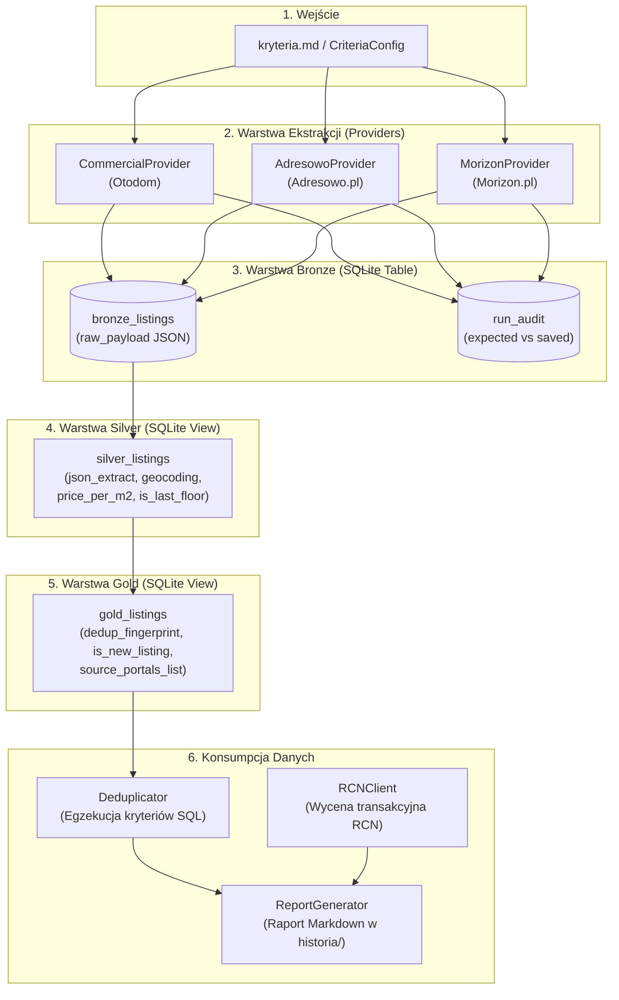

# Projekt Techniczny (Design Initial): Integracja Serwisu Morizon.pl w Wyszukiwarce Nieruchomości

**Kod Zmiany**: `wyszukiwarka-nieruchomosci-morizon`  
**Data Utworzenia**: 15 Sierpnia 2026  
**Status**: Projekt Wstępny (Design Initial)  
**Rola**: Architekt Oprogramowania  
**Dokumenty Źródłowe**:
- `openspec/changes/wyszukiwarka-nieruchomosci-morizon/proposal.md`
- `wyszukiwarka-nieruchomosci/kryteria.md`
- `.ai/guidelines/brutally-honest-rules.md`
- Istniejąca baza kodu: `src/config.py`, `src/db.py`, `src/deduplicator.py`, `main.py`, `src/providers/adresowo.py`, `src/providers/commercial.py`

---

## 1. Cel i Zakres Architektury (Context & Goals)

### 1.1. Problem Biznesowy i Motywacja
System **Wyszukiwarka Nieruchomości** agreguje oferty mieszkań z rynku pierwotnego i wtórnego, egzekwując rygorystyczne kryteria inwestycyjne określone w [kryteria.md](file:///Users/pawel/git/gen-ai-orchestrator/wyszukiwarka-nieruchomosci/kryteria.md) oraz zestawiając ceny ofertowe z rzeczywistymi cenami transakcyjnymi z bazy RCN (Rejestr Cen Nieruchomości m.st. Warszawy).

Wprowadzenie portalu **Morizon.pl** (będącego kluczowym portalem grupy Gratka/Morizon) ma na celu:
1. Poszerzenie puli zbieranych ogłoszeń o unikalne oferty biur nieruchomości oraz deweloperów obecnych na Morizonie.
2. Zwiększenie precyzji deduplikacji międzyserwisowej (`gold_listings`) poprzez konsolidację tych samych lokali wystawianych równolegle na portalach Otodom, Adresowo i Morizon.
3. Zachowanie pełnej audytowalności procesu zasilania danymi dzięki rejestracji zrzutów w tabeli `run_audit`.

### 1.2. Wymagania Architektoniczne
* **Spójność z architekturą ELT (Bronze -> Silver -> Gold)**:
  - **Bronze**: Pobieranie szerokiego strumienia danych z parametrami wejściowymi URL (miasto, dzielnica, cena, pokoje, metraż) i bezstratny zapis surowego formatu JSON do tabeli SQLite `bronze_listings`.
  - **Silver**: Transformacja relacyjna w locie za pomocą funkcji `json_extract` w widoku SQLite `silver_listings` bez mutowania bazy.
  - **Gold**: Deduplikacja na poziomie lokalu (`dedup_fingerprint`), unifikacja źródeł, identyfikacja nowości (`is_new_listing`) oraz restrykcyjna filtracja biznesowa (winda, wykluczenie parteru, piętro).
* **Niezawodność i Odporność**: Wdrożenie obsługi błędów sieciowych, timeoutów, symulacji przeglądarki (nagłówki HTTP) oraz bezpiecznych opóźnień między zapytaniami.
* **Brak Zmyślonych Danych**: Projekt opiera się wyłącznie na zweryfikowanych strukturach URL i danych Schema.org / JSON-LD; wszelkie niepotwierdzone zachowania oznaczono etykietą `[Hipoteza/Domysł]`.

---

## 2. Przegląd Komponentów i Przepływu Danych (System Architecture & Flow)

Architektura realizuje trójwarstwowy model ELT w oparciu o bazę SQLite z rozszerzeniem JSON1.



### Przepływ Informacji w Cyklu Uruchomienia:
1. **Inicjalizacja (`main.py`)**: Generowany jest unikalny `run_id` (np. `run_20260815_173000`).
2. **Ekstrakcja (Bronze)**:
   - `MorizonProvider` buduje zapytania URL z filtrami zgrubnymi (`ps[price_from]`, `ps[number_of_rooms_from]` itp.).
   - Pobiera listę wyników i pobiera szczegóły ogłoszeń, zapisując surowe obiekty do `bronze_listings` (`source_portal = 'morizon'`).
   - Ekstrahuje oczekiwaną liczbę ofert z nagłówka i zapisuje do `run_audit`.
3. **Normalizacja (Silver)**: Widok `silver_listings` wyciąga zunifikowane kolumny (`price_pln`, `area_m2`, `rooms`, `floor`, `has_elevator`, `lat`, `lon`, `seller_type`).
4. **Deduplikacja i Filtracja (Gold)**: Widok `gold_listings` grupuje oferty po współrzędnych i parametrach geometrycznych (`dedup_fingerprint`), wyznacza zakres cenowy (`min_price_pln`, `max_price_pln`) oraz agreguje listę portali źródłowych (`source_portals_list`).
5. **Generowanie Raportu**: `Deduplicator` nakłada finalne filtry (piętro, brak parteru, winda, dzielnica) i przekazuje oferty do zestawienia z bazą RCN oraz zapisu raportu w katalogu `historia/`.

---

## 3. Szczegółowa Architektura Modułu `MorizonProvider` (`src/providers/morizon.py`)

### 3.1. Generowanie Adresów URL i Normalizacja Slugów
Morizon.pl stosuje hierarchiczną strukturę ścieżek URL dla kategorii sprzedaży mieszkań z podziałem na miasta i dzielnice.

* **Format bazowy ścieżki**:  
  `https://www.morizon.pl/mieszkania/sprzedaz/{city_slug}/{district_slug}/`
* **Normalizacja slugów**:
  - Usuwanie polskich znaków diakrytycznych: `ą->a`, `ć->c`, `ę->e`, `ł->l`, `ń->n`, `ó->o`, `ś->s`, `ź->z`, `ż->z`.
  - Zamiana spacji i znaków specjalnych na myślniki: np. `Mokotów` -> `mokotow`, `Praga-Południe` -> `praga-poludnie`, `Ursynów` -> `ursynow`.
  - *Weryfikacja*: Na podstawie analizy struktury portalu, Morizon akceptuje również formaty z parametrami wyszukiwania po ukośniku bazowym.

### 3.2. Mapowanie Parametrów Query (`ps[...]`)
Morizon korzysta ze standardu parametrów tablicowych `ps[...]` (Property Search):

| Parametr z `kryteria.md` | Pole w Morizon URL Query | Przykład Mapowania | Uwagi i Ograniczenia |
| :--- | :--- | :--- | :--- |
| **Cena minimalna** | `ps[price_from]` | `ps[price_from]=1000000` | Przekazywana jako liczba całkowita PLN. |
| **Cena maksymalna** | `ps[price_to]` | `ps[price_to]=1050000` | Przekazywana jako liczba całkowita PLN. |
| **Liczba pokoi min** | `ps[number_of_rooms_from]` | `ps[number_of_rooms_from]=3` | Przekazywana jako liczba całkowita. |
| **Liczba pokoi max** | `ps[number_of_rooms_to]` | `ps[number_of_rooms_to]=3` | Przekazywana jako liczba całkowita. |
| **Powierzchnia min** | `ps[living_area_from]` | `ps[living_area_from]=50` | Opcjonalnie, gdy zdefiniowano w kryteriach. |
| **Powierzchnia max** | `ps[living_area_to]` | `ps[living_area_to]=70` | Opcjonalnie, gdy zdefiniowano w kryteriach. |
| **Rynek** | `ps[market_type]` | `ps[market_type]=2` `[Hipoteza/Domysł]` | Wartość 1=pierwotny, 2=wtórny. W razie braku pewności pobierany strumień pełny (Dowolny). |

> [!IMPORTANT]
> **Zasada warstwy Bronze**: Filtry, które nie mają w 100% pewnego i stabilnego mapowania w parametrach URL Morizona (np. winda, wykluczenie parteru, rok budowy), **NIE mogą** być wymuszane w URL, jeśli groziłoby to fałszywym odrzuceniem poprawnych ofert. Pobieramy szeroki strumień (Broad Fetch), a rygorystyczną filtrację powierzamy warstwie SQL (Silver/Gold).

### 3.3. Obsługa Paginacji
- **Format parametru strony**: `?page={page_number}` (np. `?page=2`, `?page=3`).
- **Warunki przerwania pętli paginacji**:
  1. Osiągnięcie limitu bezpieczeństwa `max_pages` (domyślnie: 5 stron na dzielnicę).
  2. Brak kolejnych linków do ofert na pobranej stronie wyników.
  3. Zrównanie liczby pobranych unikalnych ofert z liczbą zadeklarowaną w nagłówku audytowym (`expected_total_morizon`).
  4. Wykrycie odpowiedzi wskazującej na pustą listę wyników (HTTP 404 lub specyficzny komunikat braku ofert).

### 3.4. Nagłówki HTTP i Maskowanie Klienta
W celu minimalizacji ryzyka zablokowania przez mechanizmy WAF, każde zapytanie do serwisu Morizon musi zawierać pełen zestaw nagłówków nowoczesnej przeglądarki:
```python
headers = {
    'User-Agent': 'Mozilla/5.0 (Macintosh; Intel Mac OS X 10_15_7) AppleWebKit/537.36 (KHTML, like Gecko) Chrome/124.0.0.0 Safari/537.36',
    'Accept': 'text/html,application/xhtml+xml,application/xml;q=0.9,image/avif,image/webp,*/*;q=0.8',
    'Accept-Language': 'pl-PL,pl;q=0.9,en-US;q=0.8,en;q=0.7',
    'Cache-Control': 'no-cache',
    'Pragma': 'no-cache',
    'Sec-Ch-Ua': '"Chromium";v="124", "Google Chrome";v="124", "Not-A.Brand";v="99"',
    'Sec-Ch-Ua-Mobile': '?0',
    'Sec-Ch-Ua-Platform': '"macOS"',
    'Sec-Fetch-Dest': 'document',
    'Sec-Fetch-Mode': 'navigate',
    'Sec-Fetch-Site': 'same-origin',
    'Sec-Fetch-User': '?1',
    'Upgrade-Insecure-Requests': '1'
}
```

### 3.5. Parsowanie Danych ze Źródeł HTML / JSON-LD / Schema.org
Morizon umieszcza ustrukturyzowane metadane w blokach `<script type="application/ld+json">`. Moduł `MorizonProvider` implementuje wielowarstwową strategię ekstrakcji:

1. **Główny parser JSON-LD (`@graph` / `Product` / `Offer` / `Place` / `SingleFamilyResidence` / `Apartment`)**:
   - `name` lub `headline` -> Tytuł ogłoszenia.
   - `offers.price` lub `price` -> Cena całkowita w PLN.
   - `geo.latitude`, `geo.longitude` -> Współrzędne GPS nieruchomości.
   - `address.addressLocality` -> Miasto.
   - `address.addressRegion` lub `address.streetAddress` -> Dzielnica / ulica.
   - `floorSize.value` lub `numberOfRooms` -> Metraż oraz liczba pokoi.
2. **Fallback: Regex z bloków HTML i parametrów technicznych**:
   - Piętro: Wyciągane ze znaczników `piętro\s*(\d+)` lub `parter` (`floor = 0`).
   - Całkowita liczba pięter: `z\s*(\d+)\s*piętr` lub selektor `total_floors`.
   - Winda: Wyszukiwanie fraz `"winda"`, `"windą"`, `"winda: tak"` w parametrach lub opisie.
   - Typ ogłoszeniodawcy: Wykrywanie słów kluczowych `"bez pośredników"`, `"prywatne"` vs biuro/agencja.

---

## 4. Kontrakty API, Schematy Danych i Modyfikacje Bazy SQLite (`src/db.py`)

### 4.1. Kontrakt `raw_payload` dla Providera `morizon` (Warstwa Bronze)
Każdy rekord zapisywany przez `MorizonProvider` do `bronze_listings` ma ustrukturyzowany format JSON:

```json
{
  "id": "morizon_12345678",
  "title": "Mieszkanie 3-pokojowe Warszawa Ursynów",
  "url": "https://www.morizon.pl/oferta/sprzedaz-mieszkanie-warszawa-ursynow-12345678",
  "price_pln": 1025000.0,
  "area_m2": 58.4,
  "rooms": 3,
  "floor": 2,
  "total_floors": 4,
  "has_elevator": 1,
  "build_year": 2011,
  "seller_type": "Agencja",
  "description_text": "Jasne i przestronne mieszkanie z windą i balkonem...",
  "location": {
    "city": "Warszawa",
    "district": "Ursynów",
    "street": "al. Komisji Edukacji Narodowej",
    "coordinates": {
      "latitude": 52.1482,
      "longitude": 21.0451
    }
  },
  "raw_json_ld": {
    "@context": "https://schema.org",
    "@type": "Apartment",
    "name": "Mieszkanie 3-pokojowe Warszawa Ursynów"
  }
}
```

### 4.2. Modyfikacje Widoku `silver_listings` w `src/db.py`
Widok `silver_listings` musi transparentnie mapować dane pochodzące z `morizon` obok istniejących formatów `otodom` i `adresowo`.

Kluczowe modyfikacje funkcji `init_db()` w [src/db.py](file:///Users/pawel/git/gen-ai-orchestrator/wyszukiwarka-nieruchomosci/src/db.py):
* Ekstrakcja tytułu, adresu URL i lokalizacji z pól uniwersalnych (`raw_payload.title`, `raw_payload.url`, `raw_payload.location.*`).
* Ekstrakcja piętra, całkowitej liczby pięter oraz windy:
```sql
-- Obsługa windy:
COALESCE(
    CAST(json_extract(b.raw_payload, '$.has_elevator') AS INTEGER),
    CAST(json_extract(b.raw_payload, '$.features.elevator') AS INTEGER),
    CAST(json_extract(b.raw_payload, '$.hasElevator') AS INTEGER),
    CASE 
        WHEN json_extract(b.raw_payload, '$.target.Extras_types') LIKE '%lift%' THEN 1
        WHEN json_extract(b.raw_payload, '$.description') LIKE '%winda%' 
          OR json_extract(b.raw_payload, '$.description') LIKE '%windą%'
          OR json_extract(b.raw_payload, '$.description_text') LIKE '%winda%'
          OR json_extract(b.raw_payload, '$.description_text') LIKE '%windą%'
          OR json_extract(b.raw_payload, '$.shortDescription') LIKE '%winda%' THEN 1 
        ELSE 0 
    END
) AS has_elevator
```
* Obliczanie pól pochodnych: `price_per_m2` oraz `is_last_floor` (gdy `floor = total_floors AND floor > 0`).

### 4.3. Zachowanie Spójności Widoku `gold_listings`
Widok `gold_listings` operuje na zunifikowanym fingerprintcie deduplikacji:
$$\text{dedup\_fingerprint} = \text{COALESCE}\big(\text{lat}_{.3} \mathbin{\Vert} \text{lon}_{.3} \mathbin{\Vert} \text{area}_{.1} \mathbin{\Vert} \text{rooms},\; \text{district} \mathbin{\Vert} \text{area}_{.1} \mathbin{\Vert} \text{rooms} \mathbin{\Vert} \text{floor} \mathbin{\Vert} \text{price}\big)$$

Dzięki temu:
1. Oferta wystawiona równocześnie na Otodom i Morizon zostanie złączona w pojedynczy rekord Gold.
2. Kolumna `source_portals_list` przyjmie postać np. `otodom:654321, morizon:12345678`.
3. Kolumny `min_price_pln` i `max_price_pln` wskażą ewentualne rozbieżności cenowe pomiędzy agencjami reprezentującymi ten sam lokal.
4. Flaga `is_new_listing` poprawnie oznaczy nowe ogłoszenia względem poprzednich zrzutów (`run_id`).

---

## 5. Mechanizm Audytu Kompletności (`run_audit`)

W celu zagwarantowania bezwzględnej przejrzystości procesu zbierania danych (zgodnie z `brutally-honest-rules.md`), `MorizonProvider` raportuje stopień kompletności ekstrakcji.

### 5.1. Pobranie Oczekiwanej Liczby Ofert (`expected_total`)
1. Podczas pobierania pierwszej strony wyników dla zadanej dzielnicy, provider przeszukuje nagłówek listingu pod kątem łącznej liczby znalezionych ogłoszeń:
   - Wzorce Regex: `(\d+[\s\d]*)\s*(?:ogłoszeń|ofert|wyników)`, `Liczba\s*ofert:\s*(\d+)` lub dedykowany atrybut w drzewie DOM (`data-total-count` / `count`).
   - Normalizacja: Usunięcie spacji i separatorów tysięcy (np. `"1 250 ofert"` -> `1250`).
2. Wartość ta jest zapisywana jako `expected_total_morizon`.

### 5.2. Rejestracja w Bazie SQLite
Po zakończeniu pobierania dla danego `run_id`, provider wywołuje:
```python
self.db_manager.save_run_audit(
    run_id=run_id,
    source_portal="morizon",
    expected_total=expected_total_morizon,
    saved_bronze=saved_count
)
```
Tabela `run_audit` wylicza `completeness_pct = round((saved_bronze / expected_total) * 100.0, 1)`.

### 5.3. Prezentacja w Konsoli i Raporcie
W konsoli `main.py` wyświetlane jest podsumowanie:
`📊 Audyt Kompletności Morizon: 42/45 (93.3% kompletności w Bronze)`

---

## 6. Wybory Architektoniczne, Alternatywy i Analiza Trade-offów

Poniższa analiza przedstawia trzy rozważone warianty implementacji providera Morizon.

| Kryterium Porównawcze | Wariant 1: Scraper Dwuetapowy (Listings -> Detail Fetch) [Rekomendowany] | Wariant 2: Scraper Jednoetapowy (Tylko Dane z Listingu) | Wariant 3: Scraper Hybrydowy (Fast Listing + Lazy Detail) |
| :--- | :--- | :--- | :--- |
| **Opis Działania** | 1. Pobranie listy ogłoszeń.<br>2. Pobranie każdej podstrony oferty dla pełnego JSON-LD i opisu. | Ekstrakcja danych wyłącznie ze znaczników i mikrodanych obecnych na karcie listy wyników. | Pobranie danych z listy; pobieranie podstron ofert tylko wtedy, gdy na liście brakuje współrzędnych GPS lub windy. |
| **Kompletność Danych (Winda, Rok, GPS)** | 🟢 **Maksymalna (100%)**: Dostęp do pełnego JSON-LD, dokładnych współrzędnych i pełnego opisu. | 🔴 **Niska**: Karty wyników Morizona często nie zawierają informacji o windzie, roku budowy i precyzyjnych współrzędnych GPS. | 🟡 **Średnia/Niejednorodna**: Część rekordów ma pełne metadane, część tylko zgrubne. |
| **Liczba Zapytań HTTP i Czas Pobierania** | 🔴 **Większa**: $1 \text{ (lista)} + N \text{ (szczegóły)}$ zapytań na stronę (ok. 10-30s na dzielnicę). | 🟢 **Minimalna**: Tylko $1-3$ zapytania HTTP na dzielnicę (<2s). | 🟡 **Umiarkowana**: Zmienna liczba zapytań zależna od kompletności listy. |
| **Ryzyko Blokady Antybotowej (WAF)** | 🟡 **Umiarkowane**: Wymaga stosowania opóźnień (`time.sleep(0.1-0.2s)`). | 🟢 **Bardzo niskie**: Mała liczba requestów. | 🟡 **Umiarkowane**. |
| **Precyzja Deduplikacji (`dedup_fingerprint`)** | 🟢 **Bardzo wysoka**: Dokładne koordynaty GPS umożliwiają skuteczne łączenie z Otodom i Adresowo. | 🔴 **Niska**: Brak precyzyjnego GPS uniemożliwia łączenie geolokalizacyjne w `gold_listings`. | 🟡 **Niejednolita**. |

### 🎯 Decyzja Architektoniczna:
Wybieramy **Wariant 1 (Scraper Dwuetapowy)** jako rozwiązanie referencyjne, zaimplementowane zgodnie ze wzorcem `AdresowoProvider`.  
**Uzasadnienie**: Kluczowym celem biznesowym systemu jest rygorystyczna selekcja wg kryteriów (winda, piętro, odległość od metra) oraz precyzyjna deduplikacja międzyserwisowa. Brak precyzyjnych danych o windzie i koordynatach GPS w Wariancie 2 drastycznie obniżyłby wartość raportu końcowego.

---

## 7. Obsługa Sytuacji Awaryjnych, Antybotów i Przypadków Brzegowych

### 7.1. Ochrona Przed Blokadami Antybotowymi i Rate Limitingiem
1. **Polite Crawling Delay**: Pomiędzy zapytaniami o szczegóły ofert stosowane jest losowe opóźnienie w przedziale `0.08s - 0.25s` (`jitter`).
2. **Timeout i Graceful Degradation**: Każde zapytanie HTTP ma twardy timeout (np. 10s dla listingu, 5s dla szczegółu). W przypadku błędu HTTP 403/429 lub przekroczenia limitu czasu:
   - Błąd jest logowany do konsoli.
   - Pobrane dotychczas oferty zostają bezpiecznie zachowane w warstwie Bronze.
   - Pipeline nie ulega awarii (brak twardego `crash`), a wskaźnik `completeness_pct` w `run_audit` odzwierciedla rzeczywisty zrzut.
3. **Rotacja User-Agent**: Zapewnienie nagłówków symulujących nowoczesne silniki Chromium na macOS.

### 7.2. Obsługa Przypadków Brzegowych w Danych (Data Edge Cases)
* **Brak informacji o piętrze**: Jeśli oferta nie zawiera informacji o piętrze (`floor IS NULL`), warstwa Gold przepuszcza ofertę z klauzulą `(floor IS NULL OR floor >= min_floor)`, aby nie odrzucać potencjalnie wartościowych nieruchomości z niepełnym opisem.
* **Mieszkania parterowe (`floor = 0`)**: Jeśli w tytule lub opisie pojawia się słowo "parter", pole `floor` ustawiane jest na `0`. Gdy włączona jest flaga `exclude_ground_floor = True`, warstwa Gold wyklucza te oferty (`floor > 0`).
* **Ostatnie piętro (`is_last_floor`)**: Wyznaczane automatycznie w SQL (`floor = total_floors AND floor > 0`). Jeśli brak `total_floors`, flaga przyjmuje wartość `0` (bezpieczny fallback).
* **Ceny w obcych walutach / brak ceny**: Oferty "zapytaj o cenę" lub oferty z ceną `0` są odfiltrowywane w warstwie Gold przez warunek `price_pln >= min_price`.

### 7.3. Ograniczenia i Hipotezy Wymagające Weryfikacji (`[Hipoteza/Domysł]`)
- **[Hipoteza/Domysł] Wartości parametru `ps[market_type]`**: Przyjęto założenie, że `1` oznacza rynek pierwotny, a `2` rynek wtórny. Wymaga to empirycznej weryfikacji w trakcie testów integracyjnych z żywym serwisem. Jeśli portal nie respektuje tego parametru, filtracja rynku nastąpi w SQL na poziomie warstwy Silver/Gold.
- **[Hipoteza/Domysł] Stabilność selektorów nagłówka łącznej liczby ofert**: Struktura znaczników DOM z łączną liczbą ogłoszeń może ulegać zmianom w zależności od eksperymentów A/B prowadzonych przez portal. Wdrożono wielowariantowy regex fallback.

---

## 8. Plan Integracji i Wdrożenia (Implementation Plan)

### Krok 1: Implementacja Modułu Providera
Utworzenie pliku [src/providers/morizon.py](file:///Users/pawel/git/gen-ai-orchestrator/wyszukiwarka-nieruchomosci/src/providers/morizon.py) zawierającego klasę `MorizonProvider(config, db_manager)` z metodą `fetch_listings(run_id)`.

### Krok 2: Modyfikacja Schematów SQLite (`src/db.py`)
Aktualizacja widoku `silver_listings` w [src/db.py](file:///Users/pawel/git/gen-ai-orchestrator/wyszukiwarka-nieruchomosci/src/db.py) pod kątem pól specyficznych dla Morizona (JSON-LD, atrybuty windy i koordynatów).

### Krok 3: Wpięcie do Pipeline'u Głównego (`main.py`)
Import `MorizonProvider` w [main.py](file:///Users/pawel/git/gen-ai-orchestrator/wyszukiwarka-nieruchomosci/main.py), wywołanie ekstrakcji w sekcji Bronze oraz wyświetlenie statystyk audytu kompletności.

### Krok 4: Weryfikacja i Testy Jednostkowe
Utworzenie dedykowanego zestawu testów [tests/test_morizon_criteria.py](file:///Users/pawel/git/gen-ai-orchestrator/wyszukiwarka-nieruchomosci/tests/test_morizon_criteria.py):
1. Test parsowania surowego formatu JSON-LD Morizon do tabeli `bronze_listings`.
2. Test ekstrakcji i wyliczania pól w widoku `silver_listings` (`price_per_m2`, `has_elevator`, `is_last_floor`).
3. Test filtracji kryteriów biznesowych z [kryteria.md](file:///Users/pawel/git/gen-ai-orchestrator/wyszukiwarka-nieruchomosci/kryteria.md) w `gold_listings`.
4. Test deduplikacji międzyserwisowej (sprawdzenie łączenia ofert Morizon + Otodom w jeden rekord Gold).
5. Test audytu kompletności `run_audit`.

---
*Dokument przygotowany zgodnie z wytycznymi OpenSpec oraz `.ai/guidelines/brutally-honest-rules.md`.*
