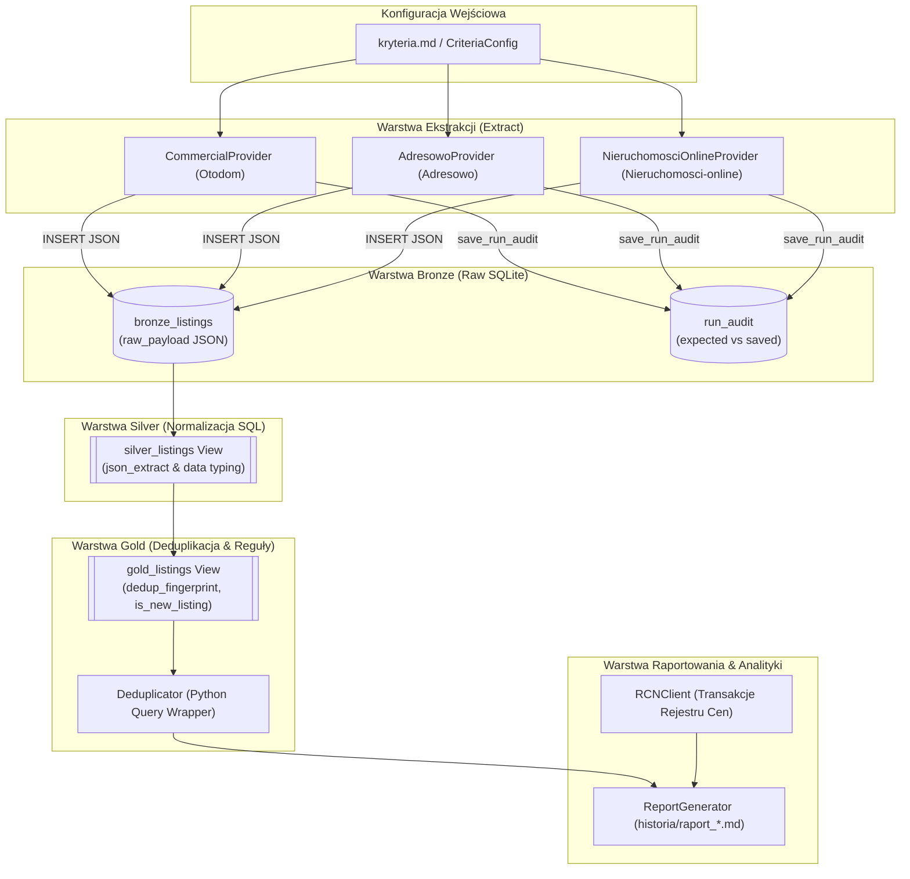

# Projekt Techniczny (Design): Integracja Portalu Nieruchomosci-online.pl

**Kod Zmiany**: `wyszukiwarka-nieruchomosci-nieruchomosci-online`  
**Data Utworzenia**: 15 Sierpnia 2026  
**Status**: Zaakceptowany Projekt Techniczny (Final Design Approved)  
**Dokumenty Powiązane**: 
- Propozycja: [`proposal.md`](file:///Users/pawel/git/gen-ai-orchestrator/openspec/changes/wyszukiwarka-nieruchomosci-nieruchomosci-online/proposal.md)
- Kryteria Biznesowe: [`kryteria.md`](file:///Users/pawel/git/gen-ai-orchestrator/wyszukiwarka-nieruchomosci/kryteria.md)
- Wytyczne Architektoniczne: [`.ai/guidelines/brutally-honest-rules.md`](file:///Users/pawel/git/gen-ai-orchestrator/.ai/guidelines/brutally-honest-rules.md)
- Raport Recenzencki: [`design-peer-review.md`](file:///Users/pawel/git/gen-ai-orchestrator/openspec/changes/wyszukiwarka-nieruchomosci-nieruchomosci-online/design-peer-review.md)
- Moduły Bazowe: [`db.py`](file:///Users/pawel/git/gen-ai-orchestrator/wyszukiwarka-nieruchomosci/src/db.py), [`deduplicator.py`](file:///Users/pawel/git/gen-ai-orchestrator/wyszukiwarka-nieruchomosci/src/deduplicator.py), [`config.py`](file:///Users/pawel/git/gen-ai-orchestrator/wyszukiwarka-nieruchomosci/src/config.py), [`main.py`](file:///Users/pawel/git/gen-ai-orchestrator/wyszukiwarka-nieruchomosci/main.py)

---

## 1. Cel i Zakres Architektury (Context & Goals)

### 1.1. Kontekst Biznesowy i Techniczny
System `wyszukiwarka-nieruchomosci` realizuje proces pozyskiwania, normalizacji, deduplikacji i analizy ofert mieszkań na rynku warszawskim w architekturze **ELT (Extract - Load - Transform)** opartej na trzech warstwach danych SQLite (**Bronze -> Silver -> Gold**). Dotychczasowe źródła to:
1. **Otodom.pl** (`CommercialProvider` / `DirectProvider`) – ekstrakcja obiektów JSON z hydracji `__NEXT_DATA__`.
2. **Adresowo.pl** (`AdresowoProvider`) – dwufazowe pobieranie listy i kart ofert z parsowaniem JSON-LD (`@graph: Offer, Place`).

Celem niniejszej zmiany jest integracja trzeciego filaru źródłowego – portalu **Nieruchomosci-online.pl** poprzez dedykowany moduł [`NieruchomosciOnlineProvider`](file:///Users/pawel/git/gen-ai-orchestrator/wyszukiwarka-nieruchomosci/src/providers/nieruchomosci_online.py).

### 1.2. Wymagania i Zakres
* **Ekstrakcja (Extract)**: Pobieranie szerokiego strumienia ogłoszeń z serwisu Nieruchomosci-online.pl przy użyciu pozycyjnego formatu parametrów zapytania URL.
* **Ładowanie (Load - Bronze)**: Zrzut kompletnego obiektu JSON do tabeli `bronze_listings` z oznaczeniem `source_portal = 'nieruchomosci_online'` i powiązaniem z unikalnym `run_id`.
* **Transformacja (Transform - Silver)**: Pasywna ekstrakcja ustrukturyzowanych pól w widoku SQL `silver_listings` bez mutowania surowego payloadu.
* **Konsolidacja i Deduplikacja (Gold)**: Scalenie ofert w widoku `gold_listings` przy pomocy odcisku `dedup_fingerprint` bazującego na koordynatach geograficznych lub parametrach fizycznych mieszkania, wykrywanie nowości (`is_new_listing`) oraz agregacja cen min/max między portalami.
* **Audyt Kompletności**: Ekstrakcja liczby ofert deklarowanej przez portal (`expected_total`) sumarycznie dla wszystkich dzielnic i rejestracja wskaźnika kompletności w tabeli `run_audit`.

---

## 2. Przegląd Komponentów i Przepływu Danych (System Architecture & Flow)

Poniższy diagram ilustruje przepływ danych w potoku ELT po wdrożeniu `NieruchomosciOnlineProvider`:



### Cykl Przetwarzania:
1. **Inicjalizacja**: [`main.py`](file:///Users/pawel/git/gen-ai-orchestrator/wyszukiwarka-nieruchomosci/main.py) generuje unikalny `run_id` (`run_YYYYMMDD_HHMMSS`), wczytuje [`kryteria.md`](file:///Users/pawel/git/gen-ai-orchestrator/wyszukiwarka-nieruchomosci/kryteria.md) i inicjalizuje schemat SQLite w [`db.py`](file:///Users/pawel/git/gen-ai-orchestrator/wyszukiwarka-nieruchomosci/src/db.py).
2. **Pobieranie Równoległe/Sekwencyjne**: Wywołanie `fetch_listings(run_id)` na providerach (Otodom, Adresowo, Nieruchomosci-online). Każdy provider pobiera zrzut do `bronze_listings` oraz rejestruje audyt w `run_audit`.
3. **Normalizacja Silver**: Widok `silver_listings` parsuje JSON za pomocą funkcji `json_extract()` SQLite, wyliczając `price_per_m2` oraz `is_last_floor`.
4. **Deduplikacja Gold**: Widok `gold_listings` grupuje rekordy wg `dedup_fingerprint`, scala identyfikatory portali (`source_portals_list`) oraz weryfikuje nowość ogłoszenia względem poprzednich `run_id`.
5. **Generowanie Raportu**: [`ReportGenerator`](file:///Users/pawel/git/gen-ai-orchestrator/wyszukiwarka-nieruchomosci/src/report_generator.py) zestawia zdeduplikowane oferty z danymi transakcyjnymi RCN Warszawa i zapisuje plik w `historia/`.

---

## 3. Architektura Modułu `NieruchomosciOnlineProvider`

Dedykowany moduł zostanie zaimplementowany w pliku:  
[`src/providers/nieruchomosci_online.py`](file:///Users/pawel/git/gen-ai-orchestrator/wyszukiwarka-nieruchomosci/src/providers/nieruchomosci_online.py)

### 3.1. Format Parametrów URL (Positional Query Structure)
Portal Nieruchomosci-online.pl wykorzystuje autorski schemat pozycyjny parametrów rozdzielanych przecinkami. Na podstawie analizy endpointów portalu, generator zapytań URL realizuje następującą strukturę:

`https://www.nieruchomosci-online.pl/szukaj.html?{mode},{property_type},{transaction_type},{market},{location},{price_range},{area_range},{rooms_range}&p={page}`

#### Tabela Mapowania Pozycyjnego:
| Pozycja | Nazwa Parametru | Wartość domyślna / Wzorzec | Przykład dla `kryteria.md` |
| :--- | :--- | :--- | :--- |
| **0** | Tryb wyszukiwania (`mode`) | `3` (widok siatki/listy) | `3` |
| **1** | Typ nieruchomości | `mieszkanie` | `mieszkanie` |
| **2** | Typ transakcji | `sprzedaz` | `sprzedaz` |
| **3** | Kategoria rynku | ``, `rynek-wtorny`, `rynek-pierwotny` | `rynek-wtorny` / `rynek-pierwotny` (pętla po rynkach lub pusty) |
| **4** | Lokalizacja (`city:district`) | `{miasto}:{dzielnica}` (małe litery, bez polskich znaków diakrytycznych) | `warszawa:ursynow` |
| **5** | Przedział cenowy | `{min}-{max}` (lub puste, np. `1000000-1050000`) | `1000000-1050000` |
| **6** | Przedział metrażu | `{min}-{max}` (lub puste) | `` |
| **7** | Przedział pokoi | `{min}-{max}` (np. `3-3` lub `3`) | `3-3` |
| **Query Param** | Paginacja | `&p={page}` | `&p=1`, `&p=2`, ... |

#### Defensywna Konstrukcja URL w Pythonie:
```python
def build_search_url(self, city: str, district: str, page: int = 1) -> str:
    city_norm = self._normalize_slug(city)
    dist_norm = self._normalize_slug(district)
    loc_slot = f"{city_norm}:{dist_norm}" if dist_norm else city_norm
    
    price_slot = ""
    if self.config.min_price or self.config.max_price:
        p_min = int(self.config.min_price) if self.config.min_price else ""
        p_max = int(self.config.max_price) if self.config.max_price else ""
        price_slot = f"{p_min}-{p_max}"

    area_slot = ""
    if self.config.min_area or self.config.max_area:
        a_min = int(self.config.min_area) if self.config.min_area else ""
        a_max = int(self.config.max_area) if self.config.max_area else ""
        area_slot = f"{a_min}-{a_max}"

    rooms_slot = ""
    if self.config.min_rooms or self.config.max_rooms:
        r_min = int(self.config.min_rooms) if self.config.min_rooms else ""
        r_max = int(self.config.max_rooms) if self.config.max_rooms else ""
        rooms_slot = f"{r_min}-{r_max}" if r_min != r_max else str(r_min)

    market_slot = ""
    if self.config.market_type and self.config.market_type.lower() == "wtórny":
        market_slot = "rynek-wtorny"
    elif self.config.market_type and self.config.market_type.lower() == "pierwotny":
        market_slot = "rynek-pierwotny"

    # Tablica 8 parametrów pozycyjnych
    slots = ["3", "mieszkanie", "sprzedaz", market_slot, loc_slot, price_slot, area_slot, rooms_slot]
    base_query = ",".join(slots)
    url = f"https://www.nieruchomosci-online.pl/szukaj.html?{base_query}"
    if page > 1:
        url += f"&p={page}"
    return url
```

### 3.2. Filtrowanie: Poziom Wejścia vs Warstwa Gold
Zgodnie z zasadami systemu ELT:
* **Filtry wejściowe (URL query)**: Miasto, Dzielnica, Zakres cenowy (`min_price-max_price`), Liczba pokoi (`min_rooms-max_rooms`), Rynek (`rynek-pierwotny` / `rynek-wtorny`).
* **Filtry w warstwie Gold (SQL / Deduplicator)**:
  - `exclude_ground_floor` (wykluczenie parteru: `floor > 0`).
  - `elevator` (wymóg windy: `has_elevator = 1`).
  - `min_floor` / `max_floor` (filtracja piętra: `floor >= min AND floor <= max`).
  - `exclude_top_floor` (wykluczenie ostatniego piętra: `is_last_floor = 0`).
  - `min_build_year` (rok budowy weryfikowany w metadanych).
  - `seller_type` (weryfikacja `Bezpośrednio` vs `Agencja`).

### 3.3. Strategia Pobierania Danych (Dwufazowa Ekstrakcja)
Podobnie jak w `AdresowoProvider` i `MorizonProvider`, najwyższą jakość danych gwarantuje dwufazowy proces ekstrakcji:
1. **Faza 1 (Listing Fetch)**:
   - Pobranie strony wyników wyszukiwania `szukaj.html?...`.
   - Ekstrakcja deklarowanej liczby ofert (`expected_total`) z elementu podsumowania (np. `znaleziono <strong>X</strong> ogłoszeń` lub regex `(\d+)\s*ogłosze`).
   - Ekstrakcja unikalnych adresów URL ofert (np. kafelki ofert z linkami zawierającymi identyfikator oferty lub slug).
2. **Faza 2 (Detail Fetch & JSON-LD / HTML Scraping)**:
   - Pobranie strony szczegółowej ogłoszenia.
   - Parsowanie znaczników `application/ld+json` (`@graph` zawierający `@type: Offer`, `@type: Place`, `@type: Apartment` lub `@type: Product`).
   - Parsowanie tabeli parametrów technicznych w DOM (Piętro, Liczba pięter, Rok budowy, Winda, Balkon, Typ budynku, Forma własności, Stan wykończenia).
   - Ekstrakcja współrzędnych geograficznych (z JSON-LD `geo.latitude` / `geo.longitude` lub skryptów mapy).
   - Rozbudowana detekcja windy: `(?i)(winda|windą|windy|dźwig osobowy|cichobieżna|cichobieżny)`.
   - Konstrukcja ustandaryzowanego obiektu `raw_payload` i zapis do `bronze_listings`.

### 3.4. Nagłówki HTTP i Zabezpieczenia Antybotowe
Nieruchomosci-online.pl monitoruje nagłówki i częstotliwość zapytań. Provider wysyła pełen zestaw realistycznych nagłówków przeglądarki:
```python
HEADERS = {
    'User-Agent': 'Mozilla/5.0 (Macintosh; Intel Mac OS X 10_15_7) AppleWebKit/537.36 (KHTML, like Gecko) Chrome/124.0.0.0 Safari/537.36',
    'Accept': 'text/html,application/xhtml+xml,application/xml;q=0.9,image/avif,image/webp,*/*;q=0.8',
    'Accept-Language': 'pl-PL,pl;q=0.9,en-US;q=0.8,en;q=0.7',
    'Sec-Ch-Ua': '"Chromium";v="124", "Google Chrome";v="124", "Not-A.Brand";v="99"',
    'Sec-Ch-Ua-Mobile': '?0',
    'Sec-Ch-Ua-Platform': '"macOS"',
    'Sec-Fetch-Dest': 'document',
    'Sec-Fetch-Mode': 'navigate',
    'Sec-Fetch-Site': 'same-origin',
    'Sec-Fetch-User': '?1',
    'Upgrade-Insecure-Requests': '1'
}
```
Dodatkowo stosowane są bezpieczne odstępy czasowe (`time.sleep(0.2 - 0.4)` sekundy) pomiędzy kolejnymi zapytaniami o szczegóły ofert.

---

## 4. Kontrakty Danych, Schemat `raw_payload` i Widoki SQLite (`db.py`)

### 4.1. Ujednolicony Schemat `raw_payload` dla `nieruchomosci_online`
Zgodnie z ustaleniami peer review, `NieruchomosciOnlineProvider` zapisuje zdenormalizowane klucze pierwszego poziomu w `raw_payload`:

```json
{
  "id": "24598123",
  "title": "3 pokoje z balkonem i windą, Ursynów Imielin",
  "url": "https://warszawa.nieruchomosci-online.pl/mieszkanie-na-sprzedaz/24598123.html",
  "price_pln": 1025000.0,
  "area_m2": 56.4,
  "rooms": 3,
  "floor": 3,
  "total_floors": 10,
  "has_elevator": 1,
  "build_year": 1982,
  "seller_type": "Agencja",
  "finish_status": "Do odświeżenia",
  "legal_status": "Spółdzielcze własnościowe z KW",
  "description_text": "Jasne, przestronne mieszkanie trzypokojowe z cichobieżną windą...",
  "location": {
    "city": "Warszawa",
    "district": "Ursynów",
    "street": "ul. Dereniowa",
    "coordinates": {
      "latitude": 52.1445,
      "longitude": 21.0421
    }
  },
  "technical_details": {
    "building_type": "Wielka płyta",
    "heating": "Miejskie",
    "balcony": true,
    "parking": false
  },
  "json_ld": {
    "offer": { "@type": "Offer", "price": "1025000", "priceCurrency": "PLN" },
    "place": { "@type": "Place", "geo": { "latitude": 52.1445, "longitude": 21.0421 } }
  }
}
```

### 4.2. Wpływ na Widok `silver_listings`
Istniejący widok `silver_listings` w [`db.py`](file:///Users/pawel/git/gen-ai-orchestrator/wyszukiwarka-nieruchomosci/src/db.py) przetwarza powyższe pola w sposób bezpośredni i wydajny $O(1)$:
* `title`: `json_extract(b.raw_payload, '$.title')`
* `url`: `json_extract(b.raw_payload, '$.url')`
* `city`: `json_extract(b.raw_payload, '$.location.city')`
* `district`: `json_extract(b.raw_payload, '$.location.district')`
* `price_pln`: `CAST(json_extract(b.raw_payload, '$.price_pln') AS REAL)`
* `area_m2`: `CAST(json_extract(b.raw_payload, '$.area_m2') AS REAL)`
* `rooms`: `CAST(json_extract(b.raw_payload, '$.rooms') AS INTEGER)`
* `floor`: `CAST(json_extract(b.raw_payload, '$.floor') AS INTEGER)`
* `total_floors`: `CAST(json_extract(b.raw_payload, '$.total_floors') AS INTEGER)`
* `has_elevator`: `CAST(json_extract(b.raw_payload, '$.has_elevator') AS INTEGER)`
* `lat` / `lon`: `json_extract(b.raw_payload, '$.location.coordinates.latitude')` oraz `longitude`
* `seller_type`: `json_extract(b.raw_payload, '$.seller_type')`

### 4.3. Konsolidacja w Widoku `gold_listings`
Widok `gold_listings` wylicza `dedup_fingerprint`:
```sql
COALESCE(
    ROUND(lat, 3) || '_' || ROUND(lon, 3) || '_' || ROUND(area_m2, 1) || '_' || rooms,
    district || '_' || ROUND(area_m2, 1) || '_' || rooms || '_' || floor || '_' || CAST(price_pln AS INT)
) AS dedup_fingerprint
```
Dzięki temu:
1. Oferta wystawiona jednocześnie na **Otodom**, **Adresowo**, **Morizon** i **Nieruchomosci-online** zostaje skonsolidowana do jednego wiersza.
2. Kolumna `source_portals_list` przyjmuje wartość np. `otodom:65123456, adresowo:o-98765, nieruchomosci_online:24598123`.
3. Wyliczany jest przedział cenowy `min_price_pln` i `max_price_pln` (identyfikacja rozbieżności prowizyjnych między agencjami).
4. `portal_occurrences_count` wskazuje liczbę portali, na których dana nieruchomość została odnaleziona.

---

## 5. Audyt Kompletności (`run_audit`)

Aby spełnić wymóg audytowalności i wykrywania ewentualnych anomalii pobierania (np. obcięcia paginacji, blokady IP), provider współpracuje z tabelą `run_audit`:

```sql
CREATE TABLE IF NOT EXISTS run_audit (
    id INTEGER PRIMARY KEY AUTOINCREMENT,
    run_id TEXT NOT NULL,
    source_portal TEXT NOT NULL,
    expected_total INTEGER,
    saved_bronze INTEGER,
    completeness_pct REAL,
    run_timestamp DATETIME DEFAULT CURRENT_TIMESTAMP,
    UNIQUE(run_id, source_portal) ON CONFLICT REPLACE
);
```

### Mechanizm Działania Audytu (Akumulacja dla wielu dzielnic):
1. Dla każdej odpytywanej dzielnicy (`district` w `config.districts`), provider pobiera liczbę ofert z nagłówka pierwszej strony listingu.
2. Wartości `expected_total` są **sumowane w pętli** po wszystkich dzielnicach:
   ```python
   total_expected_sum += expected_district_count
   ```
3. Po zakończeniu pobierania wywoływana jest metoda rejestrująca łączny wynik:
   ```python
   self.db_manager.save_run_audit(run_id, "nieruchomosci_online", total_expected_sum, saved_count)
   ```
4. [`main.py`](file:///Users/pawel/git/gen-ai-orchestrator/wyszukiwarka-nieruchomosci/main.py) prezentuje podsumowanie audytu w konsoli oraz przekazuje dane do raportu końcowego.

---

## 6. Wybory Architektoniczne, Alternatywy i Trade-offy (Architectural Trade-offs)

### Porównanie Wariantów Architektonicznych:

| Kryterium Porównawcze | Wariant 1: Dwufazowy (Rekomendowany) | Wariant 2: Jednofazowy (Tylko Kafelki) | Wariant 3: Asynchroniczny Worker Pool |
| :--- | :--- | :--- | :--- |
| **Kompletność Danych** | 🟢 **100% (Maksymalna)**<br>Pełne dane o windzie, piętrze, roku budowy i geolokalizacji. | 🔴 **Niska (40-60%)**<br>Kafelki listy często nie zawierają roku budowy, windy i dokładnych współrzędnych. | 🟢 **100% (Maksymalna)**<br>Identyczna z Wariantem 1. |
| **Odporność Antybotowa** | 🟢 **Wysoka**<br>Naturalne sekwencyjne odpytywanie z opóźnieniem `sleep(0.2-0.4s)` minimalizuje ryzyko 429. | 🟢 **Bardzo Wysoka**<br>Tylko kilka zapytań o strony paginacji. | 🔴 **Niska**<br>Równoczesne wysłanie dziesiątek żądań prowadzi do natychmiastowego HTTP 429 / Captcha. |
| **Zgodność z `kryteria.md`** | 🟢 **Pełna**<br>Umożliwia rzetelne filtrowanie windy (`elevator`) i wykluczenie parteru w Gold. | 🔴 **Ograniczona**<br>Brak możliwości weryfikacji windy i roku budowy wymusza kompromisy w Gold. | 🟢 **Pełna** |
| **Złożoność Kodu** | 🟡 **Średnia**<br>Dwie pętle pobierania + obsługa błędów pojedynczych kart. | 🟢 **Niska**<br>Pojedynczy parser HTML listy. | 🔴 **Wysoka**<br>Wymaga bibliotek `asyncio`/`aiohttp` lub wątków oraz zarządzania semaforami. |
| **Czas Wykonania (dla 50 ofert)** | 🟡 ~15-20 sekund | 🟢 ~1-2 sekundy | 🟢 ~3-5 sekund |

### Rekomendacja Architektoniczna:
**Wybór Wariantu 1 (Dwufazowy z opóźnieniem sekwencyjnym)** jako rozwiązania kanonicznego. Zapewnia on maksymalną dokładność danych dla widoku Gold i deduplikatora, eliminując ryzyko odrzucenia przez zabezpieczenia antybotowe portalu.

---

## 7. Obsługa Sytuacji Awaryjnych, Antybotów, Rate Limiting i Przypadków Brzegowych

### 7.1. Kody Błędów HTTP i Strategia Retry
* **HTTP 403 Forbidden / 429 Too Many Requests**:
  - Wykrycie blokady lub rate-limitingu.
  - Zastosowanie mechanizmu Exponential Backoff (odczekanie 2s, 5s, 10s).
  - W razie trwałej odmowy – zalogowanie błędu, zachowanie dotychczas pobranych ofert w Bronze i kontynuacja potoku dla pozostałych providerów bez przerwania działania całego `main.py`.
* **HTTP 500 / 502 / 503 / 504 (Błędy serwera portalu)**:
  - Pojedynczy retry po 1 sekundzie; w razie niepowodzenia pominięcie pojedynczej oferty i rejestracja w logu.
* **Timeout sieciowy**:
  - Domyślny timeout: `timeout=10` sekund dla listy oraz `timeout=5` sekund dla pojedynczej karty ogłoszenia.

### 7.2. Przypadki Brzegowe i Walidacja Danych (Data Edge Cases)
1. **Nietypowe określenia piętra**:
   - Wartości tekstowe takie jak *"Parter"*, *"Wysoki parter"* -> mapowane na `floor = 0`.
   - *"Poddasze"*, *"Suterena"* -> mapowane na odpowiednio `floor = NULL` lub `-1`.
   - Zapis *"Piętro 3 z 10"* -> ekstrakcja `floor = 3` oraz `total_floors = 10`.
2. **Brak koordynatów geograficznych w ogłoszeniu**:
   - W przypadku braku dokładnego punktu GPS, pole `coordinates` pozostaje puste (`None`).
   - Widok `gold_listings` automatycznie przełącza się na zapasowy algorytm deduplikacji (`district + area + rooms + floor + price`).
3. **Niejednorodne nazewnictwo dzielnic**:
   - Nieruchomosci-online stosuje czasem podział na rejony (np. *"Ursynów Imielin"*, *"Ursynów Natolin"*, *"Ursynów Kabaty"*).
   - Provider normalizuje dzielnicę główną do wartości bazowej (`Ursynów`), zachowując pod-dzielnicę w tytule i opisie.
4. **Weryfikacja obecności windy (`has_elevator`)**:
   - Źródło 1: Parametr w tabeli technicznej (`Winda: tak`).
   - Źródło 2: Wzmianka w treści opisu / cechach ogłoszenia (regex `(?i)(winda|windą|windy|dźwig osobowy|cichobieżna|cichobieżny)`).
   - Domyślnie `0` jeśli brak jakichkolwiek wzmianek.
5. **Cena podana w walucie obcej (EUR / USD)**:
   - Portal sporadycznie prezentuje oferty w EUR. Jeśli waluta w JSON-LD != `PLN`, provider przelicza lub oznacza walutę w surowym payloadzie, by zapobiec zaburzeniu filtru cenowego w PLN.

---

## 8. Konsensus Architektoniczny po Peer Review

W ramach procedury wzajemnego przeglądu projektów (Peer Review) z architektami modułów **Gratka**, **Morizon** i **OLX**, wypracowano i zatwierdzono następujące zasady standaryzacyjne:

1. **Pre-normalizacja w Pythonie (Klucze pierwszego poziomu w `raw_payload`)**:
   Wszystkie providery zapisują ustandaryzowane klucze (`price_pln`, `area_m2`, `rooms`, `floor`, `total_floors`, `has_elevator`, `build_year`, `seller_type`, `description_text`, `location.coordinates`) w korzeniu `raw_payload`. Eliminuje to konieczność pisania wolnych podzapytań `json_each` w widoku SQL `silver_listings`.
2. **Defensywna walidacja parametrów pozycyjnych**:
   Generator URL `build_search_url()` ściśle pilnuje liczby 8 slotów pozycyjnych, co zapobiega przesunięciu parametrów przy braku niektórych kryteriów (np. pusty metraż lub dowolny rynek).
3. **Akumulacja sumaryczna metryk audytowych**:
   Gdy w `config.districts` zdefiniowano więcej niż jedną dzielnicę, pole `expected_total` w `save_run_audit` odzwierciedla sumę zadeklarowanych ofert ze wszystkich sprawdzonych dzielnic.
4. **Rozszerzony słownik synonimów windy**:
   Detekcja windy uwzględnia frazy `dźwig osobowy`, `cichobieżna winda`, `cichobieżne windy`.

---

## 9. Plan Wdrożenia i Weryfikacji (Implementation Plan)

Kroki realizacyjne (szczegółowo rozpisane w [`tasks.md`](file:///Users/pawel/git/gen-ai-orchestrator/openspec/changes/wyszukiwarka-nieruchomosci-nieruchomosci-online/tasks.md)):
1. **Implementacja `NieruchomosciOnlineProvider`** w [`src/providers/nieruchomosci_online.py`](file:///Users/pawel/git/gen-ai-orchestrator/wyszukiwarka-nieruchomosci/src/providers/nieruchomosci_online.py).
2. **Weryfikacja kompatybilności widoków SQL** w [`src/db.py`](file:///Users/pawel/git/gen-ai-orchestrator/wyszukiwarka-nieruchomosci/src/db.py).
3. **Integracja w `main.py`** z rejestracją audytu `run_audit`.
4. **Przygotowanie zestawu testów jednostkowych** w `tests/test_nieruchomosci_online_criteria.py`.
