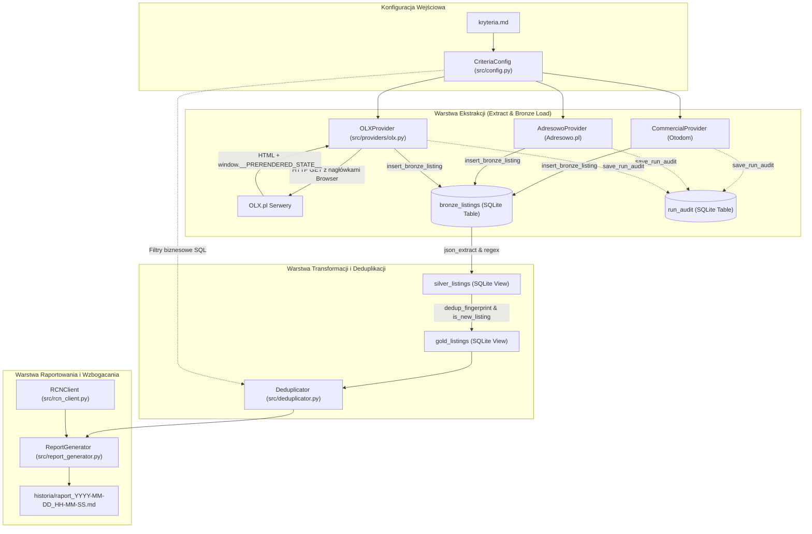
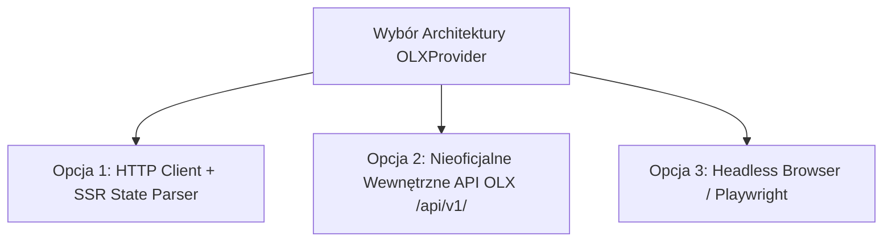

# Projekt Techniczny: Integracja Serwisu OLX.pl (Warstwa ELT)

**Kod Zmiany**: `wyszukiwarka-nieruchomosci-olx`  
**Status**: Projekt Wstępny (Initial Technical Design)  
**Autor**: Software Architect & Antigravity Pair Programmer  
**Data**: 15 Sierpnia 2026  
**Dokumenty Źródłowe i Wytyczne**:
- [proposal.md](file:///Users/pawel/git/gen-ai-orchestrator/openspec/changes/wyszukiwarka-nieruchomosci-olx/proposal.md)
- [kryteria.md](file:///Users/pawel/git/gen-ai-orchestrator/wyszukiwarka-nieruchomosci/kryteria.md)
- [brutally-honest-rules.md](file:///Users/pawel/git/gen-ai-orchestrator/.ai/guidelines/brutally-honest-rules.md)
- [db.py](file:///Users/pawel/git/gen-ai-orchestrator/wyszukiwarka-nieruchomosci/src/db.py) | [deduplicator.py](file:///Users/pawel/git/gen-ai-orchestrator/wyszukiwarka-nieruchomosci/src/deduplicator.py) | [config.py](file:///Users/pawel/git/gen-ai-orchestrator/wyszukiwarka-nieruchomosci/src/config.py) | [main.py](file:///Users/pawel/git/gen-ai-orchestrator/wyszukiwarka-nieruchomosci/main.py)

---

## 1. Cel i Zakres Architektury (Context & Goals)

### 1.1. Kontekst Biznesowy i Architektoniczny
Głównym celem zmiany jest włączenie portalu **OLX.pl** jako trzeciego, kluczowego źródła danych w systemie `wyszukiwarka-nieruchomosci` (obok portali Otodom i Adresowo). OLX gromadzi największy wolumen bezpośrednich ogłoszeń właścicieli mieszkań ("bez pośredników") oraz ofert mniejszych, lokalnych biur nieruchomości, co stwarza największy potencjał identyfikacji okazji cenowych poniżej benchmarku rynkowego RCN (Rejestr Cen Nieruchomości m.st. Warszawy).

Projekt jest realizowany zgodnie ze standardem **ELT (Extract-Load-Transform)**:
1. **Extract & Load (Warstwa Bronze)**: Pobranie surowego, szerokiego strumienia ogłoszeń z OLX bez stratnej filtracji i zapisanie do tabeli `bronze_listings` (w formacie JSON).
2. **Transform (Warstwa Silver)**: Zunifikowanie atrybutów nieruchomości (cena, metraż, pokoje, piętro, winda, geolokalizacja) w widoku SQL `silver_listings` za pomocą wbudowanych funkcji SQLite JSON1 (`json_extract`).
3. **Filter & Deduplicate (Warstwa Gold)**: Wyliczenie unikalnego odcisku palca oferty (`dedup_fingerprint`), eliminacja duplikatów międzyserwisowych, wykrycie nowości (`is_new_listing`) oraz nałożenie reguł biznesowych z `kryteria.md`.
4. **Enrich & Report**: Zestawienie z danymi transakcyjnymi RCN i wygenerowanie raportu markdown w katalogu `historia/`.

### 1.2. Szczera Ocena Możliwości i Ograniczeń (Brutally Honest Scope Analysis)
*Na podstawie analizy mechanizmów filtrowania OLX.pl oraz dotychczasowej architektury systemu:*

| Parametr z `kryteria.md` | Poziom Filtrowania | Uzasadnienie Techniczne i Granice Pewności |
| :--- | :---: | :--- |
| **Miasto & Dzielnica** | 🟢 **Natywne URL Query** | OLX natywnie obsługuje strukturę ścieżki i parametr dzielnicy (`/warszawa/q-{district}/` lub `search[filter_enum_district]`). |
| **Cena min / max** | 🟢 **Natywne URL Query** | Obsługiwane przez parametry zapytania GET: `search[filter_float_price:from]` oraz `search[filter_float_price:to]`. |
| **Liczba pokoi** | 🟢 **Natywne URL Query** | Obsługiwane przez tablicowy parametr `search[filter_enum_rooms][0]=three` (lub odpowiednik numeryczny). |
| **Powierzchnia min / max** | 🟡 **Query + Warstwa Gold** | OLX wspiera `search[filter_float_m:from]`, jednak w ogłoszeniach prywatnych metraż bywa mylony z powierzchnią działki/użytkowej. Wymagana re-walidacja w warstwie Gold. |
| **Rynek (Pierwotny / Wtórny)** | 🟡 **Warstwa Gold** | Parametr rynku w OLX bywa niekompletny lub ignorowany przez użytkowników prywatnych dodających ogłoszenia w uproszczonym formularzu. |
| **Piętro / Wyklucz parter** | 🔴 **Wyłącznie Warstwa Gold** | OLX nie udostępnia w URL niezawodnego filtra wykluczającego wyłącznie parter bez jednoczesnego obcięcia ofert z brakującym atrybutem. Filtrowanie następuje w SQL. |
| **Winda** | 🔴 **Wyłącznie Warstwa Gold** | Brak bezpośredniego selektora w formularzu wyszukiwania URL. Wymaga ekstrakcji cech z payloadu oraz analizy regex w tekście opisu (`winda`, `windą`). |
| **Odległość od metra** | 🔴 **Poza zakresem providera** | Obliczane ortodromicznie (`haversine_m`) w module bazy danych i deduplikatora na podstawie współrzędnych geograficznych. |

---

## 2. Architektura Systemu i Przepływ Danych (System Architecture & Flow)

Poniższy diagram ilustruje przepływ danych i powiązania komponentów po wdrożeniu modułu `OLXProvider`.



### 2.1. Identyfikacja Uruchomień (`run_id`) i Cykl Życia Danych
1. Każde wykonanie pipeline'u w `main.py` generuje unikalny identyfikator `run_id` (format: `run_YYYYMMDD_HHMMSS`).
2. Wszystkie wiersze w `bronze_listings` posiadają przypisany `run_id`, co zapewnia idempotencję i umożliwia zachowanie pełnej historii ofert.
3. Wskaźnik nowości `is_new_listing` w widoku `gold_listings` bada obecność tożsamego `dedup_fingerprint` we wcześniejszych uruchomieniach (`scraped_at < d.scraped_at AND run_id != d.run_id`).

---

## 3. Architektura Modułu `OLXProvider` (`src/providers/olx.py`)

### 3.1. Konstrukcja Zapytań URL i Mapowanie Parametrów
OLX.pl stosuje hierarchiczną strukturę ścieżek URL dla kategorii oraz parametry tablicowe w query string.

* **Format Bazowy URL**:  
  `https://www.olx.pl/nieruchomosci/mieszkania/sprzedaz/{city_slug}/`
* **Slug Miasta**:  
  `warszawa` (znormalizowany, małe litery, bez znaków diakrytycznych).
* **Slug Dzielnicy**:  
  [Hipoteza/Domysł]: OLX obsługuje dzielnice poprzez ścieżkę podkategorii (np. `/warszawa/q-{district_slug}/`) lub dedykowany parametr zapytania `search[filter_enum_district][0]={district_id}`.  
  *Rozwiązanie odporne*: Provider w pierwszej kolejności wykorzystuje ustandaryzowaną ścieżkę wyszukiwania tekstowego/lokalizacyjnego w URL lub query `search[district_id]`, pobierając oferty dla wskazanych dzielnic (np. Ursynów, Mokotów, Wilanów).
* **Filtry Cenowe**:  
  - Od: `search[filter_float_price:from]={int(min_price)}`  
  - Do: `search[filter_float_price:to]={int(max_price)}`
* **Liczba Pokoi**:  
  - 1 pokój: `search[filter_enum_rooms][0]=one`
  - 2 pokoje: `search[filter_enum_rooms][0]=two`
  - 3 pokoje: `search[filter_enum_rooms][0]=three`
  - 4 pokoje: `search[filter_enum_rooms][0]=four`
  - 5+ pokoi: `search[filter_enum_rooms][0]=five`
* **Paginacja**:  
  Parametr `page={page_number}` (gdzie pierwsza strona to brak parametru lub `page=1`).

### 3.2. Ekstrakcja Danych ze Stanu SSR (`__PRERENDERED_STATE__`)
Portal OLX generuje stronę w architekturze React SSR. W kodzie źródłowym HTML osadzony jest obiekt stanu w znaczniku `<script>`:
```html
<script id="__PRERENDERED_STATE__" type="application/json">
  {"props":{"pageProps":{"data":{"adSearch":{"data":[{"id":999999,"title":"..."}, ...],"totalElements":142}}}}}
</script>
```
*Alternatywna lokalizacja stanu w starszych wersjach szablonu*:
```javascript
window.__PRERENDERED_STATE__ = "...";
```

#### Algorytm Ekstrakcji w `OLXProvider.fetch_listings()`:
1. Pobranie strony HTML za pomocą `urllib.request.Request` z zestawem nagłówków przeglądarkowych.
2. Wyszukanie znacznika z danymi JSON przy użyciu wyrażeń regularnych:
   - Wzorzec główny: `r'<script id="__PRERENDERED_STATE__"[^>]*>(.*?)</script>'`
   - Wzorzec alternatywny 1: `r'window\.__PRERENDERED_STATE__\s*=\s*\"?(\{.*?\})\"?;'`
   - Wzorzec alternatywny 2 (JSON-LD): `r'<script type="application/ld\+json"[^>]*>(.*?)</script>'`
3. Parsowanie wyekstrahowanego stringa do obiektu Pythona za pomocą `json.loads()`.
4. Wyciągnięcie listy ogłoszeń ze struktury stanu: `ads = state.get('props', {}).get('pageProps', {}).get('data', {}).get('adSearch', {}).get('data', [])` (lub odpowiadającej gałęzi `listing.ads`).
5. Zapis każdego ogłoszenia bezpośrednio do `bronze_listings` za pośrednictwem `db_manager.insert_bronze_listing`.
6. **Mechanizm Fallback**: W sytuacji, gdy struktura JSON nie zostanie odnaleziona (np. z powodu zmiany szablonu przez OLX), provider przełącza się na parser linków HTML regex (`href="(/d/oferta/[^"]+)"`), budując minimalny obiekt zastępczy, co zapobiega zatrzymaniu pipeline'u.

### 3.3. Zestaw Nagłówków HTTP (Browser Emulation & WAF)
W celu zminimalizowania ryzyka blokad ze strony Cloudflare/WAF, provider przekazuje nagłówki identyczne z nowoczesną sesją przeglądarki Chrome na macOS:
```python
HEADERS = {
    'User-Agent': 'Mozilla/5.0 (Macintosh; Intel Mac OS X 10_15_7) AppleWebKit/537.36 (KHTML, like Gecko) Chrome/124.0.0.0 Safari/537.36',
    'Accept': 'text/html,application/xhtml+xml,application/xml;q=0.9,image/avif,image/webp,image/apng,*/*;q=0.8',
    'Accept-Language': 'pl-PL,pl;q=0.9,en-US;q=0.8,en;q=0.7',
    'Cache-Control': 'max-age=0',
    'Sec-Ch-Ua': '"Chromium";v="124", "Not(A:Brand";v="24", "Google Chrome";v="124"',
    'Sec-Ch-Ua-Mobile': '?0',
    'Sec-Ch-Ua-Platform': '"macOS"',
    'Sec-Fetch-Dest': 'document',
    'Sec-Fetch-Mode': 'navigate',
    'Sec-Fetch-Site': 'none',
    'Sec-Fetch-User': '?1',
    'Upgrade-Insecure-Requests': '1'
}
```

---

## 4. Kontrakty Danych i Schemat Bazy Danych (`db.py`)

### 4.1. Schemat `raw_payload` dla OLX (Warstwa Bronze)
Do tabeli `bronze_listings` trafia natywny słownik reprezentujący ogłoszenie OLX. Kluczowe pola payloadu:

```json
{
  "id": 918273645,
  "title": "Mieszkanie 3 pokoje Ursynów Imielin blisko metra",
  "url": "https://www.olx.pl/d/oferta/mieszkanie-3-pokoje-ursynow-imielin-CID3-ID12345.html",
  "created_time": "2026-08-10T12:00:00+02:00",
  "last_refresh_time": "2026-08-15T08:30:00+02:00",
  "params": [
    {"key": "price", "name": "Cena", "value": {"value": 1020000, "currency": "PLN"}},
    {"key": "m", "name": "Powierzchnia", "value": {"value": 58.5, "key": "58.5"}},
    {"key": "rooms", "name": "Liczba pokoi", "value": {"key": "three", "label": "3 pokoje"}},
    {"key": "floor_select", "name": "Poziom", "value": {"key": "floor_2", "label": "2"}},
    {"key": "furniture", "name": "Umeblowanie", "value": {"key": "yes"}},
    {"key": "builttype", "name": "Rodzaj zabudowy", "value": {"key": "block"}},
    {"key": "elevator", "name": "Winda", "value": {"key": "yes"}}
  ],
  "location": {
    "city": {"name": "Warszawa", "normalized_name": "warszawa"},
    "district": {"name": "Ursynów", "normalized_name": "ursynow"},
    "latitude": 52.1485,
    "longitude": 21.0452
  },
  "user": {
    "id": 887766,
    "name": "Jan",
    "is_business": false
  },
  "description": "Sprzedam bezpośrednio 3-pokojowe mieszkanie na Ursynowie. Budynek posiada nową windę..."
}
```

### 4.2. Modyfikacje Widoku `silver_listings` w SQLite
Widok `silver_listings` w [db.py](file:///Users/pawel/git/gen-ai-orchestrator/wyszukiwarka-nieruchomosci/src/db.py) zostanie rozszerzony o ekstrakcję powyższych struktur JSON specyficznych dla portalu OLX.

#### Szczegółowe Mapowanie Atrybutów OLX w SQL:

1. **Tytuł i URL**:
   ```sql
   COALESCE(
       json_extract(b.raw_payload, '$.title'),
       json_extract(b.raw_payload, '$.place_ld.name')
   ) AS title,
   COALESCE(
       json_extract(b.raw_payload, '$.url'),
       CASE 
           WHEN json_extract(b.raw_payload, '$.slug') IS NOT NULL 
           THEN 'https://www.olx.pl/d/oferta/' || json_extract(b.raw_payload, '$.slug')
           ELSE 'https://www.olx.pl/d/oferta/' || b.external_id
       END
   ) AS url
   ```

2. **Dzielnica i Miasto**:
   ```sql
   COALESCE(
       json_extract(b.raw_payload, '$.location.district.name'),
       json_extract(b.raw_payload, '$.location.district'),
       json_extract(b.raw_payload, '$.location.address.district.name'),
       b.chunk_name
   ) AS district
   ```

3. **Cena (PLN)**:
   ```sql
   CAST(COALESCE(
       json_extract(b.raw_payload, '$.price_pln'),
       json_extract(b.raw_payload, '$.params[0].value.value'),
       (
           SELECT json_extract(value, '$.value.value')
           FROM json_each(b.raw_payload, '$.params')
           WHERE json_extract(value, '$.key') = 'price'
           LIMIT 1
       ),
       json_extract(b.raw_payload, '$.price.value'),
       json_extract(b.raw_payload, '$.totalPrice.value')
   ) AS REAL) AS price_pln
   ```

4. **Metraż (`area_m2`)**:
   ```sql
   CAST(COALESCE(
       json_extract(b.raw_payload, '$.area_m2'),
       (
           SELECT json_extract(value, '$.value.value')
           FROM json_each(b.raw_payload, '$.params')
           WHERE json_extract(value, '$.key') = 'm'
           LIMIT 1
       ),
       json_extract(b.raw_payload, '$.area.value'),
       json_extract(b.raw_payload, '$.areaInSquareMeters')
   ) AS REAL) AS area_m2
   ```

5. **Pokoje (`rooms`)**:
   ```sql
   CAST(COALESCE(
       json_extract(b.raw_payload, '$.rooms'),
       (
           SELECT 
               CASE json_extract(value, '$.value.key')
                   WHEN 'one' THEN 1
                   WHEN 'two' THEN 2
                   WHEN 'three' THEN 3
                   WHEN 'four' THEN 4
                   WHEN 'five' THEN 5
                   ELSE CAST(json_extract(value, '$.value.key') AS INTEGER)
               END
           FROM json_each(b.raw_payload, '$.params')
           WHERE json_extract(value, '$.key') = 'rooms'
           LIMIT 1
       ),
       CASE json_extract(b.raw_payload, '$.roomsNumber')
           WHEN 'ONE' THEN 1
           WHEN 'TWO' THEN 2
           WHEN 'THREE' THEN 3
           WHEN 'FOUR' THEN 4
           WHEN 'FIVE' THEN 5
           ELSE CAST(json_extract(b.raw_payload, '$.roomsNumber') AS INTEGER)
       END
   ) AS INTEGER) AS rooms
   ```

6. **Piętro (`floor`)**:
   ```sql
   CAST(COALESCE(
       json_extract(b.raw_payload, '$.floor'),
       (
           SELECT 
               CASE json_extract(value, '$.value.key')
                   WHEN 'floor_0' THEN 0
                   WHEN 'floor_1' THEN 1
                   WHEN 'floor_2' THEN 2
                   WHEN 'floor_3' THEN 3
                   WHEN 'floor_4' THEN 4
                   WHEN 'floor_5' THEN 5
                   WHEN 'floor_6' THEN 6
                   WHEN 'floor_7' THEN 7
                   WHEN 'floor_8' THEN 8
                   WHEN 'floor_9' THEN 9
                   WHEN 'floor_10' THEN 10
                   WHEN 'floor_11' THEN 11
                   WHEN 'floor_higher' THEN 12
                   ELSE NULL
               END
           FROM json_each(b.raw_payload, '$.params')
           WHERE json_extract(value, '$.key') IN ('floor_select', 'floor')
           LIMIT 1
       ),
       CASE json_extract(b.raw_payload, '$.floorNumber')
           WHEN 'GROUND_FLOOR' THEN 0
           WHEN 'FIRST' THEN 1
           WHEN 'SECOND' THEN 2
           WHEN 'THIRD' THEN 3
           WHEN 'FOURTH' THEN 4
           ELSE NULL
       END
   ) AS INTEGER) AS floor
   ```

7. **Winda (`has_elevator`)**:
   ```sql
   COALESCE(
       CAST(json_extract(b.raw_payload, '$.has_elevator') AS INTEGER),
       (
           SELECT 
               CASE 
                   WHEN json_extract(value, '$.value.key') IN ('yes', '1', 'true') THEN 1 
                   ELSE 0 
               END
           FROM json_each(b.raw_payload, '$.params')
           WHERE json_extract(value, '$.key') IN ('elevator', 'has_elevator')
           LIMIT 1
       ),
       CASE 
           WHEN json_extract(b.raw_payload, '$.description') LIKE '%winda%' 
             OR json_extract(b.raw_payload, '$.description') LIKE '%windą%' THEN 1 
           ELSE 0 
       END
   ) AS has_elevator
   ```

8. **Typ Ogłoszeniodawcy (`seller_type`)**:
   ```sql
   COALESCE(
       json_extract(b.raw_payload, '$.seller_type'),
       CASE 
           WHEN json_extract(b.raw_payload, '$.user.is_business') = 0 THEN 'Bezpośrednio'
           WHEN json_extract(b.raw_payload, '$.user.is_business') = 1 THEN 'Agencja'
           WHEN json_extract(b.raw_payload, '$.isPrivateOwner') = 1 THEN 'Bezpośrednio'
           ELSE 'Agencja'
       END
   ) AS seller_type
   ```

### 4.3. Kompatybilność z Widokiem `gold_listings` i Deduplikacją
Widok `gold_listings` bazuje na odcisku palca:
$$\text{dedup\_fingerprint} = \text{COALESCE}(\text{lat}_{.3}\_\text{lon}_{.3}\_\text{area}_{.1}\_\text{rooms},\; \text{district}\_\text{area}_{.1}\_\text{rooms}\_\text{floor}\_\text{price})$$

Wdrożenie OLX nie wymaga modyfikacji samej definicji widoku `gold_listings`, ponieważ poprawnie znormalizowane pola w `silver_listings` natychmiast zasilają mechanizm deduplikacji międzyserwisowej. Jeżeli ogłoszenie występuje jednocześnie na Otodom, Adresowo i OLX, zostanie zagregowane do jednego rekordu w Gold z listą `source_portals_list` (np. `otodom:123, adresowo:456, olx:789`).

---

## 5. Audyt Kompletności Uruchomień (`run_audit`)

W celu spełnienia wymagań audytowalności i transparentności ekstrakcji:
1. `OLXProvider` podczas odpytywania pierwszej strony z danego zapytania pobiera zadeklarowaną przez portal całkowitą liczbę ogłoszeń:
   - Z obiektu stanu: `total_elements = state.get('props', {}).get('pageProps', {}).get('data', {}).get('adSearch', {}).get('totalElements')`
   - Lub z fallbacku regex: `re.search(r'(\d+)\s*ogłosze', html)`
2. Po zakończeniu pobierania provider wywołuje:
   ```python
   self.db_manager.save_run_audit(
       run_id=run_id,
       source_portal="olx",
       expected_total=expected_total_olx,
       saved_bronze=saved_count
   )
   ```
3. W konsoli `main.py` wyświetlana jest metryka:
   ```text
   📊 Audyt Kompletności Olx: 48/52 (92.3% kompletności w Bronze)
   ```

---

## 6. Wybory Architektoniczne, Alternatywy i Trade-offy (Architectural Trade-offs)

Zgodnie z zasadami inżynierii oprogramowania i wytycznymi OpenSpec, przeanalizowano 3 warianty implementacji providera OLX:



### Opcja 1 (Rekomendowana): Direct HTTP Client + SSR `__PRERENDERED_STATE__` Parser
* **Opis**: Wykonywanie synchronicznych/asynchronicznych zapytań HTTP GET za pomocą standardowego modułu `urllib.request` (lub `requests`) z pełnymi nagłówkami przeglądarki i ekstrakcja stanu JSON ze znacznika `<script>`.
* **Zalety**:
  - ✅ **Brak zewnętrznych ciężkich zależności**: Działa w czystym środowisku Python bez konieczności instalowania binariów przeglądarek (brak narzutu Chromium/Node.js).
  - ✅ **Wysoka wydajność**: Czas pobrania strony to 200–500 ms (w porównaniu do 3–6 s na renderowanie w Playwright).
  - ✅ **Bogaty schemat danych**: Obiekt stanu SSR zawiera kompletne, ustrukturyzowane dane (koordynaty GPS, parametry techniczne, ID użytkownika).
* **Wady / Ryzyka**:
  - ⚠️ Podatność na zmiany struktury wewnętrznego stanu SSR przez zespół frontendowy OLX.
  - ⚠️ W przypadku zaostrzenia reguł Cloudflare WAF (wyświetlenie wyzwania JavaScript / Turnstile) zapytanie zakończy się błędem HTTP 403.

### Opcja 2: Wykorzystanie Wewnętrznego REST API Aplikacji Mobilnej OLX (`/api/v1/offers/`)
* **Opis**: Bezpośrednie odpytywanie endpointów JSON używanych przez aplikację mobilną OLX na Android/iOS z autoryzacją Bearer token (pobieranym z klienta publicznego).
* **Zalety**:
  - ✅ Czysty, stabilny kontrakt JSON bez konieczności parsowania HTML.
  - ✅ Mniejszy wolumen przesyłanych danych (brak narzutu kodu HTML/CSS).
* **Wady / Ryzyka**:
  - ❌ [Hipoteza/Domysł]: Wymaga dynamicznej generacji lub emulacji kluczy `client_id` / `client_secret` aplikacji mobilnej lub rotacji tokenów OAuth.
  - ❌ Wysokie ryzyko natychmiastowej blokady IP ze względu na sygnatury zapytań spoza oficjalnej aplikacji.
  - ❌ Brak oficjalnej dokumentacji publicznego API dla rynku nieruchomości.

### Opcja 3: Pełna Emulacja Przeglądarki przez Headless Browser (Playwright / Selenium)
* **Opis**: Uruchamianie rzeczywistej instancji przeglądarki Chromium w tle do renderowania strony i przechwytywania odpowiedzi sieciowych lub drzewa DOM.
* **Zalety**:
  - ✅ Pełna odporność na proste wyzwania JavaScript i dynamiczne skrypty antybotowe.
  - ✅ Gwarancja załadowania wszystkich elementów asynchronicznych.
* **Wady / Ryzyka**:
  - ❌ Bardzo duży narzut zasobów (CPU/RAM) i powolne działanie (drastyczny wzrost czasu wykonania `main.py`).
  - ❌ Wymóg instalacji binariów przeglądarek i sterowników w środowisku uruchomieniowym.
  - ❌ Nadmiarowość w stosunku do obecnej architektury Otodom i Adresowo.

### ⚖️ Podsumowanie Decyzji Architektonicznej:
Przyjmujemy **Opcję 1 (HTTP Client + SSR Parser)** jako rozwiązanie wiodące, spójne z istniejącymi providerami `CommercialProvider` i `AdresowoProvider`. Opcja ta zapewnia idealny balans między szybkością, prostotą a kompletnością danych. Dodatkowo wprowadzamy wielopoziomowy fallback regex w razie modyfikacji struktury stanu SSR.

---

## 7. Obsługa Sytuacji Awaryjnych, Antybotów i Przypadków Brzegowych (Edge Cases & Resilience)

### 7.1. Sytuacje Awaryjne i Strategie Mitygacji

1. **Blokada Cloudflare / HTTP 403 Forbidden / 429 Too Many Requests**:
   - *Detekcja*: Kod statusu HTTP `403` lub `429` w bloku `urllib.error.HTTPError`.
   - *Mitygacja*: Zastosowanie techniki Exponential Backoff z losowym jitterem (np. próba 1: sleep 1s, próba 2: sleep 2.5s, próba 3: sleep 5s).
   - *Zachowanie awaryjne (Fail-Safe)*: W razie trwałej blokady provider loguje ostrzeżenie, zapisuje dotychczas pobrane rekordy, rejestruje częściowy audyt w `run_audit` i nie przerywa działania pozostałych providerów (`Otodom`, `Adresowo`).

2. **Brakujące Koordynaty GPS w Ogłoszeniu**:
   - W części ogłoszeń prywatnych na OLX współrzędne geograficzne mogą być puste (`latitude=None`).
   - *Obsługa*: Widok `silver_listings` przypisuje `NULL` do `lat` i `lon`. Widok `gold_listings` płynnie przełącza się na fallbackowy format odcisku palca bazujący na dzielnicy, powierzchni, pokojach, piętrze i cenie:
     $$\text{district}\_\text{area}\_\text{rooms}\_\text{floor}\_\text{price}$$

3. **Nietypowe Formaty Cen i Walut**:
   - Ogłoszenia z ceną w EUR lub ceną "do negocjacji" (wartość tekstowa).
   - *Obsługa*: Wymuszenie rzutowania `CAST(... AS REAL)`. Rekordy z nieprawidłową ceną (lub ceną 0) są odrzucane w warstwie Gold przez warunek `price_pln >= min_price`.

4. **Niespójne Nazewnictwo Dzielnic**:
   - Użytkownicy OLX mogą wpisać dzielnicę z literówkami lub w tytule (np. "Ursynów - Kabaty", "Ursynow", "Mokotow").
   - *Obsługa*: `Deduplicator` stosuje normalizację polskich znaków diakrytycznych (`translate(str.maketrans('ąćęłńóśźż...', 'acelnoszz...'))`) oraz dopasowanie `LIKE %dzielnica%`.

---

## 8. Plan Weryfikacji i Testów (Testing Strategy)

W ramach wdrożenia przygotowany zostanie dedykowany zestaw testów jednostkowych w pliku `wyszukiwarka-nieruchomosci/tests/test_olx_criteria.py`:

1. **Test Parsowania Stanu SSR (`test_olx_payload_parsing`)**:
   - Weryfikacja poprawnej ekstrakcji pól: cena, metraż, pokoje, piętro, winda z syntetycznego obiektu stanu OLX.
2. **Test Zgodności z Kryteriami (`test_olx_criteria_filtering`)**:
   - Sprawdzenie odrzucania ofert parterowych przy włączonym `exclude_ground_floor=True`.
   - Sprawdzenie poprawnego filtrowania widełek cenowych (1 000 000 – 1 050 000 PLN) i liczby pokoi (3 pokoje).
3. **Test Deduplikacji Międzyserwisowej (`test_cross_portal_deduplication`)**:
   - Wstrzyknięcie tożsamej oferty z Otodom, Adresowo i OLX do `bronze_listings` i weryfikacja scalenia w 1 rekord w `gold_listings` z `portal_occurrences_count = 3`.
4. **Test Audytu Kompletności (`test_olx_audit_logging`)**:
   - Sprawdzenie poprawności zapisu metryk do tabeli `run_audit`.

---
*Dokument przygotowany zgodnie ze standardem OpenSpec i wytycznymi bezwzględnej uczciwości inżynierskiej.*
