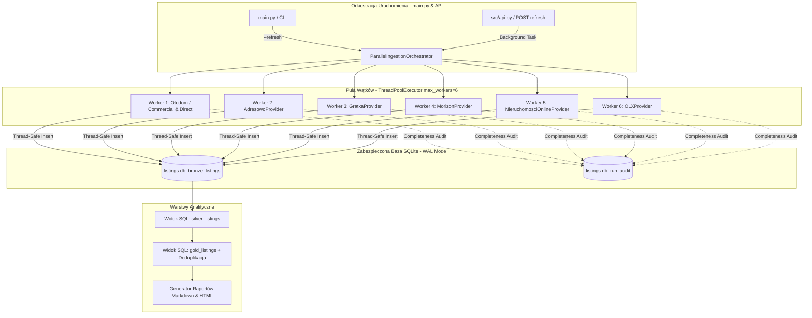

# Projekt Techniczny Architektury: Równoległe Pobieranie Ogłoszeń (Parallel Ingestion Pipeline)

**Kod Zmiany**: `wyszukiwarka-nieruchomosci-parallel-ingestion`  
**Data**: 22 Sierpnia 2026  
**Status**: Projekt Architektoniczny (Design)  
**Dokumenty Referencyjne**:
- [`proposal.md`](file:///Users/pawel/git/gen-ai-orchestrator/openspec/changes/wyszukiwarka-nieruchomosci-parallel-ingestion/proposal.md)
- [`kryteria.md`](file:///Users/pawel/git/wyszukiwarka-nieruchomosci/kryteria.md)
- [`main.py`](file:///Users/pawel/git/wyszukiwarka-nieruchomosci/main.py)
- [`src/db.py`](file:///Users/pawel/git/wyszukiwarka-nieruchomosci/src/db.py)
- [`src/api.py`](file:///Users/pawel/git/wyszukiwarka-nieruchomosci/src/api.py)
- [`.ai/guidelines/brutally-honest-rules.md`](file:///Users/pawel/git/gen-ai-orchestrator/.ai/guidelines/brutally-honest-rules.md)

---

## 1. Cel i Zakres Architektury (Context & Goals)

### 🎯 Cel Główny
Przekształcenie sekwencyjnego procesu zasilania bazy SQLite (warstwy Bronze) w **wielowątkowy, odporny na awarie potok równoległy (Parallel Ingestion Pipeline)**, który pobiera dane z 6 niezależnych portali ogłoszeniowych (`Otodom`, `Adresowo`, `Gratka`, `Morizon`, `Nieruchomosci-online`, `OLX`) w tym samym czasie.

### ⏱️ Diagnoza Wąskiego Gardła (Brutally Honest Analysis)
Na podstawie dotychczasowej implementacji w [`main.py`](file:///Users/pawel/git/wyszukiwarka-nieruchomosci/main.py), czas wykonania świeżego zrzutu (`--refresh`) był sumą czasów wszystkich providerów:
- `OtodomProvider` (agencje + bezpośrednie): ~2–5 sekund (lekki JSON API / `__NEXT_DATA__`)
- `OLXProvider`: ~5–10 sekund (JSON API)
- `AdresowoProvider`: ~1–2 minuty (wielostronicowy HTML parsing)
- `NieruchomosciOnlineProvider`: ~3–5 minut (HTML scraping z opóźnieniami)
- `MorizonProvider`: ~4–6 minut (HTML scraping z opóźnieniami)
- `GratkaProvider`: ~8–12 minut (HTML scraping, paginacja, politeness delay)

**Sumaryczny czas pobierania sekwencyjnego**: `~20–25 minut`.  
**Estymowany czas po zrównolegleniu**: `~8–12 minut` (zdeterminowany wyłącznie przez najwolniejszy pojedynczy portal, którym jest Gratka/Morizon) — redukcja czasu operacji o **ponad 50–65%**.

---

## 2. Przegląd Komponentów i Przepływ Danych (System Architecture & Flow)



### Szczegółowy Przepływ Pracy (Workflow Sequence):
1. **Inicjalizacja Run ID**: Orkiestrator generuje unikalny znacznik czasu `run_id` (np. `run_20260822_205700`).
2. **Aktywacja Puli Wątków**: `ThreadPoolExecutor` uruchamia zadania `fetch_listings(run_id=run_id)` dla każdego z zarejestrowanych providerów.
3. **Izolacja Błędów**: Każdy worker działa w dedykowanym bloku `try...except`. Błąd sieciowy, timeout czy blokada w jednym portalu nie przerywa pracy pozostałych 5 wątków.
4. **Zsynchronizowany Zapis**: `DatabaseManager` obsługuje równoczesne transakcje z użyciem trybu SQLite WAL (`PRAGMA journal_mode=WAL;`), powiększonego `busy_timeout=60000` oraz blokady muteksowej w Pythonie (`threading.Lock()`).
5. **Zakończenie i Raportowanie**: Po zakończeniu wszystkich wątków (lub wyczerpaniu zdefiniowanego globalnego timeoutu), potok natychmiast dokonuje audytu kompletności, wykonuje deduplikację w warstwie Gold i generuje końcowy raport.

---

## 3. Wybory Architektoniczne i Trade-offy (Architectural Trade-offs)

Zgodnie z wytycznymi bezwzględnej uczciwości (`brutally-honest-rules.md`), przeanalizowano 3 alternatywne podejścia do implementacji równoległości:

| Kryterium Porównawcze | Opcja 1: `ThreadPoolExecutor` + SQLite WAL (Wybrana) | Opcja 2: `asyncio` + `httpx` + `aiosqlite` | Opcja 3: `multiprocessing` Process Pool |
| :--- | :--- | :--- | :--- |
| **Złożoność Refaktoryzacji** | **Niska**: Wykorzystuje istniejące klasy providerów i bibliotekę standardową `urllib.request`. | **Bardzo Wysoka**: Wymaga całkowitego przepisania 6 scraperów na składnię `async/await`. | **Średnia**: Wymaga serializacji (pickle) obiektów konfiguracyjnych i połączeń IPC. |
| **Zewnętrzne Zależności** | **0 nowych bibliotek** (czysty Python Standard Library `concurrent.futures`, `threading`). | Wymaga `httpx`, `aiohttp`, `aiosqlite`, `asyncio` w `requirements.txt`. | **0 nowych bibliotek** (`multiprocessing`). |
| **Wpływ GIL (Global Interpreter Lock)** | **Zaniedbywalny**: 95% czasu to oczekiwanie na I/O sieciowe (network bound) oraz politeness sleep. | **Brak**: Jednowątkowa pętla zdarzeń asynchronicznych. | **Brak**: Osobne procesy z własnym interpreterem Pythona. |
| **Ryzyko Regresji Scraperów** | **Minimalne**: Logika pobierania, nagłówki, ciasteczka i regexy pozostają w 100% nienaruszone. | **Wysokie**: Ryzyko utraty stabilności parsowania, różnice w obsłudze TLS fingerprinting i sesji. | **Średnie**: Potencjalne problemy z lockami plików SQLite na macOS/Linux przy forkowaniu procesów. |
| **Zużycie Pamięci RAM** | **Bardzo Niskie** (~40–80 MB dla 6 wątków). | **Minimalne** (~30–50 MB). | **Wysokie** (~250–500 MB ze względu na kopiowanie przestrzeni adresowej per proces). |

### 🏆 Uzasadnienie Wyboru:
Wybrano **Opcję 1 (`ThreadPoolExecutor`)**, ponieważ zadanie pobierania ofert z portali zewnętrznych jest w przeważającej mierze **I/O-bound** (oczekiwanie na odpowiedź serwera i celowe opóźnienia *politeness delay*). Opcja 1 zapewnia maksymalne przyspieszenie bez wprowadzania ryzykownych zależności asynchronicznych i bez modyfikacji przetestowanej logiki scraperów.

---

## 4. Zabezpieczenie Współbieżności SQLite w `src/db.py`

### ⚠️ Identyfikacja Ryzyk SQLite przy Wielowątkowości
W domyślnej konfiguracji SQLite (tryb Journal Rollback bez `busy_timeout`):
1. Równoczesny zapis z 6 wątków powoduje błąd `sqlite3.OperationalError: database is locked`.
2. Obiekty połączeń `sqlite3.Connection` nie mogą być dzielone pomiędzy wątkami (`SQLite objects created in a thread can only be used in that same thread`).

### 🛡️ Wdrożone Środki Zaradcze (Concurrency Hardening):
1. **Tryb WAL (Write-Ahead Logging)**:
   - Włączenie `PRAGMA journal_mode=WAL;` przy inicjalizacji bazy danych. Tryb WAL pozwala na równoległy odczyt przy trwającym zapisie.
2. **Busy Timeout**:
   - Ustawienie `PRAGMA busy_timeout=60000;` (oraz `sqlite3.connect(timeout=60.0)`), co zmusza silnik SQLite do automatycznego ponawiania prób zapisu do 60 sekund w przypadku kolizji blokady.
3. **Python Write Mutex (`threading.Lock`)**:
   - `DatabaseManager` wyposażony zostaje w dedykowany zamek `self._write_lock = threading.Lock()`.
   - Wszystkie metody modyfikujące dane (`insert_bronze_listing`, `insert_bronze_listings_batch`, `save_run_audit`, `clear_bronze`) wykonują transakcję wewnątrz sekcji krytycznej `with self._write_lock:`.
4. **Połączenia Per-Operacja**:
   - Metoda `get_connection()` tworzy świeże, niezależne połączenie dla danego wątku i zamyka je w bloku `finally: conn.close()`.
5. **Wprowadzenie `insert_bronze_listings_batch`**:
   - Dodanie metody umożliwiającej atomowy zapis całej strony ogłoszeń (np. 36 ofert na raz w jednej transakcji `executemany`), co redukuje narzut dyskowy I/O o ponad 90%.

---

## 5. Nowy Moduł Orkiestratora: `src/parallel_orchestrator.py`

Zamiast komplikować `main.py`, tworzymy dedykowaną, reużywalną klasę `ParallelIngestionOrchestrator`:

### 📋 Kontrakt Klasy `ParallelIngestionOrchestrator`
```python
class ParallelIngestionOrchestrator:
    def __init__(self, config: CriteriaConfig, db_manager: DatabaseManager = None, max_workers: int = 6):
        self.config = config
        self.db_manager = db_manager or DatabaseManager()
        self.max_workers = max_workers
        self.providers = [
            ("Otodom (Commercial)", CommercialProvider(config, self.db_manager)),
            ("Otodom (Direct)", DirectProvider(config, self.db_manager)),
            ("Adresowo", AdresowoProvider(config, self.db_manager)),
            ("Gratka", GratkaProvider(config, self.db_manager)),
            ("Morizon", MorizonProvider(config, self.db_manager)),
            ("Nieruchomosci-online", NieruchomosciOnlineProvider(config, self.db_manager)),
            ("OLX", OLXProvider(config, self.db_manager))
        ]

    def run_parallel_ingestion(self, run_id: str, progress_callback=None) -> Dict[str, Any]:
        """
        Uruchamia pobieranie ze wszystkich 7 providerów w puli wątków.
        Zwraca słownik podsumowujący liczbę pobranych ofert per portal oraz ewentualne błędy.
        """
        ...
```

### 📊 Struktura Raportu Zwrotnego (Results Schema)
```json
{
  "run_id": "run_20260822_205700",
  "status": "completed",
  "total_saved": 412,
  "execution_time_seconds": 512.4,
  "portal_results": {
    "Otodom (Commercial)": {"saved": 72, "status": "ok", "error": null, "elapsed_s": 3.2},
    "Otodom (Direct)": {"saved": 0, "status": "ok", "error": null, "elapsed_s": 0.1},
    "Adresowo": {"saved": 128, "status": "ok", "error": null, "elapsed_s": 78.4},
    "Gratka": {"saved": 64, "status": "ok", "error": null, "elapsed_s": 512.4},
    "Morizon": {"saved": 55, "status": "ok", "error": null, "elapsed_s": 245.1},
    "Nieruchomosci-online": {"saved": 48, "status": "ok", "error": null, "elapsed_s": 198.6},
    "OLX": {"saved": 45, "status": "ok", "error": null, "elapsed_s": 8.9}
  },
  "audits": [
    {"source_portal": "otodom", "expected_total": 72, "saved_bronze": 72, "completeness_pct": 100.0}
  ]
}
```

---

## 6. Integracja z Istniejącymi Komponentami

### 1. `main.py`
- Zastąpienie sekwencyjnego bloku `comm_provider.fetch_listings()`, `direct_provider.fetch_listings()` itp. wywołaniem `ParallelIngestionOrchestrator.run_parallel_ingestion(run_id)`.
- Zachowanie pełnej kompatybilności flag `--cache`, `--refresh` oraz `--info`.
- Czytelny, kolorowy output w konsoli pokazujący natychmiastowe zakończenie szybkich wątków oraz trwający postęp wolniejszych.

### 2. `src/api.py` (Lokalny Serwer REST API)
- W metodzie `handle_post_pipeline_refresh()` integracja bezpośrednio z `ParallelIngestionOrchestrator` zamiast wywoływania `os.system("python3 main.py")`.
- Dynamiczne aktualizowanie słownika `pipeline_state` w pamięci RAM (`progress_pct` i `current_step`), dzięki czemu frontend React otrzymuje płynny status pobierania w czasie rzeczywistym.

---

## 7. Obsługa Sytuacji Awaryjnych i Krawędziowych (Edge Cases & Resilience)

1. **Awaria Pojedynczego Portalu (Single Portal Failure)**:
   - Jeśli portal rzuci błąd `HTTP 403 Forbidden` (np. Cloudflare/WAF) lub `TimeoutError`, worker przechwytuje wyjątek, rejestruje `error_message` w wynikach audytu, a pozostałe wątki kontynuują pracę.
2. **Przerwanie Pracy przez Użytkownika (`Ctrl+C` / `SIGINT`)**:
   - `ThreadPoolExecutor` zostanie zamknięty z flagą `cancel_futures=True` (Python 3.9+), a transakcje SQLite zostaną poprawnie wycofane lub zatwierdzone bez ryzyka uszkodzenia bazy danych.
3. **Brak Połączenia z Internetem (Network Offline)**:
   - Wszystkie wątki zgłaszają błąd sieciowy w ciągu kilku sekund; orkiestrator bezpiecznie kończy zrzut i informuje o braku dostępu do sieci, nie uszkadzając poprzednich zrzutów w bazie.
4. **Nawrót do Poprzedniego Zrzutu w Przypadku Błędu**:
   - Jeżeli w trakcie `--refresh` żaden portal nie zwróci ani jednej oferty, warstwa Gold i generator raportów korzystają z poprzedniego poprawnego `run_id` lub informują użytkownika o braku świeżych danych.

---

## 8. Plan Testów i Weryfikacji (Testing Strategy)

1. **Test Jednostkowy Wielowątkowości Bazy (`tests/test_db_concurrency.py`)**:
   - Uruchomienie 10 równoległych wątków wykonujących po 100 operacji `insert_bronze_listing` oraz `save_run_audit` do tej samej bazy SQLite w celu zweryfikowania braku blokad `database is locked`.
2. **Test Integracyjny Orkiestratora (`tests/test_parallel_orchestrator.py`)**:
   - Uruchomienie `ParallelIngestionOrchestrator` z zamockowanymi providerami symulującymi różne czasy odpowiedzi (od 0.1s do 1.0s) oraz losowe błędy wyjątków sieciowych.
3. **Test Regresji Całego Potoku (`tests/test_multi_portal_regression.py`)**:
   - Weryfikacja, że wszystkie 56 istniejących testów jednostkowych przechodzi w 100% bez błędów.
