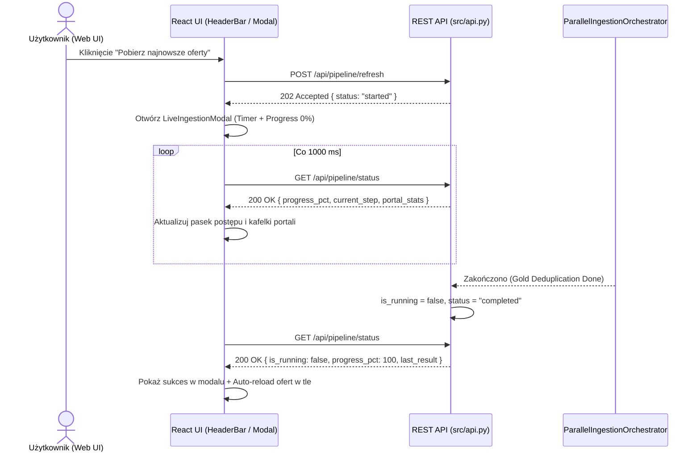

# Projekt Techniczny: Interaktywne Odświeżanie Ofert z Portali w Web UI (Live Ingestion Modal)

**Kod Zmiany**: `wyszukiwarka-nieruchomosci-ui-live-refresh`  
**Data**: 22 Sierpnia 2026  
**Status**: Projekt Architektoniczny (Design)  
**Dokumenty Referencyjne**:
- [`proposal.md`](file:///Users/pawel/git/gen-ai-orchestrator/openspec/changes/wyszukiwarka-nieruchomosci-ui-live-refresh/proposal.md)
- [`src/api.py`](file:///Users/pawel/git/wyszukiwarka-nieruchomosci/src/api.py)
- [`ui/src/App.jsx`](file:///Users/pawel/git/wyszukiwarka-nieruchomosci/ui/src/App.jsx)
- [`ui/src/components/HeaderBar.jsx`](file:///Users/pawel/git/wyszukiwarka-nieruchomosci/ui/src/components/HeaderBar.jsx)

---

## 1. Cel i Architektura Interakcji (UX & Flow)

Celem jest zapewnienie użytkownikowi pełnej kontroli i przezroczystości nad procesem pobierania świeżych ofert bezpośrednio z poziomu przeglądarki.



---

## 2. Kontrakty Danych i Model Stanu

### 📊 Model Stanu `/api/pipeline/status` (`src/api.py`)
```json
{
  "is_running": true,
  "current_step": "Pobrano Otodom (Commercial) (1/7)",
  "progress_pct": 25,
  "started_at": "2026-08-22T21:18:10.123456",
  "finished_at": null,
  "last_result": null,
  "portal_stats": {
    "Otodom (Commercial)": { "saved": 158, "status": "ok", "error": null, "elapsed_s": 25.7 },
    "OLX": { "saved": 58, "status": "ok", "error": null, "elapsed_s": 43.8 },
    "Adresowo": { "saved": 0, "status": "running", "error": null, "elapsed_s": 12.4 }
  }
}
```

---

## 3. Komponenty UI i Stylizacja

1. **`HeaderBar.jsx`**:
   - Wyeksponowany przycisk akcji *"Pobierz najnowsze oferty"* ze statusem animacji (pulsujący wskaźnik podczas pobierania).
   - Badge świeżości danych informujący o wieku ostatniego zrzutu.
2. **`LiveIngestionModal.jsx`**:
   - Płynny pasek ładowania z gradientem i procentem ukończenia.
   - Licznik czasu trwania (live stopwatch `mm:ss`).
   - Siatka 6 kafelków portali:
     - 🟢 *Zakończono* (z liczbą pobranych ofert i czasem).
     - ⏳ *W trakcie pobierania* (animowany spinner).
     - ⚠️ *Błąd* (komunikat o problemie sieciowym).
   - Ekran podsumowania po zakończeniu: łączna liczba zapisanych ofert w Bronze i unikalnych w Gold oraz przycisk *"Przejrzyj oferty"*.
3. **CSS / UX**:
   - Glassmorphism, dopasowanie do ciemnego motywu (`#0f172a`, `#1e293b`), płynne przejścia `framer-motion` lub CSS transitions.

---

## 4. Obsługa Błędów i Sytuacji Krawędziowych

1. **Równoczesne kliknięcie (409 Conflict)**: Modal wykrywa stan `is_running: true` i płynnie podłącza się do trwającego procesu.
2. **Utrata połączenia z lokalnym API**: W przypadku błędu sieciowego modal wyświetla ostrzeżenie o braku odpowiedzi serwera bez zrywania stanu.
3. **Zamknięcie modalu podczas scrapingu**: Użytkownik może zamknąć modal (zminimalizować do nagłówka) — proces w tle trwa nadal, a przycisk w `HeaderBar` wskazuje aktywność.
