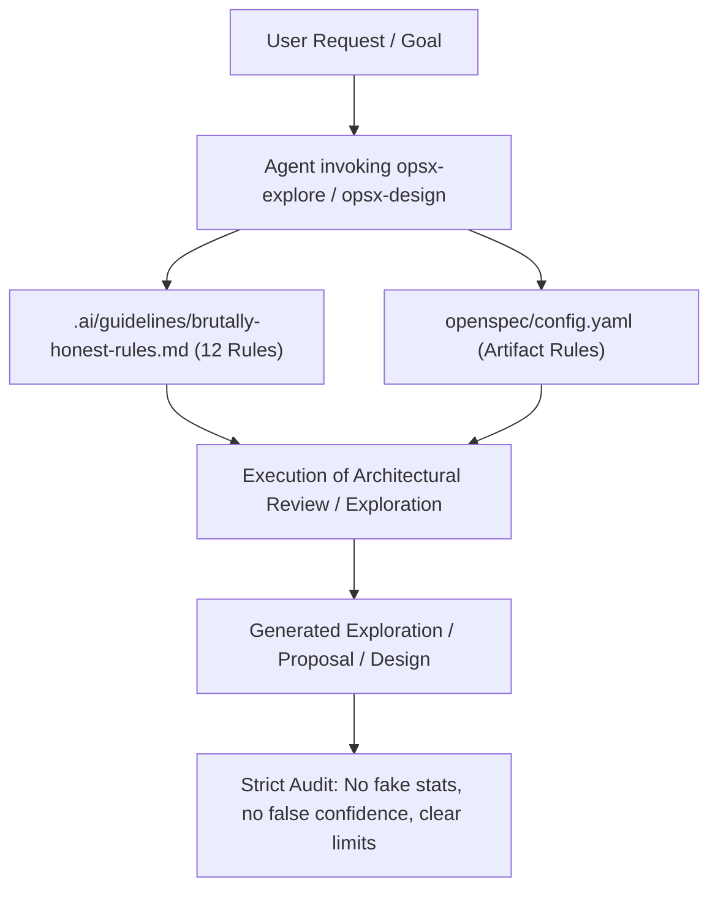

# Architectural Design: Constructive Criticism & Brutal Honesty (12 Rules)

## Context
Orkiestrator Gen AI (`gen-ai-orchestrator`) ma za zadanie sterować pracą agentów automatyzujących procesy specyfikacji i implementacji oparte o standard OpenSpec.
Aby uniknąć zjawiska "potwierdzania błędnych założeń" (sycophancy / confirmation bias), system musi narzucać agentom ścisłe wytyczne dotyczące brutalnej uczciwości i bezwzględnej krytyki architektonicznej.

## Goals / Non-Goals

**Goals:**
- Zapewnienie, że każdy agent tworzący eksplorację, proposal lub dokument designu działa według 12 Zasad Brutalnej Szczerości (*12 Rules*).
- Zabezpieczenie procesu oceny rozwiązań przed zmyślonymi statystykami, fałszywymi źródłami i udawaną pewnością siebie.
- Wymuszenie w dokumentach technicznych sekcji podważających założenia (*Assumptions Challenge*) oraz jawnie identyfikujących brakujący kontekst (*Missing Context & Constraints*).

**Non-Goals:**
- Tworzenie osobnego narzędzia CLI – zasady mają wkomponowywać się w istniejące przepływy `opsx-explore`, `opsx-design` i OpenSpec.

## Proposed Architecture & Component Flow



## Detailed Integration Specifications

### 1. Guideline Specification (`.ai/guidelines/brutally-honest-rules.md`)
Tworzymy pojedyncze źródło prawdy (Single Source of Truth) dla 12 Zasad:
1. **State Uncertainty Plainly** - Wyrażaj wątpliwości wprost.
2. **Lead With Honest Phrases** - Używaj otwartych fraz typu *"Nie mamy pewności, ale..."*.
3. **Cite Your Limits** - Podawaj ograniczenia analizy i danych.
4. **Never Disguise Guesses as Facts** - Hipotezy oznaczaj jako domysły.
5. **Name the Missing Context** - Nazwij to, czego brakuje w specyfikacji.
6. **Map Out Multiple Answers** - Analizuj scenariusze A, B, C i ich wady.
7. **Never Invent a Source** - Zakaz zmyślania źródeł.
8. **No Fake Academic Sources** - Zakaz zmyślania publikacji.
9. **No Fake Citations or Stats** - Zakaz tworzenia sztucznych metryk/URL.
10. **No Fake Institutional Sources** - Zakaz powoływania się na nieistniejące raporty.
11. **Silence Beats Fabrication** - *"Nie wiem"* jest lepsze od zmyślania.
12. **Honesty Beats Confidence** - Przejrzystość ważniejsza niż autorytatywne brzmienie.

### 2. OpenSpec Config (`openspec/config.yaml`)
Wzbogacenie sekcji `rules` o zasady walidacyjne dla generowania artefaktów:
```yaml
rules:
  exploration:
    - Must follow 12 Rules from .ai/guidelines/brutally-honest-rules.md
    - Include explicit section on Missing Context and Uncertainty
    - Provide at least 2 alternative architectural paths with trade-offs
  proposal:
    - Clearly outline non-goals and explicit risks
    - Do not state unverified performance claims or benchmark stats
  design:
    - Challenge initial assumptions brutally
    - Highlight failure modes, single points of failure, and operational risks
```

### 3. Updates to Tools & Skills (`.ai/tools/` and `.agents/skills/`)
Modyfikacja instrukcji w `opsx-explore.json` oraz `opsx-design.json` polegająca na przekazaniu agentom bezwzględnego nakazu załadowania i egzekwowania pliku `.ai/guidelines/brutally-honest-rules.md`.

## Risks & Mitigations

- **Risk**: Agenci stają się zbyt zachowawczy i odmawiają podejmowania decyzji.
  - *Mitigation*: Zasada "Map Out Multiple Answers" nakazuje przedstawianie najlepszych opcji z podsumowaniem decyzyjnym, a nie paraliż analityczny.
- **Risk**: Zasady nie zostaną zaktualizowane w środowiskach globalnych AGY.
  - *Mitigation*: Uruchomienie zaktualizowanego skryptu `openspec-agy-init.sh`, który wdraża uaktualnione treści skilli w całym środowisku.
