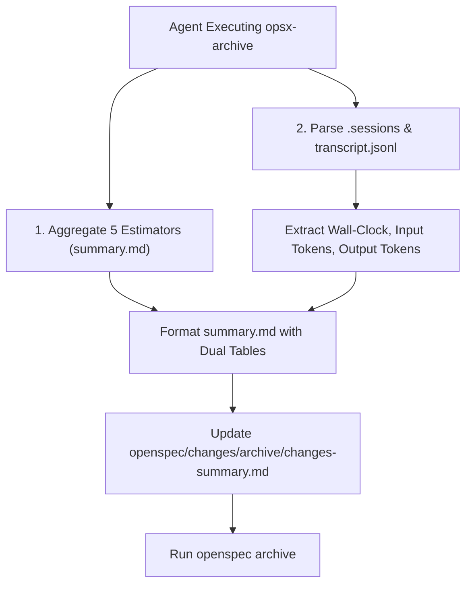

# Architectural Design: Constructive Criticism (12 Rules), README Structure & Estimation Metrics

## Context

Orkiestrator Gen AI (`gen-ai-orchestrator`) odpowiada za automatyzację prac inżynieryjnych i specyfikacji w oparciu o standard OpenSpec.
Aby wyeliminować ryzyko potwierdzania błędnych założeń (sycophancy / confirmation bias), ukrywania niepewności oraz braków w rzetelnym mierzeniu kosztów i czasu trwania prac, niniejszy projekt wpadł na potrójne usprawnienie:

1. **Bezwzględna Uczciwość (12 Rules)**: Implementacja Zasad *How to Make Claude Brutally Honest (12 Rules)* w procesach oceny architektonicznej, eksploracji i opiniowaniu designu.
2. **Dokumentacja Struktury Repozytorium w `README.md`**: Pełny opis drzewa katalogów wraz ze specyfikacją roli poszczególnych komponentów.
3. **Jednolity Szablon Estymacji (`summary.md`), Wsteczna Migracja & Zbiorczy Rejestr (`archive/changes-summary.md`)**:
   - Przekształcenie estymacji i metryk w `summary.md` w układ tabelaryczny z uwzględnieniem czasu trwania (Wall-clock), zużycia tokenów WE/WY oraz uśrednionego szacowanego kosztu.
   - Wsteczna migracja zarchiwizowanych zmian (`2026-07-26-explore-orchestrator-setup` i `2026-07-26-orchestrator-setup-repos`).
   - Utworzenie i automatyczna aktualizacja zbiorczego pliku `openspec/changes/archive/changes-summary.md`.

---

## Goals / Non-Goals

**Goals:**
- Egzekwowanie 12 Zasad Brutalnej Szczerości w promptach agentów (`opsx-explore`, `opsx-design`), pliku zasad `.ai/guidelines/brutally-honest-rules.md` oraz konfiguracyjnych wymogach `openspec/config.yaml`.
- Czytelne przedstawienie w `README.md` pełnego drzewa architektonicznego z wyjasnieniem powiązań między `.ai/` a `.agents/` oraz strukturą `openspec/`.
- Zapewnienie tabelarycznego formatu estymacji i metryk sesji w `summary.md` oraz wsteczna przebudowa zarchiwizowanych `summary.md`.
- Stworzenie i automatyczne utrzymywanie pliku zbiorczego `openspec/changes/archive/changes-summary.md` agregującego metryki wszystkich zarchiwizowanych zmian.

**Non-Goals:**
- Modyfikacja mechaniki samego CLI `openspec`.
- Zmiana reguł wykonawczych w `opsx-implement` poza obowiązkiem zgłaszania brakującego kontekstu.

---

## Decisions

### Decision 1: Utworzenie Kanonicznego Standardu `.ai/guidelines/brutally-honest-rules.md` i Wdrożenie w Konfiguracji OpenSpec
- **Opis**: Tworzymy wydzielony plik z 12 Zasadami Brutalnej Szczerości. Narzędzia `.ai/tools/opsx-explore.json`, `.ai/tools/opsx-design.json` oraz instrukcje w `openspec-agy-init.sh` nakazują agentom bezwzględne czytanie tego pliku przed generowaniem analiz.
- **Alternatywy**:
  - *Samo dopisanie zdania w promptach*: Odrzucone - prompty bez kanonicznego pliku wytycznych bywają powierzchownie interpretowane przez agenty.
- **Zgodność z 12 Zasadami**: Wyrażanie niepewności wprost, oznaczanie domysłów jako `[Hipoteza/Domysł]`, nakaz podawania alternatyw i zakaz zmyślania źródeł/statystyk.

### Decision 2: Pełna Wizualizacja Struktury Katalogów w `README.md`
- **Opis**: Dodanie bloku kodu ze strukturą drzewiastą repozytorium oraz sekcją objaśniającą rolę każdego podkatalogu (`.ai/agents`, `.ai/skills`, `.ai/tools`, `.ai/guidelines`, `.agents/`, `openspec/specs`, `openspec/changes`, `openspec/changes/archive`).
- **Alternatywy**:
  - *Skrótowy opis jednolinijkowy*: Odrzucony – nie daje nowym agentom natychmiastowej wiedzy o mapowaniu symlinków i podkatalogów.

### Decision 3: Tabelaryczny Format Estymacji i Metryk Sesyjnych w `summary.md`
- **Opis**: Sekcja `## ⏱️ Effort Estimation & Metrics` w każdym `summary.md` przybiera spójną postać dwóch tabel:
  1. **Tabela Estymatorów (Sub-Agents)**:
     | Rola Estymatora | Czas (Roboczogodziny) | Czas (Roboczodni, 1 MD = 8h) | Koszt Estymowany ($) | Uwagi / Ryzyka |
  2. **Tabela Metryk Sesji (Session & Execution Metrics)**:
     | Metryka Sesji | Wartość |
     | --- | --- |
     | Wall-clock (Rzeczywisty czas trwania) | HH:MM:SS / X min |
     | Tokeny Wejściowe (Input Tokens) | N |
     | Tokeny Wyjściowe (Output Tokens) | N |
     | Średni Szacowany Koszt | $X.XX |

### Decision 4: Wsteczna Aktualizacja Zarchiwizowanych Zmian i Zbiorczy Rejestr `changes-summary.md`
- **Opis**:
  1. Skrypt/agent analizuje dotychczasowe zarchiwizowane zmiany (`2026-07-26-explore-orchestrator-setup` i `2026-07-26-orchestrator-setup-repos`), pobiera statystyki sesyjne z logów (`.sessions` / `transcript.jsonl`) i aktualizuje ich pliki `summary.md` do nowego formatu tabelarycznego.
  2. Tworzymy plik `openspec/changes/archive/changes-summary.md` zbierający metryki na poziomie każdej zarchiwizowanej zmiany:
     - Nazwa zmiany (`change-name`)
     - Krótki opis zmiany
     - Podsumowanie sesji (wall clock, tokeny we/wy, szacowany koszt - uśredniona wartość od estymatorów)
  3. Modyfikacja procedury archiwizacji (`opsx-archive.json` / `openspec-agy-init.sh`) tak, aby przy archiwizacji automatycznie wyliczała metryki i dopisywała/aktualizowała plik `openspec/changes/archive/changes-summary.md`.

---

## Technical Architecture & Workflow

---

## Risks / Trade-offs

- **[Risk] Brak pełnych logów dla niektórych historycznych sesji** → *Mitigation*: Jeśli plik `transcript.jsonl` jest niedostępny lub nie zawiera pełnych metryk tokenów, skrypt loguje wartość `[Brak danych w logu - oszacowanie]` zgodnie z 11 zasadą (*Silence Beats Fabrication*).
- **[Risk] Przesunięcia w formatowaniu Markdown przy archiwizacji** → *Mitigation*: Standaryzowany szablon generowania wpisów w `changes-summary.md` w formacie tabelarycznym.

---

## Migration Plan

1. Tworzenie wytycznych `.ai/guidelines/brutally-honest-rules.md`.
2. Aktualizacja `openspec/config.yaml`, `.ai/tools/opsx-explore.json`, `.ai/tools/opsx-design.json`, `opsx-estimate.json`, `opsx-archive.json`.
3. Przebudowa `README.md` o szczegółowe drzewo katalogów i opis funkcji.
4. Przeprowadzenie wstecznej migracji plików `summary.md` w zarchiwizowanych katalogach `2026-07-26-explore-orchestrator-setup` i `2026-07-26-orchestrator-setup-repos`.
5. Utworzenie zbiorczego pliku `openspec/changes/archive/changes-summary.md`.
6. Aktualizacja skryptu `openspec-agy-init.sh` oraz odświeżenie skilli AGY.
