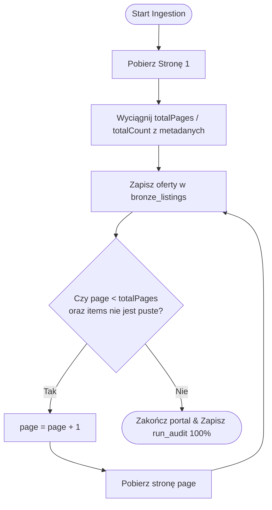

# Projekt Techniczny: Dynamiczna Pełna Paginacja Scraperów (Full Dynamic Pagination)

**Kod Zmiany**: `wyszukiwarka-nieruchomosci-full-dynamic-pagination`  
**Data**: 22 Sierpnia 2026  
**Status**: Projekt Architektoniczny (Design)  
**Dokumenty Referencyjne**:
- [`proposal.md`](file:///Users/pawel/git/gen-ai-orchestrator/openspec/changes/wyszukiwarka-nieruchomosci-full-dynamic-pagination/proposal.md)
- [`src/providers/commercial.py`](file:///Users/pawel/git/wyszukiwarka-nieruchomosci/src/providers/commercial.py)
- [`src/providers/gratka.py`](file:///Users/pawel/git/wyszukiwarka-nieruchomosci/src/providers/gratka.py)
- [`src/providers/morizon.py`](file:///Users/pawel/git/wyszukiwarka-nieruchomosci/src/providers/morizon.py)
- [`src/providers/nieruchomosci_online.py`](file:///Users/pawel/git/wyszukiwarka-nieruchomosci/src/providers/nieruchomosci_online.py)
- [`src/providers/olx.py`](file:///Users/pawel/git/wyszukiwarka-nieruchomosci/src/providers/olx.py)

---

## 1. Architektura Paginacji per Portal

---

## 2. Szczegóły Implementacji dla Dostawców

### 1. **Otodom (`CommercialProvider` & `DirectProvider`)**:
- W obiekcie `searchAds.pagination` odczytujemy:
  - `totalPages`: całkowita liczba podstron dla danego rynku/dzielnicy.
  - `totalCount`: całkowita liczba ogłoszeń.
- Pętla: `while True:`
  - Jeśli `page > totalPages` (lub `not items`) -> `break`.
  - Inkrementacja `page += 1`.

### 2. **Gratka (`GratkaProvider`)**:
- Wyszukiwanie łącznej liczby stron z selektora paginacji HTML / JSON-LD lub sprawdzanie, czy strona zawiera nowe ogłoszenia.
- Pętla: `while True:`
  - Jeśli strona nie zawiera żadnych ogłoszeń lub natrafiono na przekierowanie -> `break`.
  - Inkrementacja `page += 1`.

### 3. **Morizon (`MorizonProvider`)**:
- Paginacja: `https://www.morizon.pl/do-wynajecia/.../?page=N`.
- Sprawdzanie obecności elementów `div.row--listing` / `li.single-result`.
- Zatrzymanie, gdy lista ofert jest pusta lub strona nie wnosi nowych unikalnych ID.

### 4. **Nieruchomości-online (`NieruchomosciOnlineProvider`)**:
- Sprawdzanie liczby stron z widoku listy lub zatrzymanie przy pustej liście ofert `div.item-block`.

### 5. **OLX (`OLXProvider`)**:
- W stanie SSR `__PRERENDERED_STATE__` odczytujemy `page_count` / `total_elements`.
- Pętla aż do `page > total_pages` lub brak `data.data`.

---

## 3. Parametr Ochronny `max_pages` (Konfigurowalny)

- W konstruktorze każdego providera: `def __init__(self, config, db_manager=None, max_pages=None):`
- Domyślnie `max_pages = None` (oznacza pełny zrzut 100% bez limitu).
- Jeśli `max_pages` jest podany (np. w testach jednostkowych: `max_pages=2`), pętla zatrzymuje się po osiągnięciu tej wartości.
