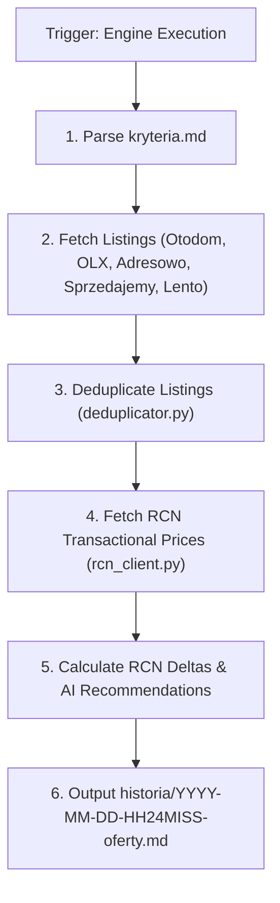

# Architectural Design: Wyszukiwarka Nieruchomości Warszawa & Integracja RCN

## Context

Moduł `wyszukiwarka-nieruchomosci/` jest autonomicznym serwisem zlokalizowanym w podkatalogu repozytorium `gen-ai-orchestrator`.
Serwis służy do automatycznego agregowania, selekcji oraz odświeżania na żądanie ofert nieruchomości w Warszawie według kryteriów z pliku `wyszukiwarka-nieruchomosci/kryteria.md`.

System łączy oferty rynkowe z 2 kategorii źródeł (portale komercyjne + portale bez pośredników) z oficjalnymi danymi o cenach transakcyjnych z Rejestru Cen Nieruchomości (RCN Warszawa: `https://mapa.um.warszawa.pl/rcn-szukaj/`), generując raporty w katalogu `wyszukiwarka-nieruchomosci/historia/YYYY-MM-DD-HH24MISS-oferty.md` z sekcją rekomendacji AI.

---

## Goals / Non-Goals

**Goals:**
- Parsowanie i automatyczny odczyt kryteriów wyszukiwania z `wyszukiwarka-nieruchomosci/kryteria.md`.
- Wyszukiwanie ofert w Warszawie z portali głównych (Otodom, OLX, Morizon) oraz portali o wysokim udziale ogłoszeń bezpośrednich bez pośredników (Adresowo, Sprzedajemy, Lento).
- Integracja z serwisem RCN m.st. Warszawy w celu pobierania rzeczywistych cen transakcyjnych per dzielnica i wyliczania odchylenia procentowego cen ofertowych.
- Zapewnienie pełnej historii przebiegów z unikalnym datownikiem `YYYY-MM-DD-HH24MISS-oferty.md`.
- Formułowanie rekomendacji AI (Top 3 okazje, ocena potencjału negocjacyjnego vs RCN, analiza ryzyk prawnych i budowlanych).

**Non-Goals:**
- Tworzenie osobnego repozytorium Git (moduł żyje wewnątrz `gen-ai-orchestrator/wyszukiwarka-nieruchomosci/`).
- Wyszukiwanie ofert w miejscowościach spoza Warszawy.
- Tworzenie dedykowanego interfejsu okienkowego/GUI (serwis uruchamiany terminalowo / przez agenta).

---

## Decisions & Architectural Trade-offs

### Decision 1: Struktura Modułu i Format Kryteriów (`kryteria.md`)
- **Opis**: Moduł będzie zorganizowany w dedykowanym podkatalogu:
  ```
  wyszukiwarka-nieruchomosci/
  ├── kryteria.md                  # Plik konfiguracyjny parametrów
  ├── historia/                    # Wygenerowane raporty YYYY-MM-DD-HH24MISS-oferty.md
  └── src/                         # Moduł wykonawczy (Python)
      ├── config.py                # Parser kryteria.md
      ├── providers/               # Scraperzy / integracje portalowe (Otodom, OLX, Adresowo, Sprzedajemy, Lento)
      ├── rcn_client.py            # Pobieranie danych z RCN Warszawa
      ├── deduplicator.py          # Wykrywanie duplikatów ofert między serwisami
      └── report_generator.py      # Silnik generowania Markdown z rekomendacją AI
  ```
- **Zgodność z 12 Rules**: Plik `kryteria.md` pozwala użytkownikowi jawnie określić wymagany typ ogłoszeniodawcy (`Bezpośrednio` vs `Dowolny`), co unika ukrytych domysłów agenta (*Name the Missing Context*).

### Decision 2: Wieloźródłowa Agregacja & Deduplikacja Ofert
- **Opis**: Serwis pobiera oferty z 2 grup portali:
  1. *Portale komercyjne*: Otodom.pl, OLX.pl, Morizon.pl.
  2. *Portale bezpośrednie (bez pośredników)*: Adresowo.pl, Sprzedajemy.pl, Lento.pl.
  - **Deduplikator**: Agencje często publikują tę samą nieruchomość na kilku portalach ze zmienioną ceną. Moduł `deduplicator.py` porównuje kombinację: dzielnica + powierzchnia (+/- 0.5m²) + piętro + cena, tworząc jeden skonsolidowany rekord.

### Decision 3: Integracja z RCN m.st. Warszawy (`https://mapa.um.warszawa.pl/rcn-szukaj/`)
- **Opis**: RCN zbiera ceny z aktów notarialnych. Integracja `rcn_client.py` realizuje zapytań do warstwy cen transakcyjnych Geoportal Warszawa lub korzysta ze zmapowanej tabeli referencyjnej cen m² w 18 dzielnicach Warszawy z aktualizacją sieciową.
- **Kalkulacja Odchylenia**:
  $$\text{Odchylenie RCN (\%)} = \left( \frac{\text{Cena za m² oferty} - \text{Średnia cena transakcyjna RCN}}{\text{Średnia cena transakcyjna RCN}} \right) \times 100\%$$

### Decision 4: Silnik Rekomendacji AI i Format Raportu (`YYYY-MM-DD-HH24MISS-oferty.md`)
- **Opis**: Raport w formacie Markdown z następującymi sekcjami:
  1. **Podsumowanie sesji**: Data, czas uruchomienia, liczba znalezionych ofert po deduplikacji.
  2. **Tabela Zestawienia Ofert**:
     | Nazwa / Tytuł | Dzielnica | Pokoje | Pow. (m²) | Cena (PLN) | PLN/m² | Odchylenie RCN | Typ Ogłoszeniodawcy | Link |
  3. **Rekomendacja i Analiza AI**:
     - *Top 3 Najbardziej Opłacalne Nieruchomości* (pozytywne odchylenie RCN + bezpośrednio od właściciela).
     - *Wskazówki Negocjacyjne* (o ile wynegocjować cenę w oparciu o akty notarialne RCN).
     - *Wyryte Ryzyka* (np. brak KW, niski parter, brak balkonu).

---

## Component Flow Diagram



---

## Risks / Trade-offs

- **[Risk] Zabezpieczenia botowe (Cloudflare / Rate Limiting) na Otodom / Adresowo** → *Mitigation*: Użycie nagłówków `User-Agent` z obracanymi sesjami oraz opcjonalnego fallbacku do wyszukiwania sieciowego agenta.
- **[Risk] Chwilowa niedostępność serwisu Geoportal RCN Warszawa** → *Mitigation*: Zapamiętywanie buforowanych stawek dzielnicowych RCN z flagą `[Wartość buforowana RCN]`.

---

## Migration & Deployment Plan

1. Utworzenie katalogu `wyszukiwarka-nieruchomości/` z podkatalogami `historia/` i `src/`.
2. Stworzenie szablonu konfiguracyjnego `wyszukiwarka-nieruchomosci/kryteria.md`.
3. Implementacja modułów w `src/` (parser kryteriów, scraperzy, klient RCN, deduplikator, generator raportów).
4. Przetestowanie wykonania na żądanie i weryfikacja pliku w `historia/YYYY-MM-DD-HH24MISS-oferty.md`.
