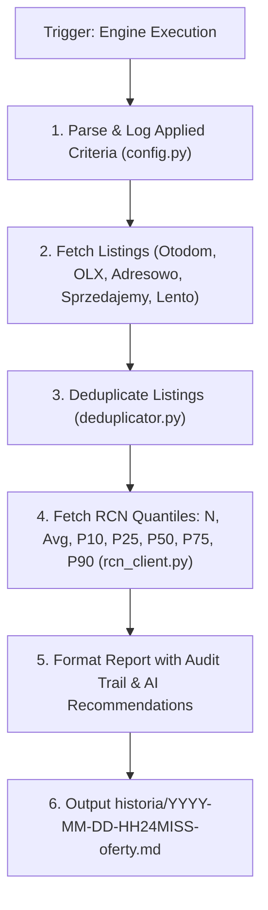

# Architectural Design: Wyszukiwarka Nieruchomości Warszawa & Integracja RCN

## Context

Moduł `wyszukiwarka-nieruchomosci/` jest autonomicznym serwisem zlokalizowanym w podkatalogu repozytorium `gen-ai-orchestrator`.
Serwis służy do automatycznego agregowania, selekcji oraz odświeżania na żądanie ofert nieruchomości w Warszawie według parametrów z pliku `wyszukiwarka-nieruchomosci/kryteria.md`.

Dokumenty wynikowe w `wyszukiwarka-nieruchomosci/historia/YYYY-MM-DD-HH24MISS-oferty.md` rejestrują **faktycznie zastosowane kryteria wyszukiwania dla zapewnienia pełnej audytowalności**, łączą oferty rynkowe z 5-kwantylowym rozkładem cen transakcyjnych z Rejestru Cen Nieruchomości (RCN Warszawa: `https://mapa.um.warszawa.pl/rcn-szukaj/`) oraz rekomendacjami AI.

---

## Goals / Non-Goals

**Goals:**
- Parsowanie i automatyczny odczyt kryteriów wyszukiwania z `wyszukiwarka-nieruchomosci/kryteria.md`.
- Rejestrowanie w nagłówku każdego wygenerowanego raportu sekcji `## ⚙️ Faktycznie Zastosowane Kryteria Wyszukiwania` (gwarancja pełnej audytowalności).
- Wyszukiwanie ofert w Warszawie z portali głównych (Otodom, OLX, Morizon) oraz portali o wysokim udziale ogłoszeń bezpośrednich bez pośredników (Adresowo, Sprzedajemy, Lento).
- Integracja z serwisem RCN m.st. Warszawy w celu pobierania rzeczywistych cen transakcyjnych per dzielnica oraz per obszar MSI (Kabaty, Natolin, Służew, Filtry itp.) wraz ze statystykami kwantylowymi ($N$, Średnia, P10, P25, P50-Mediana, P75, P90).
- Zapewnienie pełnej historii przebiegów z unikalnym datownikiem `YYYY-MM-DD-HH24MISS-oferty.md`.
- Formułowanie rekomendacji AI (Top 3 okazje, ocena potencjału negocjacyjnego vs kwantyle RCN, analiza ryzyk prawnych i budowlanych).

**Non-Goals:**
- Tworzenie osobnego repozytorium Git (moduł żyje wewnątrz `gen-ai-orchestrator/wyszukiwarka-nieruchomosci/`).
- Wyszukiwanie ofert w miejscowościach spoza Warszawy.
- Tworzenie dedykowanego interfejsu okienkowego/GUI.

---

## Decisions & Architectural Trade-offs

### Decision 1: Struktura Modułu i Format Kryteriów (`kryteria.md`)
- **Opis**: Moduł jest zorganizowany w dedykowanym podkatalogu:
  ```
  wyszukiwarka-nieruchomosci/
  ├── kryteria.md                  # Plik konfiguracyjny parametrów
  ├── historia/                    # Wygenerowane raporty YYYY-MM-DD-HH24MISS-oferty.md
  └── src/                         # Moduł wykonawczy (Python)
      ├── config.py                # Parser kryteria.md
      ├── providers/               # Scraperzy / integracje portalowe (Otodom, OLX, Adresowo, Sprzedajemy, Lento)
      │   ├── commercial.py        # Portale komercyjne
      │   └── direct.py            # Portale z ogłoszeniami bezpośrednimi
      ├── rcn_client.py            # Pobieranie danych i wyliczanie kwantyli RCN Warszawa
      ├── deduplicator.py          # Wykrywanie duplikatów ofert między serwisami
      └── report_generator.py      # Silnik generowania Markdown z audytowalnością i rekomendacją AI
  ```
- **Zgodność z 12 Rules**: Plik `kryteria.md` pozwala użytkownikowi jawnie określić wymagany typ ogłoszeniodawcy (`Bezpośrednio` vs `Dowolny`), co unika ukrytych domysłów agenta (*Name the Missing Context*).

### Decision 2: Wieloźródłowa Agregacja & Deduplikacja Ofert
- **Opis**: Serwis pobiera oferty z 2 grup portali:
  1. *Portale komercyjne*: Otodom.pl, OLX.pl, Morizon.pl.
  2. *Portale bezpośrednie (bez pośredników)*: Adresowo.pl, Sprzedajemy.pl, Lento.pl.
  - **Deduplikator**: Agencje często publikują tę samą nieruchomość na kilku portalach. Moduł `deduplicator.py` porównuje kombinację: dzielnica + powierzchnia (+/- 0.5m²) + piętro + cena, tworząc jeden skonsolidowany rekord.

### Decision 3: Integracja z RCN m.st. Warszawy (`https://mapa.um.warszawa.pl/rcn-szukaj/`)
- **Opis**: RCN zbiera ceny z aktów notarialnych. Integracja `rcn_client.py` realizuje zapytania do warstwy cen transakcyjnych Geoportal Warszawa lub korzysta ze zmapowanej tabeli referencyjnej cen m² w dzielnicach i obszarach MSI (Kabaty, Natolin, Stary Mokotów, Służew itp.).
- **Zestaw Wskaźników Statystycznych**:
  - Okres transakcyjny (np. ostatnie 12 miesięcy),
  - Liczba transakcji $N$,
  - Średnia cena za m²,
  - Rozkład kwantylowy: $10.$ Centyl (P10), $1.$ Kwartyl (P25), Mediana (P50), $3.$ Kwartyl (P75), $90.$ Centyl (P90).

### Decision 4: Silnik Rekomendacji AI i Format Raportu (`YYYY-MM-DD-HH24MISS-oferty.md`)
- **Opis**: Raport w formacie Markdown z następującymi sekcjami:
  1. **Podsumowanie sesji**: Data, czas uruchomienia, liczba znalezionych ofert po deduplikacji.
  2. **Sekcja Audytowalności `## ⚙️ Faktycznie Zastosowane Kryteria Wyszukiwania`**: Rejestruje dokładne wartości parametrów użyte w wywołaniu.
  3. **Sekcja Rozkładu RCN**: Tabele zbiorcze dla dzielnic i obszarów MSI ze wskaźnikami $N$, Średnia, P10, P25, P50, P75, P90.
  4. **Tabela Zestawienia Ofert**: Prawdziwe, klikalne odsyłacze URL, metraż, cena m², odchylenie RCN.
  5. **Rekomendacja i Analiza AI**: Top 3 okazje, ocena potencjału negocjacyjnego vs kwantyle RCN, checklisty ryzyk.

---

## Technical Architecture & Component Flow



---

## Risks / Trade-offs

- **[Risk] Zabezpieczenia botowe (Cloudflare / Rate Limiting) na Otodom / Adresowo** → *Mitigation*: Użycie nagłówków `User-Agent` z obracanymi sesjami oraz opcjonalnego fallbacku do wyszukiwania sieciowego agenta.
- **[Risk] Chwilowa niedostępność serwisu Geoportal RCN Warszawa** → *Mitigation*: Zapamiętywanie buforowanych stawek dzielnicowych i obszarowych RCN z flagą `[Wartość buforowana RCN]`.

---

## Migration & Deployment Plan

1. Utworzenie katalogu `wyszukiwarka-nieruchomości/` z podkatalogami `historia/` i `src/`.
2. Stworzenie szablonu konfiguracyjnego `wyszukiwarka-nieruchomosci/kryteria.md`.
3. Implementacja modułów w `src/` (parser kryteriów, scraperzy, klient RCN, deduplikator, generator raportów).
4. Przetestowanie wykonania na żądanie i weryfikacja pliku w `historia/YYYY-MM-DD-HH24MISS-oferty.md`.
