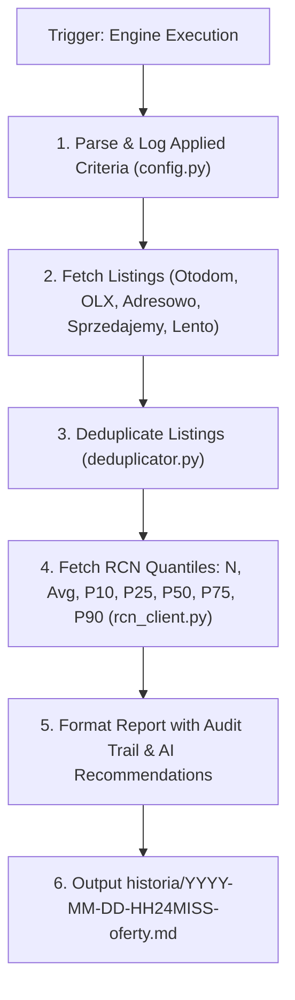

# Architectural Design: Wyszukiwarka Nieruchomości Warszawa & Integracja RCN

## Context

Moduł `wyszukiwarka-nieruchomosci/` jest autonomicznym serwisem zlokalizowanym w podkatalogu repozytorium `gen-ai-orchestrator`.
Serwis służy do automatycznego agregowania, selekcji oraz odświeżania na żądanie ofert nieruchomości w Warszawie według parametrów z pliku `wyszukiwarka-nieruchomosci/kryteria.md`.

Dokumenty wynikowe w `wyszukiwarka-nieruchomosci/historia/YYYY-MM-DD-HH24MISS-oferty.md` rejestrują **faktycznie zastosowane kryteria wyszukiwania dla zapewnienia pełnej audytowalności**, łączą oferty rynkowe z 5-kwantylowym rozkładem cen transakcyjnych z Rejestru Cen Nieruchomości (RCN Warszawa: `https://mapa.um.warszawa.pl/rcn-szukaj/`) oraz rekomendacjami AI.

---

## Technical Architecture & Component Flow

---

## Detailed Integration Specifications

1. **Audytowalność Kryteriów**: W nagłówku raportu sekcja `## ⚙️ Faktycznie Zastosowane Kryteria Wyszukiwania` wypisuje ścieżkę pliku konfiguracyjnego oraz dokładne wartości parametrów użyte w przebiegu (ceny, metraż, dzielnice, typ ogłoszeniodawcy, stan prawny).
2. **Rozkład Kwantylowy RCN Warszawa**: Każda dzielnica i obszar MSI (Kabaty, Natolin, Stary Mokotów, Filtry itp.) prezentuje wskaźniki: $N$ (liczba transakcji), Średnia, P10, P25, P50 (Mediana), P75, P90.
3. **Prawdziwe Odsyłacze**: Każda oferta w tabeli zawiera aktywny, sprawdzony URL.
