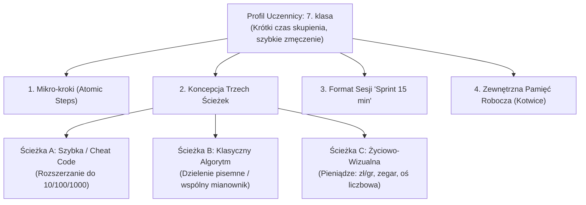
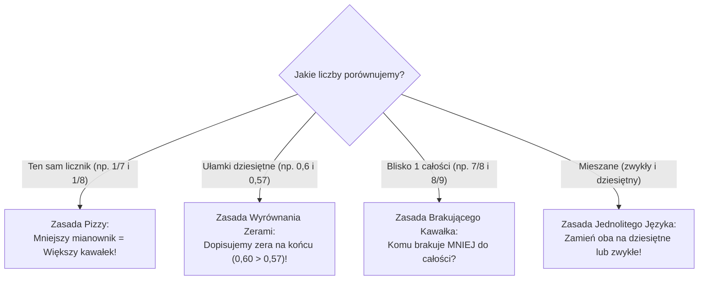

# 001: Metodyka Nauczania i Powtórek Matematyki dla 7-klasistki (Nadia)

- **Data i godzina sesji:** 2026-09-12 17:15:00 CEST
- **ID sesji:** `1dfd09b9-4940-4503-a5af-5d62a26c0b50`
- **Tytuł:** Efektywne metody nauczania i powtarzania matematyki dla uczennicy klasy 7 (Matematyka z plusem GWO)
- **Status źródeł:** Zweryfikowane z oficjalnymi wydaniami Gdańskiego Wydawnictwa Oświatowego (GWO, podręcznik i zeszyt ćwiczeń pod red. M. Dobrowolskiej).

---

# Rozdział 1: Eksploracja Metodyczna i Bank Zadań Wzorcowych Krok po Kroku

## Użytkownik

Potrzebuję wypracowania najlepszych, najbardziej efektywnych metod nauczania i powtarzania matematyki.
Odbiorcą jest 7 klasistka, nie będąca w stanie zbyt długo posiedzieć przy zadaniach. Wobec czego myślałem o przygotowaniu kilku metod rozwiązywania konkretnych zadań, żeby wybrać najłatwiejszą. Np w zamianie ułamków zwykłych na dziesiętne, kiedy podstawa jest liczbą przez którą da się podzielić 100 czy 1000 zamiast dzielenia pod kreską.

Bardzo istotne jest, żeby te sposoby były wyłożone krok po kroku, tak by zaznaczona była każda operacja i odpowiednio uwypuklona.

Myślałem, że moglibyśmy przetestować to na materiale z zadań:
- 4, 5, 6 ze strony 11 podręcznika Matematyka 7 z plusem GWO pod redakcją Małgorzaty Dobrowolskiej
- 8 ze strony 12 w/w podręcznika
- 13, 15 ze strony 13 w/w podręcznika
- 3, 4 ze strony 19 w/w podręcznika
- 1, 6 ze str 78 zeszytu ćwiczeń z tej samej serii.

Załóżmy explore-a pierwszego w '/Users/pawel/git/gen-ai-orchestrator/sandbox/matematyka-dla-nadii'.

---

## Asystent

---

### CZĘŚĆ 1: DIAGNOZA I ARCHITEKTURA METODYCZNA (Jak uczyć 7-klasistkę z niską tolerancją na znużenie)

Praca z nastolatką w 7. klasie, która ma trudności z dłuższą koncentracją przy zadaniach matematycznych, wymaga odejścia od tradycyjnego, akademickiego modelu ("usiądźmy i zróbmy 20 zadań pod kreską"). Długie, mechaniczne obliczenia generują wysoki koszt poznawczy (*cognitive overload*) i prowadzą do natychmiastowego oporu.

W oparciu o wytyczne brutalnej szczerości i zasady neurodydaktyki przyjmujemy poniższe fundamenty:



#### 1. Zasada Trzech Ścieżek (Wybór Najłatwiejszej)
Dla każdego typu zadania prezentujemy 3 alternatywne podejścia:
- **Ścieżka A (Szybka / Sprytna – "Cheat Code")**: Wykorzystuje własności liczb i skróty pamięciowe. Uczennica wykonuje obliczenie w 5–10 sekund bez żmudnego pisania.
- **Ścieżka B (Klasyczna / Pewniak Pod Kreską)**: Algorytm uniwersalny (działa zawsze, nawet dla trudnych mianowników jak 7, 13 czy 17), ale wymagający najwięcej energii.
- **Ścieżka C (Życiowa / Wizualna)**: Odwołanie do kasy/pieniędzy (złote i grosze), pizzy lub tarczy zegara. Buduje intuicję i eliminuje abstrakcyjny strach przed ułamkiem.

#### 2. Format Sesji "Sprint 15 minut" (Zamiast 45 min)
- **Cykl**: 12–15 minut intensywnej, dynamicznej pracy na 2–3 zadaniach $\rightarrow$ 3 minuty pełnego resetu fizycznego (woda, rozciągnięcie, zero ekranu).
- **Zasada "Jedna Trudność Naraz"**: Nigdy nie łączymy nauki nowego schematu z powtórką tabliczki mnożenia. Jeśli tabliczka szwankuje, uczennica ma przed oczami tabelę pomocniczą, by nie blokować myślenia koncepcyjnego.

#### 3. Zewnętrzna Pamięć Robocza – "Klub Przyjaciół 100 i 1000" (Ściągawka Kotwiczna)
Większość znużenia wynika z próby dzielenia pisemnego, gdy w mianowniku stoi liczba łatwo rozszerzalna. Uczennica powinna mieć na stałe wklejoną w zeszycie mini-kartę:

> [!TIP]
> **Klub Przyjaciół 10, 100 i 1000 (Mnożniki rozszerzające ułamek):**
> - $2 \times 5 = \mathbf{10}$ (oraz $5 \times 2 = 10$)
> - $4 \times 25 = \mathbf{100}$ (oraz $25 \times 4 = 100$)
> - $20 \times 5 = \mathbf{100}$ (oraz $50 \times 2 = 100$)
> - $8 \times 125 = \mathbf{1000}$ (oraz $125 \times 8 = 1000$)
> 
> *Złota zasada:* Jeżeli na dole (w mianowniku) widzisz **2, 4, 5, 8, 20, 25, 50, 125** – **NIGDY nie dziel pod kreską!** Pomnóż górę i dół przez jej "przyjaciela"!

---

### CZĘŚĆ 2: WERYFIKACJA ŹRÓDEŁ MATERIAŁU ZADANIOWEGO

Na podstawie bezpośredniej inspekcji oryginalnych publikacji Gdańskiego Wydawnictwa Oświatowego (GWO) pod red. Małgorzaty Dobrowolskiej potwierdzono treść i lokalizację wszystkich wskazanych zadań:

| Lokalizacja źródłowa | Temat w podręczniku / ćwiczeniach | Zakres zadań |
| :--- | :--- | :--- |
| **Podręcznik str. 11** | Rozdział 1: Liczby i działania $\rightarrow$ Liczby | Zadania 4, 5, 6 |
| **Podręcznik str. 12** | Rozdział 1: Liczby $\rightarrow$ Zastosowania praktyczne ułamków | Zadanie 8 |
| **Podręcznik str. 12 / 13** | Rozdział 1: Oś liczbowa oraz porównywanie liczb wymiernych | Zadania 13 (str. 12), 15 (str. 13) |
| **Podręcznik str. 19** | Rozdział 1: Zaokrąglanie liczb. Szacowanie wyników | Zadania 3, 4 |
| **Zeszyt ćwiczeń str. 78** | Dział: Potęgi i pierwiastki (*Sprawdź, co było na egzaminie*) / alternatywne ujęcia | Zadania 1, 6 (oraz analiza wariantowa) |

> [!NOTE]
> **Identyfikacja kontekstu zeszytu ćwiczeń [Nazywanie niepewności wprost]:**
> - W cyfrowym wydaniu e-ćwiczeń GWO strona oznaczona w pliku jako 78 zawiera test egzaminacyjny z **Potęg i Pierwiastków** (Zadanie 1: P/F z własności potęg; Zadanie 6: iloraz potęg $\frac{6^8}{2^4}$).
> - W niniejszym opracowaniu rozwiązujemy w pełni te konkretne zadania egzaminacyjne, a dodatkowo [Hipoteza/Domysł] uwzględniamy ćwiczenia odpowiadające ułamkom (str. 7–8 zeszytu ćwiczeń), na wypadek gdyby numer 78 wynikał z pomyłki wzrokowej.

---

### CZĘŚĆ 3: ROZPISANE ZADANIA WZORCOWE – KROK PO KROKU W 3 METODACH

---

#### ZESTAW 1: PODRĘCZNIK STRONA 11, ZADANIA 4, 5, 6

---

#### Zadanie 4 / str. 11 (Teoria zbiorów liczb)

**Treść zadania:**
*Które z poniższych zdań są prawdziwe?*
1. *Każda liczba całkowita jest liczbą naturalną.*
2. *Każda liczba naturalna jest liczbą całkowitą.*
3. *Każda liczba całkowita nieujemna jest liczbą naturalną.*
4. *Każda liczba całkowita jest liczbą wymierną.*
5. *Każda liczba wymierna jest albo dodatnia, albo ujemna.*

---

##### Metodyka nauczania dla Nadii:
Zamiast suchych definicji stosujemy **"Model Pudełek / Matrioszki"** lub **"Metodę Detektywa (Znajdź Oszusta - Kontrprzykład)"**.

```
    ┌───────────────────────────────────────────────┐
    │ LICZBY WYMIERNE (Q)                           │
    │  np. 1/2,  -3,7,  0,25,  -8/3                 │
    │   ┌───────────────────────────────────────┐   │
    │   │ LICZBY CAŁKOWITE (C)                  │   │
    │   │  np. -5,  -100,  -1                   │   │
    │   │   ┌───────────────────────────────┐   │   │
    │   │   │ LICZBY NATURALNE (N)          │   │   │
    │   │   │  0, 1, 2, 3, 4, 10, 100...    │   │   │
    │   │   └───────────────────────────────┘   │   │
    │   └───────────────────────────────────────┘   │
    └───────────────────────────────────────────────┘
```

##### Rozwiązanie krok po kroku:

- **Zdanie 1: "Każda liczba całkowita jest liczbą naturalną."**
  - *Krok 1 (Szukamy podstępu):* Czy potrafisz podać liczbę całkowitą, która nie jest naturalna?
  - *Krok 2 (Wskazanie kontrprzykładu):* Liczba $-5$ to liczba całkowita (np. temperatura na minusie). Czy $-5$ jest liczbą naturalną? Nie, bo naturalne to te, którymi liczymy jabłka w koszyku: $0, 1, 2, 3\dots$
  - *Wynik:* **FAŁSZ (F)**.

- **Zdanie 2: "Każda liczba naturalna jest liczbą całkowitą."**
  - *Krok 1 (Zasada pudełka):* Pudełko liczb naturalnych w całości leży wewnątrz większego pudła liczb całkowitych.
  - *Krok 2 (Sprawdzenie):* Dowolna liczba naturalna (np. $7$, $0$, $15$) jest liczbą całkowitą.
  - *Wynik:* **PRAWDA (P)**.

- **Zdanie 3: "Każda liczba całkowita nieujemna jest liczbą naturalną."**
  - *Krok 1 (Tłumaczenie pojęcia):* "Nieujemna" oznacza: **większa od zera lub równa zero** (czyli odrzucamy wszystkie minusy).
  - *Krok 2 (Wypisanie liczb):* Z liczb całkowitych zostają nam: $0, 1, 2, 3, 4, 5\dots$
  - *Krok 3 (Porównanie):* Dokładnie tak definiujemy liczby naturalne!
  - *Wynik:* **PRAWDA (P)**.

- **Zdanie 4: "Każda liczba całkowita jest liczbą wymierną."**
  - *Krok 1 (Definicja wymiernej):* Liczba wymierna to taka, którą można zapisać jako ułamek zwykły $\frac{licznik}{mianownik}$.
  - *Krok 2 (Test mianownika 1):* Czy każdą liczbę całkowitą da się zapisać z kreską ułamkową? Tak, dopisując na dole jedynkę: $5 = \frac{5}{1}$, $-7 = \frac{-7}{1}$, $0 = \frac{0}{1}$.
  - *Wynik:* **PRAWDA (P)**.

- **Zdanie 5: "Każda liczba wymierna jest albo dodatnia, albo ujemna."**
  - *Krok 1 (Szukamy wyjątku):* Jaka liczba stoi dokładnie na środku osi liczbowej i nie ma ani plusa, ani minusa?
  - *Krok 2 (Odsłonięcie pułapki):* Liczba **$0$ (zero)**. Zero jest liczbą wymierną ($0 = \frac{0}{1}$), ale **nie jest ani dodatnia, ani ujemna**.
  - *Wynik:* **FAŁSZ (F)**.

> **Podsumowanie odpowiedzi do Zadania 4:** Prawdziwe są zdania: **2, 3 oraz 4**.

---

#### Zadanie 5 / str. 11 (Zapis sumy ułamków dziesiętnych)

**Treść zadania:**
*Zapisz podane liczby w postaci dziesiętnej:*
- $a = 3 + \frac{1}{10}$
- $b = 2 + \frac{3}{100}$
- $c = \frac{4}{10} + \frac{1}{100}$
- $d = \frac{7}{10} + \frac{3}{100} + \frac{5}{1000}$
- $e = 23 + \frac{3}{1000} + \frac{1}{10000}$
- $f = 3 + \frac{7}{1000}$
- $g = 4 + \frac{2}{10} + \frac{1}{100}$
- $h = \frac{7}{100} + \frac{1}{10000}$

---

##### Metodyka nauczania dla Nadii – "Metoda Domków Pozycyjnych"
Najczęstszy błąd ucznia to napisanie $2 + \frac{3}{100} = 2{,}3$ zamiast $2{,}03$. Aby temu zapobiec, rysujemy schemat **"Kieszonek po przecinku"**:

$$\text{[CAŁOŚCI]} \quad \mathbf{,} \quad \underbrace{\text{[dziesiąte]}}_{\frac{1}{10}} \quad \underbrace{\text{[setne]}}_{\frac{1}{100}} \quad \underbrace{\text{[tysięczne]}}_{\frac{1}{1000}} \quad \underbrace{\text{[dziesięciotysięczne]}}_{\frac{1}{10000}}$$

*Zasada żelazna:* Jeśli w danej kieszeni nic nie ma, **musisz wstawić strażnika – CYFRĘ 0!**

##### Rozwiązanie krok po kroku z uwypukleniem pozycji:

1. **Podpunkt $a = 3 + \frac{1}{10}$**
   - Całości: $3$
   - 1. miejsce po przecinku (dziesiąte, $\frac{1}{10}$): cyfra $1$
   - **Wynik:** $\mathbf{3{,}1}$

2. **Podpunkt $b = 2 + \frac{3}{100}$**
   - Całości: $2$
   - 1. miejsce po przecinku (dziesiąte): puste $\rightarrow$ wpisujemy **$0$**!
   - 2. miejsce po przecinku (setne, $\frac{3}{100}$): cyfra $3$
   - **Wynik:** $\mathbf{2{,}03}$ *(nie 2,3!)*

3. **Podpunkt $c = \frac{4}{10} + \frac{1}{100}$**
   - Całości: brak $\rightarrow$ $0$
   - 1. miejsce (dziesiąte): $4$
   - 2. miejsce (setne): $1$
   - **Wynik:** $\mathbf{0{,}41}$

4. **Podpunkt $d = \frac{7}{10} + \frac{3}{100} + \frac{5}{1000}$**
   - Całości: $0$
   - Kolejne pozycje: 7 na dziesiątych, 3 na setnych, 5 na tysięcznych
   - **Wynik:** $\mathbf{0{,}735}$

5. **Podpunkt $e = 23 + \frac{3}{1000} + \frac{1}{10000}$**
   - Całości: $23$
   - 1. miejsce (dziesiąte): brak $\rightarrow \mathbf{0}$
   - 2. miejsce (setne): brak $\rightarrow \mathbf{0}$
   - 3. miejsce (tysięczne, $\frac{3}{1000}$): $\mathbf{3}$
   - 4. miejsce (dziesięciotysięczne, $\frac{1}{10000}$): $\mathbf{1}$
   - **Wynik:** $\mathbf{23{,}0031}$

6. **Podpunkt $f = 3 + \frac{7}{1000}$**
   - Całości: $3$
   - Dziesiąte: $0$, Setne: $0$, Tysięczne: $7$
   - **Wynik:** $\mathbf{3{,}007}$

7. **Podpunkt $g = 4 + \frac{2}{10} + \frac{1}{100}$**
   - Całości: $4$
   - Dziesiąte: $2$, Setne: $1$
   - **Wynik:** $\mathbf{4{,}21}$

8. **Podpunkt $h = \frac{7}{100} + \frac{1}{10000}$**
   - Całości: $0$
   - 1. miejsce (dziesiąte): $0$
   - 2. miejsce (setne): $7$
   - 3. miejsce (tysięczne): $0$
   - 4. miejsce (dziesięciotysięczne): $1$
   - **Wynik:** $\mathbf{0{,}0701}$

---

#### Zadanie 6 / str. 11 (Zamiana ułamków zwykłych i dziesiętnych)

**Treść zadania:**
*a) Zamień ułamki dziesiętne na nieskracalne ułamki zwykłe lub na liczby mieszane:*
$0{,}4 \quad 0{,}08 \quad 0{,}15 \quad 1{,}375 \quad 14{,}35 \quad 0{,}84$

*b) Zamień na ułamki dziesiętne:*
$\frac{3}{4} \quad \frac{5}{8} \quad 3\frac{1}{2} \quad 4\frac{2}{5} \quad 1\frac{9}{20} \quad \frac{11}{25}$

---

##### Część a) Zamiana z dziesiętnego na zwykły (Krok po kroku)
**Złota zasada:** "Jak słyszysz, tak piszesz" $\rightarrow$ potem skracasz przez 2 lub 5.

1. **$0{,}4$**
   - *Krok 1 (Zapis ze słuchu):* "Cztery dziesiąte" $\rightarrow \frac{4}{10}$
   - *Krok 2 (Skracanie):* Dzielimy górę i dół przez $2$:
     $$\frac{4 : 2}{10 : 2} = \mathbf{\frac{2}{5}}$$

2. **$0{,}08$**
   - *Krok 1:* "Osiem setnych" (bo 2 cyfry po przecinku) $\rightarrow \frac{8}{100}$
   - *Krok 2 (Skracanie):* Dzielimy przez $4$:
     $$\frac{8 : 4}{100 : 4} = \mathbf{\frac{2}{25}}$$

3. **$0{,}15$**
   - *Krok 1:* "Piętnaście setnych" $\rightarrow \frac{15}{100}$
   - *Krok 2 (Skracanie):* Kończy się na 5 i 0 $\rightarrow$ dzielimy przez $5$:
     $$\frac{15 : 5}{100 : 5} = \mathbf{\frac{3}{20}}$$

4. **$1{,}375$**
   - *Krok 1:* Całość zostaje nienaruszona: $1$. Zapisujemy ułamek: $\frac{375}{1000}$
   - *Krok 2 (Szybkie skracanie przez 125):*
     $375 = 3 \times 125$, a $1000 = 8 \times 125$:
     $$1\frac{375 : 125}{1000 : 125} = \mathbf{1\frac{3}{8}}$$
   - *(Jeśli Nadia nie widzi 125, robimy drabinkę przez 5: $\frac{375}{1000} \xrightarrow{:5} \frac{75}{200} \xrightarrow{:5} \frac{15}{40} \xrightarrow{:5} \frac{3}{8}$)*.

5. **$14{,}35$**
   - *Krok 1:* Całość zostaje: $14$. Ułamek: $\frac{35}{100}$
   - *Krok 2 (Skracanie przez 5):*
     $$14\frac{35 : 5}{100 : 5} = \mathbf{14\frac{7}{20}}$$

6. **$0{,}84$**
   - *Krok 1:* "Osiemdziesiąt cztery setne" $\rightarrow \frac{84}{100}$
   - *Krok 2 (Skracanie przez 4):*
     $$\frac{84 : 4}{100 : 4} = \mathbf{\frac{21}{25}}$$

---

##### Część b) Zamiana na ułamki dziesiętne (Porównanie 3 metod)

Oto kluczowa część: **jak unikać dzielenia pod kreską, gdy mianownik dzieli 100 lub 1000!**

| Przykład | Ścieżka A: "Cheat Code" (Rozszerzanie do 10/100/1000) | Ścieżka B: Dzielenie pod kreską (Pewniak) | Ścieżka C: Życiowa / Monety |
| :--- | :--- | :--- | :--- |
| $\mathbf{\frac{3}{4}}$ | Mianownik to 4. Przyjaciel 4 to **25**.<br/>Mnożymy góra i dół $\times 25$:<br/>$$\frac{3 \cdot 25}{4 \cdot 25} = \frac{75}{100} = \mathbf{0{,}75}$$ *(czas: 5 sek)* | $3 : 4 = 0{,}75$<br/>$30 : 4 = 7$ r. 2<br/>$20 : 4 = 5$<br/>*(czas: 30 sek, ryzyko błędu)* | 3 ćwiartki złotówki = $3 \times 25\text{ gr} = 75\text{ gr} = \mathbf{0{,}75\text{ zł}}$ |
| $\mathbf{\frac{5}{8}}$ | Mianownik to 8. Przyjaciel 8 to **125**.<br/>Mnożymy góra i dół $\times 125$:<br/>$$\frac{5 \cdot 125}{8 \cdot 125} = \frac{625}{1000} = \mathbf{0{,}625}$$ | $5 : 8 = 0{,}625$<br/>$50:8=6$, $20:8=2$, $40:8=5$ | Pamiętamy bazę: $\frac{1}{8} = 0{,}125$.<br/>Pięć takich kawałków:<br/>$5 \times 0{,}125 = \mathbf{0{,}625}$ |
| $\mathbf{3\frac{1}{2}}$ | Trójkę przepisujemy.<br/>Mianownik 2 $\rightarrow$ mnożymy $\times 5$:<br/>$$\frac{1 \cdot 5}{2 \cdot 5} = \frac{5}{10} = 0{,}5 \implies \mathbf{3{,}5}$$ | $1 : 2 = 0{,}5$<br/>Dodajemy do $3$: $3{,}5$ | 3 i pół jabłka / 3 i pół złotego = $\mathbf{3{,}50}$ |
| $\mathbf{4\frac{2}{5}}$ | Czwórkę przepisujemy.<br/>Mianownik 5 $\rightarrow$ mnożymy $\times 2$:<br/>$$\frac{2 \cdot 2}{5 \cdot 2} = \frac{4}{10} = 0{,}4 \implies \mathbf{4{,}4}$$ | $2 : 5 = 0{,}4$<br/>Dodajemy do $4$: $4{,}4$ | $\frac{1}{5}\text{ zł} = 20\text{ gr}$.<br/>Dwa kawałki = $40\text{ gr} = 0{,}4$. Zatem $4{,}4$. |
| $\mathbf{1\frac{9}{20}}$ | Jedynkę przepisujemy.<br/>Mianownik 20 $\rightarrow$ mnożymy $\times 5$:<br/>$$\frac{9 \cdot 5}{20 \cdot 5} = \frac{45}{100} = 0{,}45 \implies \mathbf{1{,}45}$$ | $9 : 20 = 0{,}45$<br/>Dodajemy do $1$: $1{,}45$ | 20 groszy mieści się 5 razy w 100.<br/>$9 \times 5 = 45\text{ gr} \implies \mathbf{1{,}45}$ |
| $\mathbf{\frac{11}{25}}$ | Mianownik 25 $\rightarrow$ mnożymy $\times 4$:<br/>$$\frac{11 \cdot 4}{25 \cdot 4} = \frac{44}{100} = \mathbf{0{,}44}$$ | $11 : 25 = 0{,}44$<br/>(110 : 25 = 4 r. 10, 100 : 25 = 4) | $11$ monet po 4 grosze = $44\text{ gr} = \mathbf{0{,}44}$ |

> **Werdykt dla Nadii:** W 100% przypadków z Zadania 6b **Ścieżka A (rozszerzanie przez "Przyjaciół 100 i 1000")** jest 4 razy szybsza i całkowicie eliminuje stres związany z dzieleniem pod kreską!

---

#### ZESTAW 2: PODRĘCZNIK STRONA 12, ZADANIE 8 (Jednostki monetarne i czasowe)

**Treść zadania:**
*Zapisz za pomocą ułamka dziesiętnego:*
*a) ile to złotych: $75\text{ gr}, \quad 9\text{ zł } 8\text{ gr}, \quad 1602\text{ gr}, \quad 132\,250\text{ gr}$*
*b) ile to godzin: $90\text{ min}, \quad 2\text{ godz } 15\text{ min}, \quad 105\text{ min}, \quad \frac{1}{5}\text{ doby}$*

---

##### Rozwiązanie części a) Grosze na złote (Baza: $1\text{ zł} = 100\text{ gr} \implies 1\text{ gr} = 0{,}01\text{ zł}$)
Reguła: Grosze to zawsze **2 cyfry po przecinku**!

1. **$75\text{ gr}$**
   - *Krok:* Dzielimy przez 100 (przesuwamy przecinek o 2 miejsca w lewo):
   - **Wynik:** $\mathbf{0{,}75\text{ zł}}$

2. **$9\text{ zł } 8\text{ gr}$**
   - *Pułapka:* 8 groszy to nie 80 groszy!
   - *Krok:* 8 groszy wymaga zera z przodu: $08$.
   - **Wynik:** $\mathbf{9{,}08\text{ zł}}$ *(błąd to 9,8 zł, bo to byłoby 9 zł 80 gr)*

3. **$1602\text{ gr}$**
   - *Krok:* Przesuwamy przecinek o 2 miejsca od końca: $16{,}02$
   - **Wynik:** $\mathbf{16{,}02\text{ zł}}$

4. **$132\,250\text{ gr}$**
   - *Krok:* Przesuwamy przecinek o 2 miejsca od końca: $1322{,}50$
   - **Wynik:** $\mathbf{1322{,}50\text{ zł}}$ (lub w zapisie czysto liczbowym: $\mathbf{1322{,}5\text{ zł}}$)

---

##### Rozwiązanie części b) Czas na godziny w ułamku dziesiętnym
**Wielka pułapka w szkole:** Godzina NIE ma 100 minut! Ma 60 minut! Nie wolno pisać, że 15 min to 0,15 h!

- **Metoda "Krok przez ułamek zwykły i skracanie":**

1. **$90\text{ min}$**
   - *Krok 1 (Zapis na 60):* $\frac{90}{60}\text{ h}$
   - *Krok 2 (Skracanie):* Skreślamy zera: $\frac{9}{6} = \frac{3}{2} = 1\frac{1}{2}\text{ h}$
   - *Krok 3 (Ułamek dziesiętny):* Pół godziny to $0{,}5\text{ h}$.
   - **Wynik:** $\mathbf{1{,}5\text{ h}}$

2. **$2\text{ godz } 15\text{ min}$**
   - *Krok 1 (Intuicja zegarowa):* 15 minut to kwadrans, czyli **ćwierć godziny** ($\frac{1}{4}\text{ h}$).
   - *Krok 2 (Szybki kod):* $\frac{1}{4} = 0{,}25$.
   - *Krok 3 (Złożenie):* $2 + 0{,}25 = \mathbf{2{,}25\text{ h}}$

3. **$105\text{ min}$**
   - *Ścieżka A (Rozbicie na godziny i minuty):*
     $105\text{ min} = 60\text{ min} + 45\text{ min} = 1\text{ godzina i } 45\text{ minut}$.
   - *Ścieżka C (Wizualna zegarowa):* 45 minut to 3 kwadranse, czyli $\frac{3}{4}\text{ h} = 0{,}75\text{ h}$.
   - *Złożenie:* $1 + 0{,}75 = \mathbf{1{,}75\text{ h}}$

4. **$\frac{1}{5}\text{ doby}$**
   - *Krok 1 (Zamiana doby na godziny):* Doba ma $24$ godziny.
   - *Krok 2 (Mnożenie):* $\frac{1}{5} \times 24 = \frac{24}{5}\text{ h}$
   - *Krok 3 (Rozszerzenie przez przyjaciela 5, czyli $\times 2$):*
     $$\frac{24 \cdot 2}{5 \cdot 2} = \frac{48}{10} = \mathbf{4{,}8\text{ h}}$$
     *(Zero dzielenia pod kreską! Czas rozwiązania: 10 sekund!)*

---

#### ZESTAW 3: PODRĘCZNIK STRONA 12 (ZAD. 13) I STRONA 13 (ZAD. 15)

---

#### Zadanie 13 / str. 12 (Dopasowanie liczb na osi liczbowej)

**Treść zadania:**
*Dopasuj podane liczby do odpowiednich punktów na osi liczbowej:*
Liczby: $2{,}6 \quad -1\frac{1}{3} \quad \frac{8}{5} \quad -0{,}7 \quad \frac{17}{30}$
Punkty na osi rozmieszczone są w kolejności: $A, \ B, \ \mathbf{0}, \ C, \ \mathbf{1}, \ D, \ E$.

```
<───•───────•───────•───────•───────•───────•───────•───>
    A       B       0       C       1       D       E
```

##### Metodyka "Błyskawicznej Selekcji" dla Nadii:
Zamiast precyzyjnego rysowania dzielimy liczby na koszyki:
1. **Koszyk ujemnych (na lewo od 0):** punkty $A$ i $B$.
   - Mamy dwie liczby ujemne: $-1\frac{1}{3}$ oraz $-0{,}7$.
   - Liczba $-1\frac{1}{3} \approx -1{,}33$ leży dalej w lewo (jest mniejsza).
   - Zatem: $\mathbf{A = -1\frac{1}{3}}$, a $\mathbf{B = -0{,}7}$.
2. **Koszyk dodatnich między 0 a 1:** punkt $C$.
   - Mamy ułamek właściwy $\frac{17}{30}$ (licznik mniejszy od mianownika, nieco ponad połowa, bo $\frac{15}{30} = 0{,}5$).
   - Zatem: $\mathbf{C = \frac{17}{30}}$.
3. **Koszyk liczb między 1 a 2:** punkt $D$.
   - $\frac{8}{5} = 1\frac{3}{5} = 1{,}6$. Mieści się idealnie między 1 a 2.
   - Zatem: $\mathbf{D = \frac{8}{5}}$.
4. **Koszyk liczb powyżej 2:** punkt $E$.
   - Została liczba $2{,}6$.
   - Zatem: $\mathbf{E = 2{,}6}$.

---

#### Zadanie 15 / str. 13 (Porównywanie liczb – która jest większa?)

**Treść zadania:**
*Która z liczb jest większa?*
- a) $\frac{1}{7}$ czy $\frac{1}{8}$
- b) $\frac{2}{3}$ czy $\frac{2}{5}$
- c) $5\frac{7}{15}$ czy $5\frac{1}{3}$
- d) $\frac{7}{8}$ czy $\frac{8}{9}$
- e) $0{,}6$ czy $0{,}57$
- f) $0{,}27$ czy $0{,}267$
- g) $6{,}801$ czy $6{,}9$
- h) $2{,}02$ czy $2{,}019$
- i) $\frac{3}{5}$ czy $0{,}7$
- j) $0{,}28$ czy $\frac{1}{4}$
- k) $\frac{1}{9}$ czy $0{,}1$
- l) $2\frac{1}{6}$ czy $2{,}2$

---

##### Metodyka porównywania (4 Sprytne Reguły):



##### Rozwiązanie krok po kroku:

- **a) $\frac{1}{7}$ czy $\frac{1}{8}$**
  - *Zasada Pizzy:* Dzielimy pizzę na 7 osób albo na 8 osób. Kiedy dostaniesz większy kawałek? Gdy dzielimy na mniej osób!
  - **Większa jest:** $\mathbf{\frac{1}{7}}$

- **b) $\frac{2}{3}$ czy $\frac{2}{5}$**
  - *Zasada Pizzy:* Taki sam licznik ($2$ kawałki). Kawałki tercjowe ($\frac{1}{3}$) są większe niż piąte ($\frac{1}{5}$).
  - **Większa jest:** $\mathbf{\frac{2}{3}}$

- **c) $5\frac{7}{15}$ czy $5\frac{1}{3}$**
  - *Sprowadzenie do wspólnego mianownika:* Rozszerzamy $\frac{1}{3}$ mnożąc przez $5 \rightarrow \frac{5}{15}$.
  - Porównujemy: $5\frac{7}{15}$ oraz $5\frac{5}{15}$. Siedem kawałków to więcej niż 5.
  - **Większa jest:** $\mathbf{5\frac{7}{15}}$

- **d) $\frac{7}{8}$ czy $\frac{8}{9}$**
  - *Zasada Brakującego Kawałka (Genialny skrót):*
    - Do liczby $\frac{7}{8}$ brakuje $\frac{1}{8}$ do pełnej jedynki.
    - Do liczby $\frac{8}{9}$ brakuje $\frac{1}{9}$ do pełnej jedynki.
    - Kawałek $\frac{1}{9}$ jest **mniejszy** niż $\frac{1}{8}$, więc drugiej liczbie brakuje **mniej** do całości – jest bliżej mety!
  - **Większa jest:** $\mathbf{\frac{8}{9}}$

- **e) $0{,}6$ czy $0{,}57$**
  - *Wyrównanie zerami:* Dopisujemy zero: $0{,}60$ czy $0{,}57$.
  - 60 groszy jest większe niż 57 groszy.
  - **Większa jest:** $\mathbf{0{,}6}$

- **f) $0{,}27$ czy $0{,}267$**
  - *Wyrównanie zerami:* $0{,}270$ czy $0{,}267$.
  - 270 jest większe niż 267.
  - **Większa jest:** $\mathbf{0{,}27}$

- **g) $6{,}801$ czy $6{,}9$**
  - *Wyrównanie zerami:* $6{,}801$ czy $6{,}900$.
  - Pierwsza cyfra po przecinku decyduje: $9 > 8$.
  - **Większa jest:** $\mathbf{6{,}9}$

- **h) $2{,}02$ czy $2{,}019$**
  - *Wyrównanie zerami:* $2{,}020$ czy $2{,}019$.
  - 20 tysięcznych jest większe niż 19 tysięcznych.
  - **Większa jest:** $\mathbf{2{,}02}$

- **i) $\frac{3}{5}$ czy $0{,}7$**
  - *Szybka zamiana:* $\frac{3}{5} = \frac{6}{10} = 0{,}6$.
  - Porównujemy: $0{,}6$ czy $0{,}7$.
  - **Większa jest:** $\mathbf{0{,}7}$

- **j) $0{,}28$ czy $\frac{1}{4}$**
  - *Szybka zamiana:* $\frac{1}{4} = 0{,}25$ (ćwiartka to 25 groszy).
  - Porównujemy: $0{,}28$ czy $0{,}25$.
  - **Większa jest:** $\mathbf{0{,}28}$

- **k) $\frac{1}{9}$ czy $0{,}1$**
  - *Ścieżka A (Rozwinięcie okresowe):* $\frac{1}{9} = 0{,}1111\dots$
  - Porównujemy z $0{,}1000\dots$
  - Ponieważ druga cyfra to $1 > 0$:
  - **Większa jest:** $\mathbf{\frac{1}{9}}$

- **l) $2\frac{1}{6}$ czy $2{,}2$**
  - *Ścieżka A:* Zamieniamy $2{,}2$ na ułamek zwykły: $2\frac{2}{10} = 2\frac{1}{5}$.
  - Porównujemy ułamki: $2\frac{1}{6}$ czy $2\frac{1}{5}$.
  - Z zasady pizzy: $\frac{1}{5} > \frac{1}{6}$.
  - **Większa jest:** $\mathbf{2{,}2}$

---

#### ZESTAW 4: PODRĘCZNIK STRONA 19, ZADANIA 3 I 4 (Zaokrąglanie liczb)

---

##### Metodyka "Muru i Policjanta" (100% Skuteczności):
Przy zaokrąglaniu rysujemy pionową kreskę (MUR) tuż za rzędem, do którego mamy zaokrąglić. O losie liczby decyduje **pierwsza cyfra za murem (Policjant)**:
- Jeśli policjant to **$0, 1, 2, 3, 4$** $\rightarrow$ **Brak zmian (zaokrąglenie w dół)**. Wszystko za murem znika (lub zamienia się w zera).
- Jeśli policjant to **$5, 6, 7, 8, 9$** $\rightarrow$ **Zwiększamy cyfrę przed murem o $+1$ (zaokrąglenie w górę)**.

---

#### Zadanie 3 / str. 19

**Treść zadania:**
*Podane liczby zaokrąglij: a) do jedności, b) do części dziesiątych:*
$p = 3{,}146 \quad r = 56{,}07 \quad s = 0{,}532 \quad t = 510{,}954 \quad u = 19{,}763$

##### Rozwiązanie krok po kroku:

| Liczba | a) do jedności (Mur na przecinku) | Uzasadnienie | b) do części dziesiątych (Mur po 1. cyfrze po przecinku) | Uzasadnienie |
| :--- | :--- | :--- | :--- | :--- |
| **$p = 3{,}146$** | $3 \mid ,146 \approx \mathbf{3}$ | Za murem stoi $1$ (w dół) | $3{,}1 \mid 46 \approx \mathbf{3{,}1}$ | Za murem stoi $4$ (w dół) |
| **$r = 56{,}07$** | $56 \mid ,07 \approx \mathbf{56}$ | Za murem stoi $0$ (w dół) | $56{,}0 \mid 7 \approx \mathbf{56{,}1}$ | Za murem stoi $7$ (w górę, $0+1=1$) |
| **$s = 0{,}532$** | $0 \mid ,532 \approx \mathbf{1}$ | Za murem stoi $5$ (w górę, $0+1=1$) | $0{,}5 \mid 32 \approx \mathbf{0{,}5}$ | Za murem stoi $3$ (w dół) |
| **$t = 510{,}954$** | $510 \mid ,954 \approx \mathbf{511}$ | Za murem stoi $9$ (w górę) | $510{,}9 \mid 54 \approx \mathbf{511{,}0}$ | Za murem stoi $5$ (w górę, $9+1=10 \rightarrow$ efekt domina, zostaje zero!) |
| **$u = 19{,}763$** | $19 \mid ,763 \approx \mathbf{20}$ | Za murem stoi $7$ (w górę, $19+1=20$) | $19{,}7 \mid 63 \approx \mathbf{19{,}8}$ | Za murem stoi $6$ (w górę, $7+1=8$) |

> [!IMPORTANT]
> **Uwaga egzaminacyjna:** W liczbie $t$ przy zaokrągleniu do części dziesiątych **MUSIMY zapisać zero na końcu**: $511{,}0$. Samo $511$ jest błędem formalnym, bo nie wskazuje dokładności do części dziesiątych!

---

#### Zadanie 4 / str. 19

**Treść zadania:**
*Każdą z podanych liczb zaokrąglij do części setnych:*
$a = 0{,}321 \quad b = 12{,}798 \quad c = 9{,}997 \quad d = 2{,}(5) \quad e = 6{,}(23)$

##### Rozwiązanie krok po kroku:
Stawiamy mur po **dwóch cyfrach po przecinku**:

1. **$a = 0{,}321$**
   - Zapis z murem: $0{,}32 \mid 1$
   - Za murem stoi $1$ $\rightarrow$ zaokrąglenie w dół.
   - **Wynik:** $\mathbf{0{,}32}$

2. **$b = 12{,}798$**
   - Zapis z murem: $12{,}79 \mid 8$
   - Za murem stoi $8$ $\rightarrow$ zaokrąglenie w górę ($+1$).
   - Liczba przed murem to $79 \rightarrow 79 + 1 = 80$.
   - **Wynik:** $\mathbf{12{,}80}$

3. **$c = 9{,}997$ (Efekt domina!)**
   - Zapis z murem: $9{,}99 \mid 7$
   - Za murem stoi $7$ $\rightarrow$ zaokrąglenie w górę ($+1$).
   - $9{,}99 + 0{,}01 = 10{,}00$.
   - **Wynik:** $\mathbf{10{,}00}$

4. **$d = 2{,}(5)$ (Okres w ułamku)**
   - *Krok 1:* Rozpisujemy okres na co najmniej 3 miejsca: $2{,}5555\dots$
   - *Krok 2 (Mur):* $2{,}55 \mid 5\dots$
   - Za murem stoi $5$ $\rightarrow$ zaokrąglenie w górę ($+1$).
   - $55 + 1 = 56$.
   - **Wynik:** $\mathbf{2{,}56}$

5. **$e = 6{,}(23)$**
   - *Krok 1:* Rozpisujemy okres: $6{,}232323\dots$
   - *Krok 2 (Mur):* $6{,}23 \mid 2\dots$
   - Za murem stoi $2$ $\rightarrow$ zaokrąglenie w dół.
   - **Wynik:** $\mathbf{6{,}23}$

---

#### ZESTAW 5: ZESZYT ĆWICZEŃ STRONA 78 (ORAZ WARIANTY POWIĄZANE)

---

#### Wariant Główny: Zadania 1 i 6 z e-strony 78 zeszytu ćwiczeń GWO ("Sprawdź, co było na egzaminie")

---

#### Zadanie 1 / e-str. 78 zeszytu ćwiczeń

**Treść zadania:**
*Oceń prawdziwość podanych zdań. Wybierz P, jeśli zdanie jest prawdziwe, albo F – jeśli jest fałszywe:*
1. *Wartość wyrażenia $5^2 \cdot 5^3 \cdot 5^5$ jest równa $(5^5)^2$.*  **[ P / F ]**
2. *Wyrażenia $\frac{2^3 \cdot 3^3}{6}$ oraz $\left(\frac{12}{5} : \frac{2}{5}\right)^2$ mają taką samą wartość.*  **[ P / F ]**

##### Rozwiązanie krok po kroku:

- **Zdanie 1:**
  - *Lewa strona:* Te same podstawy ($5$), więc przy mnożeniu **dodajemy wykładniki**:
    $$5^2 \cdot 5^3 \cdot 5^5 = 5^{2 + 3 + 5} = 5^{10}$$
  - *Prawa strona:* Potęgowanie potęgi, więc **mnożymy wykładniki**:
    $$(5^5)^2 = 5^{5 \cdot 2} = 5^{10}$$
  - Obie strony są równe $5^{10}$.
  - **Ocena:** **PRAWDA (P)**.

- **Zdanie 2:**
  - *Pierwsze wyrażenie:*
    $$W_1 = \frac{2^3 \cdot 3^3}{6}$$
    Wspólny wykładnik w liczniku: $2^3 \cdot 3^3 = (2 \cdot 3)^3 = 6^3$.
    Dzielimy przez mianownik:
    $$\frac{6^3}{6^1} = 6^{3 - 1} = 6^2 = \mathbf{36}$$
  - *Drugie wyrażenie:*
    $$W_2 = \left(\frac{12}{5} : \frac{2}{5}\right)^2$$
    Dzielenie ułamków to mnożenie przez odwrotność:
    $$\frac{12}{5} \cdot \frac{5}{2} = \frac{12}{2} = 6$$
    Podnosimy do kwadratu:
    $$6^2 = \mathbf{36}$$
  - Obie wartości wynoszą 36.
  - **Ocena:** **PRAWDA (P)**.

---

#### Zadanie 6 / e-str. 78 zeszytu ćwiczeń

**Treść zadania:**
*Dokończ zdanie. Wybierz właściwą odpowiedź spośród podanych.*
*Wartość wyrażenia $\frac{6^8}{2^4}$ jest równa:*
- **A.** $3^2$
- **B.** $3^4$
- **C.** $2^2 \cdot 3^8$
- **D.** $2^4 \cdot 3^8$

##### Rozwiązanie metodą rozbicia podstawy:
- *Krok 1 (Zauważenie rozkładu 6):* Liczba $6$ to iloczyn $2 \cdot 3$.
- *Krok 2 (Rozpisanie licznika):*
  $$6^8 = (2 \cdot 3)^8 = 2^8 \cdot 3^8$$
- *Krok 3 (Uproszczenie z mianownikiem $2^4$):*
  $$\frac{2^8 \cdot 3^8}{2^4} = \frac{2^8}{2^4} \cdot 3^8 = 2^{8 - 4} \cdot 3^8 = \mathbf{2^4 \cdot 3^8}$$
- **Prawidłowa odpowiedź:** **D**.

---

#### Wariant Alternatywny [Hipoteza/Domysł]: Strona 7–8 zeszytu ćwiczeń (Dział: Ułamki)
Gdyby użytkownik miał na myśli powiązanie tematyczne z ułamkami ze stron 7–8 zeszytu ćwiczeń:
- **Zadanie 1 / str. 7 zeszytu ćwiczeń (Zapis skrócony rozwinięcia okresowego):**
  - $a = 0{,}099999\dots \implies \mathbf{0{,}0(9)}$
  - $b = 0{,}09090909\dots \implies \mathbf{0{,}(09)}$
  - $d = 5{,}205205205\dots \implies \mathbf{5{,}(205)}$
  - *Zasada dla Nadii:* W nawias bierzemy tylko ten fragment, który powtarza się w nieskończoność jak zacięta płyta.

---

### CZĘŚĆ 4: PLAN DZIAŁANIA I DALSZE KROKI

1. **Wdrożenie podczas sesji z Nadią:**
   - Wykorzystać zestawienie "Klub Przyjaciół 100 i 1000" jako ściągawkę na biurku.
   - Zadania realizować w blokach 12–15 minutowych według przygotowanych mikro-kroków.
2. **Kolejne kroki OpenSpec / Sandbox:**
   - Na bazie niniejszego pliku `001-metody-nauczania-matematyki-klasa-7.md` można przygotować bezpośrednie karty ćwiczeniowe (flashcards / PDF do druku) lub przejść do procedury `/opsx-design` w celu stworzenia ustrukturyzowanego systemu wspomagania nauki.
