# Raport Syntetyczny: Kompleksowa Analiza, Kategoryzacja i Plan Optymalizacji Dysku Google

**Właściciel dysku:** Paweł Trzeciakowski (`ptrzeciakowski@gmail.com`)  
**Data wykonania audytu:** 19 września 2026 r.  
**Koordynator audytu:** Antigravity Orchestrator  
**Skład zespołu analitycznego (5 niezależnych agentów AI na maksymalnym poziomie reasoningu):**
1. **Agent 1 (`gemini-pro`)**: *Starszy Architekt Informacji i Taksonomii Danych*
2. **Agent 2 (`gemini-pro`)**: *Ekspert ds. Cyberbezpieczeństwa, Uprawnień i Cold Storage*
3. **Agent 3 (`gemini-flash 3.8`)**: *Starszy Audytor Declutteringu i Selekcji Danych*
4. **Agent 4 (`gemini-flash 3.8`)**: *Analityk Behawioralny PKM, Nawyków i Automatyzacji Workflow*
5. **Agent 5 (`gemini-flash lite`)**: *Analityk Taksonomii Wielowymiarowej i Metryk Behawioralnych*

**Lokalizacja wygenerowanych raportów:**  
`/Users/pawel/git/gen-ai-orchestrator/sandbox/2026-09-19-gdrive-analysis/`

---

## 1. Globalne Metryki i Diagnoza Telemetryczna Dysku

Analiza fizycznej bazy danych Google Drive File Provider (`metadata_sqlite_db`) obejmującej **85 683 obiekty** (z czego 77 498 aktywnych plików, 8 185 folderów, 267.0 GB) ujawniła zjawisko skrajnego **"cyfrowego magazynu wysokiego składowania"**:

```
                              CAŁKOWITY WOLUMEN DYSKU: 267.0 GB
┌──────────────────────────────────────────────────────────────────────────────────┐
│ 88📸Zdjęcia (190.0 GB, 71.2%)                  │95💽Backupy (50.8 GB)│Inne (26 GB)│
└──────────────────────────────────────────────────────────────────────────────────┘
```

### 1.1. Rozkład Metryki Recency (`viewed_by_me_date`)
Analiza czasu ostatniego otwarcia pliku przez Pawła wykazała gigantyczną dysproporcję:
* **Strefa HOT (< 30 dni):** **105 plików (0.1%)** – mikroskopijny, bieżący strumień operacyjny (analizy Snowflake, Analiza Matematyczna PW, notatki bieżące).
* **Strefa WARM (1–12 miesięcy):** **10 691 plików (13.8%)** – dokumenty okresowe, szkolne, podatkowe.
* **Strefa COLD (1–3 lata):** **755 plików (1.0%)** – starsze referencje.
* **Strefa FROZEN / GLACIER (> 3 lata lub stan 0):** **65 947 plików (85.1%)** – martwy kapitał cyfrowy, w tym 29 360 plików nigdy nieotwartych od momentu synchronizacji.

> [!IMPORTANT]
> **Kluczowy wniosek:** Ponad **85% dysku** to zasoby całkowicie nieaktywne od lat. Jednocześnie na bieżący komfort pracy rzutuje zaledwie ułamek procenta plików, które obecnie cierpią na tzw. *root drift* (zaśmiecenie katalogu głównego).

---

## 2. Kluczowe Odkrycia 5 Niezależnych Agentów

### Agent 1 (`gemini-pro`) – Architektura Taksonomiczna i Likwidacja Długu
* **Audyt systemu numerycznego:** Paweł intuicyjnie wdrożył system dekadowy z emotikonami (`01` do `98`), który znakomicie ułatwia skanowanie wzrokowe, jednak z biegiem lat pojawiły się luki (brak 04, 12-14, 17-19, 21-24), niespójności formatowania (`10 ☂️ Ubezpieczenie` vs `01👨‍👩‍👧‍👦 Rodzina`) oraz rozproszenie nieruchomości (`06🏠Mieszkanie`, `15🏡Lewickie`, `16🏡Pokój`).
* **Likwidacja długu technicznego `25📄 Paweł - dokumenty`:** Megafolder (7 586 plików, 8.2 GB, nieużywany od 2021/2025 r.) to "cień dawnego systemu plików", który bezsensownie dubluje nowe kategorie: `00. Michaś`, `00. Nadia`, `01. Natalka` (dubel `01 Rodzina`), `02. Finanse` (dubel `05 Finanse`), `05. Samochód` (dubel `09 Samochód`), `06. Praca` (dubel `07 Praca`). Zaprojektowano procedurę całkowitej rozbiórki i wchłonięcia tych zasobów do właściwych gałęzi tematycznych.
* **Nowe, spójne drzewo katalogów:** Połączenie logiki Johnny Decimal z podziałem na obszary (Areas) metodologii PARA (szczegóły w rozdziale 4).

### Agent 2 (`gemini-pro`) – Cyberbezpieczeństwo, Uprawnienia i Cold Storage
* **Krytyczne naruszenie bezpieczeństwa (RODO / Kradzież tożsamości):** W otwartym katalogu głównym (`Mój dysk`) leżą bezpośrednio skany dowodów osobistych: `Dowód osobisty - Paweł Trzeciakowski.pdf` oraz `Dowód osobisty - mama.pdf`, a także folder `91🔑Hasła`. W razie przypadkowego włączenia link-sharingu lub współdzielenia root grozi to natychmiastowym wyciekiem tożsamości i wyłudzeniem kredytów.
* **Współdzielenie zewnętrzne (`is_owner = False`):** Zidentyfikowano 73 pozycje cudze na dysku (m.in. `Narty 2027` od Marka Seralisa, materiały szkolne dzieci, regulaminy turniejów Heroes III, slajdy dbt). Zalecono politykę: dokumenty statyczne kopiować na własność (`Make a copy`), a dla pracy zespołowej stosować wyłącznie skróty (`Shortcuts`), bez fizycznego przypinania do root.
* **Strategia Cold Storage:** Przeniesienie 50.8 GB starych backupów telefonów (Galaxy S3/S4/S7, HTC) oraz 190 GB zdjęć do zewnętrznego magazynu (np. Google Photos, dedykowany NAS, Google Cloud Storage Coldline) obniży koszty i odciąży dysk roboczy.

### Agent 3 (`gemini-flash 3.8`) – Triage 49 Plików Root i Potencjał Odzysku 83 GB
* **Triage 49 plików luzem w Root:**
  * **14 plików do natychmiastowego usunięcia (Kosz):** 8 artefaktów czatu AI (pliki-prompty), 4 pliki bez tytułu, 1 niekompletny duplikat CSV budżetu, 1 roboczy plan wycieczki V1.
  * **33 pliki do relokacji:** dowody osobiste do Sejfu, 12 zdjęć iPhone (`IMG_2312-2323`) do folderu zdjęć 2026.04, dokumenty Snowflake do folderu Praca, analizy PV do Mieszkania, dziennik (8.7 MB) do folderu osobistego.
  * **2 pliki do zmiany nazwy i relokacji:** `0d5a2mpppx6h1lwz06r0m4okatv9.pdf` -> `Web Summit 2025 - Sales Pitch Deck [ENG].pdf`; `Bilet - WH64222365.pdf` -> `2026-08 - Bilet kolejowy WH64222365.pdf`.
* **Odkrycie megaduplikatów folderowych:** 100% tożsame klony folderów fotograficznych: `2017 (1)` (**11.21 GB**, 1 984 pliki), `2015 (1)` (**5.94 GB**, 669 plików), `Fotograf / Kopia` (**1.54 GB**), zdublowany backup ASUS wewnątrz folderu backupów (**8.38 GB**), triplikacja `studia.zip` (**4.90 GB**).
* **Bilans odzysku przestrzeni:** **82.97 GB (31.1% dysku)** oraz **14 178 plików** czystej redundancji!

### Agent 4 (`gemini-flash 3.8`) – Rekonstrukcja Behawioralna i Automatyzacja PKM
* **Anatomia "Plików-Promptów" z AI:** Wyjaśniono, że webowy interfejs Gemini po kliknięciu *"Eksportuj do Dokumentów"* nie pyta o ścieżkę, lecz tworzy plik w `Root`, nadając mu tytuł z treści ostatniego promptu użytkownika (np. *"Czy możesz załączyć podsumowanie..."*, *"Serio? Nie możesz..."*). Zrekonstruowano pełny łańcuch pracy z 5 kwietnia 2026 r.: prompt o energii -> utworzenie gdoc z analizą -> stworzenie dedykowanego bota w `Gemini Gems` (`Ekspert od energii w Tauron`).
* **Silos Notability na iPadzie:** Aplikacja Notability utworzyła w `Root` odizolowaną strukturę 232 plików (421.9 MB), która bezpowrotnie dubluje foldery główne (`Matematyka`, `Szkolenia`, `Dzieci`, `Allegro`, `Roche`). Co więcej, aplikacja zapisuje każdą notatkę podwójnie (`.note` + `.pdf`), sztucznie pompując liczbę plików.
* **Kolizja wtyczki Chrome:** Wyjaśniono genezę folderu `Zapisane z Chrome (1)` (kolizja identyfikatorów po reinstalacji wtyczki na nowym systemie w lutym 2026 r.).
* **Wzorzec `00📥Inbox`:** Zaprojektowano bufor wejściowy ze skryptem Google Apps Script automatycznie czyszczącym Root.

### Agent 5 (`gemini-flash lite`) – Wielowymiarowy Model Taksonomii (5D)
* Opracowano 5 ortogonalnych osi klasyfikacji:
  1. **Wymiar 1 (Domena / PARA):** Praca, Finanse, Zdrowie, Rodzina, Nieruchomości, Edukacja, Hobby, System.
  2. **Wymiar 2 (Temperatura / Recency):** HOT (<30d), WARM (1-12m), COLD (1-3l), GLACIER (>3l / stan 0).
  3. **Wymiar 3 (Poufność / Governance):** Private, Confidential (Sejf), Family Shared, External Shared.
  4. **Wymiar 4 (Archetyp Treści):** Legal/Official, Knowledge/Notes, AI Drafts/Prompts, Multimedia, Binaries/Data.
  5. **Wymiar 5 (Akcyjność / Status):** Action Required, Reading Queue, Settlement Pending, Static Reference.
* Przygotowano gotowy zestaw zaawansowanych operatorów wyszukiwania w Google Drive (np. do błyskawicznego wykrywania niesklasyfikowanych zrzutów).

---

## 3. Szczegółowy Plan Triage'u 49 Plików w Katalogu Głównym (Root)

Katalog główny (`Mój dysk`) docelowo musi mieć **0 plików luzem**. Poniżej zestawienie operacyjne:

| Kategoria Działania | Liczba | Przykładowe Pliki | Docelowa Ścieżka / Akcja |
| :--- | :---: | :--- | :--- |
| **🗑️ KOSZ (Śmieci AI i Brudnopisy)** | **14** | `Czy możesz załączyć...gdoc`, `Serio?...gdoc`, `Super, dodaj...gdoc`, `wygeneruj mi...gdoc`, `Dokument bez tytułu (1-2).gdoc`, `home_budget...(1).csv` | Przeniesienie do `_DO_USUNIECIA/` na 30-dniową kwarantannę. |
| **🔒 BEZPIECZEŃSTWO (RODO / Tożsamość)** | **2** | `Dowód osobisty - Paweł Trzeciakowski.pdf`, `Dowód osobisty - mama.pdf` | Natychmiast do `00🔒Zaszyfrowany_Sejf` lub `04📄 Dokumenty_Osobiste / Tożsamość`. |
| **📸 ZDJĘCIA ZE SMARTFONA** | **12** | `IMG_2312.jpeg` do `IMG_2323.jpeg` | Do `90📸 Zdjecia / 2026 / 2026.04 /`. |
| **🏢 PROJEKTY ZAWODOWE (Snowflake / HSBC)** | **4** | `Strategia i Architektura...Snowflake.gdoc`, `Plan Projektu...Snowflake.gdoc`, `LinkedIn Post...gdoc`, `0d5a2mpp...pdf` | Do `07🏢 Praca / 2026 - HSBC /` (oraz zmiana nazwy losowego PDF na `Web Summit 2025 - Pitch Deck.pdf`). |
| **🏠 DOM, FINANSE, ENERGIA** | **4** | `Analiza zużycia energii i fotowoltaiki.gdoc`, `Pomysły na mieszkanie.gdoc`, `home_budget_categorized_2026-06-21.csv`, `Pierścionek Rocznicowy Casa Batlló.gdoc` | Do `10🏠 Mieszkanie / 05. Pod Strzechą 7 /` oraz `05💰 Finanse / 01. Budżet /`. |
| **📐 MATEMATYKA I EDUKACJA** | **3** | `Analiza_Matematyczna_WEiTI_PW_Podrecznik.gdoc`, `wprowadzenie-do-calek.docx`, `wprowadzenie-do-calek.gdoc` | Do `20📚 Nauka_i_Wiedza / 01_Matematyka /`. |
| **👨‍👩‍👧‍👦 DZIECI I SZKOŁA** | **4** | `Wzrost Nadii i Michała.gsheet`, `Karta kwalifikacyjna CAMP DRAWA.gdoc`, `Zróżnicowanie Przyrodnicze Rosji.gslides`, `Apteki ALK 30.05.23.xlsx` | Do `01👨‍👩‍👧‍👦 Rodzina / Dzieci` oraz `02🏫 Edukacja_Dzieci`. |
| **🏖️ WAKACJE I PODRÓŻE** | **3** | `Plan wycieczki - Tatry Wysokie V2.gdoc`, `OWU Warta Travel.pdf`, `Bilet - WH64222365.pdf` | Do `24🏖️ Podroze_i_Wycieczki / 2026 / 2026-08 Tatry /`. |
| **☂️ POJAZDY I UBEZPIECZENIA** | **2** | `Ubezpieczenie - Toyota Corolla.gprj`, `Ubezpieczenie - Vw Golf.gprj` | Do `12🚗 Samochod / Ubezpieczenia /`. |
| **📖 OSOBISTE (Dziennik)** | **1** | `Dziennik.gdoc` (8.7 MB) | Do `04📄 Dokumenty_Osobiste / Dziennik /`. |

---

## 4. Docelowa Architektura Folderów (Johnny Decimal + PARA Hybrid)

Zaprojektowana taksonomia szanuje wyrobiony nawyk wzrokowy Pawła (numeracja dwucyfrowa + czytelne emotikony), eliminując jednocześnie luki, chaos aplikacji i zdublowane podkatalogi:

```mermaid
graph TD
    Root["Mój dysk (Google Drive)"] --> B0["00_SYSTEM"]
    Root --> B1["01-09 OSOBISTE & RODZINA"]
    Root --> B2["10-19 MAJĄTEK & ZASOBY"]
    Root --> B3["20-29 ROZWÓJ, PASJE & WIEDZA"]
    Root --> B8["80-89 APLIKACJE & INTEGRACJE"]
    Root --> B9["90-99 INFRASTRUKTURA & ARCHIWUM"]

    B0 --> F00["00📥 Inbox (Zrzuty, AI Exports, Chrome, Notability Staging)"]
    B0 --> F00S["00🔒 Zaszyfrowany_Sejf (Dowody osobiste, hasła, RODO)"]

    B1 --> F01["01👨‍👩‍👧‍👦 Rodzina (Natalka, Nadia, Michał, Kuba, Drzewo)"]
    B1 --> F02["02🏫 Edukacja_Dzieci (Podział na klasy i roczniki)"]
    B1 --> F03["03🏥 Zdrowie (Badania, konsultacje, historia medyczna)"]
    B1 --> F04["04📄 Dokumenty_Osobiste (Dziennik, CV, certyfikaty)"]
    B1 --> F05["05💰 Finanse (Budżet domowy, podatki, banki, kredyty)"]
    B1 --> F07["07🏢 Praca (HSBC 2026, Allegro 2025, Roche, Publikacje)"]

    B2 --> F10["10🏠 Mieszkanie (Pod Strzechą 7, remonty, instalacje, sieć)"]
    B2 --> F11["11🏡 Lewickie (Działka, dom, eksploatacja, podział)"]
    B2 --> F12["12🚗 Samochód (Toyota Corolla, VW Golf, serwisy, polisy OC/AC)"]

    B3 --> F20["20📚 Nauka_i_Wiedza (Analiza Matematyczna PW, E-booki)"]
    B3 --> F21["21🎵 Audio_i_Muzyka (Audiobooki dorosłych i muzyka)"]
    B3 --> F22["22🏃 Sport_i_Zdrowie (Bieganie, plany treningowe, zawody)"]
    B3 --> F23["23🎮 Gry_i_Rozrywka (Heroes III, VCMI, Minecraft)"]
    B3 --> F24["24🏖️ Podróże_i_Wycieczki (Wg lat: 2022, 2023, 2024, 2026)"]

    B8 --> F80["80📱 Aplikacje_Zewnętrzne (Notability Backup, Chrome Sync)"]
    B8 --> F81["81📝 Obsidian (Notatki wiedzy, synchronizacja markdown)"]
    B8 --> F82["82🤖 Gemini_Gems (Zdefiniowane boty systemowe AI)"]

    B9 --> F90["90📸 Zdjęcia (Chronologiczne archiwum foto-wideo)"]
    B9 --> F95["95💽 Kopie_Zapasowe (Kompaktowe obrazy systemowe)"]
    B9 --> F98["98🧾 Paragony (Szybki skaner mobilny wydatków)"]
    B9 --> F99["99🗄️ Archiwum (Zasoby historyczne, zamknięte firmy, DWH)"]
```



### Kluczowe Uproszczenia Architektoniczne:
1. **Likwidacja anomalii majątkowej:** Folder `16🏡Pokój` zostaje włączony do `10🏠 Mieszkanie / Pokój`. Polisy komunikacyjne z `10 ☂️ Ubezpieczenie` przechodzą bezpośrednio do `12🚗 Samochód / Ubezpieczenia`.
2. **Uporządkowanie audio:** Bajki dziecięce z `92🎵 Muzyka` trafiają do `01👨‍👩‍👧‍👦 Rodzina`, a literatura faktu do `20📚 Nauka_i_Wiedza / Audiobooki`.
3. **Kwarantanna aplikacji w bloku `80-89`:** Zewnętrzne narzędzia nie mają prawa tworzyć folderów na pierwszym poziomie obok Rodziny i Pracy.

---

## 5. Potencjał Odzysku Przestrzeni Dyskowej (Plan Declutteringu)

Wdrożenie selektywnego czyszczenia pozwala na natychmiastowe odzyskanie aż **82.97 GB** i redukcję liczby plików o **14 178**:

| Poziom Ryzyka (Tier) | Zakres plików i folderów | Rozmiar do odzysku | Liczba plików | Ryzyko operacyjne |
| :--- | :--- | :---: | :---: | :--- |
| **Tier 1 (Zero-Risk)** | 100% klony folderów foto (`2017 (1)`, `2015 (1)`, `Fotograf/Kopia`), 2 zbędne kopie `studia.zip` (2x2.45 GB), śmieci AI i puste szkice w root. | **24.89 GB** | **3 419** | **Zerowe.** Pliki to w 100% tożsame duplikaty bit-w-bit lub porzucone śmieci. |
| **Tier 2 (Low-Risk)** | Stare instalatory exe/dmg (`Virtual Pool 4` 653 MB, 16-letni `ERwin` 423 MB, firmware TV 444 MB), redundantny backup `Paweł - dokumenty` z 2021 r. (8.38 GB). | **11.88 GB** | **6 876** | **Minimalne.** Oprogramowanie jest publicznie dostępne w nowszych wersjach, backup jest duplikatem. |
| **Tier 3 (Selective)** | Przegląd i selekcja folderu `88📸Zdjęcia / 0001 - Temp` (stare surowe nagrania wideo z lat 2016-2017 po 100-800 MB). | **46.20 GB** | **3 883** | **Średnie.** Wymaga krótkiego rzutu okiem przed skasowaniem (rekomendowany eksport na dysk zewnętrzny). |
| **RAZEM** | **Odzysk przestrzeni na Dysku Google** | **82.97 GB** | **14 178** | **Oszczędność ~31% całkowitej pojemności dysku!** |

---

## 6. Harmonogram Wdrożenia Krok po Kroku (4-Fazowa Roadmapa)

```
 [Faza 1: Emergency & Zero Root] ──► [Faza 2: Tier 1 & 2 Cleanup] ──► [Faza 3: Nowa Taksonomia] ──► [Faza 4: Automatyzacja & Cold Storage]
        (Dziś - 15 min)                     (Dni 1-7)                        (Dni 8-14)                         (Dni 15-30)
```

### Faza 1: Działania Natychmiastowe (Dziś – 15 minut)
1. **Bezpieczeństwo RODO:** Utwórz folder `00🔒Zaszyfrowany_Sejf` (lub przenieś do bezpiecznego menedżera haseł) pliki: `Dowód osobisty - Paweł Trzeciakowski.pdf` oraz `Dowód osobisty - mama.pdf`. Zweryfikuj, czy nie mają włączonego link sharingu.
2. **Czyszczenie Roota (Zero-Root):**
   * Utwórz folder `00📥 Inbox`.
   * Przenieś 14 śmieci AI i szkiców bez tytułu do folderu kwarantanny `_DO_USUNIECIA /`.
   * Przenieś pozostałe 35 plików z katalogu głównego do właściwych folderów tematycznych według tabeli z Rozdziału 3. Katalog główny ma mieć **0 plików**.

### Faza 2: Eliminacja Megaduplikatów i Śmieci Binarnych (Dni 1–7)
1. Przenieś do stagingu `_DO_USUNIECIA/` udowodnione duplikaty:
   * `88📸Zdjęcia / 2017 (1)` (11.21 GB)
   * `88📸Zdjęcia / 2015 (1)` (5.94 GB)
   * `88📸Zdjęcia / 2012 / ... / Fotograf / Kopia` (1.54 GB)
   * Zbędne kopie `studia.zip` (4.90 GB)
   * Zdezaktualizowane instalatory z `94🧑‍💻Oprogramowanie`
2. Pozostaw je w folderze stagingu przez 14–30 dni (zerowe ryzyko utraty danych; pliki nadal można przywrócić jednym kliknięciem).
3. Po okresie kwarantanny opróżnij kosz, uwalniając ponad **25–36 GB**.

### Faza 3: Reorganizacja Taksonomii i Rozbiórka Folderu 25 (Dni 8–14)
1. Wdróż nową numerację główną `00-99` (przemianuj `06` i `16` na `10🏠 Mieszkanie`, `15` na `11🏡 Lewickie`, `09` na `12🚗 Samochód`).
2. Przeprowadź dekompromitację megafolderu `25📄 Paweł - dokumenty`:
   * Rozprowadź jego podfoldery do `01 Rodzina / Archiwum`, `05 Finanse / Archiwum`, `07 Praca / Archiwum`.
   * Po opróżnieniu usuń stary folder `25📄`.
3. Scal edukację matematyczną: folder `Analiza_Matematyczna_WEiTI` włącz do `20📚 Nauka_i_Wiedza / 01_Matematyka`.

### Faza 4: Długoterminowa Optymalizacja i Automatyzacja (Dni 15–30)
1. **Wdrożenie reguły Inbox:** Wdrożenie prostego skryptu Google Apps Script sprawdzającego raz w tygodniu Root i przenoszącego zapomniane eksporty AI do `00📥 Inbox / 🤖_AI_Exports`.
2. **Higiena Notability:** W ustawieniach Notability na iPadzie zmienić opcję Auto-Backup z formatu `.note + .pdf` na wyłącznie przeszukiwalny wektorowy `.pdf`, kierując kopię do `80📱 Aplikacje_Zewnętrzne / Notability_Backup`.
3. **Strategia dla Zdjęć (190 GB):** Rozważyć migrację zasobów fotograficznych do Google Photos (z włączonym automatycznym tagowaniem twarzy i kompresją Storage Saver) lub na domowy serwer NAS, co odciąży główny dysk roboczy.

---

## 7. Spis Raportów Szczegółowych

Wszystkie szczegółowe dane, skrypty analityczne i operacyjne zestawienia zostały zachowane w folderze projektu:

1. [01-architektura-i-struktura-pro.md](file:///Users/pawel/git/gen-ai-orchestrator/sandbox/2026-09-19-gdrive-analysis/01-architektura-i-struktura-pro.md) – *Pełny audyt taksonomiczny, analiza długu technicznego folderu 25, specyfikacja architektury Johnny Decimal + PARA.*
2. [02-uprawnienia-bezpieczenstwo-archiwizacja-pro.md](file:///Users/pawel/git/gen-ai-orchestrator/sandbox/2026-09-19-gdrive-analysis/02-uprawnienia-bezpieczenstwo-archiwizacja-pro.md) – *Matryca ryzyka RODO/PII, zarządzanie udostępnieniami zewnętrznymi oraz strategia Cold Storage dla 85% zamrożonych zasobów.*
3. [03-plan-czyszczenia-i-selekcja-plikow-flash.md](file:///Users/pawel/git/gen-ai-orchestrator/sandbox/2026-09-19-gdrive-analysis/03-plan-czyszczenia-i-selekcja-plikow-flash.md) – *Operacyjna tabela triage'u 49 plików root, detekcja duplikatów bit-w-bit, protokół kwarantanny i kalkulacja odzysku 83 GB.*
4. [04-workflow-nawyki-i-automatyzacja-flash.md](file:///Users/pawel/git/gen-ai-orchestrator/sandbox/2026-09-19-gdrive-analysis/04-workflow-nawyki-i-automatyzacja-flash.md) – *Behawioralna rekonstrukcja stylu pracy (Gemini, Notability, Chrome), specyfikacja wzorca 00📥Inbox i gotowy kod Google Apps Script.*
5. [05-wielowymiarowa-kategoryzacja-i-metryki-flashlite.md](file:///Users/pawel/git/gen-ai-orchestrator/sandbox/2026-09-19-gdrive-analysis/05-wielowymiarowa-kategoryzacja-i-metryki-flashlite.md) – *Model 5D (Domena, Temperatura Recency, Uprawnienia, Archetyp, Akcyjność) oraz zestaw formuł wyszukiwania w Google Drive.*
6. [drive_dataset_complete.json](file:///Users/pawel/git/gen-ai-orchestrator/sandbox/2026-09-19-gdrive-analysis/drive_dataset_complete.json) – *Kompletny zrzut metadanych telemetrycznych JSON dla całego Dysku Google.*
