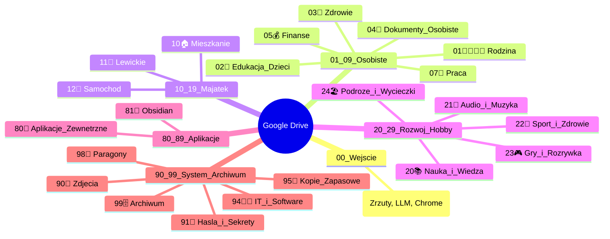

# Audyt i Projekt Architektury Informacji Google Drive

**Data:** 19 września 2026 r.
**Autor:** Antigravity (Ekspert Architektury Informacji)
**Metodologia:** Johnny Decimal, PARA Method, Deep Taxonomy Analysis

---

## 1. Audyt obecnej taksonomii (Luki, niespójności, anomalie)

Obecna struktura folderów opiera się na luźnej adaptacji systemu numeryczno-emotikonowego. Analiza wykazała następujące problemy:

### Niespójności w numeracji i nazewnictwie:
* **Brak ciągłości i luki numeryczne:** System zaczyna się poprawnie (01, 02, 03, 05, 06, 07, 08, 09, 10), ale pomija kluczowe bloki. Pomiędzy `10` a `15` jest przerwa (z wyjątkiem pustego `11. Obsydian`), a potem następuje skok do `20`, `25`, a następnie czarna dziura aż do `85`.
* **Niespójne formatowanie:** Niektóre foldery mają spację po numerze (`10 ☂️ Ubezpieczenie`), inne nie (`01👨‍👩‍👧‍👦 Rodzina`), a niektóre używają kropek (`11. Obsydian`).
* **Rozwarstwienie tematyczne:** 
    * Nieruchomości są rozbite na numery losowe: `06🏠Mieszkanie`, `15🏡Lewickie`, `16🏡Pokój`.
    * Audiobooki znajdują się w `20📚 ebooks + audobooks` oraz błędnie w `92🎵 Muzyka` (bajki dla dzieci).
* **Anomalia Ubezpieczeniowa:** Folder `10 ☂️ Ubezpieczenie` przechowuje głównie ubezpieczenia samochodów (np. VW Golf, Toyota Corolla), które powinny znajdować się w `09🚗Samochód` jako kontekstowy zasób pojazdu.

### Root drift i luźne pliki:
W katalogu głównym ("Mój dysk") zalega 49 plików, w tym skany dowodów osobistych (ryzyko bezpieczeństwa), pliki zrzucone bezpośrednio z telefonu (`IMG_...`), eksporty z chatów LLM (Gemini) oraz notatki tymczasowe. Wskazuje to na brak dedykowanej strefy wejściowej typu "Inbox".

---

## 2. Krytyczny problem megaprojektu historycznego: `25📄 Paweł - dokumenty`

Folder `25📄 Paweł - dokumenty` (7 586 plików, 8.2 GB, nieotwierany w większości od 2021 r., z ostatnim odczytem w 2025 r.) to klasyczny przykład "długu taksonomicznego". Zamiast zintegrować się z nową strukturą, funkcjonuje jako oddzielny, zacieniony system plików (tzw. _shadow file system_).

**Dublowanie kategorii:**
* `25.../00. Michaś`, `00. Nadia`, `01. Natalka` dublują katalog główny `01👨‍👩‍👧‍👦 Rodzina`.
* `25.../02. Finanse` dubluje `05💰Finanse`.
* `25.../05. Samochód` dubluje `09🚗Samochód`.
* `25.../06. Praca` dubluje `07🏢Praca`.

**Rozwiązanie:** Folder 25 należy całkowicie poddać procedurze *Decommissioning*. Zamiast trzymać zduplikowany układ, zawartość podkatalogów musi zostać rozebrana i przeniesiona jako podfoldery `Archiwum_Historyczne` do wewnątrz odpowiednich nowych kategorii, aby zintegrować wiedzę, a resztki (np. studia z 2009 r.) przesłać do docelowego głównego Archiwum.

---

## 3. Foldery aplikacji i zewnętrzne systemy zapisu

Foldery generowane przez aplikacje zaburzają numerację pierwszego poziomu. Należą do nich:
* `Notability` (replikuje kategorie wewnętrzne jak Allegro, Dzieci, Zdrowie).
* `Analiza_Matematyczna_WEiTI` (edukacyjny izolowany folder).
* `Gemini Gems` oraz wtyczki Chrome (`Zapisane z Chrome`, `Zapisane z Chrome (1)`).

**Rozwiązanie:** Wdrożenie zasady **"Izolacji i Inboxingu"**. Aplikacje wymuszające własne foldery powinny być przypisane do dedykowanej strefy Inbox lub Aplikacji (blok `80-89`), aby nie zaśmiecać głównego drzewa decyzyjnego. Zduplikowane instancje Chrome należy scalić.

---

## 4. Projekt nowej, zoptymalizowanej architektury folderów

Nowy układ bazuje na logice Johnny Decimal połączonej ze strukturą obszarów (Areas) z metodologii PARA. Wymusza spójne nazewnictwo: `[XX][Emotikon] [Nazwa]`.

---

## 5. Szczegółowy plan migracji (Mapowanie Stare ➡️ Nowe)

Migrację należy przeprowadzić etapami, aby zachować ciągłość pracy.

### Etap 1: Utworzenie i sanitacja Roota
1. **Utwórz folder `00📥 Inbox`**. Przenieś do niego luźne pliki z katalogu głównego (np. pliki Gemini, `IMG_...`, porzucone szkice).
2. **Utwórz `04📄 Dokumenty_Osobiste`**. Przenieś tam wrażliwe pliki z roota (np. dowody osobiste, paszporty, ubezpieczenia osobowe z `10 ☂️ Ubezpieczenie`). Zadbaj o restrykcyjne uprawnienia.

### Etap 2: Konsolidacja Majątku
| Folder Źródłowy | Operacja | Folder Docelowy (Nowy) |
| :--- | :--- | :--- |
| `06🏠Mieszkanie` + `16🏡Pokój` | Scalenie i ujednolicenie | `10🏠 Mieszkanie` |
| `15🏡Lewickie` | Zmiana nazwy i prefiksu | `11🏡 Lewickie` |
| `09🚗Samochód` + `10 ☂️ Ubezpieczenie` (część auto) | Połączenie zasobów | `12🚗 Samochód` |

### Etap 3: Rozwiązanie problemu `25📄 Paweł - dokumenty`
Należy rozpakować folder 25 i zmapować jego zawartość odpowiednio w podfolderach `/Archiwum` właściwych dziedzin roboczych.

| Zawartość Folderu 25 | Gdzie Przenieść |
| :--- | :--- |
| `00. Michaś`, `00. Nadia`, `01. Natalka` | `01👨‍👩‍👧‍👦 Rodzina/[Imię]/Archiwum_Historyczne` |
| `02. Finanse`, `03. NFZ` | `05💰 Finanse/Archiwum`, `03🏥 Zdrowie/Archiwum` |
| `05. Samochód`, `06. Praca` | `12🚗 Samochód/Archiwum`, `07🏢 Praca/Archiwum` |
| `04. CV`, `50. Zdrowie` | `07🏢 Praca/CV`, `03🏥 Zdrowie/Historia_Medyczna` |
| `05. DWH`, `96. Studia` | `99🗄️ Archiwum/DWH`, `20📚 Nauka_i_Wiedza/Studia` |
| **Sam pusty folder 25📄** | **USUNĄĆ całkowicie** |

### Etap 4: Porządkowanie Aplikacji i Rozwoju
| Folder Źródłowy | Operacja | Folder Docelowy (Nowy) |
| :--- | :--- | :--- |
| `Analiza_Matematyczna_WEiTI` + `20📚 ebooks...` | Scalenie edukacji | `20📚 Nauka_i_Wiedza` |
| `92🎵 Muzyka` (bajki!) | Separacja bajek dziecięcych | `21🎵 Audio_i_Muzyka` (oraz przenieść audiobooki dzieci do `01👨‍👩‍👧‍👦 Rodzina`) |
| `85🏃 Bieganie` | Rozszerzenie kategorii | `22🏃 Sport_i_Zdrowie` |
| `93🎮Gry` | Aktualizacja nazwy | `23🎮 Gry_i_Rozrywka` |
| `08🏖️Wakacje` | Zmiana klastra | `24🏖️ Podroze_i_Wycieczki` |
| `Notability`, `Chrome`, `Gemini Gems` | Izolacja do jednego huba | `80📱 Aplikacje_Zewnetrzne` (utworzyć podfoldery wewnątrz) |
| `11. Obsydian` | Poprawa literówki i numeracji | `81📝 Obsidian` |

### Etap 5: Segment 90+ (Infrastruktura i Archiwum)
* `88📸Zdjęcia` ➡️ `90📸 Zdjecia` (wymuszamy równy numer systemowy).
* `91🔑Hasła` ➡️ `91🔑 Hasla_i_Sekrety`.
* `95💽Kopia zapasowa` ➡️ `95💽 Kopie_Zapasowe` (wewnątrz skompresować wielkie, nieużywane kopie, np. backupy telefonów z 2013-2018).
* `98🧾Paragony` ➡️ Pozostaje pod aktualnym numerem dla szybkości skanowania z telefonu, ewentualnie dodawane jako podkatalog do Finansów (do decyzji właściciela).
* `96🗄️Archiwum` ➡️ `99🗄️ Archiwum`. 

Dzięki takiemu rozkładowi, obszary (Areas) życia osobistego, majątku i hobby są wyraźnie odseparowane od technicznego tła aplikacji i archiwów, a zduplikowany megaprojekt "25" przestaje zaburzać logikę systemu.
