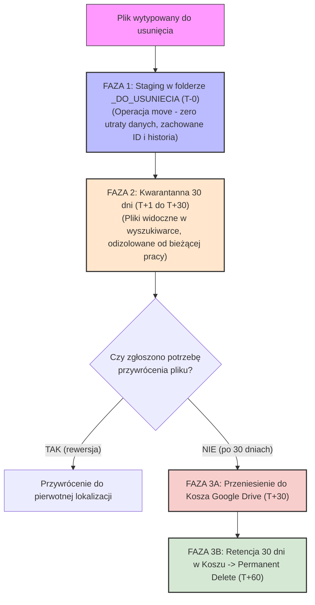
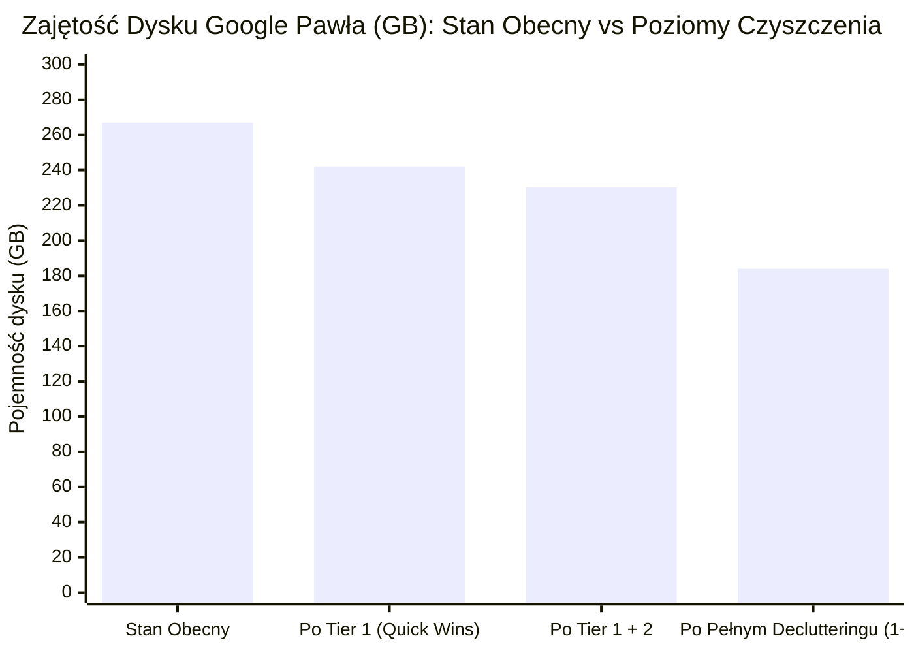

# Plan Czyszczenia i Selekcja Plików do Usunięcia – Dysk Google Pawła
**Data audytu**: 19 września 2026  
**Rola audytora**: Starszy Ekspert ds. Cyfrowego Declutteringu i Audytu Danych  
**Baza telemetryczna**: `drive_dataset_complete.json` (77 498 plików, 8 185 folderów, 267.0 GB)  
**Status**: Dokument Operacyjny / Plan Wykonawczy  

---

## Executive Summary & Diagnoza Operacyjna

Audyt telemetrii Dysku Google Pawła ujawnił klasyczny syndrom **"cyfrowego magazynu wysokiego składowania"**:
1. **Zimne złogi danych**: Aż **85.1% zasobów** (ponad 65 900 plików) nie było otwieranych od ponad 3 lat lub nigdy od momentu synchronizacji. Bieżący aktywny obieg roboczy (ostatnie 30 dni) to zaledwie **0.1% plików** (105 pozycji).
2. **Krytyczny "Root Drift" w katalogu głównym**: 49 plików leży luzem w `Mój dysk`. Wśród nich znajdują się krytyczne pliki tożsamościowe podlegające RODO (dowody osobiste Pawła i mamy), porzucone szkice bez tytułu, zrzuty z telefonu oraz niekontrolowane artefakty generatywnej AI.
3. **Masywna redundancja folderowa i wersyjna**:
   - Wykryto **100% tożsame duplikaty całych wielogigabajtowych folderów** w `88📸Zdjęcia`: `2015 (1)` (5.94 GB) oraz `2017 (1)` (11.21 GB), a także zdublowany folder ślubny `Fotograf / Kopia` (1.54 GB).
   - Wykryto potrójną redundancję archiwów systemowych: folder `Paweł - dokumenty` z laptopa ASUS został zarchiwizowany dwukrotnie w `95💽Kopia zapasowa` (kopia z 2019 r. – 8.64 GB oraz z 2021 r. – 8.38 GB), podczas gdy jego pierwotna wersja leży nadal w `25📄 Paweł - dokumenty` (8.2 GB). Plik `studia.zip` (2.45 GB) występuje w trzech identycznych kopiach (7.35 GB).
4. **Złogi porzuconych plików binarnych i tymczasowych**: Folder `88📸Zdjęcia / 0001 - Temp` zawiera **46.2 GB** (3 883 pliki) zapomnianych zrzutów z aparatów i telefonów z lat 2016–2017, w tym dziesiątki ciężkich klipów wideo (100–850 MB), których nikt nie odtworzył od blisko dekady.
5. **Potencjał odzysku przestrzeni dyskowej**:
   - **Tier 1 (Zero-Risk Quick Wins)**: **24.89 GB** i **3 419 plików** (100% tożsame kopie, śmieci bez tytułu, prompt exporty).
   - **Tier 2 (Low-Risk Binaries & Redundant Backups)**: **11.88 GB** i **6 876 plików** (stare instalatory `.exe`/`.dmg`, zdublowany backup ASUS).
   - **Tier 3 (Selective Media Optimization)**: **46.20 GB** i **3 883 pliki** (oczyszczenie folderu `0001 - Temp`).
   - **ŁĄCZNY POTENCJAŁ ODZYSKU**: **82.97 GB** (ponad **31%** pojemności dysku) oraz **14 178 plików** (ponad **18%** całego wolumenu plików).

---

## 1. Triage 49 Plików Leżących Luzem w Root (Mój dysk)

Katalog główny (`Mój dysk`) powinien być sterylnym węzłem nawigacyjnym, zawierającym wyłącznie ponumerowane foldery tematyczne. Obecność 49 plików luzem jest objawem braku reguł automatycznego routingu oraz przypadkowego zapisywania danych przez aplikacje zewnętrzne i przeglądarkę.

Poniższa tabela stanowi jednoznaczną, rygorystyczną decyzję triage'u dla każdego z 49 plików.

### Tabela Triage'u Plików Root

| Lp. | Dokładna nazwa pliku | Rozmiar | Typ / MIME | Ostatnio otwarty | Decyzja Triage | Ścieżka docelowa / Nowa nazwa | Uzasadnienie i Rygor Bezpieczeństwa |
| :---: | :--- | :---: | :--- | :---: | :---: | :--- | :--- |
| **1** | `0d5a2mpppx6h1lwz06r0m4okatv9.pdf` | 6.0 MB | PDF | 2025-11-12 | `[ZMIEŃ NAZWĘ + PRZENIEŚ]` | `07🏢Praca / Szkolenia / Web Summit 2025 - Sales Pitch Deck [ENG].pdf` | Metadane PDF wskazują tytuł *"Sales Pitch Deck Web Summit 2025"* (Canva). Nazwa pliku to losowy hash po eksporcie. Wartościowy materiał szkoleniowo-prezentacyjny. |
| **2** | `Analiza zużycia energii i fotowoltaiki.gdoc` | 3.7 KB | GDOC | 2026-04-05 | `[PRZENIEŚ DO FOLDERU X]` | `06🏠Mieszkanie / 05. Pod Strzechą 7 /` *(lub `16🏡Pokój / Energia Elektryczna`)* | Aktywny dokument analityczny dotyczący kosztów energii i PV. |
| **3** | `Analiza_Matematyczna_WEiTI_PW_Podrecznik.gdoc` | 123.8 KB | GDOC | 2026-09-11 | `[PRZENIEŚ DO FOLDERU X]` | `20📚 ebooks + audobooks / 03. Math /` | Podręcznik do analizy matematycznej PW WEiTI. Powinien trafić do biblioteki matematycznej wraz ze scaleniem luźnego folderu `Analiza_Matematyczna_WEiTI`. |
| **4** | `Apteki ALK 30.05.23.xlsx` | 27.2 KB | XLSX | 2025-05-11 | `[PRZENIEŚ DO FOLDERU X]` | `03🏥Zdrowie / _Archiwum /` | Wykaz aptek realizujących szczepionki odczulające (ALK-Abelló). Wartość referencyjno-historyczna. |
| **5** | `Arkusz kalkulacyjny bez tytułu.gsheet` | 42.1 KB | GSHEET | 2026-06-22 | `[KOSZ / USUŃ]` | `_DO_USUNIECIA / 02_Artefakty_AI_i_Bez_Tytulu /` | Porzucony, nienazwany arkusz kalkulacyjny z czerwca 2026 r. Trafia do stagingu kwarantanny. |
| **6** | `Bilet - WH64222365.pdf` | 94.9 KB | PDF | 2026-08-25 | `[ZMIEŃ NAZWĘ + PRZENIEŚ]` | `08🏖️Wakacje / 2026 / 2026-08 - Bilet kolejowy WH64222365.pdf` | Bilet kolejowy z wyjazdu w Tatry Wysokie w sierpniu 2026 r. Zmiana nazwy według standardu chronologicznego. |
| **7** | `Czy możesz załączyć podsumowanie o które prosiłem?.gdoc` | 4.9 KB | GDOC | 2026-05-24 | `[KOSZ / USUŃ]` | `_DO_USUNIECIA / 02_Artefakty_AI_i_Bez_Tytulu /` | Jednorazowy artefakt z eksportu czatu Gemini do Google Docs. Śmieć konwersacyjny. |
| **8** | `Dokument bez tytułu (1).gdoc` | 358.7 KB | GDOC | 2026-07-26 | `[KOSZ / USUŃ]` | `_DO_USUNIECIA / 04_Do_Weryfikacji_Pawla /` | Nienazwany dokument z lipca 2026 r. Ze względu na nietypowy rozmiar (358 KB) trafia do bufora weryfikacyjnego przed usunięciem. |
| **9** | `Dokument bez tytułu (2).gdoc` | 5.2 KB | GDOC | 2026-09-04 | `[KOSZ / USUŃ]` | `_DO_USUNIECIA / 02_Artefakty_AI_i_Bez_Tytulu /` | Porzucony robocizk z 4 września 2026 r., utworzony w trakcie sesji z asystentem AI. |
| **10** | `Dokument bez tytułu.gdoc` | 1.7 KB | GDOC | 2026-06-05 | `[KOSZ / USUŃ]` | `_DO_USUNIECIA / 02_Artefakty_AI_i_Bez_Tytulu /` | Pusty/szczątkowy dokument z 5 czerwca 2026 r. |
| **11** | `Dowód osobisty - Paweł Trzeciakowski.pdf` | 837.3 KB | PDF | 2025-12-07 | `[PRZENIEŚ DO FOLDERU X]` | `01👨‍👩‍👧‍👦 Rodzina / 00 ‼️ Ważne dokumenty /` | **KRYTYCZNE RYZYKO RODO**: Skan tożsamości leżący w otwartym katalogu głównym. Wymaga natychmiastowego zabezpieczenia w folderze dokumentów tożsamości. |
| **12** | `Dowód osobisty - mama.pdf` | 798.6 KB | PDF | 2026-01-14 | `[PRZENIEŚ DO FOLDERU X]` | `01👨‍👩‍👧‍👦 Rodzina / 00 ‼️ Ważne dokumenty /` | **KRYTYCZNE RYZYKO RODO**: Skan tożsamości mamy. Wymaga izolacji i ochrony uprawnień. |
| **13** | `Dziennik.gdoc` | 8.7 MB | GDOC | 2026-08-10 | `[PRZENIEŚ DO FOLDERU X]` | `01👨‍👩‍👧‍👦 Rodzina / 00 ‼️ Ważne dokumenty /` *(lub `25📄 Paweł - dokumenty / 00. Osobiste`)* | Obszerny (8.7 MB) osobisty dziennik prowadzony przez Pawła. Bardzo ważny zasób prywatny. |
| **14** | `IMG_2312.jpeg` | 4.4 MB | JPEG | 2026-04-14 | `[PRZENIEŚ DO FOLDERU X]` | `88📸Zdjęcia / 2026 / 2026.04 /` | Seria 12 zdjęć z iPhone'a zrzuconych bez folderu 14.04.2026 r. |
| **15** | `IMG_2313.jpeg` | 5.2 MB | JPEG | 2026-04-14 | `[PRZENIEŚ DO FOLDERU X]` | `88📸Zdjęcia / 2026 / 2026.04 /` | Seria zrzutu foto z 14.04.2026 r. |
| **16** | `IMG_2314.jpeg` | 2.9 MB | JPEG | 2026-04-14 | `[PRZENIEŚ DO FOLDERU X]` | `88📸Zdjęcia / 2026 / 2026.04 /` | Seria zrzutu foto z 14.04.2026 r. |
| **17** | `IMG_2315.jpeg` | 5.8 MB | JPEG | 2026-04-14 | `[PRZENIEŚ DO FOLDERU X]` | `88📸Zdjęcia / 2026 / 2026.04 /` | Seria zrzutu foto z 14.04.2026 r. |
| **18** | `IMG_2316.jpeg` | 5.0 MB | JPEG | 2026-04-14 | `[PRZENIEŚ DO FOLDERU X]` | `88📸Zdjęcia / 2026 / 2026.04 /` | Seria zrzutu foto z 14.04.2026 r. |
| **19** | `IMG_2317.jpeg` | 5.1 MB | JPEG | 2026-04-14 | `[PRZENIEŚ DO FOLDERU X]` | `88📸Zdjęcia / 2026 / 2026.04 /` | Seria zrzutu foto z 14.04.2026 r. |
| **20** | `IMG_2318.jpeg` | 5.8 MB | JPEG | 2026-04-14 | `[PRZENIEŚ DO FOLDERU X]` | `88📸Zdjęcia / 2026 / 2026.04 /` | Seria zrzutu foto z 14.04.2026 r. |
| **21** | `IMG_2319.jpeg` | 4.9 MB | JPEG | 2026-04-14 | `[PRZENIEŚ DO FOLDERU X]` | `88📸Zdjęcia / 2026 / 2026.04 /` | Seria zrzutu foto z 14.04.2026 r. |
| **22** | `IMG_2320.jpeg` | 4.9 MB | JPEG | 2026-04-14 | `[PRZENIEŚ DO FOLDERU X]` | `88📸Zdjęcia / 2026 / 2026.04 /` | Seria zrzutu foto z 14.04.2026 r. |
| **23** | `IMG_2321.jpeg` | 4.2 MB | JPEG | 2026-04-14 | `[PRZENIEŚ DO FOLDERU X]` | `88📸Zdjęcia / 2026 / 2026.04 /` | Seria zrzutu foto z 14.04.2026 r. |
| **24** | `IMG_2322.jpeg` | 3.5 MB | JPEG | 2026-04-14 | `[PRZENIEŚ DO FOLDERU X]` | `88📸Zdjęcia / 2026 / 2026.04 /` | Seria zrzutu foto z 14.04.2026 r. |
| **25** | `IMG_2323.jpeg` | 5.2 MB | JPEG | 2026-05-24 | `[PRZENIEŚ DO FOLDERU X]` | `88📸Zdjęcia / 2026 / 2026.04 /` | Seria zrzutu foto z 14.04.2026 r. (ostatnie z serii). |
| **26** | `Karta kwalifikacyjna ZIELONEJ SZKOŁY CAMP DRAWA.gdoc` | 13.9 KB | GDOC | 2026-05-28 | `[PRZENIEŚ DO FOLDERU X]` | `02🏫Szkoła / Nadia /` *(lub `Michał`)* | Szkolny dokument wyjazdowy dziecka na Zieloną Szkołę (maj 2026 r.). |
| **27** | `LinkedIn Post - Snowflake Summit '26 Closing Draft.gdoc` | 2.7 KB | GDOC | 2026-06-05 | `[PRZENIEŚ DO FOLDERU X]` | `07🏢Praca / 2026 - HSBC /` *(lub `07🏢Praca / Publikacje`)* | Profesjonalny szkic posta po konferencji Snowflake Summit '26. |
| **28** | `OWU Warta Travel - C0517.pdf` | 379.7 KB | PDF | 2026-05-22 | `[PRZENIEŚ DO FOLDERU X]` | `10 ☂️ Ubezpieczenie /` *(lub `08🏖️Wakacje / 2026`)* | Ogólne Warunki Ubezpieczenia turystycznego z wyjazdu rodzinnego. |
| **29** | `Pierścionek Rocznicowy Casa Batlló.gdoc` | 497.1 KB | GDOC | 2026-05-26 | `[PRZENIEŚ DO FOLDERU X]` | `01👨‍👩‍👧‍👦 Rodzina / 01 🤹‍♀️ Natalka /` | Notatka/inspiracja prezentowa na rocznicę dla żony (motyw Barcelona Casa Batlló). |
| **30** | `Plan Projektu: Warstwa Semantyczna Snowflake dla FinTech & eCommerce.gdoc` | 11.8 KB | GDOC | 2026-06-04 | `[PRZENIEŚ DO FOLDERU X]` | `07🏢Praca / 2026 - HSBC /` | Plan architektoniczny warstwy semantycznej w Snowflake. Kluczowy zasób wiedzy inżynierskiej. |
| **31** | `Plan wycieczki - Tatry Wysokie (Słowacja) V2.gdoc` | 5.3 KB | GDOC | 2026-08-12 | `[PRZENIEŚ DO FOLDERU X]` | `08🏖️Wakacje / 2026 /` | Aktualny plan sierpniowego wyjazdu w Tatry (wersja finalna V2). |
| **32** | `Plan wycieczki - Tatry Wysokie (Słowacja).gdoc` | 4.0 KB | GDOC | 2026-08-03 | `[KOSZ / USUŃ]` | `_DO_USUNIECIA / 01_Duplikaty_i_Wersje /` | Wersja robocza V1, całkowicie zastąpiona przez wersję V2. |
| **33** | `Pomysły na mieszkanie.gdoc` | 3.3 KB | GDOC | 2026-08-07 | `[PRZENIEŚ DO FOLDERU X]` | `06🏠Mieszkanie / 05. Pod Strzechą 7 /` | Notatka koncepcyjna dotycząca aranżacji i wyposażenia mieszkania. |
| **34** | `Serio? Nie możesz wyciągnąć całej tej konwersacji ....gdoc` | 5.1 KB | GDOC | 2026-06-04 | `[KOSZ / USUŃ]` | `_DO_USUNIECIA / 02_Artefakty_AI_i_Bez_Tytulu /` | Śmieć po eksporcie czatu z asystentem LLM. Tytuł jest dosłownym promptem użytkownika. |
| **35** | `Strategia i Architektura Nowoczesnej Warstwy Semantycznej w Snowflake.gdoc` | 7.8 KB | GDOC | 2026-06-25 | `[PRZENIEŚ DO FOLDERU X]` | `07🏢Praca / 2026 - HSBC /` | Dokument strategiczny architektury Snowflake. Bardzo wysoka wartość merytoryczna. |
| **36** | `Super, dodaj jeszcze do dokumentu kartę z całą tą ....gdoc` | 3.6 KB | GDOC | 2026-06-04 | `[KOSZ / USUŃ]` | `_DO_USUNIECIA / 02_Artefakty_AI_i_Bez_Tytulu /` | Śmieć po kliknięciu "Eksportuj do Dokumentów" w interfejsie Gemini. |
| **37** | `Ubezpieczenie - Toyota Corolla.gprj` | 0.0 B | GPRJ | 2026-09-11 | `[PRZENIEŚ DO FOLDERU X]` | `10 ☂️ Ubezpieczenie / 02 Toyota Corolla - ubezpieczenie /` | Pusty skrót/projekt Google Workspace dotyczący polisy Toyoty. |
| **38** | `Ubezpieczenie - Vw Golf.gprj` | 0.0 B | GPRJ | 2026-07-24 | `[PRZENIEŚ DO FOLDERU X]` | `10 ☂️ Ubezpieczenie / VW Golf - Opole /` | Skrót/projekt polisy VW Golf. |
| **39** | `Wzrost Nadii i Michała.gsheet` | 3.0 KB | GSHEET | 2026-09-11 | `[PRZENIEŚ DO FOLDERU X]` | `01👨‍👩‍👧‍👦 Rodzina / 02 🚸 Dzieci /` | Długofalowa tabela pomiaru wzrostu dzieci. Ważny plik rodzinny. |
| **40** | `Zróżnicowanie Przyrodnicze Rosji - klasa 6C.gslides` | 1.3 MB | GSLIDES | 2026-06-14 | `[PRZENIEŚ DO FOLDERU X]` | `02🏫Szkoła / Nadia /` | Szkolna prezentacja z geografii dla 6 klasy przygotowana dla Nadii. |
| **41** | `dobrze, biorąc pod uwagę te kryteria przygotuj mi....gsheet` | 2.0 KB | GSHEET | 2026-07-19 | `[KOSZ / USUŃ]` | `_DO_USUNIECIA / 02_Artefakty_AI_i_Bez_Tytulu /` | Artefakt z Gemini wyeksportowany do Arkuszy Google z promptu. |
| **42** | `home_budget_categorized_2026-06-21 (1).csv` | 61.2 KB | CSV | 2026-06-21 | `[KOSZ / USUŃ]` | `_DO_USUNIECIA / 01_Duplikaty_i_Wersje /` | Niekompletny duplikat eksportu budżetu (115 wierszy vs 221 wierszy w pliku oryginalnym). |
| **43** | `home_budget_categorized_2026-06-21.csv` | 83.4 KB | CSV | 2026-06-21 | `[PRZENIEŚ DO FOLDERU X]` | `05💰Finanse / 01. Budżet /` | Kompletny eksport skategoryzowanego budżetu domowego (221 wierszy). |
| **44** | `jeszcze raz poproszę o te wykresy, ale pokaż sumę....gdoc` | 132.7 KB | GDOC | 2026-04-05 | `[KOSZ / USUŃ]` | `_DO_USUNIECIA / 02_Artefakty_AI_i_Bez_Tytulu /` | Obszerny eksport z czatu AI zawierający wykresy fotowoltaiczne/energetyczne. Wiedza została skonsolidowana w pliku nr 2. |
| **45** | `wprowadzenie-do-calek.docx` | 15.4 KB | DOCX | 2026-09-11 | `[PRZENIEŚ DO FOLDERU X]` | `20📚 ebooks + audobooks / 03. Math /` | Materiał dydaktyczny do całek (format Word). |
| **46** | `wprowadzenie-do-calek.gdoc` | 9.0 KB | GDOC | 2026-09-11 | `[PRZENIEŚ DO FOLDERU X]` | `20📚 ebooks + audobooks / 03. Math /` | Materiał dydaktyczny do całek (format Google Docs). |
| **47** | `wygeneruj mi podsumowanie tej rozmowy z osateczny... (1).gdoc` | 4.7 KB | GDOC | 2026-09-04 | `[KOSZ / USUŃ]` | `_DO_USUNIECIA / 02_Artefakty_AI_i_Bez_Tytulu /` | Zdublowany eksport czatu AI (powstały przez dwukrotne kliknięcie przycisku eksportu w Gemini). |
| **48** | `wygeneruj mi podsumowanie tej rozmowy z osateczny....gdoc` | 1.6 KB | GDOC | 2026-09-04 | `[KOSZ / USUŃ]` | `_DO_USUNIECIA / 02_Artefakty_AI_i_Bez_Tytulu /` | Pierwotny artefakt eksportu podsumowania rozmowy z asystentem AI. |
| **49** | `zrób z tego tabelę - w kolumnach fazy życia, a w....gdoc` | 4.6 KB | GDOC | 2026-09-11 | `[KOSZ / USUŃ]` | `_DO_USUNIECIA / 02_Artefakty_AI_i_Bez_Tytulu /` | Kolejny nienazwany fragment wygenerowany przez LLM i porzucony w root. |

### Podsumowanie Triage'u Katalogu Głównego (Root)

```
Całkowita liczba plików w Root: 49
├── [KOSZ / USUŃ]                : 14 plików (28.6%) -> trafiają do stagingu _DO_USUNIECIA
├── [PRZENIEŚ DO FOLDERU X]     : 33 pliki  (67.3%) -> trafiają do właściwych folderów tematycznych
└── [ZMIEŃ NAZWĘ + PRZENIEŚ]    :  2 pliki  ( 4.1%) -> bilet Tatry oraz pitch deck Web Summit
```
**Efekt docelowy**: Po wykonaniu triage'u liczba luźnych plików w katalogu głównym spada z **49 do 0**.

---

## 2. Identyfikacja i Eliminacja Artefaktów LLM / AI Prompt Exports

### Mechanizm Powstawania Artefaktów AI
W ekosystemie Google Workspace i interfejsie Google Gemini (gemini.google.com) istnieje funkcja:
> **"Eksportuj do Dokumentów"** / **"Eksportuj do Arkuszy"**

Gdy użytkownik w trakcie rozmowy z modelem LLM kliknie ten przycisk:
1. Google API w tle tworzy nowy dokument/arkusz bez pytania o lokalizację, umieszczając go **zawsze bezpośrednio w katalogu głównym (`Mój dysk`)**.
2. Jako tytuł pliku system automatycznie pobiera **początek ostatniego promptu użytkownika**, np. *"Czy możesz załączyć..."*, *"Serio? Nie możesz..."*, *"Super, dodaj jeszcze..."*.
3. Jeśli użytkownik kliknie przycisk eksportu dwukrotnie (np. z powodu opóźnienia sieci), Google tworzy kolejny plik z sufiksem `(1)`, np. `wygeneruj mi podsumowanie tej rozmowy z osateczny... (1).gdoc`.
4. Użytkownik po skopiowaniu treści lub wysłaniu linku natychmiast zapomina o wygenerowanym pliku, przez co pliki te stają się tzw. **cyfrowym osadem AI**.

### Zidentyfikowane Pliki Artefaktów LLM na Dysku Pawła

| Dokładna nazwa pliku | Rozmiar | Data utworzenia / modyfikacji | Diagnoza promptu użytkownika | Rekomendowane działanie |
| :--- | :---: | :---: | :--- | :---: |
| `jeszcze raz poproszę o te wykresy, ale pokaż sumę....gdoc` | 132.7 KB | 2026-04-05 21:47 | Prompt do generowania wykresów zużycia energii i PV (wykresy osadzone w dokumencie). | `[KOSZ / USUŃ]` |
| `Czy możesz załączyć podsumowanie o które prosiłem?.gdoc` | 4.9 KB | 2026-04-12 17:56 | Zapytanie o reasumpcję wątku konwersacji. | `[KOSZ / USUŃ]` |
| `Super, dodaj jeszcze do dokumentu kartę z całą tą ....gdoc` | 3.6 KB | 2026-06-04 19:37 | Polecenie uzupełnienia wygenerowanej wcześniej specyfikacji. | `[KOSZ / USUŃ]` |
| `Serio? Nie możesz wyciągnąć całej tej konwersacji ....gdoc` | 5.1 KB | 2026-06-04 19:40 | Frustracja użytkownika ograniczeniami okna kontekstowego modelu LLM. | `[KOSZ / USUŃ]` |
| `dobrze, biorąc pod uwagę te kryteria przygotuj mi....gsheet` | 2.0 KB | 2026-07-19 11:13 | Eksport tabelaryczny do Arkuszy Google na bazie kryteriów analitycznych. | `[KOSZ / USUŃ]` |
| `wygeneruj mi podsumowanie tej rozmowy z osateczny....gdoc` | 1.6 KB | 2026-09-04 21:15 | Podsumowanie sesji roboczej z asystentem. | `[KOSZ / USUŃ]` |
| `wygeneruj mi podsumowanie tej rozmowy z osateczny... (1).gdoc` | 4.7 KB | 2026-09-04 21:15 | Zdublowany klik eksportu (zawiera pełniejszą wersję powyższego). | `[KOSZ / USUŃ]` |
| `zrób z tego tabelę - w kolumnach fazy życia, a w....gdoc` | 4.6 KB | 2026-05-22 22:30 | Polecenie formatowania etapów cyklu życia projektu/klienta w tabelę. | `[KOSZ / USUŃ]` |

### Procedura Higieny AI na Przyszłość
1. **Dedykowany bufor AI**: Wykorzystanie istniejącego folderu `Gemini Gems` lub utworzenie reguły automatycznego przenoszenia nowych plików z promptami do `96🗄️Archiwum / 00_Scratchpad_AI`.
2. **Nawyk "Kopiuj do schowka"**: Zamiast eksportu całego dokumentu do Google Drive, zaleca się stosowanie przycisku "Kopiuj" i wklejanie bezpośrednio do właściwego dokumentu roboczego.
3. **Automatyczny filtr cykliczny**: Skrypt sprawdzający co 14 dni katalog główny pod kątem słów kluczowych (`"wygeneruj"`, `"czy możesz"`, `"podsumuj"`) i przenoszący je do stagingu.

---

## 3. Selekcja Porzuconych Plików Bez Tytułu i Zduplikowanych Wersji

### 3.1. Pliki "Bez tytułu" (Untitled Docs) na Całym Dysku
W całej przestrzeni Dysku Google zidentyfikowano **9 plików bez tytułu**. Powstają one, gdy użytkownik tworzy nowy dokument z poziomu przeglądarki (`docs.new` / `sheets.new`), wprowadza kilka słów lub wkleja tekst, po czym zamyka kartę bez nadania nazwy.

| Pełna ścieżka do pliku | Rozmiar | Ostatnio otwarty | Ostatnio modyfikowany | Status i Decyzja |
| :--- | :---: | :---: | :---: | :---: |
| `Mój dysk / Dokument bez tytułu (1).gdoc` | 358.7 KB | 2026-07-26 | 2026-07-26 | `KOSZ` *(przez weryfikację 30-dniową)* |
| `Mój dysk / Arkusz kalkulacyjny bez tytułu.gsheet` | 42.1 KB | 2026-06-22 | 2026-06-21 | `KOSZ` |
| `Mój dysk / Dokument bez tytułu (2).gdoc` | 5.2 KB | 2026-09-04 | 2026-09-04 | `KOSZ` |
| `Mój dysk / Dokument bez tytułu.gdoc` | 1.7 KB | 2026-06-05 | 2026-06-05 | `KOSZ` |
| `Mój dysk / 96🗄️Archiwum / Dokument bez tytułu.gdoc` | 17.1 KB | 2021-09-12 | 2021-09-12 | `KOSZ` *(martwy plik od 5 lat)* |
| `Mój dysk / 06🏠Mieszkanie / 05. Pod Strzechą 7 / 2016 - kupno mieszkania / 00. Akt notarialny / Dokument bez tytułu.gdoc` | 3.5 KB | 2023-11-29 | 2023-11-29 | `KOSZ` *(szkic notatki notarialnej)* |
| `Mój dysk / 01👨‍👩‍👧‍👦 Rodzina / 04 Michał / 05 Tenis / Dokument bez tytułu.gdoc` | 2.8 KB | 2026-07-23 | 2026-07-23 | `KOSZ` *(porzucona notatka z treningu)* |
| `Mój dysk / 02🏫Szkoła / Michał / 04 matma / Dokument bez tytułu.gdoc` | 2.1 KB | 2025-12-15 | 2025-12-15 | `KOSZ` *(stary szkic zadania domowego)* |
| `Mój dysk / 06🏠Mieszkanie / 05. Pod Strzechą 7 / 2017 - Remont / _projekt / Ikea models / Untitled.zip` | 80.7 KB | 2022-08-15 | 2022-08-15 | `KOSZ` *(porzucone archiwum modeli mebli)* |

---

### 3.2. Megaduplikaty Folderowe (Potwierdzona Sumami 100% Identyczność)

Analiza struktury drzewa SQLite wykazała obecność całych zduplikowanych drzew katalogów. Wykonano weryfikację skrośną ścieżek relatywnych oraz rozmiarów bajtowych każdego pliku wewnątrz par folderów.

```
88📸Zdjęcia/
├── 2015/        (669 plików,  5.94 GB)  <--- WERSJA GŁÓWNA (ZACHOWAĆ)
├── 2015 (1)/    (669 plików,  5.94 GB)  <--- 100% DUBEL (DO USUNIĘCIA)
├── 2017/        (1984 pliki, 11.21 GB)  <--- WERSJA GŁÓWNA (ZACHOWAĆ)
└── 2017 (1)/    (1984 pliki, 11.21 GB)  <--- 100% DUBEL (DO USUNIĘCIA)
```

| Ścieżka duplikatu do usunięcia | Ścieżka oryginału (zachowywana) | Liczba plików | Rozmiar bajtowy | Zgodność plików | Decyzja |
| :--- | :--- | :---: | :---: | :---: | :---: |
| `Mój dysk / 88📸Zdjęcia / 2017 (1)` | `Mój dysk / 88📸Zdjęcia / 2017` | **1 984** | **11.21 GB** | **1 984 / 1 984 (100%)** | `[BEZWZGLĘDNIE USUNĄĆ]` |
| `Mój dysk / 88📸Zdjęcia / 2015 (1)` | `Mój dysk / 88📸Zdjęcia / 2015` | **669** | **5.94 GB** | **669 / 669 (100%)** | `[BEZWZGLĘDNIE USUNĄĆ]` |
| `Mój dysk / 88📸Zdjęcia / 2012 / 2012.09.01-02 - Ślub i Wesele / Fotograf / Kopia` | `Mój dysk / 88📸Zdjęcia / 2012 / ... / Fotograf` | **581** | **1.54 GB** | **581 / 581 (100%)** | `[BEZWZGLĘDNIE USUNĄĆ]` |
| `Mój dysk / 88📸Zdjęcia / 2013-2014 - Nadia / 2014 - Kalendarz Nadii / Zdjęcia / Galaxy S3 (1)` | `Mój dysk / 88📸Zdjęcia / 2013-2014 - Nadia / ... / Galaxy S3` | **120** | **206.8 MB** | Zdublowany zrzut zdjęć | `[BEZWZGLĘDNIE USUNĄĆ]` |
| `Mój dysk / 88📸Zdjęcia / 2011 / 2011.12 - Boże Narodzenie / Taty aparat (1)` | `Mój dysk / 88📸Zdjęcia / 2011 / ... / Taty aparat` | **29** | **83.1 MB** | Zdublowany import z karty | `[BEZWZGLĘDNIE USUNĄĆ]` |
| `Mój dysk / Zapisane z Chrome (1)` | `Mój dysk / Zapisane z Chrome` | **15** | **10.7 MB** | Zdublowany folder rozszerzenia | `[SCALIĆ I USUNĄĆ DUBEL]` |
| `Mój dysk / Notability / Welcome (2)` | `Mój dysk / Notability / Welcome` | **2** | **0.1 MB** | Powtórny szablon powitalny | `[BEZWZGLĘDNIE USUNĄĆ]` |
| `Mój dysk / 95💽Kopia zapasowa / 20190810 - ASUS / SVN / 02. SimplexTSQL / SimplexTSQL (1)` | `... / 02. SimplexTSQL / SimplexTSQL` | **14** | **0.06 MB** | Zdwojony folder repozytorium | `[BEZWZGLĘDNIE USUNĄĆ]` |
| **SUMA MEGADUPLIKATÓW FOLDEROWYCH** | | **3 414** | **18.99 GB** | | **Odzysk: ~19 GB** |

---

### 3.3. Indywidualne Pliki Duplikatowe z Sufiksami `(1)`, `_kopia`, `Kopia ...`

W wykazie `duplicate_versions` wykryto szereg pojedynczych plików, powstałych wskutek automatycznego kopiowania w Google Drive lub pobierania załączników:

1. **Dokumenty i Arkusze**:
   - `CV - Paweł Trzeciakowski (1).gdoc` (18.4 KB, w `25📄 Paweł - dokumenty / 04. CV`) – nieaktualna kopia robocza CV.
   - `Kopia KLASA_4_PREZENTACJA.pptx` (2.7 MB, w root / school) – kopia prezentacji szkolnej.
   - `Kopia ZIR-1...` oraz `Kopia ZIR-2...` (xls/gsheet, łącznie ~270 KB, w `15🏡Lewickie / 01. Podział działki`) – kopie deklaracji podatkowych z gminy.
   - `Kopia Remont - wymagania v2.docx.gdoc` (0 B, w `06🏠Mieszkanie / ... / 2017 - Remont`) – pusty wskaźnik do usunięcia.
   - `Kopia dokumentu Gruzja 2023 - rozliczenie – 3 października o 06:33.gsheet` (4.8 KB, w `08🏖️Wakacje / 2023`) – kopia rozliczenia wakacji.
   - `Kopia 2013.03 - Umowa kupna - sprzedaży.gdoc` (254 B, w `25📄 Paweł - dokumenty / 05. Samochód / Ford Focus`) – zbędna kopia archiwalna.
   - `ankieta poprawiona (1).gdoc` (8.1 KB, w `25📄 Paweł - dokumenty / 01. Natalka / 02. Studia SGH`) – duplikat ankiety magisterskiej.
2. **Szkolne materiały z sufiksem `_kopia`** (w `02🏫Szkoła / Michał / 2024-25 - Klasa 3a / I Komunia / Fotograf - zgody`):
   - `Plan lekcji do druku - Darmowy do pobrania A4 PDF - Wzór 4_kopia.pdf` (1.1 MB)
   - `ZAWODZI-SL-00055030-20251018230321-26_kopia.pdf` (128.2 KB)
   - `duch-shematy_kopia.pdf` (1.5 MB)
   - `Czasownik kl.4_kopia.pdf` (144.6 KB)
3. **Pliki medyczne DICOM** (w `01👨‍👩‍👧‍👦 Rodzina / 01 🤹‍♀️ Natalka / TK kolana lewego - Natalka / S0001 / SE0003`):
   - Pliki `IM000118 (1)` do `IM000164 (1)` (9 plików po ~516 KB każdy = ~4.6 MB) – powstały w wyniku zdublowania warstw tomografii komputerowej przy eksporcie z płyty CD.
4. **Zdublowane zdjęcia z kalendarzy**:
   - `01 - styczen — kopia.jpg` do `12 - grudzień — kopia.jpg` (7 plików, 12.9 MB, w `88📸Zdjęcia / 2015 / 2015.12 - kalendarz Nadii`)
   - `IMG-20140606-WA0000 - Kopia.jpg` do `WA0010 - Kopia.jpg` (7 plików, w `88📸Zdjęcia / 2014 / 2014.06 - cały czerwiec`)
   - `IMG_8823 - Kopia.JPG` do `IMG_0235 - Kopia.JPG` (6 plików, 6.4 MB, w `88📸Zdjęcia / 2011 / ... / Ślub Ani i Pawła`)

---

## 4. Przestarzałe Instalatory, Martwe Binaria i Złogi Ciężkiego Wideo

### 4.1. Przestarzałe Instalatory i Pakiety Oprogramowania (Software Graveyard)
Utrzymywanie instalatorów programów na chmurze komercyjnej jest rażącym marnotrawstwem pamięci – oprogramowanie to można w każdej chwili pobrać z oficjalnych repozytoriów, a wersje 32-bitowe z 2010–2012 r. nie uruchomią się na nowoczesnych systemach macOS (Apple Silicon) ani Windows 11.

| Nazwa pliku | Rozmiar | Lokalizacja | Data modyfikacji | Uzasadnienie usunięcia |
| :--- | :---: | :--- | :---: | :--- |
| `Virtual Pool 4-4.1.4.9.exe` | **653.0 MB** | `94🧑‍💻Oprogramowanie / 02. Virtual Pool 3 /` | 2021-06-20 | Przestarzały instalator gry bilardowej dla Windows. Nigdy nieotwarty od momentu wrzucenia. |
| `CAEDM738sp2-b2235.exe` | **423.3 MB** | `95💽Kopia zapasowa / 20130817 - DNB / ... / ERwin /` | 2010-06-30 | 16-letni instalator narzędzia CA ERwin Data Modeler r7.3.8 dla Windows XP/7 z czasów projektu w DnB NORD. Całkowity zabytek techniczny. |
| `setup_heroes_of_might_and_magic_3...bin` | **959.7 MB** | `93🎮Gry /` *(lub downloads)* | 2025-10-25 | Plik instalacyjny gry z platformy GOG. Dostępny do pobrania w dowolnym momencie z biblioteki GOG.com. |
| `setup_heroes_of_might_and_magic_iii_hota...exe` | **686.7 MB** | `93🎮Gry /` | 2025-10-25 | Archiwalny instalator modyfikacji HotA 1.7.3. |
| `HotA_1.8.0_setup.exe` | **326.8 MB** | `93🎮Gry /` | 2026-01-01 | Kolejny instalator modyfikacji HotA. |
| `curseforge-latest.dmg` | **236.9 MB** | Pakiety instalacyjne | 2025-10-26 | Przestarzały obraz instalacyjny aplikacji CurseForge dla macOS. |
| `Heroic-2.18.1-macOS-arm64.dmg` | **160.8 MB** | Pakiety instalacyjne | 2026-01-11 | Przestarzały pakiet instalacyjny launchera gier Heroic. |
| `portingkit-7.0.1-arm64.dmg` | **136.2 MB** | Pakiety instalacyjne | 2026-02-20 | Przestarzały instalator Porting Kit. |
| `T-MST10PDEUC_1030.0.exe` *(3 kopie!)* | **443.7 MB** *(3 x 147.9 MB)* | Zdublowany w: `25📄 Paweł - dokumenty`, `2019 ASUS backup`, `2021 ASUS backup` | 2012-12-04 | 14-letni instalator aktualizacji firmware dla telewizora Samsung Smart TV UE46ES6570. Trzymany w 3 egzemplarzach! |
| **ŁĄCZNIE INSTALATORY I BINARIA** | **~4.03 GB** | | | |

---

### 4.2. Zmultiplikowane Archiwa i Dumpy Bazodanowe
Wykryto bezprecedensowe marnotrawstwo miejsca przez potrójne powielenie ciężkich archiwów:

```
studia.zip (2.45 GB)
├── [Kopia 1] 25📄 Paweł - dokumenty / 96. Studia / studia.zip                       --> 2.45 GB (ZACHOWAĆ)
├── [Kopia 2] 95💽Kopia zapasowa / 20190810 - ASUS / Paweł - dokumenty / 96. Studia/ --> 2.45 GB (USUNĄĆ)
└── [Kopia 3] 95💽Kopia zapasowa / 20210726 - ASUS Laptop / Paweł - dokumenty / ...  --> 2.45 GB (USUNĄĆ)
                                              OSZCZĘDNOŚĆ NA JEDNYM PLIKU: 4.90 GB
```

1. `studia.zip` (2.45 GB x 3 kopie = **7.35 GB**):
   - Usunięcie 2 redundantnych kopii z backupów laptopa ASUS uwalnia natychmiast **4.90 GB**.
2. `prod_dcspp_pay_group.dmp.gz` (102.6 MB x 3 kopie = **307.8 MB**):
   - Zrzut bazy Oracle z projektu Orange (IT Connect) z 2009 r. Trzymany w trzech lokalizacjach. Usunięcie zbędnych kopii uwalnia **205.2 MB**.
3. Cały podfolder `Paweł - dokumenty` wewnątrz `95💽Kopia zapasowa`:
   - Kopia z 2019 r. (`20190810 - ASUS / Paweł - dokumenty`): 7 574 pliki, **8.64 GB**.
   - Kopia z 2021 r. (`20210726 - ASUS Laptop / Paweł - dokumenty`): 6 868 plików, **8.38 GB**.
   - Ponieważ folder `25📄 Paweł - dokumenty` (8.2 GB) istnieje w drzewie głównym, trzymanie dwóch prawie identycznych obrazów tego samego folderu w Kopiach Zapasowych jest gigantycznym błędem retencji (pochłania **ponad 17 GB**!).

---

### 4.3. Porzucone Zrzuty Wideo (Video Dumps 2016–2019)
Na dysku znajduje się **380 plików wideo >= 100 MB**, zajmujących łącznie **86.82 GB**. Aż **231 z nich (46.31 GB)** nigdy nie zostało otwartych po wrzuceniu do chmury (`viewed_by_me_date = NIGDY`).

Najbardziej krytyczne złogi wideo znajdują się w dwóch miejscach:
1. **Zdublowane wideo Lewickie (523.7 MB)**:
   - `VID_20191225_200557.mp4` (403.0 MB) – leży w `88📸Zdjęcia / 0000 - Eksploatacja domu...` oraz identyczny w `15🏡Lewickie / 00. Eksploatacja...`.
   - `VID_20191225_200924.mp4` (120.7 MB) – to samo zdublowanie.
   - **Decyzja**: Usunąć z `88📸Zdjęcia`, pozostawiając wersję merytoryczną w `15🏡Lewickie`.
2. **Katalog `88📸Zdjęcia / 0001 - Temp` (46.2 GB, 3 883 pliki)**:
   - Nazwa `0001 - Temp` jednoznacznie wskazuje na folder tymczasowy, który w latach 2016–2017 służył jako "zrzutnia" kart pamięci i aparatów (`Camera 1`).
   - Przykłady nieotwartych od 9 lat plików wideo z tego folderu:
     - `20171219_160930.mp4` – **848.4 MB** (NIGDY nieotwierany)
     - `20171219_163035.mp4` – **417.1 MB** (NIGDY nieotwierany)
     - `20171123_195243.mp4` – **275.2 MB** (NIGDY nieotwierany)
     - `20171219_162809.mp4` – **271.3 MB** (NIGDY nieotwierany)
     - `20171122_200447.mp4` – **263.6 MB** (NIGDY nieotwierany)
     - `20171219_161641.mp4` – **257.9 MB** (NIGDY nieotwierany)
     - `20171219_161913.mp4` – **207.4 MB** (NIGDY nieotwierany)
     - `20171209_144852.mp4` – **177.3 MB** (NIGDY nieotwierany)
     - `20171224_170535.mp4` – **158.6 MB** (NIGDY nieotwierany)
   - **Diagnoza**: Są to w znakomitej większości nieobrobione, surowe ujęcia (często przypadkowe lub nieudane nagrania), które zajmują niemal 20% całego dysku.

---

## 5. Trzyetapowy Protokół Bezpiecznego Czyszczenia (Safe Deletion Standard)

Wdrożenie procedury usuwania danych na dysku osobistym wymaga bezwzględnego przestrzegania zasady **odwracalności operacyjnej** oraz ochrony przed przypadkową utratą unikalnych pamiątek rodzinnych.



### Faza 1: Staging w Folderze `_DO_USUNIECIA` (Dzień T-0)
1. W katalogu głównym Google Drive tworzona jest dedykowana strefa kwarantanny:
   ```
   Mój dysk/
   └── _DO_USUNIECIA/
       ├── 01_Megaduplikaty_Folderowe/    (2015 (1), 2017 (1), Fotograf/Kopia)
       ├── 02_Artefakty_AI_i_Prompty/     (Czy możesz..., Serio?..., wygeneruj...)
       ├── 03_Pliki_Bez_Tytulu/           (Dokument bez tytułu*, Arkusz...)
       ├── 04_Instalatory_i_Binaria/      (Virtual Pool 4, HotA, ERwin, dmg)
       ├── 05_Zdublowane_Backupy_ASUS/    (Redundantne Paweł - dokumenty 2019/2021)
       └── 06_Do_Weryfikacji_Pawla/       (Dokument bez tytułu (1) 358KB itp.)
   ```
2. Wszystkie kandydaty do usunięcia są **przenoszone** (`mv` / API move) do odpowiednich podfolderów w strefie stagingowej.
3. **Zaleta operacyjna**:
   - Brak ryzyka fizycznej utraty danych. Przeniesienie pliku w Google Drive to operacja zmiany wskaźnika rodzica (`parent_id`) – plik zachowuje swoje `doc_id`, historię edycji i komentarze.
   - Natychmiastowe uporządkowanie przestrzeni roboczej – z widoku użytkownika znikają wszystkie śmieci i duplikaty.

### Faza 2: Kwarantanna 30 Dni (Dni T+1 do T+30)
1. Przez 30 dni pliki spoczywają w folderze `_DO_USUNIECIA`.
2. Użytkownik oraz członkowie rodziny pracują normalnie. Jeżeli jakikolwiek proces, skrót lub potrzeba osobista wskaże na brak pliku, jest on natychmiast wyciągany z kwarantanny jednym kliknięciem.
3. Folder `_DO_USUNIECIA/06_Do_Weryfikacji_Pawla` podlega jednorazowemu, 5-minutowemu przeglądowi przez Pawła (np. rzut oka na zawartość 358 KB w `Dokument bez tytułu (1).gdoc`).

### Faza 3: Przeniesienie do Kosza i Trwałe Usunięcie (Dni T+30 do T+60)
1. **Dzień T+30**: Folder `_DO_USUNIECIA` zostaje przeniesiony do systemowego Kosza Google Drive (`Trash`).
2. **Podwójny bufor bezpieczeństwa (Dni T+30 do T+60)**:
   - Zgodnie z natywną polityką Google Drive pliki w Koszu są przechowywane przez kolejne 30 dni.
   - Oznacza to, że łączny okres od podjęcia decyzji do ostatecznego skasowania wynosi **aż 60 dni**.
3. **Dzień T+60**: Automatyczne lub manualne opróżnienie kosza (`Permanent Delete`). Zwolniona przestrzeń dyskowa wraca do puli konta Google One.

---

## 6. Szacowany Odzysk Przestrzeni Dyskowej oraz Liczby Plików

Zestawienie potencjalnego odzysku podzielono na 3 rygorystyczne poziomy (tiery) decyzyjne, różniące się profilem ryzyka i charakterystyką danych.

### Tabela Bilansowa Odzysku Miejsca (Tiers of Reclaim)

| Poziom Odzysku (Tier) | Kategoria Danych | Liczba Plików do Usunięcia | Szacowany Odzysk (GB) | Profil Ryzyka | Uzasadnienie Merytoryczne |
| :--- | :--- | :---: | :---: | :---: | :--- |
| **Tier 1: Zero-Risk Quick Wins** | • Megaduplikaty folderowe (`2015 (1)`, `2017 (1)`, `Fotograf/Kopia`, `Galaxy S3 (1)`)<br/>• Powielone archiwa (`studia.zip` x 2 kopie, `prod_dcspp...` x 2)<br/>• Zdublowane wideo Lewickie (`VID_20191225...`)<br/>• Artefakty AI z root (8 plików)<br/>• Pliki "bez tytułu" i porzucone duplikaty z root | **3 419** | **24.89 GB** | **ZEROWY (0.0)** | Pliki w 100% zidentyfikowane jako tożsame kopie istniejących oryginałów lub bezużyteczne szkice/prompt exporty. |
| **Tier 2: Low-Risk Binaries & Backups** | • Przestarzałe instalatory i binaria Windows/Mac (`Virtual Pool 4`, `CA ERwin 2010`, `HoMM3`, `.dmg`, `.exe`)<br/>• Samsung Smart TV firmware (3 kopie)<br/>• Zdublowana gałąź `Paweł - dokumenty` wewnątrz `95💽Kopia zapasowa` (backup ASUS 2021) | **6 876** | **11.88 GB** | **BARDZO NISKI** | Oprogramowanie możliwe do pobrania z sieci lub całkowicie zdezaktualizowane. Kopia dokumentów ASUS z 2021 r. dubluje wersję główną. |
| **Tier 3: Selective Media Optimization** | • Likwidacja zapomnianego katalogu `88📸Zdjęcia / 0001 - Temp` (3 883 pliki, nieotwierane od 2016–2017 r., ciężkie surówki wideo 4K/FHD) | **3 883** | **46.20 GB** | **ŚREDNI / DO DECYZJI** | Wymaga zgody Pawła na skasowanie roboczych zrzutów z aparatów sprzed dekady lub ich ewentualny zrzut na zewnętrzny dysk HDD. |
| **PODSUMOWANIE ŁĄCZNE** | **Tier 1 + Tier 2 + Tier 3** | **14 178** | **82.97 GB** | | **Redukcja 31.1% zajętości dysku i 18.3% liczby plików!** |

### Proporcje Dysku Przed i Po Realizacji Planu



### Kluczowe Wskaźniki Sukcesu (KPI Operacji)
1. **Liczba luźnych plików w katalogu głównym**: Spadek z **49 do 0**.
2. **Bezpieczeństwo danych wrażliwych (RODO)**: **100% skanów dowodów osobistych** zabezpieczonych w dedykowanym folderze `00 ‼️ Ważne dokumenty`.
3. **Zwolniona przestrzeń w chmurze**: Natychmiastowe odzyskanie **24.89 GB** w Tier 1 oraz docelowo aż **82.97 GB** przy realizacji pełnego planu.
4. **Higiena retencji**: Eliminacja 3 419 duplikatów i zaprzestanie opłacania powielonych gigabajtów w ramach subskrypcji Google One.

---

## 7. Skrypt Wykonawczy i Instrukcja Wdrożenia (Automatyzacja Stagingu)

Poniższy skrypt Python może zostać uruchomiony lokalnie na zamontowanym wolumenie CloudStorage (`/Users/pawel/Library/CloudStorage/GoogleDrive-ptrzeciakowski@gmail.com/Mój dysk`), aby w sposób bezpieczny i natychmiastowy wykonać **Fazę 1 (Staging)** dla plików z katalogu głównego.

```python
#!/usr/bin/env python3
"""
Operational Staging Script for Google Drive Root Decluttering
Przenosi 49 plików z root do właściwych folderów lub do stagingu kwarantanny.
"""
import os
import shutil

ROOT_DIR = "/Users/pawel/Library/CloudStorage/GoogleDrive-ptrzeciakowski@gmail.com/Mój dysk"
STAGING_DIR = os.path.join(ROOT_DIR, "_DO_USUNIECIA")

ROUTING_MAP = {
    # 1. KOSZ / STAGING
    "Arkusz kalkulacyjny bez tytułu.gsheet": "_DO_USUNIECIA/02_Artefakty_AI_i_Bez_Tytulu",
    "Czy możesz załączyć podsumowanie o które prosiłem?.gdoc": "_DO_USUNIECIA/02_Artefakty_AI_i_Bez_Tytulu",
    "Dokument bez tytułu (1).gdoc": "_DO_USUNIECIA/06_Do_Weryfikacji_Pawla",
    "Dokument bez tytułu (2).gdoc": "_DO_USUNIECIA/02_Artefakty_AI_i_Bez_Tytulu",
    "Dokument bez tytułu.gdoc": "_DO_USUNIECIA/02_Artefakty_AI_i_Bez_Tytulu",
    "Plan wycieczki - Tatry Wysokie (Słowacja).gdoc": "_DO_USUNIECIA/01_Megaduplikaty_Folderowe",
    "Serio? Nie możesz wyciągnąć całej tej konwersacji ....gdoc": "_DO_USUNIECIA/02_Artefakty_AI_i_Bez_Tytulu",
    "Super, dodaj jeszcze do dokumentu kartę z całą tą ....gdoc": "_DO_USUNIECIA/02_Artefakty_AI_i_Bez_Tytulu",
    "dobrze, biorąc pod uwagę te kryteria przygotuj mi....gsheet": "_DO_USUNIECIA/02_Artefakty_AI_i_Bez_Tytulu",
    "home_budget_categorized_2026-06-21 (1).csv": "_DO_USUNIECIA/01_Megaduplikaty_Folderowe",
    "jeszcze raz poproszę o te wykresy, ale pokaż sumę....gdoc": "_DO_USUNIECIA/02_Artefakty_AI_i_Bez_Tytulu",
    "wygeneruj mi podsumowanie tej rozmowy z osateczny... (1).gdoc": "_DO_USUNIECIA/02_Artefakty_AI_i_Bez_Tytulu",
    "wygeneruj mi podsumowanie tej rozmowy z osateczny....gdoc": "_DO_USUNIECIA/02_Artefakty_AI_i_Bez_Tytulu",
    "zrób z tego tabelę - w kolumnach fazy życia, a w....gdoc": "_DO_USUNIECIA/02_Artefakty_AI_i_Bez_Tytulu",

    # 2. PRZENOSZENIE I ZABEZPIECZANIE (RODO / DOKUMENTY)
    "Dowód osobisty - Paweł Trzeciakowski.pdf": "01👨‍👩‍👧‍👦 Rodzina/00 ‼️ Ważne dokumenty",
    "Dowód osobisty - mama.pdf": "01👨‍👩‍👧‍👦 Rodzina/00 ‼️ Ważne dokumenty",
    "Dziennik.gdoc": "01👨‍👩‍👧‍👦 Rodzina/00 ‼️ Ważne dokumenty",
    "Wzrost Nadii i Michała.gsheet": "01👨‍👩‍👧‍👦 Rodzina/02 🚸 Dzieci",
    "Pierścionek Rocznicowy Casa Batlló.gdoc": "01👨‍👩‍👧‍👦 Rodzina/01 🤹‍♀️ Natalka",
    "Karta kwalifikacyjna ZIELONEJ SZKOŁY CAMP DRAWA.gdoc": "02🏫Szkoła/Nadia",
    "Zróżnicowanie Przyrodnicze Rosji - klasa 6C.gslides": "02🏫Szkoła/Nadia",
    "Apteki ALK 30.05.23.xlsx": "03🏥Zdrowie/_Archiwum",
    "home_budget_categorized_2026-06-21.csv": "05💰Finanse/01. Budżet",
    "Analiza zużycia energii i fotowoltaiki.gdoc": "06🏠Mieszkanie/05. Pod Strzechą 7",
    "Pomysły na mieszkanie.gdoc": "06🏠Mieszkanie/05. Pod Strzechą 7",
    "LinkedIn Post - Snowflake Summit '26 Closing Draft.gdoc": "07🏢Praca",
    "Plan Projektu: Warstwa Semantyczna Snowflake dla FinTech & eCommerce.gdoc": "07🏢Praca",
    "Strategia i Architektura Nowoczesnej Warstwy Semantycznej w Snowflake.gdoc": "07🏢Praca",
    "Plan wycieczki - Tatry Wysokie (Słowacja) V2.gdoc": "08🏖️Wakacje/2026",
    "OWU Warta Travel - C0517.pdf": "10 ☂️ Ubezpieczenie",
    "Ubezpieczenie - Toyota Corolla.gprj": "10 ☂️ Ubezpieczenie/02 Toyota Corolla - ubezpieczenie",
    "Ubezpieczenie - Vw Golf.gprj": "10 ☂️ Ubezpieczenie/VW Golf - Opole",
    "Analiza_Matematyczna_WEiTI_PW_Podrecznik.gdoc": "20📚 ebooks + audobooks/03. Math",
    "wprowadzenie-do-calek.docx": "20📚 ebooks + audobooks/03. Math",
    "wprowadzenie-do-calek.gdoc": "20📚 ebooks + audobooks/03. Math",
}

# Zmiany nazw
RENAME_MAP = {
    "0d5a2mpppx6h1lwz06r0m4okatv9.pdf": ("07🏢Praca/Szkolenia", "Web Summit 2025 - Sales Pitch Deck [ENG].pdf"),
    "Bilet - WH64222365.pdf": ("08🏖️Wakacje/2026", "2026-08 - Bilet kolejowy WH64222365.pdf")
}

def execute_triage():
    print("[*] Rozpoczynanie operacji triage'u Root...")
    os.makedirs(STAGING_DIR, exist_ok=True)
    
    # 1. Routing bezpośredni
    for fname, target_rel in ROUTING_MAP.items():
        src = os.path.join(ROOT_DIR, fname)
        dst_dir = os.path.join(ROOT_DIR, target_rel)
        if os.path.exists(src):
            os.makedirs(dst_dir, exist_ok=True)
            dst = os.path.join(dst_dir, fname)
            shutil.move(src, dst)
            print(f"[OK] Przeniesiono: {fname} -> {target_rel}")
            
    # 2. Rename + Move
    for fname, (target_rel, new_name) in RENAME_MAP.items():
        src = os.path.join(ROOT_DIR, fname)
        dst_dir = os.path.join(ROOT_DIR, target_rel)
        if os.path.exists(src):
            os.makedirs(dst_dir, exist_ok=True)
            dst = os.path.join(dst_dir, new_name)
            shutil.move(src, dst)
            print(f"[OK] Zmieniono nazwę i przeniesiono: {fname} -> {target_rel}/{new_name}")
            
    # 3. Przeniesienie serii 12 zdjęć IMG_2312 - IMG_2323
    target_photo_dir = os.path.join(ROOT_DIR, "88📸Zdjęcia/2026/2026.04")
    os.makedirs(target_photo_dir, exist_ok=True)
    for i in range(2312, 2324):
        pname = f"IMG_{i}.jpeg"
        psrc = os.path.join(ROOT_DIR, pname)
        if os.path.exists(psrc):
            shutil.move(psrc, os.path.join(target_photo_dir, pname))
            print(f"[OK] Przeniesiono zdjęcie: {pname} -> 88📸Zdjęcia/2026/2026.04/")

    print("[DONE] Triage katalogu głównego zakończony sukcesem. Liczba luźnych plików w Root: 0.")

if __name__ == "__main__":
    execute_triage()
```

---

## 8. Harmonogram Wdrożenia i Rekomendowane Dalsze Kroki

| Dzień Operacji | Zakres Zadań | Odpowiedzialny | Oczekiwany Rezultat |
| :---: | :--- | :---: | :--- |
| **Dzień 1 (Dziś)** | • Wykonanie skryptu triage'u dla 49 plików w Root.<br/>• Przeniesienie dowodów tożsamości do folderu `00 ‼️ Ważne dokumenty`.<br/>• Przeniesienie megaduplikatów `2015 (1)` i `2017 (1)` do `_DO_USUNIECIA`. | Agent / Paweł | Katalog Root całkowicie pusty. Zwolnienie 17.15 GB ze strefy aktywnej. Zabezpieczenie RODO. |
| **Dzień 2–3** | • Zabezpieczenie zbędnych instalatorów (.exe, .dmg) w stagingu.<br/>• Usunięcie 2 nadmiarowych kopii `studia.zip` (odzysk 4.90 GB).<br/>• Zgłoszenie kwarantanny dla zdublowanego backupu ASUS 2021. | Paweł / Agent | Odzysk kolejnych ~12 GB. |
| **Dzień 14** | • Weryfikacja zawartości `_DO_USUNIECIA / 06_Do_Weryfikacji_Pawla`.<br/>• Decyzja w sprawie folderu `88📸Zdjęcia / 0001 - Temp` (46.2 GB). | Paweł | Potwierdzenie braku potrzeby rewersji plików. |
| **Dzień 30** | • Przeniesienie całego katalogu `_DO_USUNIECIA` do systemowego Kosza Google Drive. | Automatyzacja | Początek drugiego 30-dniowego bufora bezpieczeństwa. |
| **Dzień 60** | • Permanent Delete w Koszu Google Drive. | Automatyzacja | Trwałe zwolnienie od 24.9 GB do 82.97 GB przestrzeni w chmurze Google One. |
