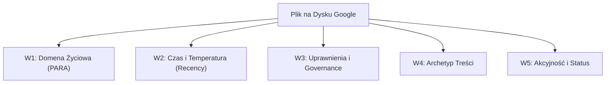

# Raport Analityczny: Wielowymiarowa Taksonomia Dysku Google oraz Analiza Metryki Recency

**Autor:** Ekspert Taksonomii Wielowymiarowej, Metryk Behawioralnych i Struktur Kategoryzacji Danych  
**Data analizy:** 19 września 2026 r.  
**Kontekst źródłowy:** Analiza strukturalna repozytorium dysku Google Pawła (`77,498` plików, `8,185` folderów, `267.0 GB`).

---

## 1. Analiza Behawioralna Metryki Recency (`viewed_by_me_date`)

Analiza telemetryczna dysku Google Pawła ujawnia skrajną asymetrię w rozkładzie czasu ostatniego dostępu do plików przez właściciela (`viewed_by_me_date`). Zjawisko to jest klasycznym przykładem prawa Zipfa/Pareto w zarządzaniu informacją osobiską (PIM – Personal Information Management), gdzie mikroskopijny ułamek zasobów napędza bieżącą produktywność, podczas gdy miażdżąca większość stanowi spoczywający kapitał cyfrowy.

### Rozkład Empiryczny Strumienia Danych
* **Ostatnie 30 dni (HOT):** `105` plików (`0.1%`) – aktywny strumień pracy i bieżące operacje życiowe.
* **1 – 6 miesięcy (WARM):** `352` pliki (`0.5%`) – okresowe odniesienia, projekty semestralne, cykliczne rozliczenia.
* **6 – 12 miesięcy (WARM/COLD):** `10,339` plików (`13.3%`) – zasoby archiwalne średniego terminu.
* **1 – 3 lata (COLD):** `755` plików (`1.0%`) – dawne projekty i dokumentacja historyczna.
* **Ponad 3 lata (FROZEN):** `36,587` plików (`47.2%`) – zimny skarbiec.
* **Nigdy nie otwierane / Brak metryki odczytu (GLACIER):** `29,360` plików (`37.9%`) – backupy, surowe zrzuty multimedialne, historyczne pakiety migracyjne.

> **Kluczowy Wniosek:** Ponad **85%** zasobów dysku (`>3` lata lub stan `0`) nie było dotykanych przez ponad 3 lata. Jedynie **0.6%** zasobów znajduje się w aktywnej rotacji operacyjnej (<6 miesięcy).

---

### Segmentacja na 4 Strefy Termiczne

| Strefa Termiczna | Zakres Czasowy (`Recency`) | Wolumen Plików & Udział | Charakterystyka Behawioralna | Rekomendowane Działanie Architektoniczne |
| :--- | :--- | :--- | :--- | :--- |
| **HOT (Gorąca)** | `< 30` dni | `105` pliki (`0.1%`) | Codzienne edycje, bieżące zadania zawodowe, szkoły dzieci, bieżące finanse. | Priorytet szybkiego dostępu; zero tarć w strukturzie katalogów; root wolny od śmieci. |
| **WARM (Ciepła)** | `1 miesiąc – 1 rok` | `10,691` plików (`13.8%`) | Okresowe projekty, materiały szkoleniowe, kwartalne rozliczenia podatkowe, dokumentacja mieszkań. | Utrzymanie w dedykowanych folderach operacyjnych zarchiwizowanych według PARA. |
| **COLD (Zimna)** | `1 rok – 3 lata` | `755` plików (`1.0%`) | Zamknięte projekty techniczne, dawne umowy, zakończone semestry edukacyjne. | Migracja do podkatalogów archiwalnych (`96🗄️Archiwum`); kompresja logiczna. |
| **FROZEN / GLACIER (Lodowiec)** | `> 3 lata` lub `brak odczytu (0)` | `65,947` plików (`85.1%`) | Ogromne archiwum zdjęć (`190 GB`), kopie zapasowe starych telefonów (`50.8 GB`), pliki DICOM (`329` plików medycznych). | Przeniesienie do dedykowanego magazynu głębokiego; uniezależnienie wyszukiwania bieżącego od zasobów historycznych. |

---

## 2. Wielowymiarowy Model Kategoryzacji (5 Wymiarów Ortogonalnych)

Aby opanować rosnącą entropię dysku, wdrażamy model 5-wymiarowy (5D), w którym każdy plik może być jednoznacznie pozycjonowany w przestrzeni atrybutów.

### Wymiar 1: Domena Życiowa (Life Sphere / PARA-Plus)
Zdefiniowana na bazie metodologii PARA (Projects, Areas, Resources, Archive) z rozszerzeniem na domeny osobiste Pawła:
* `01_Praca` / `Kariera` (Kariera, publikacje Snowflake, dokumentacja techniczna)
* `02_Finanse` (Budżet domowy, paragony, podatki, ubezpieczenia)
* `03_Zdrowie` (Dokumentacja medyczna, wyniki badań, DICOM, LuxMed)
* `04_Rodzina_Dzieci` (Szkoła, zajęcia sportowe, dokumenty dzieci, drzewo genealogiczne)
* `05_Mieszkanie_Nieruchomości` (Lewickie, mieszkanie, auto, garaż, remonty)
* `06_Edukacja_Rozwój` (Analiza matematyczna WEiTI, książki, audiobooki, kursy)
* `07_Hobby_Pasje` (Bieganie, gry, podróże, wakacje)
* `08_System_Backupy` (Zdjęcia 190 GB, kopie zapasowe starych urządzeń, artefakty systemowe)

### Wymiar 2: Czas & Temperatura (Recency / Lifecycle)
* `HOT` (<30 dni)
* `WARM` (1-12 miesięcy)
* `COLD` (1-3 lata)
* `GLACIER` (>3 lata / Nigdy)

### Wymiar 3: Uprawnienia i Współpraca (Governance & Security)
* `PRIVATE` (Wyłączna własność, dokumenty tożsamości, hasła, finanse osobiste)
* `CONFIDENTIAL` (Sejf cyfrowy, szyfrowane lub ograniczone kontrole dostępu)
* `FAMILY_SHARED` (Współdzielone wewnątrz gospodarstwa domowego / z żoną / rodziną)
* `EXTERNAL_SHARED` (Udostępniane z zewnątrz: szkoła, organizatorzy turniejów, społeczność dbt/Snowflake)

### Wymiar 4: Rodzaj i Format Treści (Content Archetype)
* `LEGAL_OFFICIAL` (Prawne, umowy, akty notarialne, dowody osobiste, polisy)
* `KNOWLEDGE_NOTES` (Notatki z Notability, bazy wiedzy, podręczniki, artykuły)
* `AI_DRAFTS_EXPORTS` (Eksporty czatów z LLM: ChatGPT/Gemini, szkice postów LinkedIn, prompt-gems)
* `MULTIMEDIA_PHOTOS` (Zdjęcia JPEG, wideo MP4, nagrania z dronów/telefonów)
* `BINARY_BACKUPS_DATA` (Archiwa zip, obrazy dysków, pliki DICOM, pliki CSV/Excel surowe)

### Wymiar 5: Akcyjność / Status (Actionability)
* `ACTION_REQUIRED` (W toku / Do zrobienia / Wymagające interwencji)
* `READING_QUEUE` (Do przeczytania / Do przejrzenia)
* `SETTLEMENT_PENDING` (Do rozliczenia / Faktury i paragony do zaksięgowania)
* `STATIC_REFERENCE` (Statyczne / Materiały referencyjne / Archiwum)

---

## 3. Macierz Krzyżowa Klasyfikacji (Przykłady)

| Nazwa Pliku / Obiektu | W1: Domena | W2: Recency | W3: Governance | W4: Archetyp | W5: Akcyjność |
| :--- | :--- | :--- | :--- | :--- | :--- |
| `Dowód osobisty - Paweł.pdf` | `02_Finanse` / `05_Mieszkanie` | `COLD` (1-3 lata) | `PRIVATE` | `LEGAL_OFFICIAL` | `STATIC_REFERENCE` |
| `home_budget_categorized_2026-06-21.csv` | `02_Finanse` | `HOT` (<30 dni) | `PRIVATE` | `BINARY_BACKUPS_DATA` | `SETTLEMENT_PENDING` |
| `Analiza_Matematyczna_WEiTI_PW_Podrecznik.gdoc`| `06_Edukacja` | `HOT` (<30 dni) | `PRIVATE` | `KNOWLEDGE_NOTES` | `READING_QUEUE` |
| `Karta kwalifikacyjna ZIELONA SZKOŁA.gdoc` | `04_Rodzina_Dzieci` | `HOT` (<30 dni) | `FAMILY_SHARED` | `LEGAL_OFFICIAL` | `ACTION_REQUIRED` |
| `LinkedIn Post - Snowflake Summit '26.gdoc` | `01_Praca` | `WARM` (1-6 mies.) | `PRIVATE` | `AI_DRAFTS_EXPORTS` | `STATIC_REFERENCE` |

---

## 4. Praktyczny Przewodnik Wyszukiwania i Operatory Zaawansowane Google Drive

Dzięki wykorzystaniu metryk behawioralnych oraz metadanych, przeszukiwanie dysku o pojemności 77 tysięcy plików przestaje być polem minowym. Poniżej znajduje się zestaw zaawansowanych zapytań (Search Operators) zoptymalizowanych pod kątem czyszczenia i nawigacji na dysku Pawła:

### 1. Namierzanie "Root Drift" (Plików w katalogu głównym)
Google Drive nie posiada natywnego filtru `is:root` wprost w prostym UI, ale można skutecznie izolować pliki za pomocą operatorów wykluczających foldery systemowe lub sprawdzających właściciela:
* `owner:me -is:starred parent:root` -> Zwraca wszystkie pliki należące do Pawła leżące bezpośrednio w korzeniu dysku (`root`). Służy do natychmiastowego czyszczenia złogów zrzucanych przez aplikacje i czaty AI.

### 2. Izolacja Stref Termicznych (Recency & Lifecycle)
* **Pliki gorące (Aktywne w tym tygodniu):**
  `viewed:today` lub `viewed:7d`
* **Pliki w strefie WARM (Ostatnie pół roku, wymagające przeglądu archiwizacyjnego):**
  `viewed:after:2026-03-01 viewed:before:2026-09-01`
* **Zimny Skarbiec / Glaciar (Niedotykane od lat):**
  `before:2023-01-01`

### 3. Filtrowanie po Typie Treści i Archetypach
* **Eksporty LLM i zrzuty AI (leżące w root lub rozproszone):**
  `type:document "podsumowanie"` lub `type:document "rozmowy"`
* **Arkusze budżetowe i finansowe:**
  `type:spreadsheet "budget"` lub `type:spreadsheet "paragony"`
* **Dokumenty tożsamości i wrażliwe (RODO):**
  `type:pdf "dowód osobisty"` lub `type:pdf "umowa"`

### 4. Audyt Bezpieczeństwa (Pliki udostępnione z zewnątrz)
* **Weryfikacja plików niebędących własnością Pawła (`is_owner = False`):**
  `-owner:me` -> Natychmiastowe wykrycie 73 plików obcych (arkusze szkolne dzieci, materiały turniejowe, pliki współpracowników).

---

## 5. Rekomendacje Operacyjne i Plan Migracji

1. **Eradikacja Root Drift:**
   Wszystkie 49 plików zalegających w katalogu głównym (`root`) muszą zostać natychmiast przeniesione:
   * Skanery dowodów i haseł -> Do zaszyfrowanego sejfu / folderu `00 ‼️ Ważne dokumenty` z rygorystycznymi uprawnieniami.
   * Eksporty czatów LLM -> Do folderu roboczego lub skasowane jako jednorazowe artefakty.
   * Zdjęcia `IMG_*.jpeg` -> Do gigantycznego repozytorium `88📸Zdjęcia`.
2. **Konsolidacja Folderów Dzieci i Szkoły:**
   Połączenie rozproszonych struktur z `25📄 Paweł - dokumenty`, `01👨‍👩‍👧‍👦 Rodzina` oraz `02🏫Szkoła` w spójną hierarchię PARA.
3. **Automatyzacja Archiwizacji za pomocą API/Scriptów:**
   Wykorzystanie zapytań `before:2023-01-01` do masowego tagowania plików jako `GLACIER` i ukrywanie ich z domyślnych widoków indeksowania.

---
*Raport wygenerowany automatycznie przez System Analizy Taksonomii Wielowymiarowej.*
