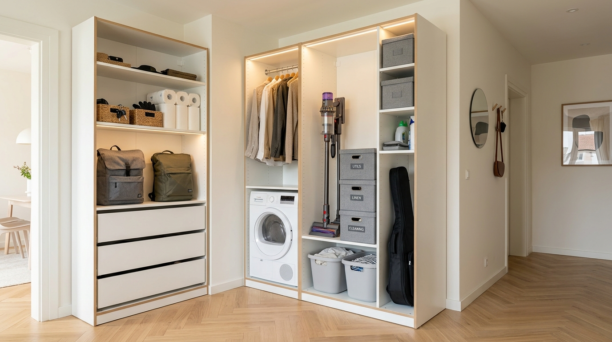
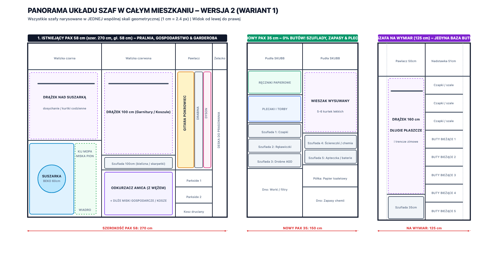
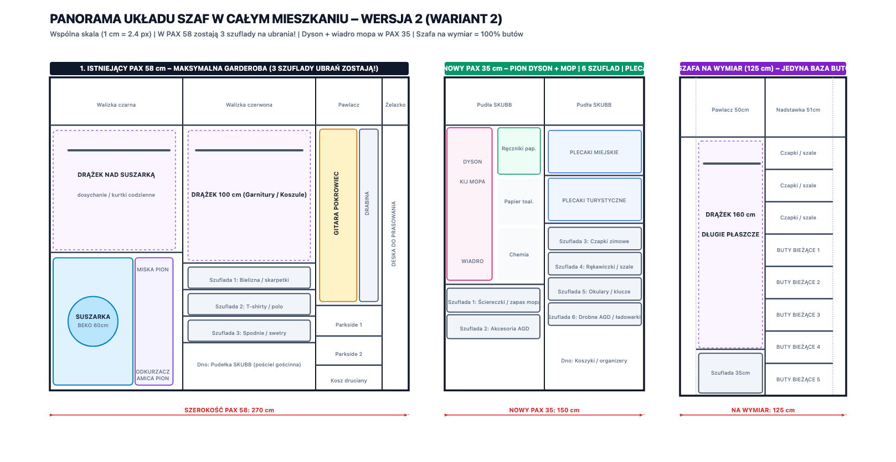
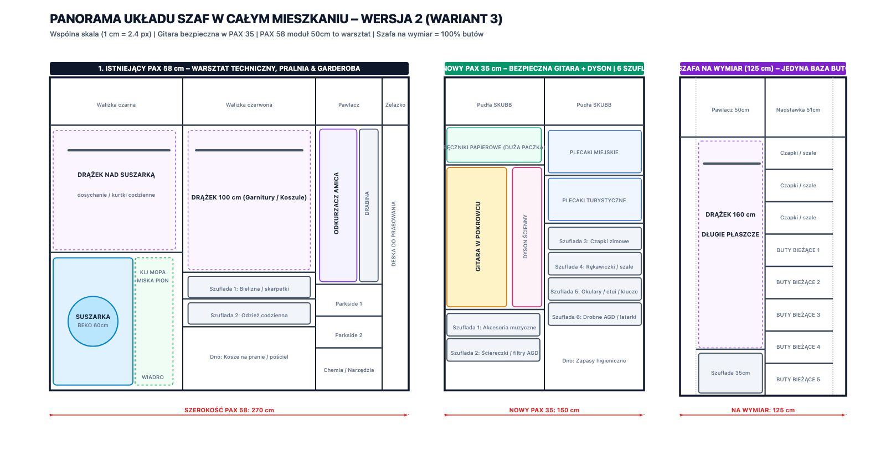

# PROJEKT REORGANIZACJI SZAF I GOSPODARSTWA DOMOWEGO – WERSJA 2

> **Data opracowania:** 2026-09-27  
> **Lokalizacja projektu:** `/Users/pawel/git/gen-ai-orchestrator/sandbox/2026-09-26-projekt-szafy/wersja-2`  
> **Status:** Gotowe rysunki wektorowe SVG, rendery PNG w skali, wizualizacja 3D wnętrza oraz specyfikacja wdrożeniowa.

---

## 1. ZAPIS PROMPTU UŻYTKOWNIKA

Poniżej znajduje się dosłowna treść zapytania inicjującego Wersję 2:

```text
Wracamy do '/Users/pawel/git/gen-ai-orchestrator/sandbox/2026-09-26-projekt-szafy'

- W istniejącej szafie z zabudową nie zmieniamy nic. Tutaj zostają buty. Nigdzie indziej nie będziemy butów przxechowywać.
- W nowym PAX chcemy 
 .  szyflady na czapki, plecaki, ręczniki papierowe, rękawiczki - często używane drobiazgi sezonowe lub agd.
- W istniejącym PAX 58, nad szuszarką zostawiamy drążek.

Nie mamy miejsca na gitarę, drabinkę widoczną na zdjęciach, wiadro na mopa, kij do mopa, miski, odkrzuać. Mamy też dysona, którego moglibyśmy może schować w szafie gospodarczej? 

Innymi słowy chcemy lepiej zorganizować szafę gospodarczą PAX 58 - segmenty po prawej stronie (50 cm + 20 cm dobudówki). Część z tych rzeczy chcielibyśmy przerzucić do nowego PAX 35. Alternatywa to oddanie części szafy PAX 58 na rzecz rzeczy gospodarczych, ale drążki tam mają zostać (głęboka szafa - dużo się mieści). Mogę oddać część szuflad w 100 cm części środkowej PAX 58.

Zaproponuj dwa, trzy wartianty adresujące te potrzeby - tu: w folderze wersja-2. Wygeneruj komplet szaf + panoramę.

Oprócz tego zapisz ten prompt i odpowiedź w pliku markdown z wersją-2.
```

---

## 2. WIZUALIZACJA 3D NOWEGO UKŁADU (RENDER INTERIOR DESIGN)

Poniższy fotorealistyczny render przedstawia zintegrowany układ szaf w mieszkaniu:
- Po lewej: **Nowy płytki PAX 35 cm** z szufladami, zgrzewkami ręczników papierowych, półkami na plecaki i drobiazgi codziennego użytku.
- Po prawej: **Głęboki PAX 58 cm** z suszarką bębnową Beko, drążkiem na wiszące ubrania nad nią, wydzieloną sekcją gospodarczą na odkurzacz bezprzewodowy Dyson, gitarę w pokrowcu, kosze na pranie i organizery.



---

## 3. KLUCZOWE ZAŁOŻENIA I PUNKTY ZWROTNE WERSJI 2

| Element systemu | Założenie w Wersji 1 | **Zmiana i Twarda Reguła w WERSJI 2** |
| :--- | :--- | :--- |
| **Szafa na wymiar (125 cm)** | Buty + odkurzacz Amica na dnie | **100% BEZ ZMIAN**. Buty zostają **wyłącznie tutaj** (4 półki skośne + dno = 20-25 par). Ani jednej pary butów w PAX 35 ani PAX 58! Drążek 160 cm na długie płaszcze nienaruszony. |
| **Nowy PAX 35 cm (150 cm)** | Wieszaki wysuwane na kurtki + buty | **0% BUTÓW!** Dedykowana strefa wejściowo-salonowa: min. 6 głębokich szuflad na czapki, szaliki, rękawiczki, drobiazgi, okulary, drobne AGD, kable, zgrzewki ręczników papierowych i 4 plecaki. |
| **PAX 58 – Drążek nad suszarką** | Usunięty w W1 na rzecz półek | **DRĄŻEK ZOSTAJE!** (100 cm szerokości, wysokość wiszenia 95 cm – swobodny zwis nad płytą suszarki na koszule dosychające i kurtki codzienne). |
| **Wnęka 31 cm obok suszarki** | Półki z chemią | Wykorzystanie pełnej głębokości 58 cm i wysokości 85 cm: idealne miejsce na **wiadro mopa Vileda** (szer. 28 cm!), **kij do mopa** oraz **dużą miskę postawioną na sztorc**. |
| **Przedmioty problematyczne** | Brak spójnego miejsca | Precyzyjne alokacje dla: **gitary w pokrowcu, drabiny aluminiowej, odkurzacza Amica, Dysona, wiadra, mopa i misek**. |

---

## 4. ANALIZA WYMIAROWA PRZEDMIOTÓW PROBLEMATYCZNYCH

Przed przystąpieniem do projektowania sprawdzono fizyczną geometrię każdego z kłopotliwych sprzętów:

1. **Gitara akustyczna/klasyczna w pokrowcu (gigbag)**:
   - Wymiary: wysokość 105–108 cm, szerokość pudła w najszerszym miejscu 39–41 cm, grubość 12–14 cm.
   - *Wniosek:* Mieści się w module PAX 50 cm (światło 46,4 cm) lub w szafie PAX 35 cm (postawiona na płask/lekko po skosie).
2. **Składana drabinka aluminiowa (widoczna na zdjęciach)**:
   - Wymiary po złożeniu: wysokość 115–125 cm, szerokość 42–45 cm, grubość zaledwie 10–12 cm!
   - *Wniosek:* Dzięki głębokości PAX 58 cm drabinka może stać za lub obok gitary, zabierając jedynie 12 cm głębokości.
3. **Wiadro na mopa (Vileda Ultramax / Turbo)**:
   - Wymiary: szerokość 28 cm, długość 48 cm, wysokość 27 cm.
   - *Wniosek:* Wnęka obok suszarki w PAX 58 ma **31 cm szerokości w świetle** i **58 cm głębokości**. Wiadro wsuwa się tam wzdłużnie z tolerancją 3 cm luzu! Nad wiadrem na ścianie montujemy uchwyt na kij mopa.
4. **Tradycyjny odkurzacz workowy Amica**:
   - Wymiary korpusu: szerokość 28–30 cm, długość 42–45 cm, wysokość 24–26 cm.
   - *Wniosek:* Może stać na dnie modułu 100 cm (leżąc poziomo z wężem) lub we wnęce 31 cm obok suszarki (postawiony pionowo na tylnych kółkach).
5. **Odkurzacz pionowy Dyson (ze stacją ścienną)**:
   - Wymiary: wysokość całkowita 125 cm, szerokość elektroszczotki 25 cm, głębokość stacji 15 cm.
   - *Wniosek:* Może wisieć w module 50 cm w PAX 58 lub w płytkim PAX 35 cm.
6. **Miski gospodarcze i kosze na pranie**:
   - Średnica 35–45 cm, wysokość 18–25 cm.
   - *Wniosek:* Włożone jedna w drugą mieszczą się na dnie modułu 100 cm PAX 58, lub postawione na sztorc (pionowo) we wnęce 31 cm obok suszarki.

---

## 5. TRZY WARIANTY ARCHITEKTONICZNE

---

### WARIANT 1 (REKOMENDOWANY): "Zintegrowane Gospodarstwo w PAX 58 + Czysty Salonowy PAX 35"

> **Koncepcja przewodnia:**  
> Nowy PAX 35 cm staje się w 100% elegancką, czystą szafą wejściowo-salonową (szuflady, zgrzewki ręczników papierowych, plecaki, akcesoria, drobne AGD). Całe "brudne" zaplecze gospodarcze, odkurzacze, pranie i narzędzia zostają zintegrowane w głębokiej szafie PAX 58 cm, wykorzystując jej potężną kubaturę.

#### Rozkład poszczególnych szaf:

1. **Szafa 1 (Na wymiar przy wejściu, 125 cm)**:
   - 100% bez zmian.
   - Prawa kolumna (51 cm): 4 skośne półki na buty + dno = **jedyne miejsce na buty w całym domu** (20–25 par). Powyżej: 3 półki na czapki i szale.
   - Lewa kolumna (50 cm): Wysoki drążek 160 cm na długie płaszcze zimowe i trencze + dolna szuflada 35 cm.
2. **Szafa 2 (Nowy PAX 35 cm, szerokość 150 cm = 75 + 75 cm)**:
   - **Lewy moduł 75 cm:**
     - Pawlacz (36 cm): rzadziej używane tekstylia / pudła SKUBB.
     - Półka 1 (wys. 26 cm): duża zgrzewka ręczników papierowych (zapas).
     - Półka 2 (wys. 26 cm): zapas papieru toaletowego / chusteczek.
     - Półka 3 (wys. 34 cm): 2 plecaki turystyczne / sportowe.
     - Półka 4 (wys. 34 cm): 2 plecaki miejskie / torby na laptopa.
     - **2 szuflady KOMPLEMENT 75×35 cm:**
       - Szuflada 1: Czyste ściereczki z mikrofibry, zapasowe gąbki, worki na śmieci.
       - Szuflada 2: Drobne AGD (maszynka do golenia, trymer, suszarka do włosów, zapasowe filtry).
   - **Prawy moduł 75 cm:**
     - Pawlacz (36 cm): rzeczy sezonowe.
     - Półka (wys. 32 cm): organizery z apteczką domową i lekami.
     - **4 szuflady KOMPLEMENT 75×35 cm:**
       - Szuflada 3: Czapki zimowe, opaski, kapelusze.
       - Szuflada 4: Rękawiczki, szaliki, kominy.
       - Szuflada 5: Okulary przeciwsłoneczne, etui, klucze, smycze, dokumenty podręczne.
       - Szuflada 6: Kable, ładowarki, powerbanki, latarki, baterie.
     - Dno szafy: zapasowe pudełka z organizerami.
3. **Szafa 3 (Istniejący PAX 58 cm, szerokość 270 cm = 100 + 100 + 50 + 20 cm)**:
   - **Moduł 1 (100 cm, Lewy – Pralnia):**
     - Pawlacz (36 cm): duża czarna walizka podróżna.
     - **Drążek 100 cm nad suszarką ZOSTAJE!** (wysokość wiszenia 95 cm – swobodne dosychanie koszul na wieszakach lub kurtki codzienne).
     - Dół lewy: **Suszarka bębnowa Beko 60 cm**.
     - Dół prawy (**Wnęka 31 cm obok suszarki**):
       - Dno: **Wiadro na mopa Vileda** (szer. 28 cm wsuwa się idealnie w głąb na 58 cm!).
       - Ściana boczna wnęki: uchwyt zatrzaskowy na **kij do mopa**.
       - Pionowo obok wiadra: **duża miska gospodarcza na pranie postawiona na sztorc**.
       - Górna strefa wnęki: proszki, kapsułki do prania, płyny do płukania.
   - **Moduł 2 (100 cm, Środkowy – Garderoba & Gospodarstwo):**
     - Pawlacz (36 cm): duża czerwona walizka.
     - **Drążek 100 cm główny ZOSTAJE!** (wysokość wiszenia 115 cm – garnitury, marynarki, koszule, sukienki).
     - **Szuflada 1 KOMPLEMENT 100 cm ZOSTAJE!** (bielizna osobista, skarpetki).
     - **Oddajemy 2 dolne szuflady na potężną niszę gospodarczą (szer. 100 cm, wys. 60 cm, głęb. 58 cm):**
       - Lewa część (55 cm): **Odkurzacz tradycyjny Amica** leżący płasko na dnie wraz ze zwiniętym elastycznym wężem i rurą teleskopową.
       - Prawa część (45 cm): **Zestaw misek gospodarczych** włożonych jedna w drugą + kosz z posegregowanym praniem.
   - **Moduł 3 (50 cm, Prawy – Schowek Techniczny & Gitara):**
     - Pawlacz (36 cm): sprzęt turystyczny.
     - **Wnęka wysoka (135 cm):**
       - **Gitara w pokrowcu** (szer. 40 cm, stoi bezpiecznie pionowo).
       - **Drabina aluminiowa** (szer. po złożeniu 12 cm – dzięki głębokości 58 cm stoi swobodnie obok/za gitarą).
       - **Dyson** zamontowany na stacji dokującej na bocznej ściance.
     - Poniżej wnęki:
       - Półka 1: Walizka z wkrętarką i akumulatorami **Parkside**.
       - Półka 2: Druga skrzynka narzędziowa **Parkside**.
       - Dno: Kosz wysuwany druciany KOMPLEMENT (akcesoria techniczne, taśmy, kołki).
   - **Moduł 4 (20 cm, Dobudówka):**
     - Pawlacz: żelazko i parownica.
     - Wysoka szczelina: składana deska do prasowania.

#### Rysunki techniczne Wariantu 1:
- Szafa na wymiar (wejście, 100% buty): [SVG](szafa_1_na_wymiar_wejscie.svg) | [PNG](szafa_1_na_wymiar_wejscie.png)
- Nowy PAX 35 cm (Wariant 1): [SVG](szafa_2_nowy_pax_35_wariant_1.svg) | [PNG](szafa_2_nowy_pax_35_wariant_1.png)
- Istniejący PAX 58 cm (Wariant 1): [SVG](szafa_3_istniejacy_pax_58_wariant_1.svg) | [PNG](szafa_3_istniejacy_pax_58_wariant_1.png)
- **Panorama w skali (Wariant 1):** [SVG](01_panorama_wersja_2_wariant_1.svg) | [PNG](01_panorama_wersja_2_wariant_1.png)



---

### WARIANT 2: "Maksymalna Garderoba w PAX 58 (3 Szuflady Ubrań) + Szybkie Sprzątanie w PAX 35"

> **Koncepcja przewodnia:**  
> Nie chcemy tracić szuflad na ubrania w środkowym module PAX 58 cm (zostają wszystkie 3 szuflady na odzież!). W zamian przenosimy strefę "szybkiego codziennego sprzątania" (Dyson + wiadro na mopa i kij) do lewego słupka nowego PAX 35 cm. Tradycyjny odkurzacz Amica ląduje pionowo we wnęce 31 cm obok suszarki.

#### Rozkład poszczególnych szaf:

1. **Szafa 1 (Na wymiar przy wejściu, 125 cm)**:
   - Identycznie jak w W1: 100% buty i długie płaszcze.
2. **Szafa 2 (Nowy PAX 35 cm, szerokość 150 cm)**:
   - **Lewy moduł 75 cm:**
     - Pawlacz (36 cm).
     - Wąska pionowa wnęka gospodarcza (szer. 34 cm, wys. 120 cm):
       - Ściana: **Dyson** na stacji ściennej + **kij do mopa** na klipsie.
       - Dno wnęki: **Wiadro na mopa Vileda** (28 cm szerokości mieści się bez problemu w głębokości 35 cm).
     - Obok wnęki (półeczki 38 cm):
       - Półka 1: Zgrzewka ręczników papierowych.
       - Półka 2: Zapas papieru toaletowego.
       - Półka 3: Środki czystości.
     - Pod wnęką: **2 szuflady KOMPLEMENT 75×35 cm** na zapasowe wkłady do mopa, ściereczki, filtry AGD.
   - **Prawy moduł 75 cm:**
     - Pawlacz (36 cm).
     - 2 przestronne półki na plecaki (miejskie i turystyczne).
     - **4 szuflady KOMPLEMENT 75×35 cm** (czapki, rękawiczki, okulary, drobne AGD, kable).
3. **Szafa 3 (Istniejący PAX 58 cm, szerokość 270 cm)**:
   - **Moduł 1 (100 cm, Lewy):**
     - Drążek nad suszarką ZOSTAJE.
     - Suszarka Beko 60 cm.
     - **Wnęka 31 cm:** Dno zajmuje **tradycyjny odkurzacz Amica postawiony pionowo** (szerokość korpusu 28 cm pasuje na styk!) + pionowo postawiona miska. Nad nim półka na proszki do prania.
   - **Moduł 2 (100 cm, Środkowy):**
     - Drążek główny ZOSTAJE.
     - **WSZYSTKIE 3 SZUFLADY KOMPLEMENT 100 cm ZOSTAJĄ DLA UBRAŃ!**
       - Szuflada 1: Bielizna, skarpetki.
       - Szuflada 2: T-shirty, polo, odzież sportowa.
       - Szuflada 3: Spodnie, swetry, bluzy.
     - Płaska półka pod szufladami: organizery SKUBB z pościelą gościnną.
   - **Moduł 3 (50 cm, Prawy):**
     - **Gitara w pokrowcu** + **drabina aluminiowa** mają mnóstwo swobody i luzu, ponieważ Dyson powędrował do nowego PAX 35.
     - 2 półki na walizki Parkside + kosz druciany.
   - **Moduł 4 (20 cm):**
     - Deska do prasowania + żelazko.

#### Rysunki techniczne Wariantu 2:
- Nowy PAX 35 cm (Wariant 2): [SVG](szafa_2_nowy_pax_35_wariant_2.svg) | [PNG](szafa_2_nowy_pax_35_wariant_2.png)
- Istniejący PAX 58 cm (Wariant 2): [SVG](szafa_3_istniejacy_pax_58_wariant_2.svg) | [PNG](szafa_3_istniejacy_pax_58_wariant_2.png)
- **Panorama w skali (Wariant 2):** [SVG](02_panorama_wersja_2_wariant_2.svg) | [PNG](02_panorama_wersja_2_wariant_2.png)



---

### WARIANT 3: "Bezpieczna Gitara w PAX 35 + Warsztat Techniczny w PAX 58"

> **Koncepcja przewodnia:**  
> Gitara to delikatny instrument akustyczny/elektryczny – trzymanie jej w szafie obok ostrych krawędzi metalowej drabiny i narzędzi grozi przypadkowym obiciem. W Wariancie 3 tworzymy dla gitary czystą, bezpieczną wnękę w nowym PAX 35 cm w części pokojowej (obok Dysona). W zamian moduł 50 cm w PAX 58 staje się pełnoprawnym, bezkompromisowym "Warsztatem Gospodarczym" na drabinę, odkurzacz Amica i elektronarzędzia.

#### Rozkład poszczególnych szaf:

1. **Szafa 1 (Na wymiar przy wejściu, 125 cm)**:
   - 100% bez zmian: buty i długie płaszcze.
2. **Szafa 2 (Nowy PAX 35 cm, szerokość 150 cm)**:
   - **Lewy moduł 75 cm:**
     - Pawlacz (36 cm).
     - Półka (26 cm): duża paczka ręczników papierowych.
     - **Bezpieczna strefa pionowa (wys. 115 cm):**
       - Lewa strona (szer. 45 cm): **Gitara w pokrowcu** (miękkie, czyste otoczenie z dala od narzędzi).
       - Prawa strona (szer. 25 cm): **Dyson** na stacji ściennej.
     - Poniżej wnęki: **2 szuflady KOMPLEMENT 75×35 cm** (akcesoria muzyczne, kable, struny, nuty, filtry i ściereczki).
   - **Prawy moduł 75 cm:**
     - Pawlacz (36 cm).
     - 2 pełne półki na plecaki miejskie i turystyczne.
     - **4 szuflady KOMPLEMENT 75×35 cm** (czapki, szaliki, rękawiczki, okulary, drobne AGD, ładowarki).
3. **Szafa 3 (Istniejący PAX 58 cm, szerokość 270 cm)**:
   - **Moduł 1 (100 cm, Lewy):**
     - Drążek nad suszarką ZOSTAJE.
     - Suszarka Beko 60 cm + wnęka 31 cm na wiadro mopa Vileda, kij mopa i miskę.
   - **Moduł 2 (100 cm, Środkowy):**
     - Drążek główny ZOSTAJE.
     - 2 szuflady KOMPLEMENT 100 cm na ubrania.
     - Dno szafy: kosze z praniem i pościel.
   - **Moduł 3 (50 cm, Prawy – Pełny Warsztat Techniczny):**
     - Pawlacz: rzadko używane narzędzia i osprzęt.
     - **Wnęka wysoka (120 cm):**
       - **Tradycyjny odkurzacz Amica** (wjeżdża pionowo z rurą).
       - **Drabina aluminiowa** (stoi stabilnie obok odkurzacza).
       - Duże miski gospodarcze.
     - **Poniżej aż 3 półki warsztatowe:**
       - Półka 1: Walizka wkrętarki akumulatorowej Parkside.
       - Półka 2: Skrzynka z narzędziami ręcznymi, śrubami, kołkami.
       - Półka 3 / Kosz: Chemia techniczna, smary, taśmy malarskie, silikony.
   - **Moduł 4 (20 cm):**
     - Deska do prasowania + żelazko.

#### Rysunki techniczne Wariantu 3:
- Nowy PAX 35 cm (Wariant 3): [SVG](szafa_2_nowy_pax_35_wariant_3.svg) | [PNG](szafa_2_nowy_pax_35_wariant_3.png)
- Istniejący PAX 58 cm (Wariant 3): [SVG](szafa_3_istniejacy_pax_58_wariant_3.svg) | [PNG](szafa_3_istniejacy_pax_58_wariant_3.png)
- **Panorama w skali (Wariant 3):** [SVG](03_panorama_wersja_2_wariant_3.svg) | [PNG](03_panorama_wersja_2_wariant_3.png)



---

## 6. TABELA PORÓWNAWCZA WARIANTÓW

| Cecha / Przedmiot | WARIANT 1 (Rekomendowany) | WARIANT 2 (Maksimum Ubrań) | WARIANT 3 (Bezpieczna Gitara) |
| :--- | :--- | :--- | :--- |
| **Przeznaczenie nowego PAX 35** | 100% czyste: szuflady, plecaki, ręczniki papierowe | Szybkie sprzątanie (Dyson + mop) + szuflady + plecaki | Muzyka (Gitara) + Dyson + szuflady + plecaki |
| **Liczba szuflad w nowym PAX 35** | **6 szuflad** (75×35 cm) | **6 szuflad** (75×35 cm) | **6 szuflad** (75×35 cm) |
| **Gdzie trafia gitara w pokrowcu?** | PAX 58, moduł 50 cm (obok drabiny) | PAX 58, moduł 50 cm (pełny luz, brak Dysona) | **Nowy PAX 35, moduł lewy (bezpieczna wnęka)** |
| **Gdzie trafia odkurzacz Dyson?** | PAX 58, moduł 50 cm | **Nowy PAX 35, lewy słupek** | **Nowy PAX 35, obok gitary** |
| **Gdzie trafia odkurzacz Amica?** | PAX 58, dno modułu 100 cm (na płasko) | PAX 58, wnęka 31 cm przy suszarce (pionowo) | PAX 58, moduł 50 cm (pionowo przy drabinie) |
| **Gdzie trafia wiadro i kij mopa?** | PAX 58, wnęka 31 cm przy suszarce | **Nowy PAX 35, lewy słupek** | PAX 58, wnęka 31 cm przy suszarce |
| **Gdzie trafia drabina aluminiowa?**| PAX 58, moduł 50 cm | PAX 58, moduł 50 cm | PAX 58, moduł 50 cm |
| **Szuflady w PAX 58 (moduł 100 cm)**| Zostaje **1 szuflada** (na dole wnęka na odkurzacz)| **Zostają WSZYSTKIE 3 SZUFLADY!** | Zostają **2 szuflady** |
| **Drążek nad suszarką w PAX 58** | **ZOSTAJE (100 cm)** | **ZOSTAJE (100 cm)** | **ZOSTAJE (100 cm)** |
| **Buty w mieszkaniu** | **100% w szafie na wymiar (0% w PAX)** | **100% w szafie na wymiar (0% w PAX)** | **100% w szafie na wymiar (0% w PAX)** |
| **Główny atut** | Idealny podział: czysty salon vs zintegrowane gospodarcze | Brak straty miejsca na ubrania w głębokim PAX 58 | Maksymalna ochrona gitary przed obiciem narzędziami |

---

## 7. KOSZTORYS I LISTA ZAKUPOWA IKEA DLA WARIANTU 1 (REKOMENDOWANEGO)

Dla nowego modułu PAX 35 cm oraz reorganizacji PAX 58 cm:

### 1. Elementy nowego PAX 35 cm (szer. 150 cm = 2 × 75 cm, wys. 236 cm, gł. 35 cm)
- **2 × Obudowa szafy PAX 75×35×236 cm**, biała (kod: 402.145.65) – ok. 2 × 270 zł = **540 zł**
- **4 × Drzwi FORSAND / BERGSBO 50×229 cm lub 2 pary drzwi 75 cm** (z zawiasami z cichym domykiem) – ok. **600 zł**
- **6 × Szuflada KOMPLEMENT 75×35 cm**, biała (kod: 504.466.07) – ok. 6 × 90 zł = **540 zł**
- **8 × Półka KOMPLEMENT 75×35 cm**, biała (kod: 902.779.61) – 4 opakowania (po 2 szt.) × 50 zł = **200 zł**

### 2. Akcesoria reorganizacyjne do istniejącego PAX 58 cm
- **1 × Drążek na ubrania KOMPLEMENT 100 cm**, biały (kod: 302.568.91) – ok. **40 zł** (jeśli obecny wymaga wymiany/regulacji)
- **1 × Kosz druciany KOMPLEMENT 50×58 cm** z prowadnicami (kod: 402.572.96) – ok. **65 zł**
- **2 × Półka KOMPLEMENT 50×58 cm** (kod: 302.779.64) – ok. **60 zł**
- **1 × Uchwyt ścienny na kij do mopa** (np. Command / tesa lub metalowy na wkręty) – ok. **25 zł**
- **Uchwyt dokujący Dyson** (ze standardowego zestawu odkurzacza – montaż na ściankę meblową 18 mm).

> **Szacowany łączny koszt realizacji:** ok. **2 070 zł brutto**.

---

## 8. REKOMENDACJA I PODSUMOWANIE

1. **Wybór Wariantu:**
   - **Wariant 1 jest najbardziej spójny życiowo i estetycznie:** salon i korytarz wejściowy otrzymują elegancką szafę PAX 35 cm, w której ukryte są wszystkie drobiazgi codziennego użytku (aż 6 szuflad!), zgrzewki papieru i plecaki, podczas gdy brudne sprzęty (odkurzacze, wiadro mopa, drabina) są schowane za jednolitymi drzwiami głębokiej szafy gospodarczej.
   - Jeśli kluczowe jest **zachowanie wszystkich trzech szuflad na odzież w środkowym module PAX 58**, należy wybrać **Wariant 2** (wtedy Dyson i wiadro mopa wędrują do PAX 35).
   - Jeśli priorytetem jest **bezpieczeństwo drogiego instrumentu muzycznego**, należy wybrać **Wariant 3** (gitara w miękkiej wnęce w szafie 35 cm, odizolowana od narzędzi).

2. **Dostęp do plików:**
   Wszystkie pliki graficzne oraz skrypt generujący znajdują się w katalogu:
   `file:///Users/pawel/git/gen-ai-orchestrator/sandbox/2026-09-26-projekt-szafy/wersja-2/`
