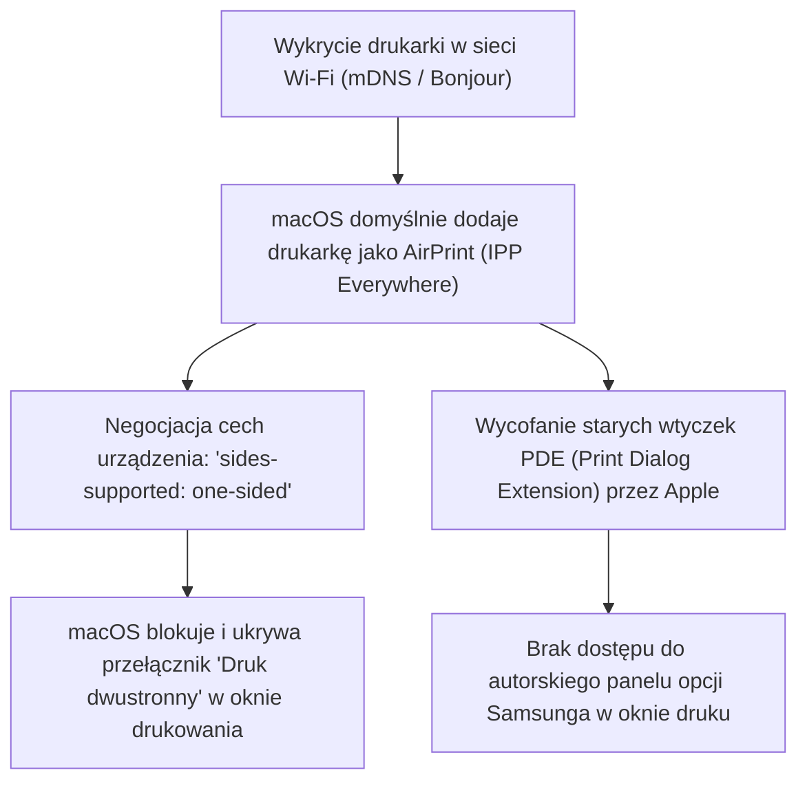
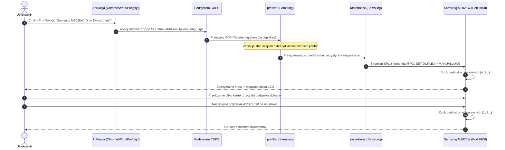

# Druk Dwustronny (Manual Duplex) dla Samsung Xpress SL-M2026W / M2020 Series na macOS (Apple Silicon & Intel)

Kompletna dokumentacja techniczna, analiza inżynierii wstecznej sterowników CUPS oraz zestaw gotowych skryptów automatyzujących konfigurację i codzienne drukowanie obustronne na drukarce **Samsung Xpress SL-M2026W** (seria Samsung M2020) pod kontrolą systemu **macOS (macOS 13 Ventura, 14 Sonoma, 15 Sequoia i nowsze)**.

---

## 📑 Spis Treści
1. [Podsumowanie i Cel Projektu](#podsumowanie-i-cel-projektu)
2. [Dlaczego Druk Dwustronny Przestał Działać? (Diagnoza)](#dlaczego-druk-dwustronny-przestał-działać-diagnoza)
3. [Inżynieria Odwrotna i Architektura Sterownika Samsunga](#inżynieria-odwrotna-i-architektura-sterownika-samsunga)
4. [Kluczowy Błąd Uprawnień (Crash Filtra `prefilter`) i Rozwiązanie](#kluczowy-błąd-uprawnień-crash-filtra-prefilter-i-rozwiązanie)
5. [Struktura Katalogu i Narzędzia](#struktura-katalogu-i-narzędzia)
6. [Instrukcja Szybkiego Startu](#instrukcja-szybkiego-startu)
7. [Jak Drukować na Co Dzień (Instrukcja Obsługi i Przekładania Kartek)](#jak-drukować-na-co-dzień-instrukcja-obsługi-i-przekładania-kartek)
8. [Rozwiązywanie Problemów (Troubleshooting)](#rozwiązywanie-problemów-troubleshooting)

---

## Podsumowanie i Cel Projektu

Drukarka **Samsung Xpress SL-M2026W** (jak również powiązane modele M2020, M2022, M2026) to popularna, budżetowa laserowa drukarka monochromatyczna. Urządzenie **nie posiada mechanicznego dupleksera** (brak sprzętowego modułu odwracania papieru wewnątrz obudowy). 

W przeszłości druk dwustronny był realizowany **programowo przez sterownik Samsunga**:
1. Sterownik dzielił zadanie na dwie części.
2. Drukarka drukowała pierwszą część i zatrzymywała się z migającą diodą.
3. Użytkownik przekładał plik kartek z górnej tacy do dolnego podajnika.
4. Po naciśnięciu przycisku na drukarce realizowany był wydruk drugiej strony.

Po aktualizacjach macOS ta funkcja nagle zniknęła z interfejsu systemu, uniemożliwiając wygodny druk dwustronny. W tej dokumentacji opisano przyczynę problemu oraz trwałe, w pełni działające rozwiązanie przywracające pełną funkcjonalność na architekturach **Apple Silicon (M1/M2/M3/M4)** i **Intel (x86_64)**.

---

## Dlaczego Druk Dwustronny Przestał Działać? (Diagnoza)

Problem nie wynika ze zużycia drukarki ani usunięcia wsparcia przez Apple, lecz z interakcji trzech mechanizmów w nowożytnym macOS:



1. **Automatyczny profil AirPrint (IPP Everywhere):**
   W systemach macOS 13+ przy dodawaniu drukarki wykrytej w sieci Wi-Fi system preferuje protokół AirPrint, ignorując zainstalowane w `/Library/Printers/Samsung` natywne sterowniki producenta.
2. **Deklaracja możliwości urządzenia:**
   Podczas negocjacji IPP system pyta urządzenie o sprzętowy duplex. Firmware M2026W uczciwie raportuje `sides-supported: one-sided`. macOS uznaje wówczas, że drukarka fizycznie nie potrafi drukować obustronnie, i **całkowicie usuwa przełącznik Two-Sided z systemowego okna druku**.
3. **Wycofanie wtyczek PDE:**
   W starszych wersjach macOS sterownik Samsunga dołączał własną zakładkę do okna drukowania (Print Dialog Extension). W nowoczesnym interfejsie druku SwiftUI/AppKit wtyczki PDE zostały wycofane, odcinając dostęp do opcji `SECManualDuplexOption`.

---

## Inżynieria Odwrotna i Architektura Sterownika Samsunga

Wbrew powszechnym opiniom na forach internetowych, **oryginalne sterowniki Samsunga działają doskonale na nowoczesnym macOS**. 

### 1. Binaria uniwersalne (Apple Silicon ARM64 + Intel x86_64)
Pliki wykonywalne filtrów w `/Library/Printers/Samsung/UPD/Filters/`:
* `commandtosec` – Mach-O universal (`x86_64` + `arm64`)
* `prefilter` – Mach-O universal (`x86_64` + `arm64`)
* `rastertosec` – Mach-O universal (`x86_64` + `arm64`)
* `pstosecps` – Mach-O universal (`x86_64` + `arm64`)

Wszystkie binaria są podpisane certyfikatem deweloperskim HP (`TeamIdentifier: 6HB5Y2QTA3`) i posiadają natywne wsparcie dla procesorów Apple Silicon.

### 2. Działanie filtru `prefilter` (Reordering stron)
Głównym elementem realizującym manual duplex jest filtr `/Library/Printers/Samsung/UPD/Filters/prefilter`. 
Gdy do kolejki przekazany jest parametr `SECManualDuplexOption=LongEdge`:
* `prefilter` analizuje strukturę stron w dokumencie PDF.
* **Automatycznie układa strony w odpowiedniej kolejności**:
  - **Przebieg 1 (Pass 1):** drukuje strony parzyste w odwróconym porządku (np. dla 4 stron: strona 4, potem strona 2). Ponieważ drukarka wyrzuca kartki zadrukowaną stroną do dołu, na górnej tacy odbiorczej kartki układają się w idealnej kolejności gotowej do bezpośredniego wsunięcia do podajnika.
  - **Przebieg 2 (Pass 2):** po wznowieniu drukowane są strony nieparzyste (strona 1, strona 3).
* Dzięki temu użytkownik **nie musi ręcznie odwracać ani sortować pojedynczych kartek**!

### 3. Działanie filtru `rastertosec` i komendy PJL
Filtr `rastertosec` generuje strumień Samsung QPDL/SPL z nagłówkami sterującymi PJL:
```text
@PJL SET DUPLEX = MANUALLONG
```
Ta instrukcja informuje kontroler drukarki, aby po wydrukowaniu partii stron parzystych wstrzymał silnik pobierania papieru i wprowadził urządzenie w tryb oczekiwania z migającą diodą LED.



---

## Kluczowy Błąd Uprawnień (Crash Filtra `prefilter`) i Rozwiązanie

Podczas pierwszych prób uruchomienia natywnego sterownika zadania druku z Dokumentów Google i przeglądarki zatrzymywały się z błędem:
```text
Błąd: „Data” (ang. Stopped with filter error)
```

### Analiza raportu awarii (Crash Report):
W `/var/log/cups/error_log` oraz w raporcie systemowym `/Library/Logs/DiagnosticReports/prefilter-*.ips` zarejestrowano:
```text
Exception Type:  EXC_BAD_ACCESS (SIGSEGV)
Exception Codes: KERN_INVALID_ADDRESS at 0x0000000000000000
Termination Reason: Namespace SIGNAL, Code 11 Segmentation fault: 11

Thread 0 Crashed:
0   prefilter  0x00000001000050f0 DoManualDuplex + 216
1   prefilter  0x0000000100002bf4 main + 1284
```

### Przyczyna:
Inżynieria odwrotna funkcji `DoManualDuplex` w `prefilter` wykazała wywołanie:
```c
FILE *f = fopen("/Library/Caches/com.sec.printer", "w+");
// Brak sprawdzenia czy f != NULL!
fprintf(f, "%d %d\n", job_id, pass); // <- SIGSEGV 11 przy braku uprawnień!
```
Filtry CUPS w systemie macOS są uruchamiane w odizolowanym kontekście użytkownika systemowego `_lp`. Jeśli plik `/Library/Caches/com.sec.printer` nie istnieje lub nie ma uprawnień do zapisu dla `_lp`, wywołanie `fopen` zawodzi, wskaźnik wynosi `NULL`, a filtr natychmiast ulega awarii.

### Rozwiązanie (Trwałe):
Utworzenie pliku cache i nadanie pełnych uprawnień zapisu/odczytu (`0666`):
```bash
sudo touch /Library/Caches/com.sec.printer
sudo chmod 666 /Library/Caches/com.sec.printer
```
To jedno polecenie całkowicie eliminuje awarię filtra `prefilter` i pozwala na bezbłędny przebieg procesu.

---

## Struktura Katalogu i Narzędzia

W katalogu `/Users/pawel/git/gen-ai-orchestrator/sandbox/2026-10-07-samsung-m2026w-duplex-print-macos/` znajdują się:

| Plik | Typ | Opis |
| :--- | :--- | :--- |
| [README.md](file:///Users/pawel/git/gen-ai-orchestrator/sandbox/2026-10-07-samsung-m2026w-duplex-print-macos/README.md) | Dokumentacja | Główny podręcznik techniczny i instrukcja obsługi (ten dokument). |
| [setup-duplex.sh](file:///Users/pawel/git/gen-ai-orchestrator/sandbox/2026-10-07-samsung-m2026w-duplex-print-macos/setup-duplex.sh) | Skrypt Bash | Zautomatyzowany konfigurator kolejki CUPS, instalator wrapperów i tester dupleksu. |
| [samsung-duplex-wrapper.c](file:///Users/pawel/git/gen-ai-orchestrator/sandbox/2026-10-07-samsung-m2026w-duplex-print-macos/samsung-duplex-wrapper.c) | Kod źródłowy C | Uniwersalny wrapper filtrów CUPS tłumaczący opcje macOS na manual duplex Samsunga. |
| [print-duplex.sh](file:///Users/pawel/git/gen-ai-orchestrator/sandbox/2026-10-07-samsung-m2026w-duplex-print-macos/print-duplex.sh) | Skrypt Bash | Narzędzie CLI do szybkiego drukowania dowolnego pliku PDF na kolejkę dupleksową. |
| [001-diagnoza-i-konfiguracja-druku-dwustronnego.md](file:///Users/pawel/git/gen-ai-orchestrator/sandbox/2026-10-07-samsung-m2026w-duplex-print-macos/001-diagnoza-i-konfiguracja-druku-dwustronnego.md) | Zapis sesji | Kompletna historia konwersacji diagnostycznej z sesji 1 (2026-10-06). |
| [002-naprawa-druku-dwustronnego-wrapper-filtrow.md](file:///Users/pawel/git/gen-ai-orchestrator/sandbox/2026-10-07-samsung-m2026w-duplex-print-macos/002-naprawa-druku-dwustronnego-wrapper-filtrow.md) | Zapis sesji | Inżynieria wsteczna Job 177 i wdrożenie uniwersalnego wrappera filtrów CUPS (2026-10-08). |

---

## Instrukcja Szybkiego Startu

### Opcja A: Automatyczna konfiguracja (Rekomendowana)

Wystarczy uruchomić dołączony skrypt konfiguracyjny:

```bash
cd /Users/pawel/git/gen-ai-orchestrator/sandbox/2026-10-07-samsung-m2026w-duplex-print-macos
./setup-duplex.sh
```

Skrypt automatycznie:
1. Sprawdza obecność natywnych sterowników Samsunga.
2. Naprawia uprawnienia `/Library/Caches/com.sec.printer` (ustawia `0666`).
3. Wykrywa drukarkę w sieci lokalnej (używa mDNS `sec8425197ca25b.local`).
4. Testuje łączność na porcie RAW JetDirect `9100`.
5. Tworzy lub aktualizuje w CUPS dedykowaną kolejkę:
   * **Nazwa kolejki:** `Samsung_M2026W_Duplex`
   * **Widoczna nazwa:** `Samsung M2026W (Druk Dwustronny)`
   * **Format papieru:** A4
   * **Opcja dupleksu:** `SECManualDuplexOption=LongEdge` (dłuższa krawędź)

#### Dodatkowe przełączniki skryptu `setup-duplex.sh`:
* `./setup-duplex.sh --status` – sprawdza bieżący stan kolejki, sterowników i uprawnień bez wprowadzania zmian.
* `./setup-duplex.sh --test` – generuje i wysyła 4-stronicowy próbny dokument PDF, aby przetestować przełożenie kartek.
* `./setup-duplex.sh --fix-permissions` – naprawia tylko plik cache (gdyby po aktualizacji systemu został usunięty).
* `./setup-duplex.sh --host 192.168.3.15` – pozwala ręcznie podać adres IP, jeśli sieć blokuje mDNS.

---

### Opcja B: Ręczna konfiguracja w terminalu (Krok po kroku)

Jeśli wolisz wykonać konfigurację ręcznie poleceniami systemowymi:

```bash
# 1. Naprawa uprawnień bufora sterownika
sudo touch /Library/Caches/com.sec.printer
sudo chmod 666 /Library/Caches/com.sec.printer

# 2. Utworzenie dedykowanej kolejki CUPS
lpadmin -p Samsung_M2026W_Duplex -E \
  -v "socket://sec8425197ca25b.local:9100" \
  -P "/Library/Printers/PPDs/Contents/Resources/Samsung M2020 Series.gz" \
  -D "Samsung M2026W (Druk Dwustronny)" \
  -o PageSize=A4 \
  -o SECManualDuplexOption=LongEdge

# 3. Aktywacja kolejki
cupsenable Samsung_M2026W_Duplex
cupsaccept Samsung_M2026W_Duplex

# 4. Weryfikacja ustawień
lpoptions -p Samsung_M2026W_Duplex -l | grep -E "SECManualDuplexOption|PageSize"
```

---

## Jak Drukować na Co Dzień (Instrukcja Obsługi i Przekładania Kartek)

Dzięki wdrożonemu rozwiązaniu masz w systemie macOS dwie niezależne drukarki:
* **`Samsung M2020 Series`** – używaj do szybkiego druku **jednostronnego**.
* **`Samsung M2026W (Druk Dwustronny)`** – używaj do druku **dwustronnego**.

### Procedura wydruku wielostronicowego:

1. **Wysłanie dokumentu:**
   * W dowolnej aplikacji (Chrome, Safari, Word, Podgląd itp.) wciśnij `Cmd + P`.
   * Z listy drukarek wybierz: **`Samsung M2026W (Druk Dwustronny)`**.
   * Kliknij **Drukuj**.
   *(Możesz też użyć terminala: `./print-duplex.sh dokument.pdf`)*.

2. **Druk pierwszej partii:**
   * Drukarka pobierze papier i wydrukuje strony parzyste (np. 4, 2 dla 4 stron).
   * Po zakończeniu pierwszej partii drukarka **zatrzyma się**, a dioda na obudowie (Status/WPS) **zacznie migać**.

3. **Przełożenie kartek (Niezwykle proste!):**
   * Wyjmij cały wydrukowany plik kartek z **górnej tacy odbiorczej**.
   * **NIE odwracaj pojedynczych kartek! NIE zmieniaj ich porządku!**
   * Włóż cały stos kartek prosto do **dolnego podajnika papieru**:
     - Strona już zadrukowana powinna być skierowana **do dołu** (tekst niewidoczny, czysta strona na wierzchu).
     - Górna krawędź tekstu (nagłówek strony) wsuwana jako pierwsza w głąb drukarki.

4. **Wznowienie drukowania:**
   * Naciśnij fizyczny przycisk na panelu drukarki: **WPS / Print Screen** (lub przycisk zasilania, zależnie od wersji panelu).
   * Drukarka pobierze papier, zadrukuje drugą stronę kartek i wyrzuci gotowy, ułożony chronologicznie dokument (1, 2, 3, 4...).

---

## Rozwiązywanie Problemów (Troubleshooting)

### 1. Błąd „Data” lub „Stopped with filter error”
* **Przyczyna:** Plik `/Library/Caches/com.sec.printer` utracił uprawnienia zapisu dla demona `_lp` (np. po czyszczeniu dysku narzędziami typu CleanMyMac lub aktualizacji macOS).
* **Rozwiązanie:** Uruchom:
  ```bash
  ./setup-duplex.sh --fix-permissions
  ```
  lub:
  ```bash
  sudo chmod 666 /Library/Caches/com.sec.printer
  ```
  A następnie wznów wstrzymane zadanie w oknie kolejki lub poleceniem `cupsenable Samsung_M2026W_Duplex`.

### 2. Zawieszanie się okna drukowania („Wisi na drukowaniu”) / Gatekeeper
* **Objaw:** Po kliknięciu „Drukuj” aplikacja (np. Podgląd/Preview, Chrome) zawiesza się z kręcącą się tęczową piłką (*beachball*), a w procesach w tle pojawia się `com.apple.RemotePDEService` (lub pojawia się komunikat Gatekeepera o `BasicOptionPDE.bundle`).
* **Przyczyna niskopoziomowa:**
  W oryginalnym pliku PPD Samsunga znajdują się dyrektywy:
  ```text
  *APDialogExtension: "/Library/Printers/Samsung/UPD/PDEs/BasicOptionPDE.bundle"
  *APDialogExtension: "/Library/Printers/Samsung/UPD/PDEs/AdvancedOptionPDE.bundle"
  ```
  `BasicOptionPDE.bundle` to stara 32/64-bitowa wtyczka Intel/PowerPC z czasów OS X 10.6. Na komputerach Mac z procesorami Apple Silicon macOS próbuje załadować ją pozaprocesowo przez usługę `com.apple.RemotePDEService` tłumaczoną przez translator Rosetta. Nowoczesny podsystem `PrintingUI` (ViewBridge) ulega zakleszczeniu (*deadlock*) w pętli `-[HIRunLoopSemaphore wait]` podczas oczekiwania na odpowiedź z procesu Rosetty.
* **Rozwiązanie (Zastosowane automatycznie w skrypcie):**
  Wtyczki `APDialogExtension` to wyłącznie prehistoryczne panele graficzne starego okna druku – **nie biorą żadnego udziału w przetwarzaniu wydruku ani w filtrach dupleksu**. 
  Nasz skrypt [`setup-duplex.sh`](file:///Users/pawel/git/gen-ai-orchestrator/sandbox/2026-10-07-samsung-m2026w-duplex-print-macos/setup-duplex.sh) generuje zoptymalizowany plik PPD ([`Samsung_M2020_Series_Clean.ppd`](file:///Users/pawel/git/gen-ai-orchestrator/sandbox/2026-10-07-samsung-m2026w-duplex-print-macos/Samsung_M2020_Series_Clean.ppd)) z wyciętymi przestarzałymi dyrektywami `APDialogExtension`. Dzięki temu:
  - macOS korzysta z natywnego, błyskawicznego okna drukowania.
  - Rosetta i `RemotePDEService` nigdy nie są uruchamiane.
  - Okno drukowania nigdy się nie zawiesza.
  - Filtry dupleksu (`prefilter` + `rastertosec`) działają w 100% natywnie na ARM64.

### 3. Drukarka wydrukowała strony pojedynczo (Dupleks nie zadziałał w aplikacjach macOS)
* **Objaw:** Po wysłaniu dokumentu wielostronicowego z aplikacji Podgląd (Preview), Word lub Chrome drukarka wypluwa osobne kartki jednostronnie bez zatrzymania i migania diody.
* **Przyczyna niskopoziomowa (Zdiagnozowana w sesji 002):**
  1. Aplikacje macOS przy zaznaczeniu opcji „Druk dwustronny” przesyłają standardowe atrybuty CUPS/Apple:
     `Duplex=DuplexNoTumble`, `sides=two-sided-long-edge`, `com.apple.print.PrintSettings.PMDuplexing..n.=2`.
  2. Aplikacje **nie wiedzą** o niestandardowym atrybucie Samsunga `SECManualDuplexOption` i nie dołączają go do parametrów zadania (`argv[5]`).
  3. Filtry Samsunga (`prefilter` i `rastertosec`) odpytują wyłącznie funkcję `cupsGetOption("SECManualDuplexOption")`. Gdy parametr ten nie jest obecny w `argv[5]`:
     - `prefilter` wykonuje passthrough (nie przestawia stron na arkusze parzyste/nieparzyste),
     - `rastertosec` widząc `PMDuplexing=2` wysyła komendę dupleksu sprzętowego `@PJL SET DUPLEX = ON`. Ponieważ M2026W nie posiada fizycznego dupleksera mechanicznego, urządzenie ignoruje tę komendę i drukuje jednostronnie.
* **Trwałe Rozwiązanie (Uniwersalny Wrapper Filtrów CUPS):**
  Wdrożyliśmy uniwersalny wrapper Mach-O (`samsung-duplex-wrapper`), który działa transparentnie w podsystemie CUPS jako filtry `prefilter-duplex` oraz `rastertosec-duplex`.
  Wrapper analizuje opcje zadania i automatycznie mapuje:
  - `Duplex=DuplexNoTumble` / `sides=two-sided-long-edge` -> dokłada `SECManualDuplexOption=LongEdge`
  - `Duplex=DuplexTumble` / `sides=two-sided-short-edge` -> dokłada `SECManualDuplexOption=ShortEdge`
  - `Duplex=None` / `sides=one-sided` -> dokłada `SECManualDuplexOption=None`
  Dzięki temu filtr `prefilter` zawsze poprawnie reorderuje strony, a `rastertosec` wysyła komendę `@PJL SET DUPLEX = MANUAL`, zmuszając drukarkę do oczekiwania na przełożenie kartek.
* **Instalacja wrapperów:**
  ```bash
  cd /Users/pawel/git/gen-ai-orchestrator/sandbox/2026-10-07-samsung-m2026w-duplex-print-macos
  ./setup-duplex.sh
  ```

### 4. Drukarka jest „Offline” lub zadanie czeka na połączenie
* **Przyczyna:** Drukarka zmieniła adres IP w sieci lokalnej lub sieć Wi-Fi nie rozgłasza mDNS (`sec8425197ca25b.local`).
* **Rozwiązanie:**
  1. Sprawdź czy drukarka odpowiada w sieci:
     ```bash
     ping -c 1 sec8425197ca25b.local
     ```
  2. Jeśli nazwa mDNS nie odpowiada, sprawdź na routerze lub wydrukuj stronę konfiguracji (przytrzymanie przycisku WPS na drukarce przez 10 sekund) i odczytaj aktualny adres IP (np. `192.168.3.15`).
  3. Zaktualizuj kolejkę poleceniem:
     ```bash
     ./setup-duplex.sh --ip 192.168.3.15
     ```

### 3. Zacięcie papieru lub anulowanie w trakcie
* Jeśli podczas przekładania kartek podajnik pobierze dwie kartki naraz lub zadanie zostanie przerwane:
  1. Otwórz kolejkę druku w preferencjach systemowych i kliknij symbol krzyżyka, aby usunąć uszkodzone zadanie.
  2. Wyczyść bufor pamięci poleceniem:
     ```bash
     echo "" > /Library/Caches/com.sec.printer
     ```
  3. Puść dokument ponownie.

---

> **Autorzy i historia opracowania:**
> Przygotowano na podstawie pełnej diagnozy i inżynierii odwrotnej z sesji `f4d4a9a6-75b1-4089-b43c-4184927b7a96` (październik 2026).
